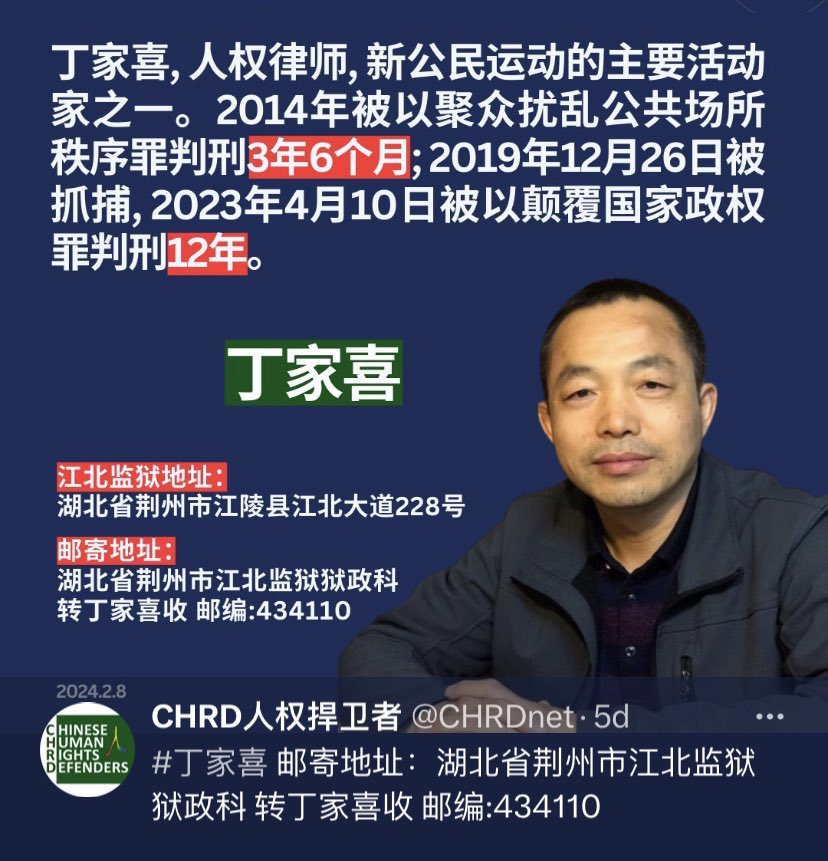
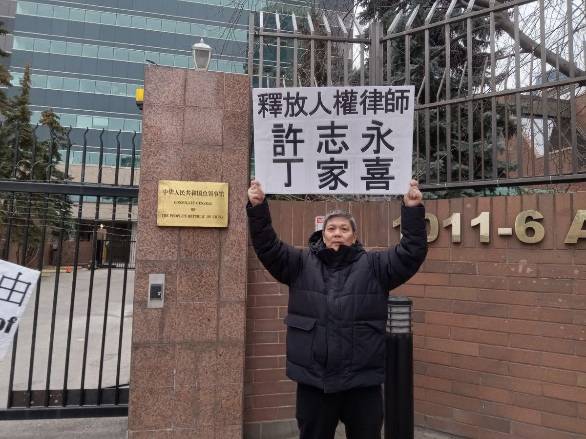
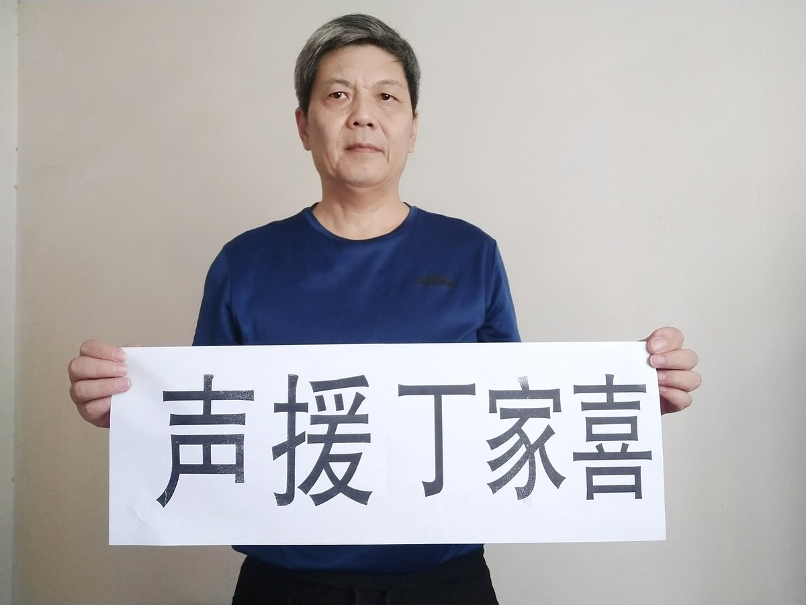
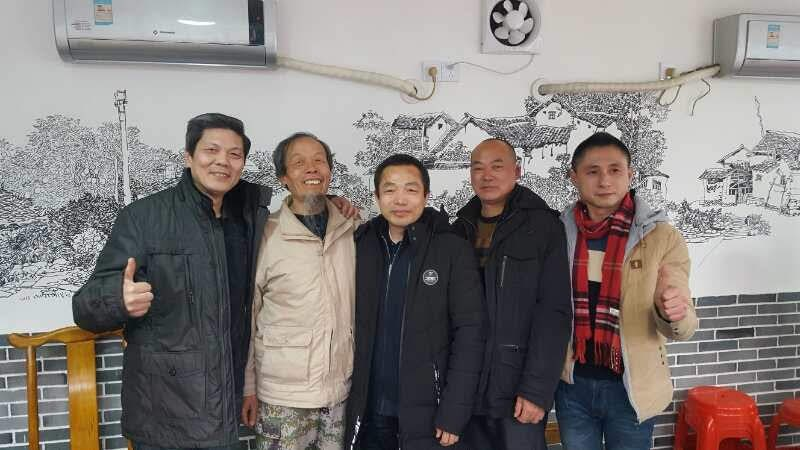

拆墙运动公号 北京时间 2024-03-01T14:01:53Z 1763444529385148650 RT @csm8964: 声援丁家喜。 https://t.co/ZLY6rSmKJz   拆墙运动公号 北京时间 2024-03-01T02:39:42Z 1763272851006587102 RT @V8te09yHVB5pQN1: https://t.co/XE62lJXzSQ   拆墙运动公号 北京时间 2024-03-01T03:09:18Z 1763280302271537434 【 #2259专案组 互联网防火墙第131号嫌犯 #张立武】    性别：男
职称：博导
电子邮件： 
通信地址： 北京市海淀区中关村南四街4号
邮政编码： 100190
学历：博士研究生，
学位：工学博士，
职务：中国科学院软件研究所高级工程师
工作单位： 中国科学院软件研究所

研究领域
网络信任体系、身份管理、身份鉴别、授权、访问控制、基于生物特征的身份鉴别、可信计算

官网：https://t.co/LZ1NK8udKm详细资料见: #BanGFW拆墙运动（建墙罪犯录）：https://t.co/6EI0P1P5tK

社会兼职
2015-12-17-2020-12-16,全国信息安全标准化技术委员会, 委员
2013-10-25-2017-10-24,中国密码学会电子认证专业委员会, 委员

科研项目

（1） 云身份管理及认证授权服务技术研究，主持，国家级
（2） 可信计算环境测评理论和技术研究，参与，国家级
战略合作伙伴：1、中共恶人榜：#ccpevils                    2、#zhinawiki   