自由亚洲电台 北京时间 2024-03-01T22:51:49Z 1763577890979906003 RT @RFA_Chinese: 近日，中国官媒大力宣传 #艾滋病已是可防可控可治的慢性病 ，引发微博网友热议。
有人问，“可防可控可治”听起来怎么这么耳熟？
有人担心，鼓吹艾滋病是慢性病，对艾滋病不提防，这完全是误导中国人，让中国出现更多艾滋病。
艾滋病真的可治了吗？弱化 #…   自由亚洲电台 北京时间 2024-03-01T23:00:11Z 1763579997925654837 RT @RFA_Chinese: 近日，中国媒体发文说，“穿汉服过新年”成为了今年春节的一道风景和新风尚，称近年来汉服越来越受到年轻人的喜爱，能彰显文化自信。有评论指出，中国推广汉服热，“是汉服统战”。
您认为，汉服是否被当成了统战工具？
您是否会穿汉服上街？ https://…   自由亚洲电台 北京时间 2024-03-01T23:12:43Z 1763583151052566931 【乐乐法利：抖音“有毒” 会让人上瘾】
【李忠宪：独裁国家借 #TikTok 侵蚀文化思想 影响巨大】
为何看似中立的短影音平台 #抖音，会对民主政治和普世价值造成威胁。而民主国家又该如何建构理论和法律，正面迎战资讯科技革命带来的挑战。
https://t.co/uTDGjo34Zx https://t.co/VDPeuF76Nv   自由亚洲电台 北京时间 2024-03-01T11:14:23Z 1763402374306254935 【中国官方公布2月 #PMI 稍降至49.1】
【稍高于市场预期】
中国国家统计局3月1日公布2月份制造业采购经理指数(PMI)为49.1%，比上月下降0.1个百分点。连续第五个月低于荣枯线，但仍稍高于市场预期。中国全国两会即将于下周召开，李强总理政府工作报告关于提振中国经济的举措令人关注。https://t.co/WzOee1eNCx   自由亚洲电台 北京时间 2024-03-01T13:47:13Z 1763440837869093017 【中央政治局会议定《政府工作报告》基调】
【 “稳中求进”迎建政75周年】
中共中央政治局周四(29日)召开会议，会中讨论中国国务院的《政府工作报告》强调今年是中共建政75周年，是实现“十四五”规划目标任务的关键一年。今年的工作总基调是坚持稳中求进，这表明本次会议为李强总理在人大会议上提交的《政府工作报告》定下基调。评论指出今年是中国危机加剧的一年。详细报道：https://t.co/QympSVStNP  （图为路透摄于2023年3月13日李强出席记者会） 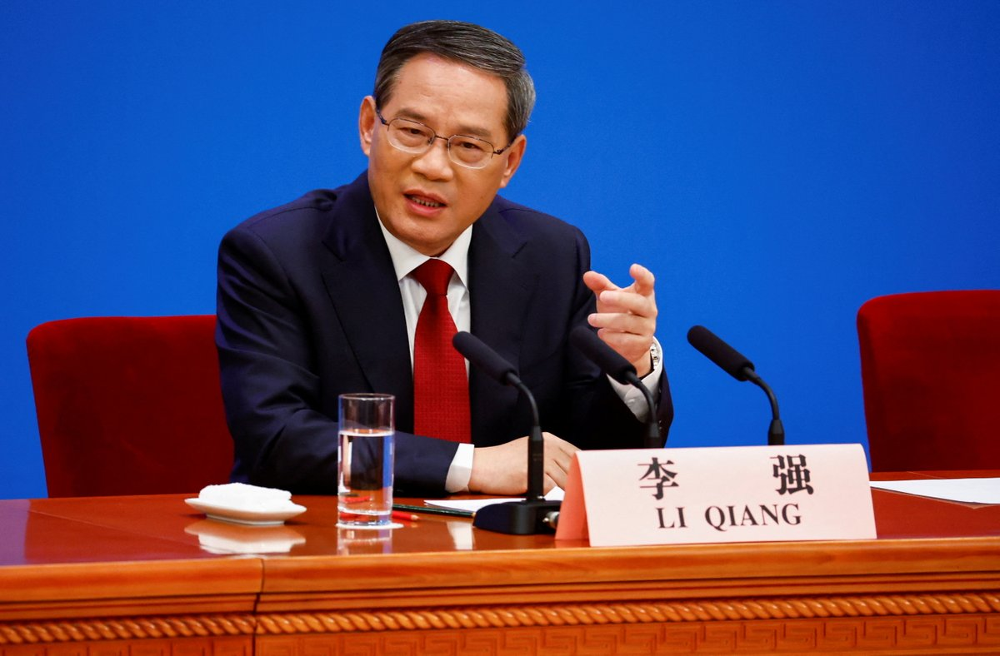  自由亚洲电台 北京时间 2024-03-01T06:30:01Z 1763330814518173846 欧盟对外事务部（EEAS）前亚太总司长维纲（Gunnar Wiegand）近日在接受本台专访时表示，中国与欧盟最首要的就是经济关系，两方既竞争又相互依赖。但他表示，俄乌战争迈入第二年，中方似乎低估了其"亲俄中立"立场对 #中欧关系 的伤害。
https://t.co/DZqS7EobDe https://t.co/9dSJfPNDqR 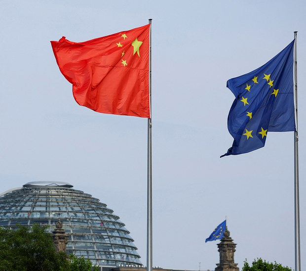  自由亚洲电台 北京时间 2024-03-01T06:37:16Z 1763332637664665711 近日，中国媒体发文说，“穿汉服过新年”成为了今年春节的一道风景和新风尚，称近年来汉服越来越受到年轻人的喜爱，能彰显文化自信。有评论指出，中国推广汉服热，“是汉服统战”。
您认为，汉服是否被当成了统战工具？
您是否会穿汉服上街？ https://t.co/nnjuc35SFU 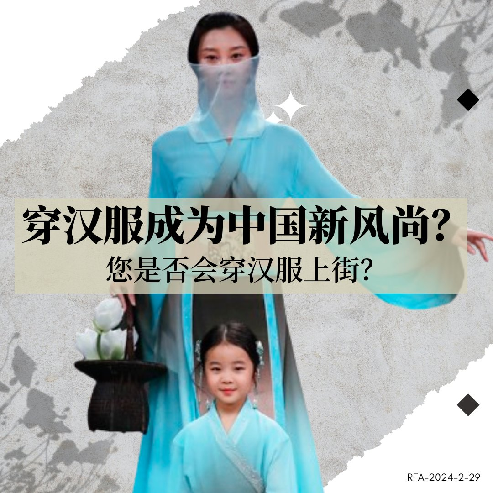  自由亚洲电台 北京时间 2024-03-01T07:00:01Z 1763338363095163309 美国总统拜登周四（2月29日）在一份声明中表示，美国政府出于 #数据安全 风险的考虑，将对“#联网车辆” 展开国家安全风险的调查，尤其关注中国造汽车。
https://t.co/zGFGUFA3PR https://t.co/75n7BHjBY0   自由亚洲电台 北京时间 2024-03-01T07:30:02Z 1763345916168429696 专栏 | #绿色情报员：上桌之前（下）鱼不好吃 人要揹锅
https://t.co/7Y0R7HENGr https://t.co/K7PL1VJWvm 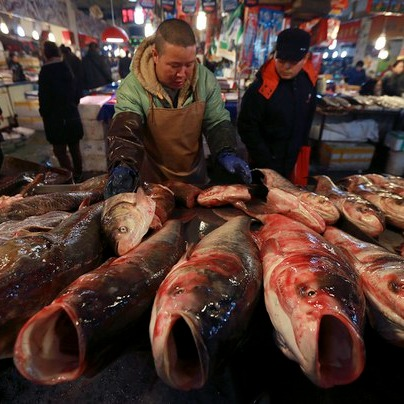  自由亚洲电台 北京时间 2024-03-01T08:26:38Z 1763360159286571486 【中国大学毕业生就业：2023届难，2024届更难】
史上最多毕业生，遇到最差经济形势，毕业求职一年比一年难。
中国官媒报道，2023年中国高校毕业人数超过1158万， 2024年预期为1179万人。 https://t.co/WXFNpz1mOf 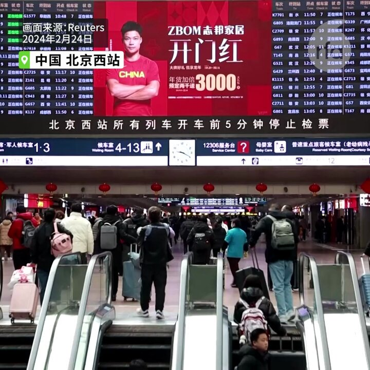  自由亚洲电台 北京时间 2024-03-01T08:30:01Z 1763361012844257538 评论 | 何清涟@HeQinglian：美中各搭"餐台"，嘉宾指望两边通吃
https://t.co/Ya5opOAmET https://t.co/BldP99PMOX 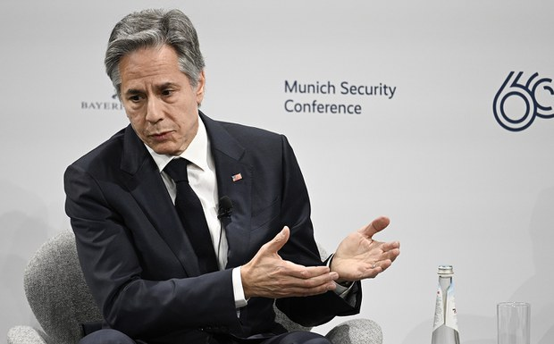  自由亚洲电台 北京时间 2024-03-01T08:47:58Z 1763365527295053963 RT @RFA_Chinese: 【诚征 #敏感日】
中国当局的“敏感日”是越来越多了，往往与重大历史事件、政治运动或纪念日有关。其间，当局会加强监控和限制以实现维稳。 
请问您知道哪些敏感日？我们将收集网友列举的日期，制作年度“#敏感日”日历，再看看365天里“#不敏感日”还…   自由亚洲电台 北京时间 2024-03-01T10:08:57Z 1763385910547341579 欧盟对外事务部（EEAS）前亚太总司长维纲（Gunnar Wiegand）近日在接受本台专访时表示，中国与欧盟最首要的就是经济关系，两方既竞争又相互依赖。但他表示，俄乌战争已经两年了，中方似乎低估了其"亲俄中立"立场对中欧关系的伤害。
https://t.co/DZqS7EobDe https://t.co/M1Kg3S9ybA   自由亚洲电台 北京时间 2024-03-01T04:28:05Z 1763300125865304374 由中国海外民运人士 #魏京生、#王丹、#王军涛 等发起的"#国是会议"，将于近日在美国首都华盛顿召开。据悉，本次会议旨在为中共垮台后的民主中国勾画蓝图，并引入全社会参与民主建设。
https://t.co/ZpKE90SuDh https://t.co/5PwKkIAjSs   自由亚洲电台 北京时间 2024-03-01T04:47:57Z 1763305126847221794 专栏 | #军事无禁区：弱人工智能－乌克兰成为AI技术实验场
https://t.co/SRtu1EWxge https://t.co/TpS2qZLzBQ 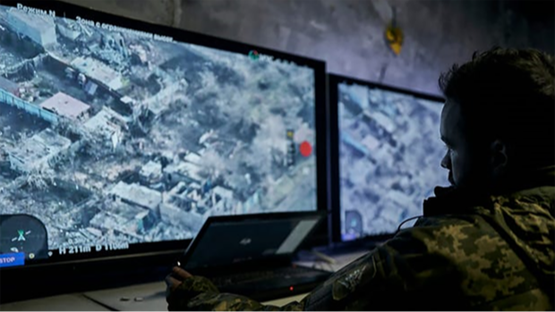  自由亚洲电台 北京时间 2024-03-01T05:34:18Z 1763316792741744842 2月29日 上海居民对针对碧桂园提起的清算申请影响感到担忧 https://t.co/oz0hd6p7Qp 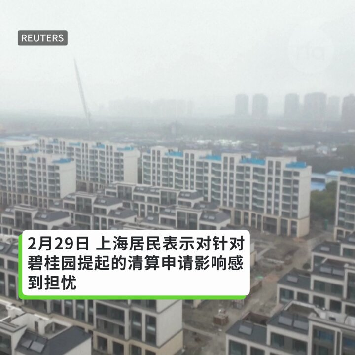  自由亚洲电台 北京时间 2024-03-01T05:47:49Z 1763320191310872586 2016年中国全国研究生招生数是66.71万，这一数字在2022年膨胀到了124.25万，在2023年则高达130.2万，在几年里翻了一番。
在2022年时，北京的 #研究生 毕业人数甚至比本科生毕业生多出了3万人。
https://t.co/hnu6o9Su26 https://t.co/tpooDvyKBH 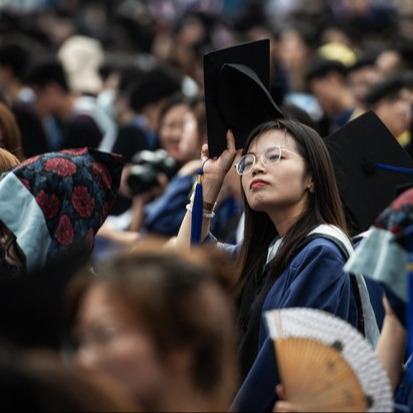  自由亚洲电台 北京时间 2024-03-01T05:52:31Z 1763321376730239334 2月29日，"#自由之家"@freedomhouse 发布2024年度《#全球自由度报告》（Freedom in the World in 2024）。报告显示，中国再度被归类为"不自由"国家，而台湾的自由度排名则仅次于日本，位居亚洲第二。https://t.co/k85U2Kg0LD https://t.co/u0nSnJujwR 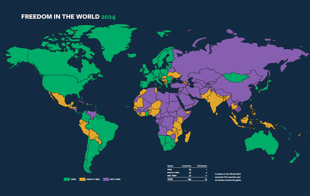  自由亚洲电台 北京时间 2024-03-01T06:08:36Z 1763325422551671067 香港《#基本法》#第二十三条 立法的公众咨询期日前结束。美国、英国政府就此发声明，质疑该立法将破坏"一国两制"，担忧港府可能依此执行境外恐吓。
https://t.co/ir3xVNThGc https://t.co/MLW9URJt3e 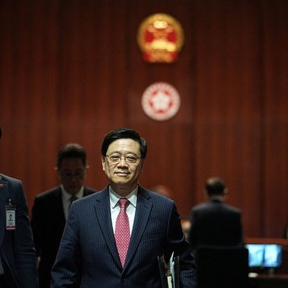  自由亚洲电台 北京时间 2024-03-01T06:10:40Z 1763325942154609133 澳洲政府已邀请中国外长王毅下个月访问，就贸易、安全等议题展开讨论。
据香港《南华早报》报道，会谈预计将讨论双边贸易、澳大利亚与美国、英国的奥库斯安全联盟（AUKUS）、新的科技协议以及澳大利亚作家 #杨恒均 的判决等问题。#王毅 预计将在堪培拉停留一天，另一天在悉尼。 https://t.co/Fvxq8HYBYt 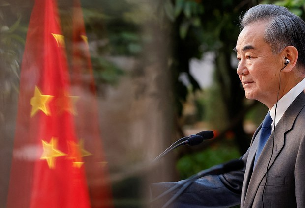  自由亚洲电台 北京时间 2024-03-01T02:46:05Z 1763274459958636661 华盛顿智库战略与国际研究中心（Center for Strategic and International Studies）周三（2月28日）发表报告指出，#南中国海 的中国"#海上民兵"力量日益突显，值得警惕。 https://t.co/1i2f1T34i1   自由亚洲电台 北京时间 2024-03-01T03:02:32Z 1763278596179988820 近日，中国官媒大力宣传 #艾滋病已是可防可控可治的慢性病 ，引发微博网友热议。
有人问，“可防可控可治”听起来怎么这么耳熟？
有人担心，鼓吹艾滋病是慢性病，对艾滋病不提防，这完全是误导中国人，让中国出现更多艾滋病。
艾滋病真的可治了吗？弱化 #艾滋病 的存在感会带来什么后果？
#您怎么看？ https://t.co/tumcxbB1YS 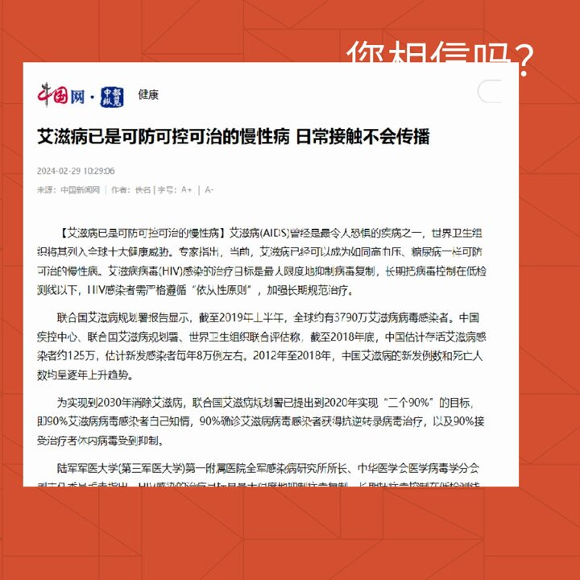  自由亚洲电台 北京时间 2024-03-01T03:37:52Z 1763287488989467054 【华裔科学家 #邱香果 夫妇因向中国泄密遭开除】
情报局发现，邱香果夫妇在中国有一个未公开的银行户口。作为2018年至2022年“#千人计划”的一部分，中方透过河北医科大学给了她约120万加元。邱香果还跟中国解放军少将 #陈薇 有过密切的合作研究关系，陈薇更因研发 #新冠疫苗 在中国获得功勋表扬。 https://t.co/03TGDwwDXC   自由亚洲电台 北京时间 2024-03-01T03:49:08Z 1763290324540198994 中国艺术家 #肖鲁 于墨尔本推出名为"记忆的尊严"展览，呈现以2017年北京清理所谓"#低端人口"和以2019年 #香港反送中 抗争为主题的摄影裝置作品。 肖鲁指出，她要以艺术作品捍卫历史记忆，反制中国官方媒体掩盖和扭曲历史。
https://t.co/CVGWRufMYA https://t.co/TrD6MqT07n   自由亚洲电台 北京时间 2024-03-01T03:53:14Z 1763291358624960809 自有国际媒体报道太平洋上的 #基里巴斯 有 #中国警察 工作后，美国就向太平洋上的各岛国发出警告，切勿从中国引入安全力量解决国内的法律和秩序问题。
https://t.co/IOC4quatMS https://t.co/OMDivhDE2Q 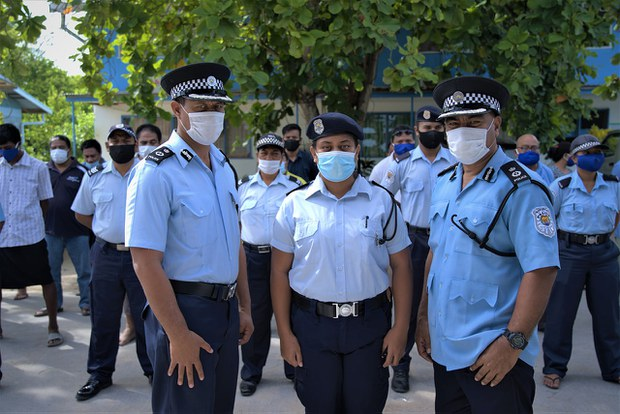  自由亚洲电台 北京时间 2024-03-01T03:55:21Z 1763291889804218864 自有国际媒体报道太平洋上的 #基里巴斯 有 #中国警察 工作后，美国就向太平洋上的各岛国发出警告，切勿从中国引入安全力量解决国内的法律和秩序问题。
https://t.co/37GSdh7D11 https://t.co/nPMjTWqIsY 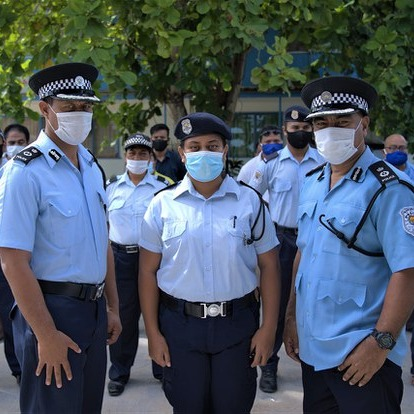  自由亚洲电台 北京时间 2024-03-01T00:16:38Z 1763236847118135326 日前，欧洲议会通过报告强调台湾与中国互不隶属，并谴责中国试图以武力片面改变台海和平及稳定现状。
有学者认为，这显示 #欧洲议会 支持蔡英文政府“四个坚持”中的内涵，台湾问题不被视为中国内政，也可谓台湾的外交里程碑。
https://t.co/2XQPDapa6Q https://t.co/pyxAUXZsdY 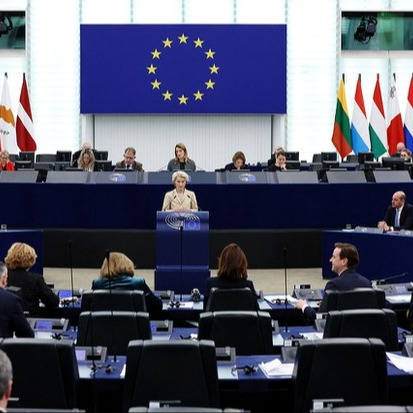  自由亚洲电台 北京时间 2024-03-01T01:14:31Z 1763251415231975470 北大报告：中国 #小微企业 面临巨大挑战  https://t.co/KHribjswOG https://t.co/ygwGonr5Ij 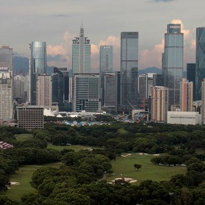  自由亚洲电台 北京时间 2024-03-01T02:11:02Z 1763265638779232603 【诚征 #敏感日】
中国当局的“敏感日”是越来越多了，往往与重大历史事件、政治运动或纪念日有关。其间，当局会加强监控和限制以实现维稳。 
请问您知道哪些敏感日？我们将收集网友列举的日期，制作年度“#敏感日”日历，再看看365天里“#不敏感日”还剩多少。 
请回帖，或电邮fankui@rfa.org ，谢谢！ https://t.co/FKgvEbKAzo 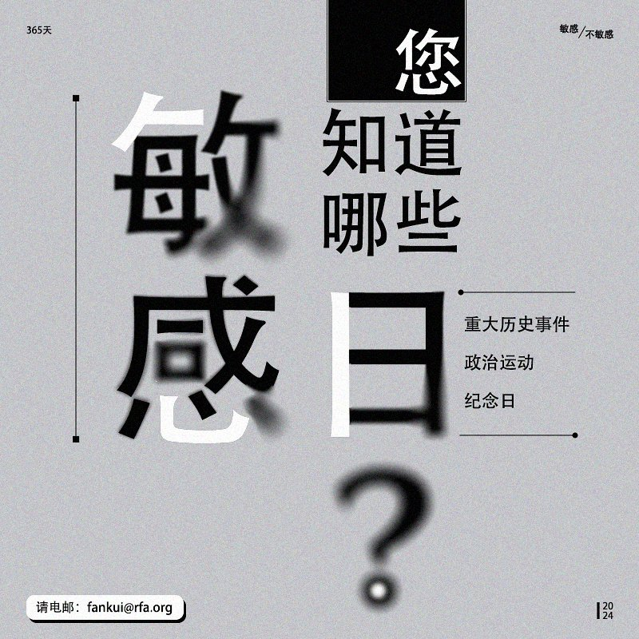  