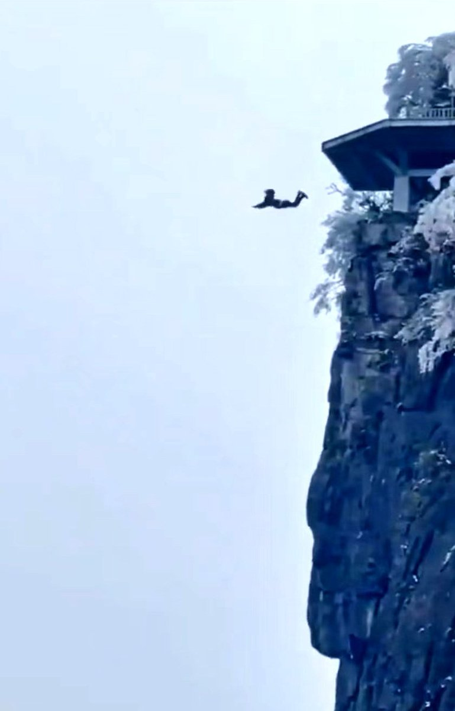

谁将十万横扫三江 北京时间 2024-03-01T08:58:08Z 1763368085623582775 网传2月28日湖南张家界天门山景区有一男子跳崖

此前，2023年4月4日3男1女曾在天门山跳崖自杀
2023年7月6日有1男子在景区坠崖身亡 https://t.co/UdvAvAgMBt   谁将十万横扫三江 北京时间 2024-03-01T09:42:38Z 1763379286378213612 RT @lilaoshizuikeai: 中国没有类似纳瓦尔尼的人，因为在中国没有舞台和观众。
当一个中国人在决定为同胞发声时，他需要做好放弃未来的觉悟。注意，这并不是一种修辞。…   