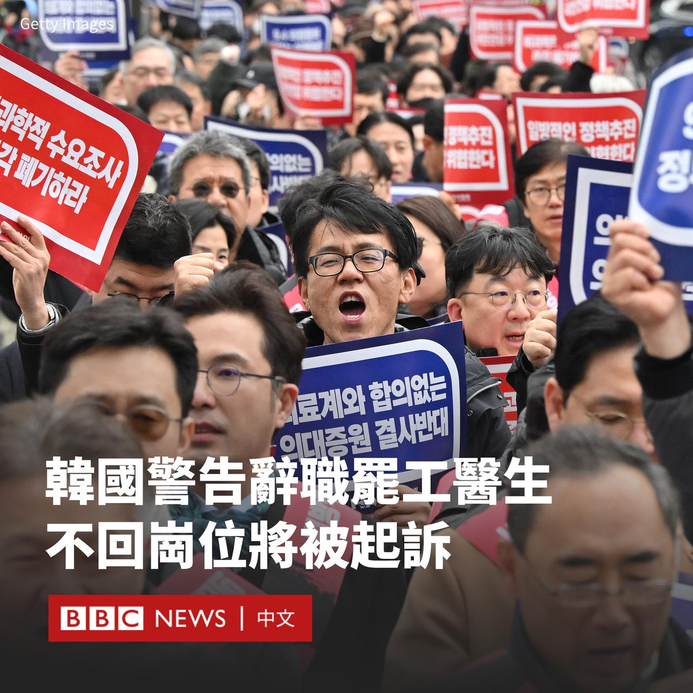

D英国广播公司BBC 北京时间 2024-02-29T19:00:05Z 1763157185532768558 尽管韩国政府将周四（2月29日）定为结束罢工的最后期限，但该国数以千计的医生仍拒绝返回岗位。此前当局警告将对继续罢工者采取法律行动，并吊销行医执照。

过去一周，韩国有大约四分之三的医生罢工或辞职，导致主要教学医院的手术中断和延误。许多抗议者为实习和住院医生，他们抗议政府增加医学院招生名额，以增加医疗系统中医生数量的计划。

韩国保健福祉部官员透露，截至周三（2月28日），在9000多名离岗的医生中，只有294人重返岗位。

抗议的年轻医生表示，政府应该首先解决薪酬和工作条件问题，然后再尝试扩招。

韩国是发达国家中医患比例最低的国家之一，加之人口迅速老龄化，政府警告称，韩国十年内将出现严重的医患短缺。

在韩国很多医院，实习医生在维持医院运转方面发挥着重要作用。因此，罢工导致很多医院被迫取消或推迟患者的手术。

上周，一名心脏骤停的老年妇女在救护车上死亡。据报道，有七家医院拒绝收治。政府表示，这名患者罹患晚期癌症，她的死亡与罢工无关。

根据当局的计划，明年医学生的招生人数将从3000人扩增至5000人。罢工的医生认为，培训更多的医生会降低医疗质量，因为这意味着将医疗执照授予能力较差的医生。

但韩国政府拒绝接受该说法。据韩联社报道，保健福祉部已上门向各家医院的实习住院医生代表送达命令书，并警告将从3月1日起开始进行行政处分及司法措施。

自罢工开始以来，采取强势态度的总统尹锡悦的支持率有所提高。民调显示，76％的人支持扩招计划。尹锡悦称，他不会让步。   D英国广播公司BBC 北京时间 2024-02-29T15:05:58Z 1763098268534202776 新冠疫情期间，疫苗在发达国家和发展中国家之间的分配不均，被一些人批评是“疫苗种族隔离”。WHO的194个成员国正在谈判一项新条约，以避免在未来的大流行期间重蹈覆辙。https://t.co/7dkcS6QObz   D英国广播公司BBC 北京时间 2024-02-29T12:35:17Z 1763060347458482448 尽管全球发达国家的生育率都在下滑，但韩国显得格外极端，其生育率年复一年地打破惊人的最低纪录。

在过去二十年，韩国政府投入了数千亿美元试图鼓励生育，却收效甚微。许多人认为，年轻女性的呼声没有被倾听。https://t.co/jg6zKS3jgD   D英国广播公司BBC 北京时间 2024-02-29T09:31:11Z 1763014016618897564 苏丹内战已持续十个月，目前联合国难民署的埃及办事处已有将近五十万民众被登记为难民，其中的许多人寻求走私集团将他们偷渡过境。BBC阿拉伯语访问了冒险踏上偷渡旅程的民众。 https://t.co/N7srddb0rf   