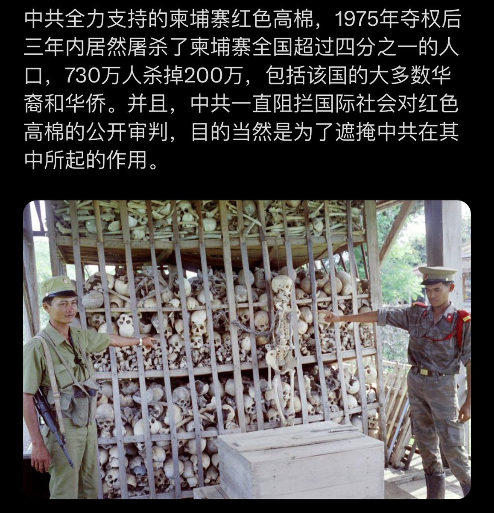
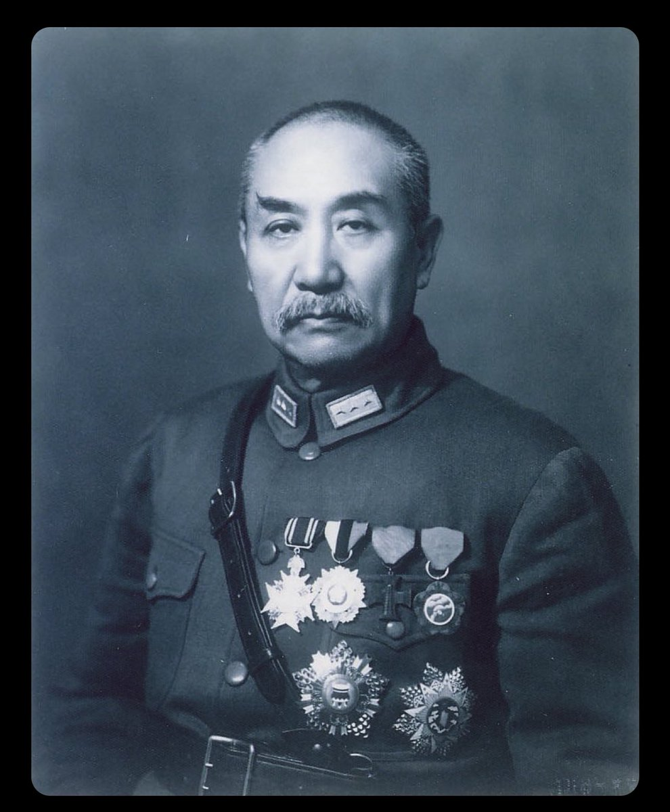
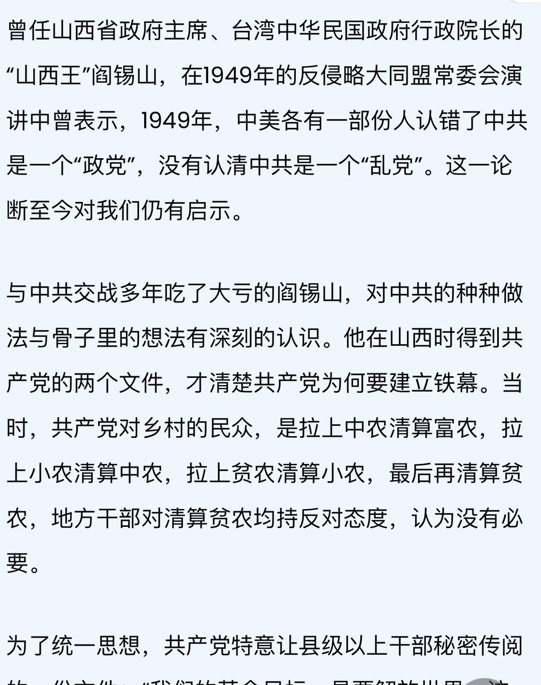
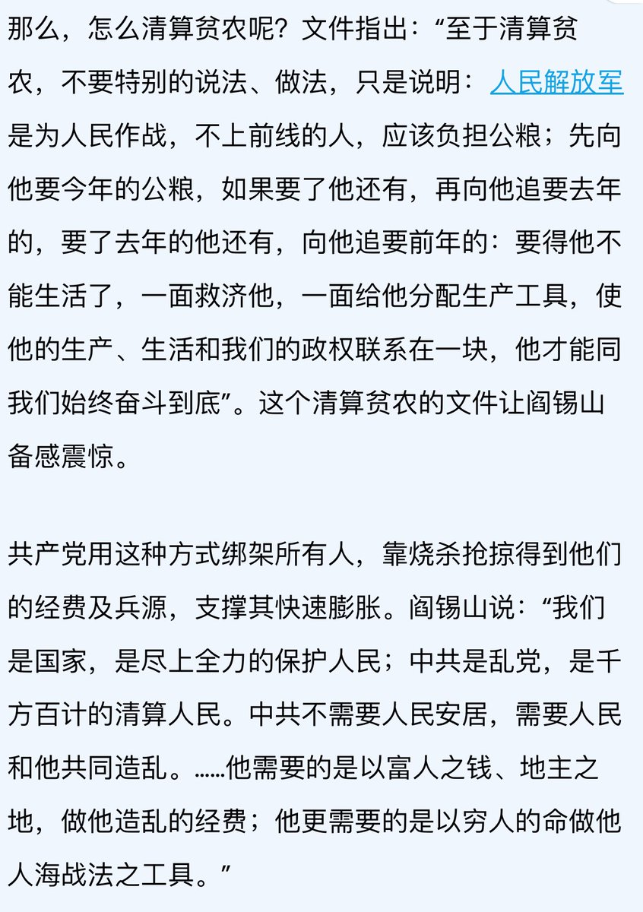

Ivy未央 北京时间 2024-02-29T22:13:15Z 1763205796572090848 RT @Ivy01011: 吴晗的外甥女吴萍，痛哭讲述吴晗文革中被迫害被摧残虐待的经历
无法想象，中共怎么就能把普通学生变成可怕的魔鬼呢？
1948年，中共特使吴晗两次登门。
劝胡适留下。并转达毛泽东意见。
胡适却劝吴晗别信那一套。
胡适去台湾时留下一句话：
“在苏俄，有面包，…   Ivy未央 北京时间 2024-02-29T11:02:24Z 1763036970891014373 RT @Ivy01011: 柬埔寨的红色高棉政权，受到毛泽东和文革的影响，从1975到1979年间进行了大屠杀，造成约200万人死亡。 https://t.co/nS7qNXqbZl   Ivy未央 北京时间 2024-02-29T08:44:56Z 1763002378528178424 阎锡山评价共产党：中共是清算人民、妄想赤化世界的“乱党”。中共不需要人民安居，他需要的是以富人之钱、地主之地，做他的经费；他更需要的是以穷人的命做他人海战法之工具。
阎锡山不管公务多忙，每年都要回家过年，每次都轻车简从，从不滋扰地方官员。且汽车村头就停下，阎换上普通衣服步行进村，一路上与村民聊家常。
随从问何故？阎答：孙先生说，民为本，我为仆，我岂能以严威慑于父老乡亲
此规矩，从1911年到阎离开大陆，坚持了38年。
中共呢？有几名官员能不扰民？   