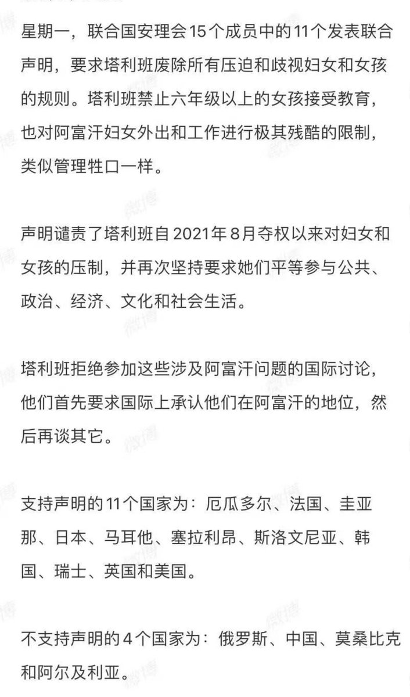
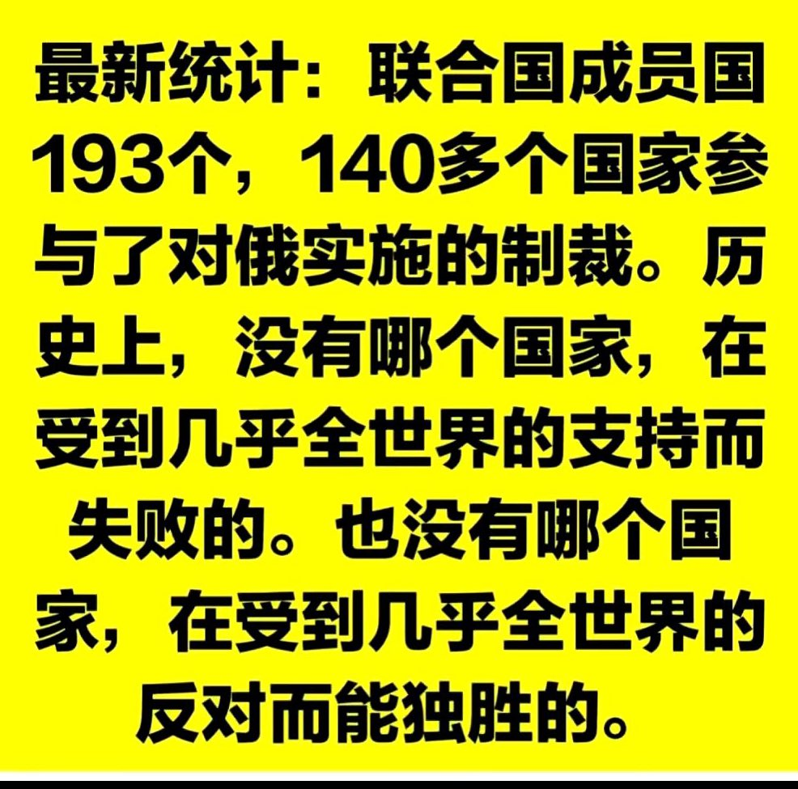

Petrichor 北京时间 2024-02-29T07:37:38Z 1762985439936266547 作为华人，挺为自己的祖国悲哀的，俄罗斯侵略乌克兰，举世谴责，140多个国家参与对俄罗斯的制裁，可是中国政府却支持俄罗斯。
塔利班压迫和欺凌妇女和女童，人神共愤，全世界予以谴责，但是中国政府公开表示对塔利班的做法不反对、不批评，其实就是支持。

中国政府一方面要求欧美对华不脱钩，另一方面凡是欧美反对的，中国政府就要拥护。但是中国政府不代表中国人民，人民不同意他们的做法。中国必须拥抱世界文明。   Petrichor 北京时间 2024-02-29T00:03:22Z 1762871122184339633 小粉红常用欧洲人到北美大地如何对待印第安人作为攻击白人的“事实”，却不知中国历史比这惨得多的历史事实。中国历史是一部野蛮史，不忍卒读。鲁迅说中国历史上写着两个字：吃人。 https://t.co/DEC4l4wvdF   