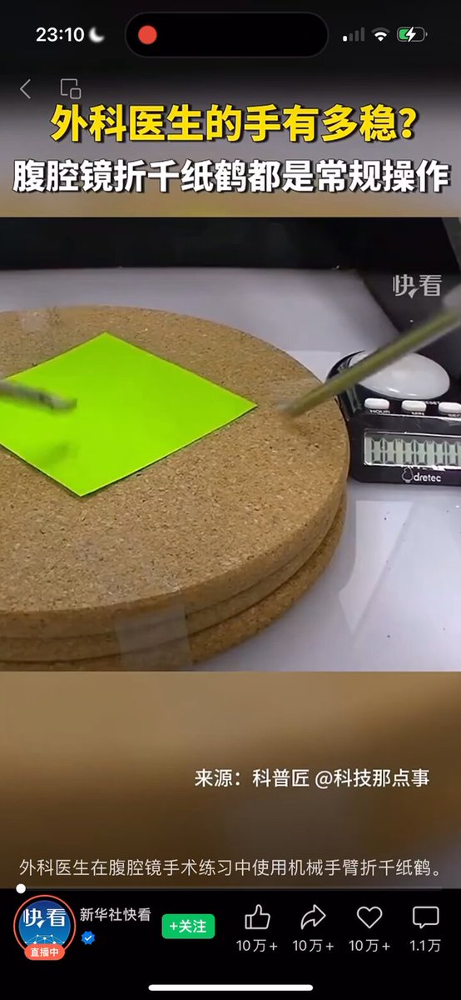

Petrichor 北京时间 2024-02-29T21:37:29Z 1763196796552065217 美联储主席鲍威尔的访谈视频，对中共国的部分清晰表达了以下几层意思：

1，中国不是市场经济；
2，中国经济遇到了大问题，经济不行了；
3，中美金融几乎没有交集，做空中国不会影响美国；
4，美国只是买了一些中国制造的商品；
5，美国与中国在经济与金融层面并没有太多的交集（近乎于彻底切割了）；
6，中共国经济崩溃之后对国际社会不会有太大的影响，只会有一点感觉而已；
7，他们不行了不代表我们不行了。所以仅仅只是他们不行了。
看着鲍威尔云淡风轻的模样，不知会否让洗帮主沮丧、抓狂。

四十年改开是以美国为首的西方世界对中国的帮助和引导，甫一出手，中国便天翻地覆。我意识到美国希望中国平稳过渡，和平演变；不希望中国大动乱、大震荡，对中国和世界都没有好处。

哪知一向好大喜功、在国际上没见过世面的乡巴佬中共，居然能沾沾自喜地把功劳归己。一群屎上雕花的、以谄媚为晋身之阶的知识奴才，将其解读为极权体制的优越性，还要与美国一争高下。多么可笑！

尤其是细，在美国眼里你就是个屁！
你把美国当对手甚至当敌人，人家从来都懒得正眼看你，你情何以堪。

现在世界上正发生着以干翻美国为终极目标的两场战争：一场是中共与美国所谓的经济金融战。中共倚仗从不知哪得来的东升西降的理论武器，信心十足的摆开阵势，准备成就万邦来仪不世之功勋，没想到美国以撤资、芯片两招（只两招）就简简单单轻而易举的让中共败下阵来。

一场是俄罗斯与乌克兰的对决。普京豪言1小时22分拿下基辅，成了二十一世纪最大的笑话。把一个演员变成了英雄，把一个硬汉变成了小丑。
要多磕碜有多磕碜。

目前，这两场战争的负面效应已经在两国内部大面积外溢，对俄罗斯而言，失败是注定的，大概率会面临再次解体；对中国而言，股市的崩溃、经济的下行、公信力的丧失等等，是体现，是证明，更是雪上加霜。中国人民现在受的苦与过去受的苦一样，都是中共造的孽。
洗罪无可赦。

中国未来的路，已经不是简单地、真心实意地拥抱世界能起作用的；也不可能再拿所谓的中国特色作为幌子欺骗世界。中国的前途只有一条路：主动或被动地结束极权体制！
中共或主动改制或被动解体；政治民主化，经济自由化。

改开四十年不是中共的功劳，是中共松动了一根小魔爪的结果。四十年让我们看到了中国蕴藏的巨大能量。如果没有中共及其体制，中国该有多么光明的前景！   Petrichor 北京时间 2024-02-29T10:34:21Z 1763029913194369195 中国学术造假太疯狂了，被国际学术期刊发现数据造假，撤稿数一年就有10000篇，涉及几万个作者。发现的仅是冰山一角，大多没有被发现或曝光。

学术上正本清源才能带来科技领域的正常运行。否则，花了科研经费，换来是一堆垃圾。假成果有百害而无一利。有的人靠一篇作假数据的Nature论文，做了院士，然后再做学官，浪费几亿科研经费，其实行内专家都知道他没有水平。

是时候开除论文造假的院士砖家教授学者，这些人的作为才是真正的辱华。   Petrichor 北京时间 2024-02-29T11:47:49Z 1763048400381980715 邱香果和丈夫陈克定几年前就被加拿大国家病毒实验室开除工作，直到现在加拿大大报还发长文对这两人与中国解放军陈薇将军以及武汉病毒所的合作耿耿于怀，套用中共处理贪官的话说：邱香果夫妇对加拿大极不忠诚，谎话连篇，哪怕加拿大情报局官员把相关证据放他们面前时，他们还继续抵赖。他们参加中国多项人才引进计划，拿加拿大国家实验室成果到中国申请专利，泄露加拿大研究资料和秘密…..   Petrichor 北京时间 2024-02-29T12:39:30Z 1763061408772522142 大家都知道美国和加拿大外科医生挣钱多，许多年轻人想进医学院学外科专业，先练习一下这个，看你的手能否熟练地操纵机器臂，干起活来做到稳准狠。 https://t.co/NZeSFwiP1a   Petrichor 北京时间 2024-02-29T12:58:29Z 1763066187015929907 哪是一个什么样的女人能够同时迷倒四个男人，甚至让已婚已育的老师送她包、钱、车、5篇SCI论文，并为她自杀？看照片她相貌平平。莫非她在床上是那种让男人特别消魂的不怕苦不怕累不怕脏的小妖精？到头来，一个个男人只是她人生道理的一块跳板而已，她的前途无量。 https://t.co/BBnMfuwiJW   Petrichor 北京时间 2024-02-29T07:37:38Z 1762985439936266547 作为华人，挺为自己的祖国悲哀的，俄罗斯侵略乌克兰，举世谴责，140多个国家参与对俄罗斯的制裁，可是中国政府却支持俄罗斯。
塔利班压迫和欺凌妇女和女童，人神共愤，全世界予以谴责，但是中国政府公开表示对塔利班的做法不反对、不批评，其实就是支持。

中国政府一方面要求欧美对华不脱钩，另一方面凡是欧美反对的，中国政府就要拥护。但是中国政府不代表中国人民，人民不同意他们的做法。中国必须拥抱世界文明。   Petrichor 北京时间 2024-02-29T00:03:22Z 1762871122184339633 小粉红常用欧洲人到北美大地如何对待印第安人作为攻击白人的“事实”，却不知中国历史比这惨得多的历史事实。中国历史是一部野蛮史，不忍卒读。鲁迅说中国历史上写着两个字：吃人。 https://t.co/DEC4l4wvdF   