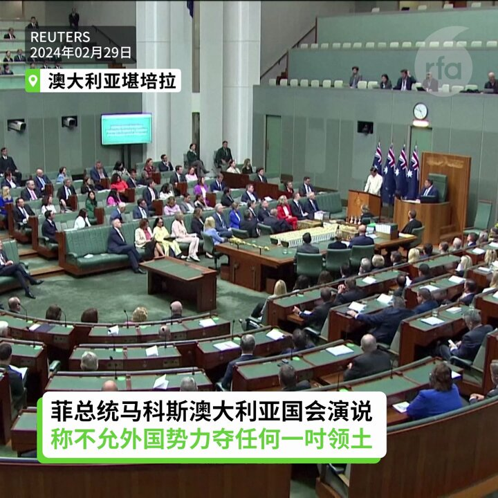
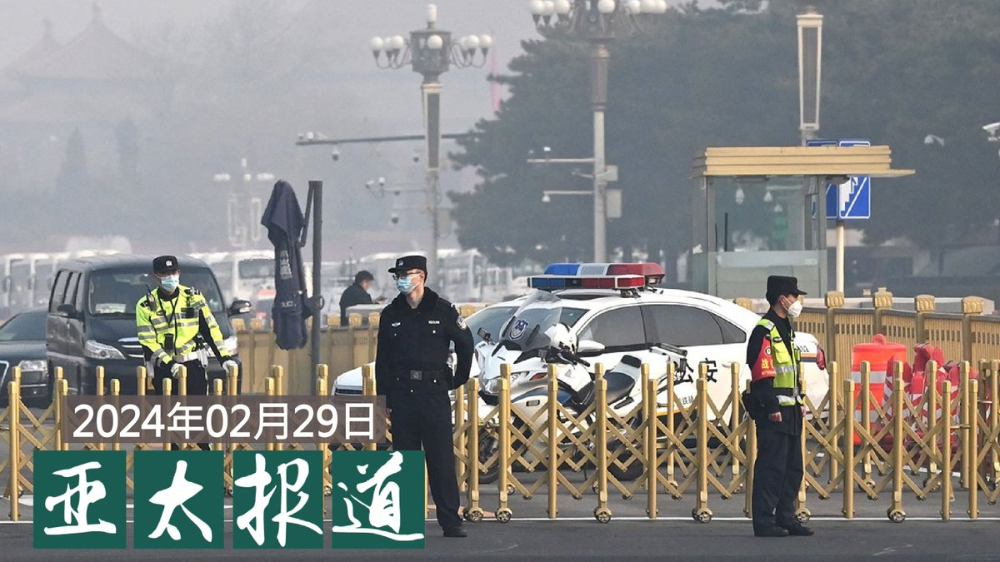
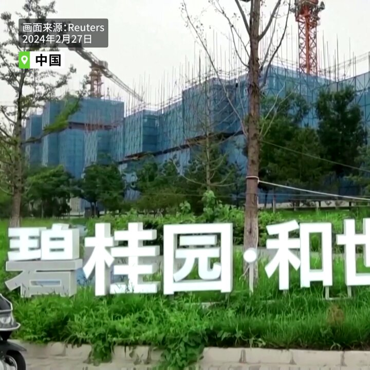
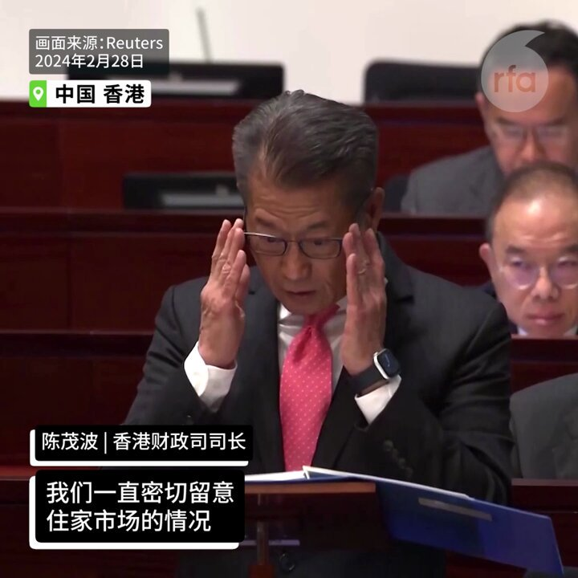
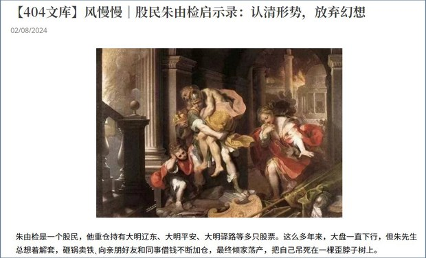
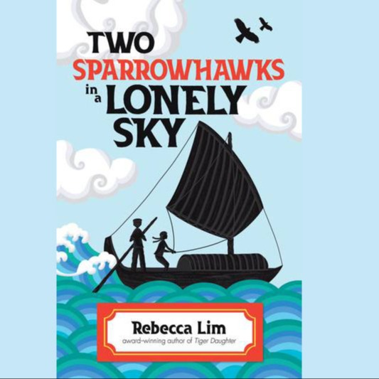
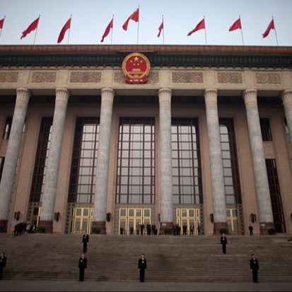
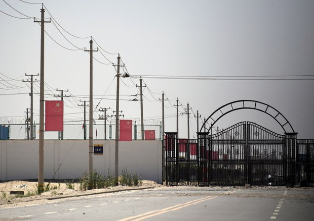
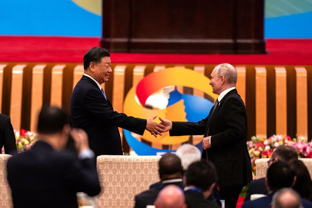
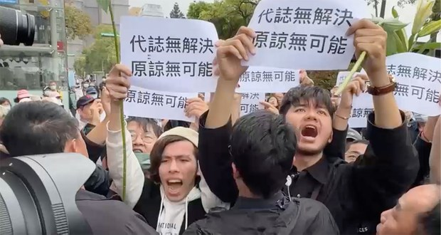

自由亚洲电台 北京时间 2024-02-29T21:47:30Z 1763199315491553335 【我的歌 回西藏的路】
两位藏族歌手在异乡相遇，吟唱刻骨铭心的离散藏人点滴。丹增昆桑是在印度出生的流亡藏人二代，此生从未见过家乡，龙珠慈仁在19岁那年从西藏流亡印度，异国婚姻让他们为爱移动生命的轨迹，昆桑移居日本，龙珠落脚 #台湾，去年底两人开始对唱，让世人听见隐而不显的 #西藏 故事。 https://t.co/GKrlAi1Fg4   自由亚洲电台 北京时间 2024-02-29T14:43:42Z 1763092663920971891 【中国150所高校与雄安签署引才计划】
【北京15所大学雄安建分校区】
北京大学、清华大学等150所高校与雄安新区签署“共建引才工作站合作意向书”，23个校企、校地产学研项目集中签约。北京交通大学、北京科技大学、中国地质大学等15所高校将在雄安新区建设校园。据一位大学毕业生说，河北石家庄的大学也将在雄安建校区。详细报道：https://t.co/tZPJUaDKqw  #雄安   自由亚洲电台 北京时间 2024-02-29T16:20:53Z 1763117123017326759 【菲总统马科斯澳大利亚国会演说】
【称不允外国势力夺任何一吋领土】
菲律宾总统马科斯周四(2月29日)在澳大利亚国会演说表示，他不会允许任何外国势力夺取菲律宾哪怕是“一平方英寸”的领土，并表示将坚定捍卫主权。这是菲律宾领导人首次在澳大利亚国会演讲，澳大利亚给予马科斯罕见礼遇。澳菲签署了加强海事合作的新谅解备忘录。
#马科斯 #中菲关系 #南海   自由亚洲电台 北京时间 2024-02-29T09:38:09Z 1763015771738046819 欢迎收听和订阅播客【＃亚太报道】 https://t.co/MjLNSvVMqc
中国"#两会"在即 敏感人士被上岗；中国再次修订 #国家保密法 意欲何为；多名军方将领人大代表资格被取消；#中俄 加强亚太协调各有算计；香港国安法 #第23条 如何影响香港 https://t.co/pdnSPqc9jc   自由亚洲电台 北京时间 2024-02-29T09:47:13Z 1763018052608606688 【起诉莫言  闹剧还是悲剧？】
近日，有人向法院起诉作家莫言，指控其在作品中“美化侵略战争”“贬低中国人民” 等等，要求“莫言向全国人民道歉”、“赔偿全体国人名誉损失费15亿元”等。此人还在网上搞了一个投票 ，结果一万多个投票者当中，有九千多个赞成 #起诉莫言。
这两天此事愈演愈烈。#胡锡进 认为这是扣帽子，断章取义，担心又一次打开互联网上恶意构陷的边界和想象空间，成为“宁左勿右”的网上示范者。
#您怎么看？   自由亚洲电台 北京时间 2024-02-29T07:02:27Z 1762976585337262469 航天专家, #中国航天三江集团 有限公司董事长 #冯杰宏 辞去全国人大代表　与整肃 #火箭军 有关？
https://t.co/09uMHSkR7r https://t.co/glNFyHR4hJ   自由亚洲电台 北京时间 2024-02-29T07:10:27Z 1762978601497239693 【专栏 | #中国透视：在中国之外重建中国】
这些润来海外的华人，依其个人的本性及其人生的历史际遇，他们分别想重建的中国主要侧重于两方面 ：“政治中国”和“文化中国” 。 https://t.co/EmWsi6HFIF https://t.co/1Rc3mZucOc   自由亚洲电台 北京时间 2024-02-29T07:14:42Z 1762979668964347974 【碧桂园面临清算】
2月28日，#碧桂园 透露他们遭债权人提出清算呈请，原因是其未支付价值 2.05 亿美元的贷款。

-- https://t.co/zrF1bZADwH   自由亚洲电台 北京时间 2024-02-29T07:21:59Z 1762981504165253453 【港府赤字逾千亿港元 连出多招救楼市】
港府撤销所有压抑楼宇卖买的“辣招”，是否见效还有待观察。 https://t.co/kJQgW7byOC   自由亚洲电台 北京时间 2024-02-29T04:37:02Z 1762939991016210456 2月28日，为期三十天的香港《#基本法二十三条》立法咨询期结束，香港离这项法案的通过又更进一步。外界关注，《基本法二十三条》通过后会对香港的公民社会带来什么样的影响？这是否又会改变外国公司在港投资的意愿呢？
https://t.co/b9tLbDyb3n https://t.co/kC9BD61eei   自由亚洲电台 北京时间 2024-02-29T05:23:10Z 1762951602716184813 专栏 | #网络博弈: 虚构文学体微信文章影射 #股市 被屏蔽
https://t.co/lWwT59goxf https://t.co/0tHO7QuRP9   自由亚洲电台 北京时间 2024-02-29T06:02:38Z 1762961532340838714 中国全国人民代表大会常务委员会2月27日发布公告，宣布前外长秦刚辞去全国人大代表职务。
法新社报道说，秦刚辞职被接受，称王毅是中国外交真正老大。
您赞同吗？#您怎么看？ https://t.co/rfs0jtFMvq   自由亚洲电台 北京时间 2024-02-29T06:05:21Z 1762962215328788524 据《世界报》 Carole Dieterich报道，印度梦想取代中国成为世界工厂，该国正在吸引越来越多的智能手机生产份额，但贫困等结构性弱点是一个障碍。
您认为，印度是否有实力取代中国成为世界工厂？
“印度制造”与“中国制造”，您更看好谁？ https://t.co/LD2x6T34NB   自由亚洲电台 北京时间 2024-02-29T02:31:48Z 1762908476815368642 最近，澳大利亚一本文学作品引起社会关注。#澳大利亚 华裔少年文学作家Rebecca Lim通过新作"#孤天双鹞" (Two Sparrow hawks in a Lonely Sky) 讲述了1950年代中共大跃进造成中国多处饥荒期间，华南农村里的一对未成年兄妹在母亲饿死后被迫流落他乡的故事。
https://t.co/94NPtiOB8g https://t.co/qQvaKqhNBC   自由亚洲电台 北京时间 2024-02-29T03:18:26Z 1762920213140721714 据中国官方最新消息，《中华人民共和国 #保守国家秘密法》本周二通过了第二次修订。新的修订内容强调党对 #保密工作 的领导，进一步泛化了国家安全概念。外界普遍认为，此举会加剧外商在华经营风险，继续重创中国复苏乏力的经济。 
https://t.co/IIz07JQs8L https://t.co/pbMiQIS6Np   自由亚洲电台 北京时间 2024-02-29T03:26:00Z 1762922116708753803 #聚焦维吾尔 | 伊利夏提 @HKokbore：中国官员暴虐之罪罄竹难书、#维吾尔人 躲再教育营买刑期入狱
https://t.co/2MVxQcxgka https://t.co/5Yj6DWHG2x   自由亚洲电台 北京时间 2024-02-29T03:55:08Z 1762929446464741617 正值 #俄乌战争两周年 之际, 中国外交部周三（28日）表示，中俄应加强在亚太事务中的沟通协调。同时，俄罗斯外泄军事档案显示，俄军仍就中国侵略的多种情境展开演练。对于 #中俄 之间微妙的双边关系，专家如何看待？
https://t.co/k8t0OdjlbV https://t.co/bWDFbIhmdP   自由亚洲电台 北京时间 2024-02-29T00:16:08Z 1762874332701917464 就中国三无船舶在 #金厦海域 翻覆事件，台湾处理本案的官员表示，该船在逃避检查蛇行过程中，高速急转弯，是否因此导致翻覆静待司法调查。此外，台湾方面已排除此船为民兵船。
https://t.co/P8pMc5RVR6 https://t.co/JrD4vs1wlQ   自由亚洲电台 北京时间 2024-02-29T00:50:32Z 1762882989875454401 "#九二共识"创造者 #苏起 曾在新书发表会上悲观地预测，两岸在四到五年后可能就game over(游戏结束)。日本东京大学东洋文化研究所教授 #松田康博 在本台《#亚洲很想聊》节目中表示，苏起太轻视战争的困难程度。中国若发动台海战争，美日势必卷入，成本与代价非常大。
https://t.co/0lMSWz0bmQ https://t.co/P3pyhbh2jT   自由亚洲电台 北京时间 2024-02-29T01:23:56Z 1762891394887377322 今年是台湾的 #二二八事件 七十七周年。
自称“蒋家后代”的 #蒋万安 以台北市长身份出席二二八纪念，遭到抗议，他公开致歉表示会记取教训。
滞台异议人士感叹，纪念二二八蓝绿取得共识，中共屠杀学生的 #六四事件，何时能像台湾获公开平反？
https://t.co/pMjGFxZhpv https://t.co/aKwjfeCkHF   