谁将十万横扫三江 北京时间 2024-02-29T18:01:27Z 1763142428243148963 RT @Qiangguofanzei: 很多具有普世价值的推友以及这次认识王志安的台湾人，可能都会怀疑，这么个玩意到底是哪里来的那么多粉丝，怎么会有那么多菊孝子到处保驾护航。除去王志安买粉的部分，今天就跟大家发长推分析一下，也不枉充了推特会员…   谁将十万横扫三江 北京时间 2024-02-29T20:45:56Z 1763183824928899230 2月19日，一个女生带爱猫去广州爱诺百思动物医院宠物店接受高压舱治疗，治疗时高压舱突然爆炸，导致女生现在脑死亡，五官碎裂，头骨整体裂开，人还在icu抢救

中国政府：不是爆炸，是舱门碰到了面部 https://t.co/ZGMwXsvsi2 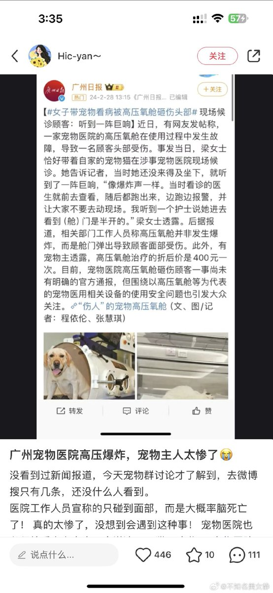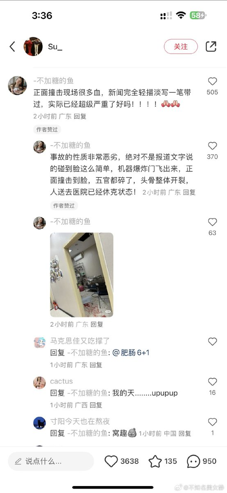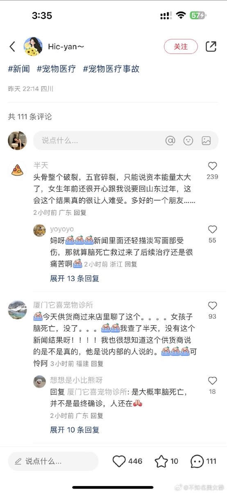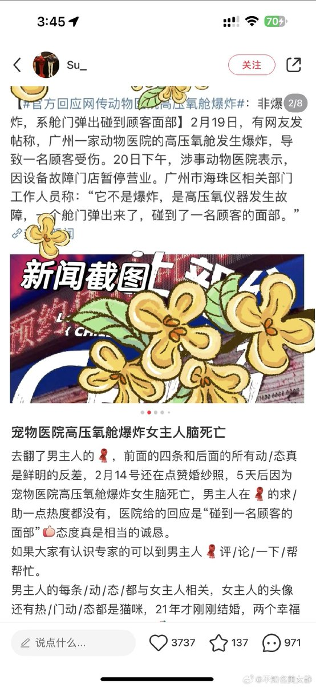  谁将十万横扫三江 北京时间 2024-02-29T12:02:37Z 1763052124861239478 分享陳澄波畫作：淡水夕照、嘉義街外、我的家庭、自畫像。

陳澄波1895年出生於嘉義，日本時代進入台灣總督府國語學校就讀（今國立台北教育大學）。他是第一位以油畫入選日本帝展的台灣畫家，代表作《淡水夕照》至今仍是台灣畫作拍賣記錄最高的保持者。

1947年228事件期間。當時的嘉義市長孫志俊要求駐守嘉義的軍方率軍隊進入嘉義鎮壓，而陳澄波代表民眾擔任「和平談判代表」前往嘉義水上機場和軍方談判。談判代表一到機場，就被趕下車，雙手被鐵絲纏繞反綁在背後，被衣服蒙住臉，遭到拘禁刑求。
3月24日他在警局寫下遺書，隔天3月25日（這天同時也是中華民國的「美術節」）陳澄波以「叛亂暴動」罪名，遊街示眾。他跪在車上，雙手反綁，背上插著死囚牌。在嘉義市火車站前公開槍決，享年52歲。
出於當時政府的壓力，鄰近醫院拒絕出借擔架給他的家屬。家屬只好返回家中，拆下家裡的門板充當擔架，將陳澄波的屍體抬回家中。 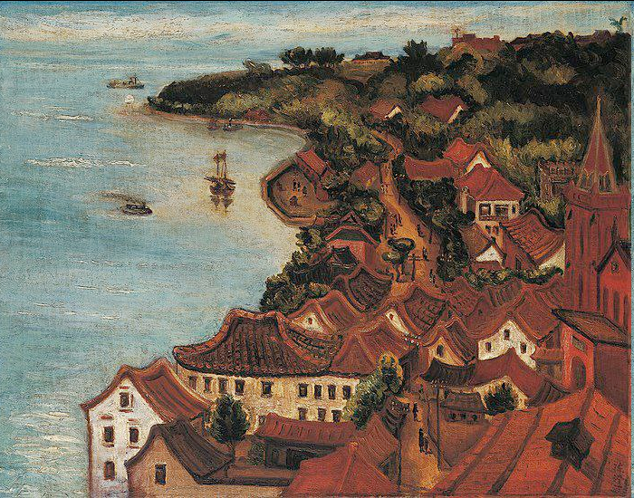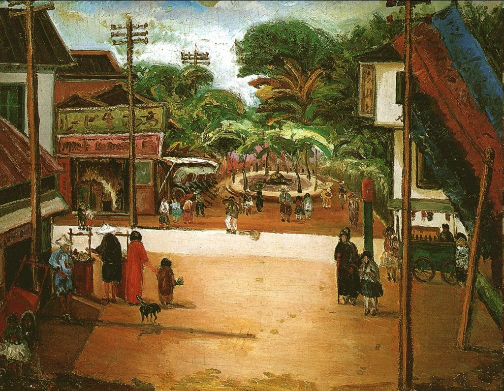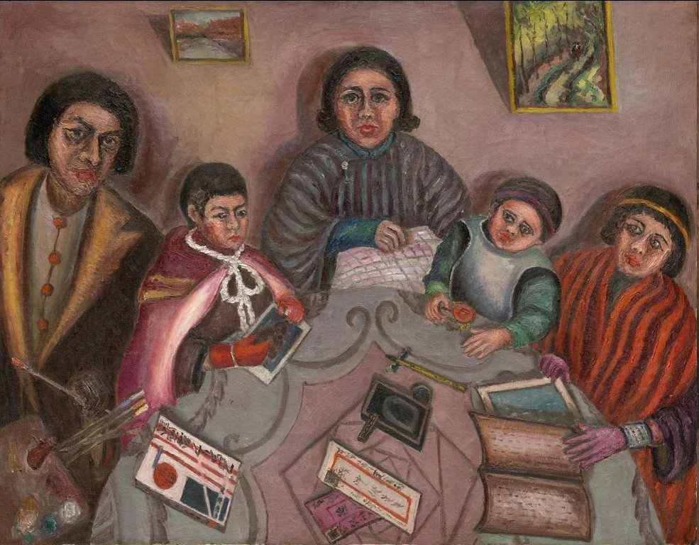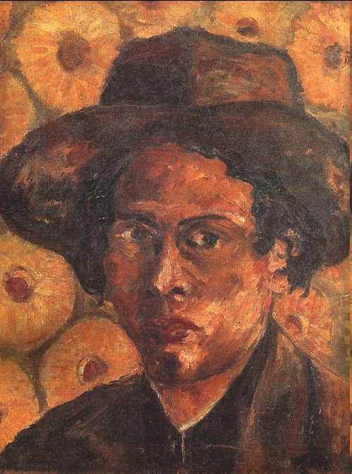  谁将十万横扫三江 北京时间 2024-02-29T12:29:25Z 1763058871713894563 广湛高铁项目之所以推进缓慢，主要是因为广佛交界处的征地拆迁属强买强卖。征地拆迁合同的保障性条款聊胜于无，征地价格低廉，征地拆迁推进工作不规范等，让当地村民反抗不止。视频摄于2024年2月27日 https://t.co/tNTKeccMnW 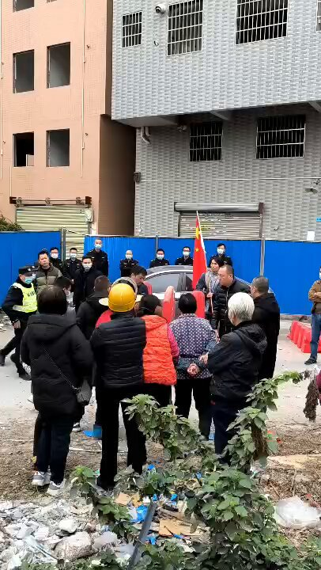  谁将十万横扫三江 北京时间 2024-02-29T12:36:47Z 1763060724816044531 毛粉红说为什么中国没有流浪汉？因为中国网络管制💧 https://t.co/mf5tLi5lBm 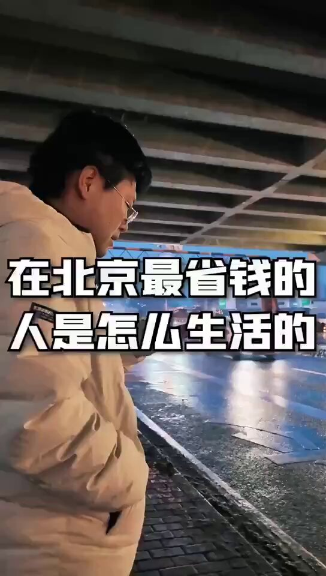  谁将十万横扫三江 北京时间 2024-02-29T09:59:42Z 1763021191437328691 美国最高法院开庭辩论：“公民有权持有机关枪么？”

1、 我写了这么多美国最高法院的案子，一直很想好好写、但还没来得及写的，是关于第二修正案的，也就是持枪权问题的案件。

2、 大家这两年，被美国的堕胎权、种族平权、特朗普的各种奇葩诉讼占据了眼球。但其实，美国的持枪权判例，也大大开了历史的倒车。这甚至是最严重的倒行逆施，因为这些年美国的大型枪击案、尤其是校园枪击案简直太多太多了。

3、 前年，在堕胎权案判决书发布的几乎同时，最高法院颁布了一个极为令人震惊的判决，即Bruen案。保守派主笔的判决书宣布：持枪权的解释，严格按照华盛顿、杰斐逊时期的十八世纪文本和“传统”进行理解，凡是不符合国父设想的限枪法律，一律违宪。

4、 今年，最高法院别有用心地受理了两个案件。一个案件，前一段时间已经开庭，还没有宣判，但案情极其离谱。德州法律规定，家暴者不允许持枪。一个德州的家暴男，多次殴打伴侣，还多次在停车场等公共场合开枪。由于被法院开了禁令，他起诉德州，认为侵犯了他的宪法第二修正案权利。为啥呢？因为，在18世纪，家暴不是个事儿，当时法律也没有禁止家暴男持枪……

5、 这种试探性的案件，不是真的关心家暴男的权益，他们就是为了用各种奇葩来蚕食限枪、控枪的努力，最终让持枪成为一种无人可管的超级权利。

6、 今晚，最高法院将迎来第二个案件的开庭辩论。

7、 美国之前的两党共识是，禁枪肯定是不可能的，但在武器类型上，最好能限制在自卫程度，所以，机关枪是不允许普通公民持有的。

8、 官方定义是：机关枪，扣一次扳机，可以发射多颗子弹；步枪，一次发射一颗子弹。

9、 但是问题来了——有人发明了一种撞火枪托，作为配件安装之后，它能把半自动步枪瞬间改装成一梭子一梭子狙人的大杀器。现在的问题是：安装了撞火枪托的步枪，到底是不是机关枪？

10、 德州有个哥们开了个枪店，里面卖这种撞火枪托版步枪，但由于法律，这些枪都被迫上缴了。哥们就起诉了这部法律，认为违反宪法第二修正案。今晚就要讨论一下：“禁止机关枪”能不能被解释为“禁止撞火枪托步枪”？

11、 一个背景知识：2017年，拉斯维加斯音乐节，有个狠人扫射观众人群，杀死60人，打伤500人。他用的就是撞火枪托改装的步枪。

source (https://t.co/DEvNIQs2jP) 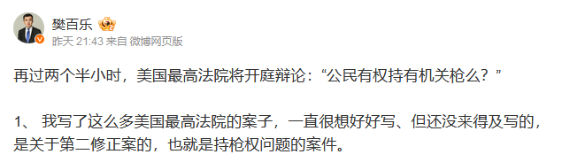  谁将十万横扫三江 北京时间 2024-02-29T10:07:45Z 1763023220117274737 一封深圳来信：母亲5件健康器官被深圳这家医院切割摘除后死去，法院判赔62万元

尊敬的邓飞先生：今日给您写信是想给您讲述一件发生在我家的悲剧。

         我母亲身体健康，没有任何不适，没有任何症状，只是于2018年8月9日去香港大学深圳医院做体检，港大深圳医院以我母亲胆总管扩张为由将我母亲收入住院。胆总管正常值是6-8mm，我母亲的是8mm（在正常值范围内），可万万没有想到就因为这，从这刻开始，我母亲的生命已经进入倒计时了。

        港大深圳医院给我母亲做了各种各样的检查，均没有发现问题，最后行ERCP下管检查，在胰腺开口的地方切了一个8毫米的小口并做胰管刷检，结果刷检病理也没有发现问题，没有发现肿瘤细胞，至此体检应该结束，理应让我母亲出院。

        但是，港大深圳医院却不让我母亲出院，而是安排我母亲就在这个有创检查的第二天，伤口还没有好的情况下，去做PET-CT检查，由于有伤口，PET-CT就在伤口的位置显示一小团高代谢灶（俗称伪影），这是因为PET-CT的追踪液会在有创检查的伤口炎性细胞处聚集形成伪影。港大深圳医院明知这个伪影是他们颠倒有创检查和无创检查的先后顺序形成，明知ERCP有创检查在此处刷检病理结果没有发现肿瘤细胞，明知PET-CT检查报告单上警告：仅供临床参考，港大深圳医院在此处病理结果没有发现肿瘤细胞的情况下，将他们制造的伪影故意说成“胰腺癌”，要求家属在“胰腺癌”手术知情书上签字，家属不是专业人士，完全被蒙在鼓里。

        接下来史上最残忍的切割摘除开始了。因为是伪影，所以根本不可能有病灶。主刀人纪某在没有病灶的情况下，不做剖腹探查，不做术中快速病理确诊，不将术中没有病灶的情况告诉在外焦急等待的家属，因为如果他按规定，但凡做了其中一样，手术都做不了，我母亲也就生还下来了。但是，主刀人在没有病灶的情况下，一上来就直接将我母亲全部胰腺、胆囊、脾、十二指肠、部分胃5个健康的人体器官切割摘除，一件一件地将我母亲的健康器官摘下，总共5件，残忍的切割摘除一直持续了十个多小时，我可怜的母亲肚子都空了！术后病理证实：所有被摘除的器官均为人体正常组织，均无任何实质性肿物，均未见恶性证据！    

        手术后，港大深圳医院未按规定将我母亲被摘下来的健康器官向我们家属展示，我们受害者家属不知道这些健康器官的真正去向！

        由于太多的消化器官缺失，我母亲无法正常代谢，还要应对手术带来的多个并发症，医院多次下病危通知书，最终于2018年12月2日含恨离世！

       一次体检，一条人命！
       后经司法鉴定结果：香港大学深圳医院责任参与度是61%-90%。

       2023年11月28日，深圳市中级人民法院作出终审判决：判决香港大学深圳医院承担全部的赔偿责任。要求香港大学深圳医院于本判决发生法律效力之日起十日内向受害人家属赔偿627645.68元，该赔偿已执行。

       但是，在手术中没有发现病灶的情况下，仍不停手，仍强摘我母亲5个健康的人体器官！做出这样肆意妄为的事情的主刀人纪某，至今没有受到任何惩处！是谁在庇护他？

       如果这种制造伪影——切除伪影的套路不被制止、不受处罚的话，那么还会有更多的人因此受害！如果这种在没有病灶的情况下仍强摘人体健康器官的行为不被依法追究刑事责任的话，那么谁来保卫普通人的生命权！

       法不能向不法让步！但谁来为我们普通老百姓做主！
                            写信人： 郇杰
                            2024年2月26日 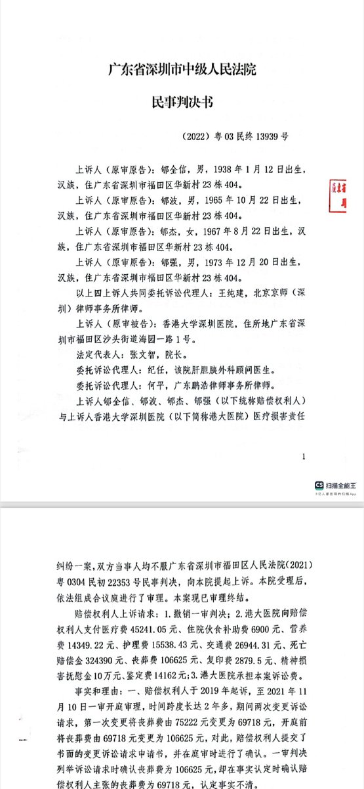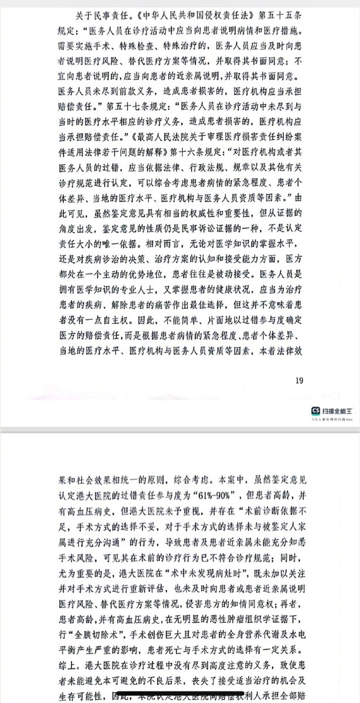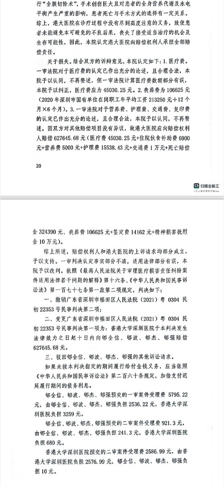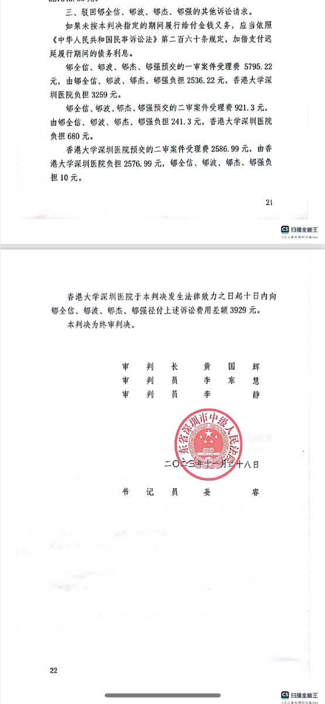  谁将十万横扫三江 北京时间 2024-02-29T10:09:03Z 1763023547591692439 RT @whyyoutouzhele: 2月28日，湖南湘潭。湘乡市栗山镇金泉学校，一女老师因学生不会做题打骂学生。视频显示，老师用手里得作业本扇学生脸，扯学生耳朵。
当天湘乡市栗山镇人民政府工作人员回应：高度重视，已成立工作专班。 https://t.co/GqxD1vRe3F 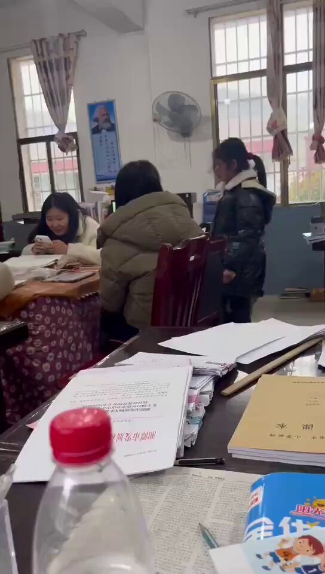  谁将十万横扫三江 北京时间 2024-02-29T10:13:06Z 1763024566354653286 RT @wikileaks: Amnesty on Julian Assange: “The US’ efforts to intimidate and silence investigative journalists for  uncovering governmental…   