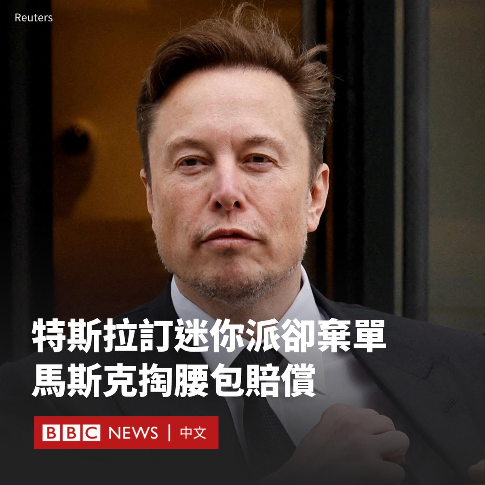
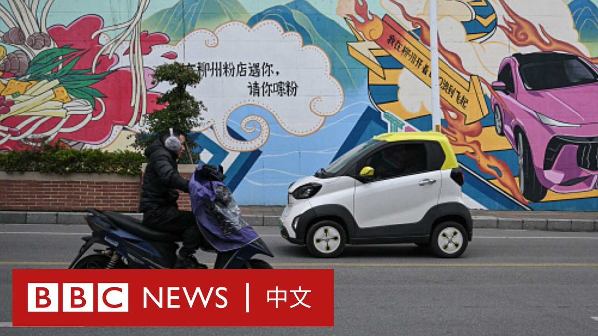
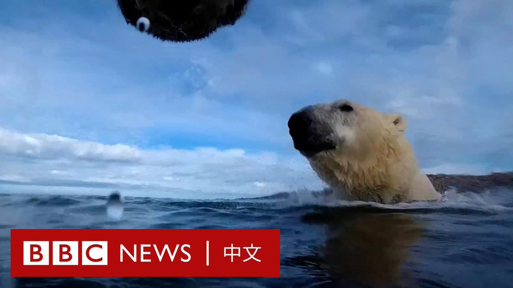

D英国广播公司BBC 北京时间 2024-02-28T17:44:54Z 1762775877346382314 在特斯拉（Tesla）公司被指向一家烘焙店预定约4000个迷你派（馅饼），却临时弃单，导致该店损失惨重后，特斯拉老板马斯克（Elon Musk）为此买了单。

据报道，名为“The Giving Pies”的烘焙店在加州圣何塞颇有名气。老板拉塞塔里纳拉（Voahangy Rasetarinera）称，特斯拉为举办一场活动，在情人节当天向她订购了2000个迷你派。

拉塞塔里纳拉说，她为此要求员工加班、购买原料和用品，并因此拒绝了其他的一些订单。

她表示，特斯拉员工后来要求将订单增加一倍，达到4000 个派，但最后却取消了订单而没有付款。

这名面包店老板在社交媒体上抱怨此事后，引起广泛关注。当地居民得知老板的处境后，纷纷前来支持烘焙店。

马斯克2月24日在X上回应说，他关注到了此事，会“妥善解决面包店的事情”。

据报道，马斯克后来支付了2000美元，并试图让特斯拉下一个新订单，但这家烘焙店表示，由于目前生意太忙，无法接单。

随着这家烘焙店走红，甚至连圣何塞市长也前来购买迷你派。他说，面包店前排队等候的人群“包围了整个街区”。   D英国广播公司BBC 北京时间 2024-02-28T14:40:21Z 1762729433042227386 中国是全球最大的电动汽车市场，特斯拉（Tesla）和比亚迪等高端车型在中国发达的都市随处可见。但在广大的不发达地区和中小城镇，价格低廉的微型电动车正占领街头，成为居民首选代步工具。 https://t.co/ekLPIf35qS   D英国广播公司BBC 北京时间 2024-02-28T12:17:52Z 1762693576213852239 中国全国人大常务委员会周二（2月27日）发布公告，宣布下落成谜的前外长秦刚辞去全国人大代表职务。分析人士认为，当局允许秦刚自行请辞可能表明，针对他的处罚不会“上升到被视为犯罪的程度”。https://t.co/vtu7qVCqm4   D英国广播公司BBC 北京时间 2024-02-28T09:09:29Z 1762646166712488346 随着海冰面积不断缩小，北极熊不得不在陆地上待更长的时间。科学家们选择在加拿大北部个别北极熊的脖子上放置相机，希望能研究它们在夏天的行动，了解它们如何在没有海冰的情况下觅食。 https://t.co/VJgZdPoRxZ   