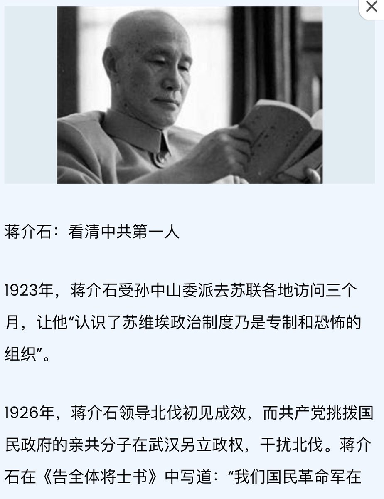
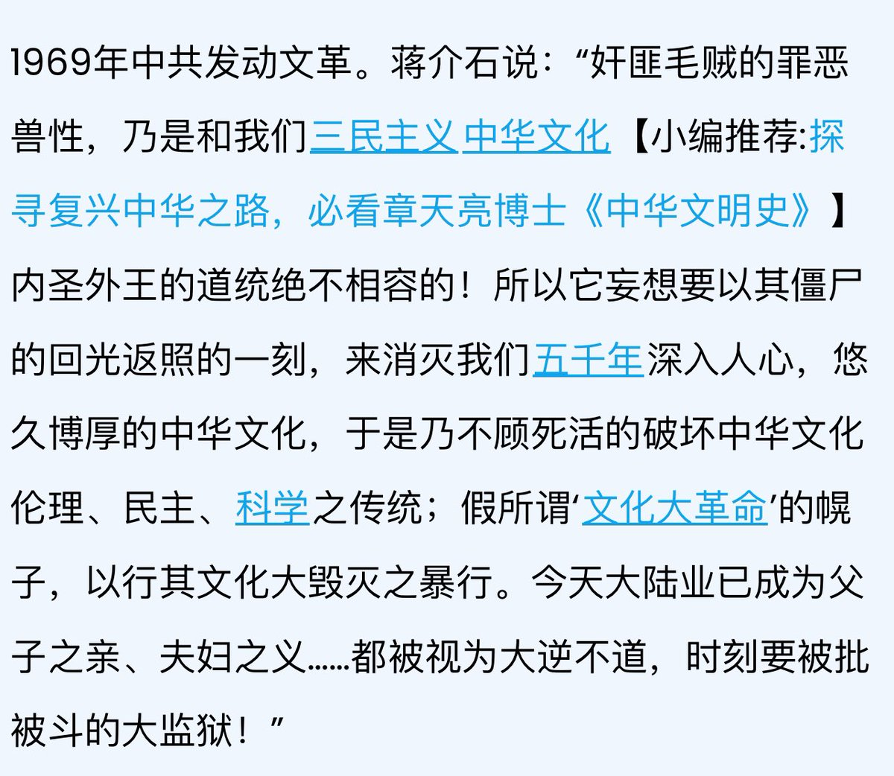
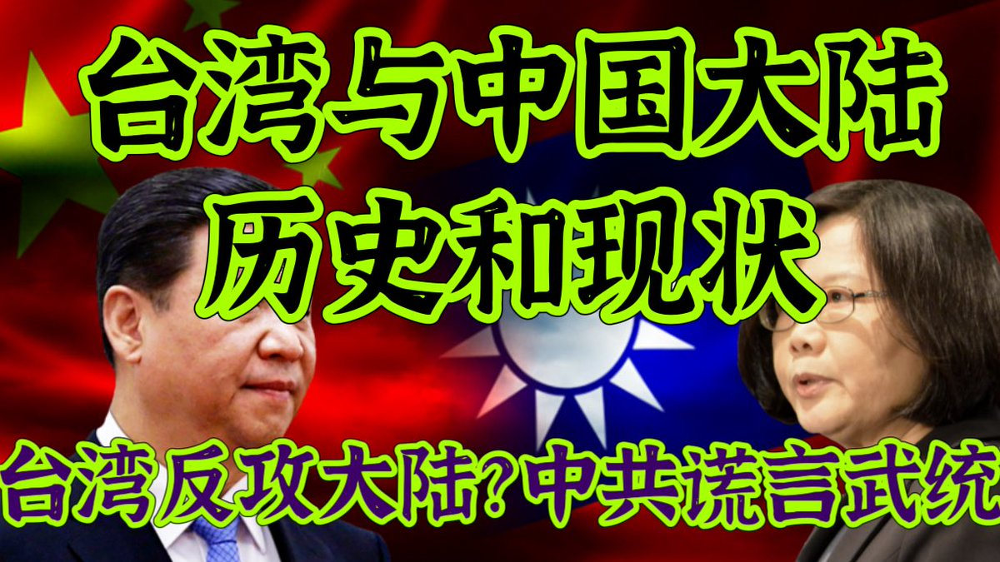
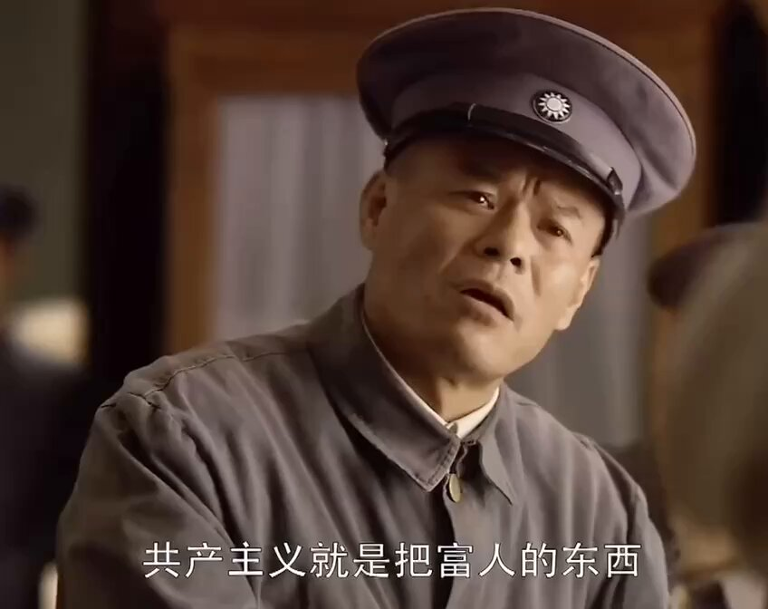
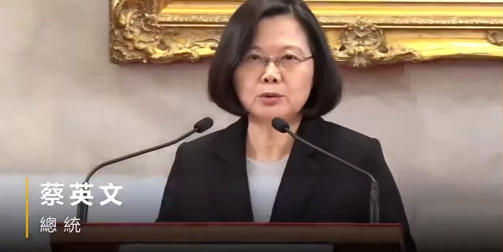

Ivy未央 北京时间 2024-02-28T21:19:34Z 1762829901202133082 RT @Ivy01011: 中共提出的一国两制统一方式，用最直白的话说，就是“我怎么对待我的人民，你们别管，我也不打算改变。但如果你在这方面做得更好，我也能接受。我先退一步，先把你骗过来再说。”… https://t.co/oZMABMPQx9   Ivy未央 北京时间 2024-02-28T22:34:32Z 1762848765306700120 蒋介石评价中共：共产党是人类最大的敌人
看清中共第一人
精辟吧？ https://t.co/RjlQfAfnDO   Ivy未央 北京时间 2024-02-28T15:06:39Z 1762736051112567144 RT @Ivy01011: 台湾最早的居民是南岛语族的原住民，来自现在的中国南部。台湾首次出现在中国的历史记录中是在公元239年，当时古代中国探险家前往那里。这一点，被北京用作对台湾领土主张的依据。随后，台湾历经荷兰人占领、清朝统治，直到1895年中日战争后被割让给日本。二战结…   Ivy未央 北京时间 2024-02-28T15:06:45Z 1762736078023164313 RT @Ivy01011: 希望中国人的下一代，可以在任何一个晚上，站在任何一个地方，说出心里想说的话，而心中没有任何恐惧。
我们这一代人所做的种种努力，也不过是希望我们的下一代将来会有“免于恐惧的自由”。
—— 龙应台 https://t.co/YFGKDcYZ7E   Ivy未央 北京时间 2024-02-28T15:07:14Z 1762736199880376714 RT @Ivy01011: 蔡英文总统关于两岸关系的讲话片段
台湾从来不承认“九二共识”
台湾绝不接受“一国两制”
要看2300万台湾人民的选择。作为民主国家，两岸政治协商要经过台湾人民的授权和监督。
这讲话水平要甩对岸小学生几条街？ https://t.co/3wzAdRF7…   Ivy未央 北京时间 2024-02-28T15:07:21Z 1762736226245677408 RT @Ivy01011: 客观聊台湾与中国大陆，两岸关系的历史和现状！台湾为什么不再主张反攻大陆？中共在台湾问题上有哪些谎言？
https://t.co/blLHaA0kUh https://t.co/BzPFBmLUys   Ivy未央 北京时间 2024-02-28T15:07:26Z 1762736249968730537 RT @Ivy01011: 请欣赏：《中华民国国旗歌》
山川壮丽，物产丰隆，炎黄世胄，东亚称雄。
毋自暴自弃，毋故步自封，光我民族，促进大同。
创业维艰，缅怀诸先烈；守成不易，莫徒务近功。
同心同德，贯彻始终，青天白日满地红；
同心同德，贯彻始终，青天白日满地红。

图片是：中…   Ivy未央 北京时间 2024-02-28T15:30:49Z 1762742134963081557 阎锡山说：“我们是国家，是尽上全力的保护人民；中共是乱党，是干方百计的清算人民。中共不需要人民安居，需要人民和他共同造乱。…他需要的是以富人之钱、地主之地，做他造乱的经费；他更需要的是以穷人的命做他人海战法之工具。”
 https://t.co/DUxqQ3L5ry   Ivy未央 北京时间 2024-02-28T13:57:40Z 1762718689667829961 蔡英文总统关于两岸关系的讲话片段
台湾从来不承认“九二共识”
台湾绝不接受“一国两制”
要看2300万台湾人民的选择。作为民主国家，两岸政治协商要经过台湾人民的授权和监督。
这讲话水平要甩对岸小学生几条街？ https://t.co/3wzAdRF7o0   Ivy未央 北京时间 2024-02-28T14:14:19Z 1762722882319175942 去年英国议会首次称台湾为"独立国家"，中国外交部回应：颠倒是非，混淆黑白。
您认为，台湾是"独立国家"吗？

台湾自己有独立的宪法，民主选举的政府总统，并有约30万常备军队，拥有自己的货币，台湾的中华民国护照免签国家比中共国护照还多呢……怎么就不能是个独立国家？ https://t.co/w0cYWZSuq7   Ivy未央 北京时间 2024-02-28T10:35:40Z 1762667858364903806 希望中国人的下一代，可以在任何一个晚上，站在任何一个地方，说出心里想说的话，而心中没有任何恐惧。
我们这一代人所做的种种努力，也不过是希望我们的下一代将来会有“免于恐惧的自由”。
—— 龙应台 https://t.co/YFGKDcYZ7E   Ivy未央 北京时间 2024-02-28T08:00:16Z 1762628750586359947 問：人死后真的会有地狱吗？
莫言：不用死后，你活着就能看到地狱。
有些人活着他已经死了！有些人死了他还活着？
 https://t.co/ETZss0S1Oy   Ivy未央 北京时间 2024-02-28T08:08:38Z 1762630853438390280 转）龙应台：孩子，我要求你读书用功，不是因为我要你跟别人比成绩，而是因为我希望你将来会拥有选择的权利，选择有意义、有时间的工作，而不是被迫谋生。当你的工作在你心中有意义，你就有成就感。当你的工作给你时间，不剥夺你的生活，你就有尊严。成就感和尊严，给你快乐。
—— 孩子们能明白这些道理吗？   