自由亚洲电台 北京时间 2024-02-28T23:14:40Z 1762858864314314793 身在中国境内的X用户@裸嘢李 公开了自己被请去喝茶的经历：“它（中共）实际上这一次就是针对@李老师不是你老师 这个ID，没有针对其他的。他（警察）还问了我有没有关注一些敏感的（帐号），还问了特别喜欢关注什么样的人。” https://t.co/XFUwLOaGTn   自由亚洲电台 北京时间 2024-02-28T23:20:10Z 1762860249911038016 中国"#两会"在即。北京等地异议和维权人士被当局上岗或被旅游。目前，北京主城区内正在清理约六十万外来人口。另外，武汉、江苏等地公安也启动维稳模式。

https://t.co/iLkpxARLGI https://t.co/bHsKfAd53p 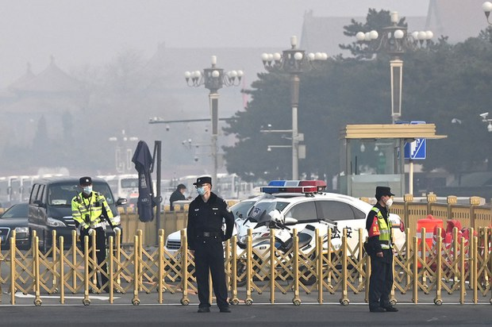  自由亚洲电台 北京时间 2024-02-28T16:33:28Z 1762757899963846945 【中国20多名人大代表资格被终止】
【近半数为解放军将领引热议】
中国全国人大会议将于下周举行。一年内，24名被终止或罢免人大代表资格的人中，除了两人去世，#解放军 代表就有10人，均为解放军海空军少将至上将。另有三名军方企业高官被撤销政协委员资格。评论认为，腐败以及政治等因素导致军队高官落马。
https://t.co/z5Wmweax4F 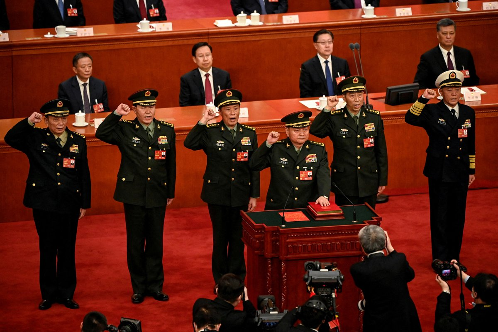  自由亚洲电台 北京时间 2024-02-28T18:10:42Z 1762782370195976554 【台湾纪念228七十七周年】
【台北市长蒋万安遭抗议】
台湾各地周三都举办 #纪念228 的仪式。在台北市，一群自称由大学生组成的团体“无力者”在追思会现场抗议，他们去年就曾于 #蒋万安 致词时，冲上台抗议。蒋万安在致辞时表示身为台北市市长，为当年的二二八事件表达诚挚的歉意，要在任内全力反省沉思，化为尊重人权、捍卫民主的圭臬。
（记者 夏小华 李宗翰） 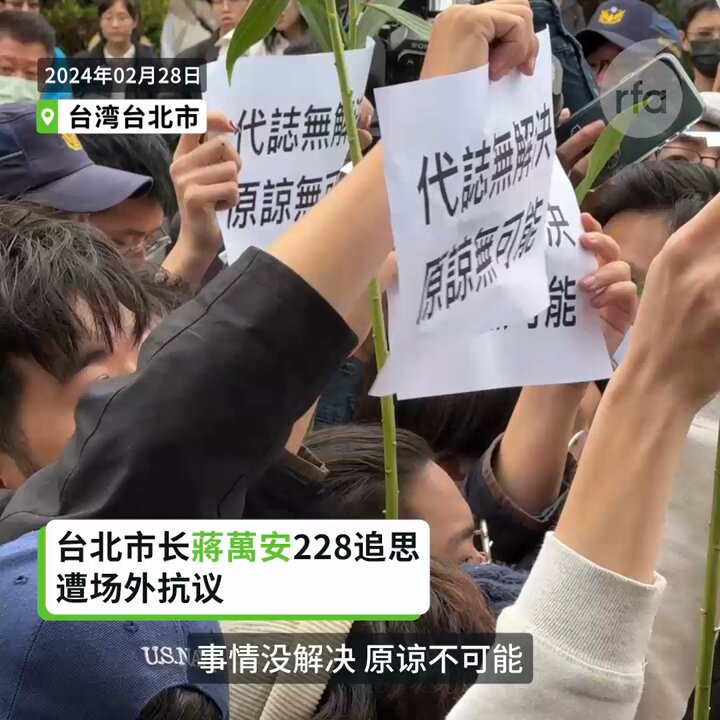  自由亚洲电台 北京时间 2024-02-28T13:34:35Z 1762712882851258446 【台湾自造潜舰海鯤號完成浮船测试】
台湾首艘 #国造潜舰 #海鲲号 26、27日出厂展开泊港测试，确认第一阶段水密性能等相关测试符合设计预期标准，将原型舰从台船公司封闭式组装工厂经由浮船作业移至干坞。
台船说，未来继续进行电瓶与主机等动力系统调校与泊港测试（HAT）后，再进入下一阶段海上测试（SAT）。 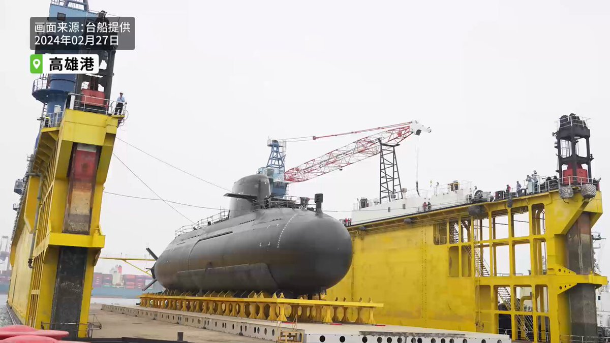  自由亚洲电台 北京时间 2024-02-28T10:15:22Z 1762662746473033832 RT @RFA_Chinese: 【周庭录视频谈狱中生活】
【沉迷小说幻想世界 忘记痛苦】… https://t.co/1dIWKloMLX   自由亚洲电台 北京时间 2024-02-28T10:15:53Z 1762662878870381014 RT @RFA_Chinese: 2月27日，香港民运人士罕见公开抗议政府拟议中的《基本法》第23条立法，称其缺乏民主监督和对人权的保障。自2019年北京镇压反送中运动，并实施全面的国安法以来，公众抗议活动在作为国际金融中心的香港几乎完全消失。香港社民联周二在港府门前举行的抗议…   自由亚洲电台 北京时间 2024-02-28T06:39:24Z 1762608396845597065 2月27日，香港民运人士罕见公开抗议政府拟议中的《基本法》第23条立法，称其缺乏民主监督和对人权的保障。自2019年北京镇压反送中运动，并实施全面的国安法以来，公众抗议活动在作为国际金融中心的香港几乎完全消失。香港社民联周二在港府门前举行的抗议活动如今已十分罕见。 https://t.co/3g9cPqWvgu 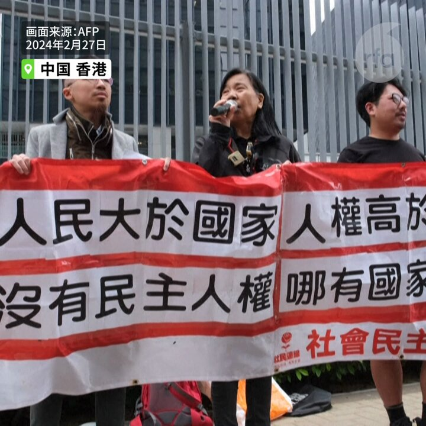  自由亚洲电台 北京时间 2024-02-28T06:42:10Z 1762609093012062688 周二，有关中国创办的“快时尚”巨头 #希音 （#Shein ）正考虑在 #伦敦证券交易所 上市的猜测越来越多。据法新社周二援引天空新闻报道称，#英国 政府已与希音老板进行了会谈。https://t.co/kj4vaFpzsC https://t.co/kzB7rrRWaA 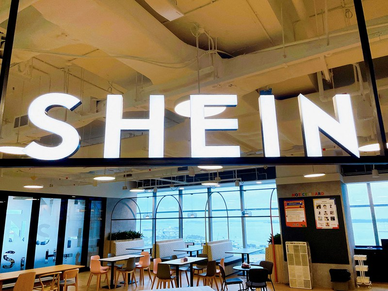  自由亚洲电台 北京时间 2024-02-28T03:36:06Z 1762562270461346031 美驻华大使 #伯恩斯 日前在中国接受美国媒体专访。在谈到美中竞争时，他称，美国不想生活在一个中国人占主导地位的世界。而今年正是 #美中建交四十五周年。对于美中关系的未来走向，专家、学者们是如何看待的呢？https://t.co/pxefisEiFo https://t.co/6bHPSnMo3d 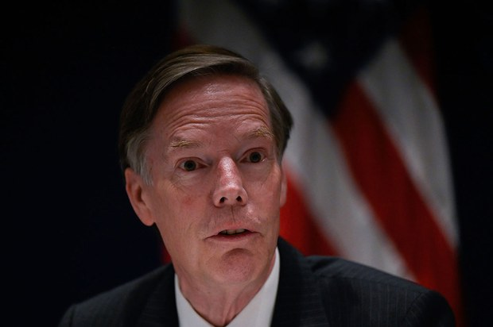  自由亚洲电台 北京时间 2024-02-28T03:38:13Z 1762562802454311277 继北京在港强推《#港区国安法》后，港府再计划推动被指更严苛的《#基本法》二十三条立法。在咨询期届满前夕，联合国特别报告员及国际人权组织均发声表达忧虑，担心含糊不清的条款将进一步危及 #香港人权。而曾经百家争鸣的香港，却只剩一个政党就二十三条立法公开抗议。https://t.co/6E7b2E3kB9 https://t.co/akAjXTWtXw 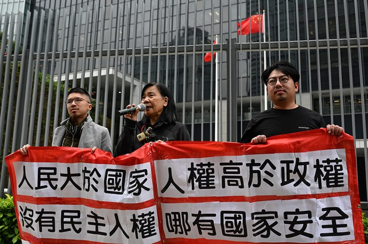  自由亚洲电台 北京时间 2024-02-28T03:39:08Z 1762563034600599690 #评论 | #江棋生：#Sora 之横空出世 仅仅是大力出奇迹吗？https://t.co/ZgKIQrN1mz https://t.co/uwazSCcPNt   自由亚洲电台 北京时间 2024-02-28T03:59:10Z 1762568074509914399 近日，社交平台X著名中国时事博主 @李老师不是你老师 发帖警告说，其160万粉丝正在被中国公安逐一排查。目前已有多人现身说法，讲述自己因为关注 #李老师 帐号而被请去"#喝茶"的经历。https://t.co/mpawARX7hb https://t.co/YDUmbXjIwO 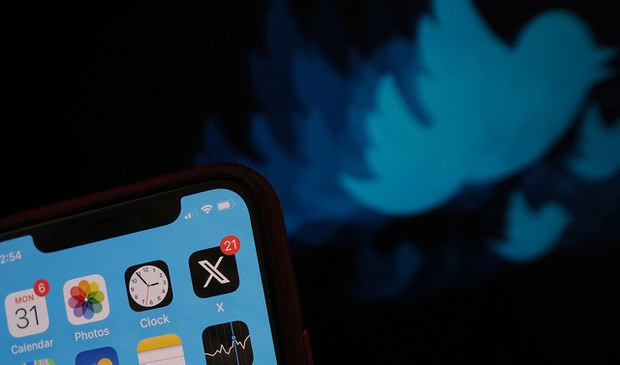  自由亚洲电台 北京时间 2024-02-28T04:18:50Z 1762573022157005021 在疫情过后，中国持续停滞的经济表现是各界高度关注的议题，本周二，英国《#经济学人》杂志北京分社社长 #任大伟（David Rennie）在一场智库研讨会上分享了他对中国当前 #经济 与 #政治 情势的观察。https://t.co/EoM8mC2M2h https://t.co/ZYNC85324N 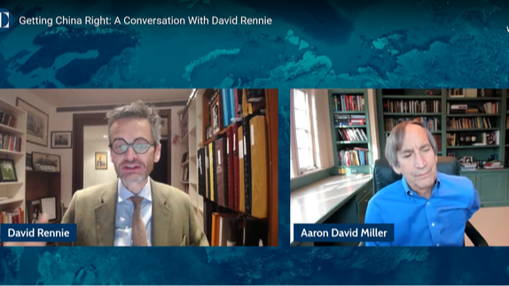  自由亚洲电台 北京时间 2024-02-28T04:40:06Z 1762578374814540003 中国前外长 #秦刚 去年六月就不曾公开露面。 除了他的外长及国务委员职务被免除，外界也传出可能被处决或身亡的消息。本周二，中国官方终于公告 #秦刚去向，表示他已向人大常委会辞去全国人大代表一职，并获得准予。 https://t.co/xHDYIB1DaD https://t.co/mgqk3TmX63 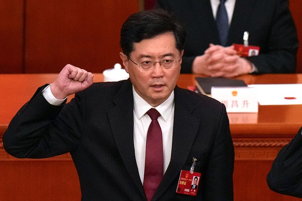  自由亚洲电台 北京时间 2024-02-28T04:41:08Z 1762578636543242709 中国船只继续出现在 #印度尼西亚 南海北部纳土纳群岛周围的专属经济区，即将成为下一任总统的印度尼西亚国防部长 #普拉博沃 呼吁加强印尼 #国防 能力。https://t.co/sHpkCtKNDs https://t.co/D841rHa4KA 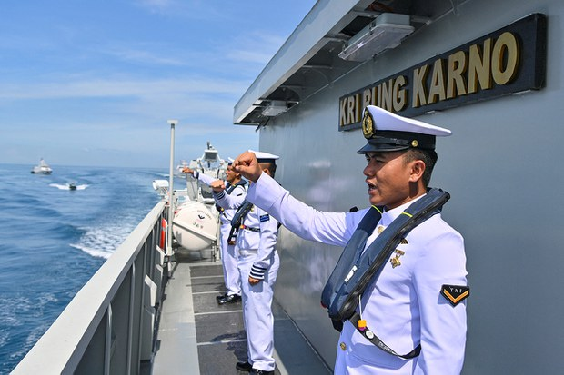  自由亚洲电台 北京时间 2024-02-28T04:41:59Z 1762578847420334589 #聚焦维吾尔 | 伊利夏提：中国官员暴虐之罪罄竹难书、维吾尔人躲再教育营买刑期入狱 https://t.co/2MVxQcxgka https://t.co/FSWWGDdxcq   自由亚洲电台 北京时间 2024-02-28T05:08:38Z 1762585555496247529 法国车企 #雷诺 的目标是引领欧洲反击廉价的 #中国电动汽车。在周一的日内瓦车展上，雷诺推出了一款新车型，该车型旨在成为最实惠的电动汽车之一。这应该有助于他们与大量抢占市场份额的低价中国电动汽车竞争。上汽名爵品牌周一再在欧洲推出新款电动汽车，BYD运抵德国3000辆电动车，来自中国企业的竞争或许只会加剧。   自由亚洲电台 北京时间 2024-02-28T05:11:04Z 1762586168720585120 欢迎收听和订阅播客【#亚太报道】 https://t.co/MjLNSvVMqc 
#秦刚 辞去人大代表 下落仍不明； 中国警方追查 #海外大V 粉丝； 中国家庭存款四年达58万亿； #美国驻华大使 称世界不希望中国主导世界 ； #台湾 称中国正把金门水域“钓鱼岛“化 https://t.co/W3Zrw1Cc9c 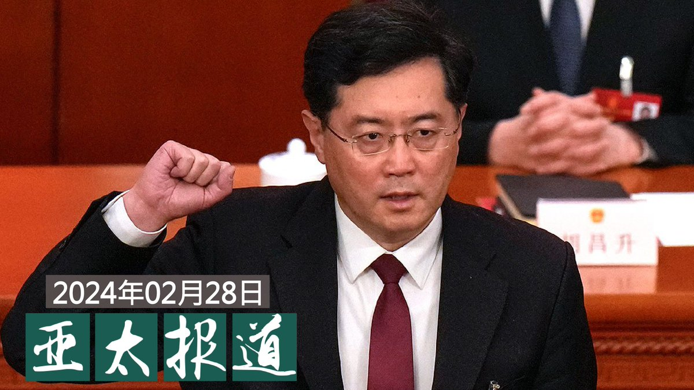  自由亚洲电台 北京时间 2024-02-28T01:10:09Z 1762525537849803134 RT @asiafactcheckcn: 【查核回顾】
【联大2758号决议叙事】

本篇回顾去年五月的查核。美众议院通过法案，旨在反制中国透过曲解联大第2758号决议阻碍台湾参与国际组织。中国国台办批美国提案错误，称此决议解决了 #包括台湾在内全中国在联合国的代表权问题。…   自由亚洲电台 北京时间 2024-02-28T01:31:07Z 1762530814854893927 罹患晚期癌症的浙江 #异议人士 #朱虞夫 本周起在日本接受化疗，但由于他不是当地居民，要支付高昂费用。为了让他安心治病，好友决定公开筹款，下一步会设法让他转到美国与家人团聚。https://t.co/QFghKPUXP8 https://t.co/h4jyHjJMBZ 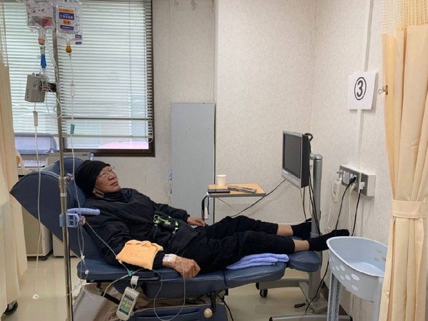  自由亚洲电台 北京时间 2024-02-28T01:32:06Z 1762531063807742070 中国三无船舶在台湾 #金门 躲避查检翻覆事件引发 #两岸关系 紧张之际，台媒报道，台湾执政党、民进党中国事务部主任在一场有两岸学者与会的线上会议表示 #台独党纲"已是历史文件"，掀起热议。 https://t.co/YuYkpulGLZ https://t.co/WBRvonUvoH 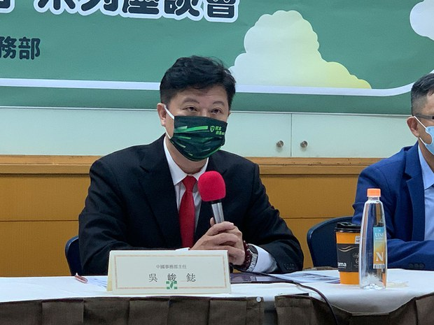  自由亚洲电台 北京时间 2024-02-28T01:32:59Z 1762531287255154885 2月26日有五艘 #中国 的海监、海警船进入金门的禁限水域，台湾的海洋委员会(海委会)主委管碧玲认为，中国企图把 #钓鱼台模式 放到 #金门 水域，#台湾 非常不愿意接受。 https://t.co/yk4rBEkYI4   自由亚洲电台 北京时间 2024-02-28T01:34:02Z 1762531549424329024 #黄岩岛（Scarborough Shoal，台湾称为“#民主礁”）出现新的"浮动屏障"，中国外交部发言人 #毛宁 称，对 #菲律宾 侵犯中国主权行为，中方不得不采取必要措施。学者分析，有美国的支持，菲律宾对中角力才更有底气。https://t.co/jetELxJuwa https://t.co/PCP62G5RXS   自由亚洲电台 北京时间 2024-02-28T01:42:44Z 1762533741598253263 据美国纽约客杂志报道，不少 #中国海鲜加工厂 雇用 #朝鲜劳工，被迫超时工作，而且人身自由遭到限制。报道说，美国进口的海鲜产品，源头大多是不透明的 #中国供应链。https://t.co/lslgvom7dW https://t.co/3QbXIuDm11   自由亚洲电台 北京时间 2024-02-28T00:11:05Z 1762510676898332875 #美国驻华大使伯恩斯：#美国 不希望 #中国 主导世界 https://t.co/Vt5PXMLeVn https://t.co/hFH4zDsGHt   