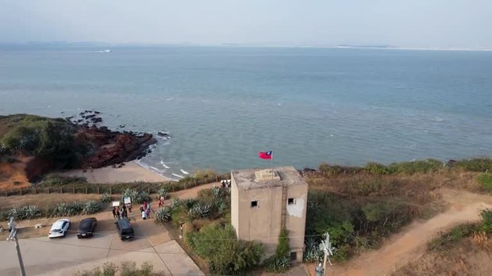
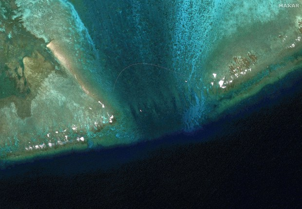
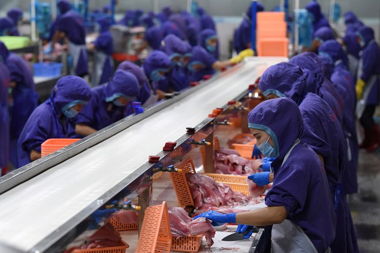

自由亚洲电台 北京时间 2024-02-28T01:32:59Z 1762531287255154885 2月26日有五艘 #中国 的海监、海警船进入金门的禁限水域，台湾的海洋委员会(海委会)主委管碧玲认为，中国企图把 #钓鱼台模式 放到 #金门 水域，#台湾 非常不愿意接受。 https://t.co/yk4rBEkYI4   自由亚洲电台 北京时间 2024-02-28T01:34:02Z 1762531549424329024 #黄岩岛（Scarborough Shoal，台湾称为“#民主礁”）出现新的"浮动屏障"，中国外交部发言人 #毛宁 称，对 #菲律宾 侵犯中国主权行为，中方不得不采取必要措施。学者分析，有美国的支持，菲律宾对中角力才更有底气。https://t.co/jetELxJuwa https://t.co/PCP62G5RXS   自由亚洲电台 北京时间 2024-02-28T01:42:44Z 1762533741598253263 据美国纽约客杂志报道，不少 #中国海鲜加工厂 雇用 #朝鲜劳工，被迫超时工作，而且人身自由遭到限制。报道说，美国进口的海鲜产品，源头大多是不透明的 #中国供应链。https://t.co/lslgvom7dW https://t.co/3QbXIuDm11   自由亚洲电台 北京时间 2024-02-28T00:11:05Z 1762510676898332875 #美国驻华大使伯恩斯：#美国 不希望 #中国 主导世界 https://t.co/Vt5PXMLeVn https://t.co/hFH4zDsGHt   