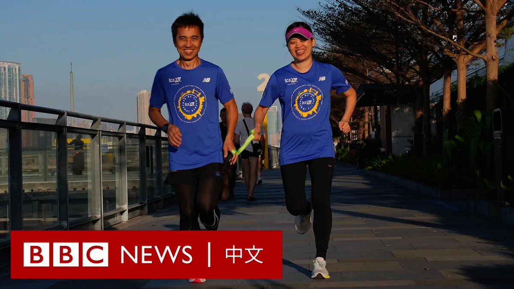
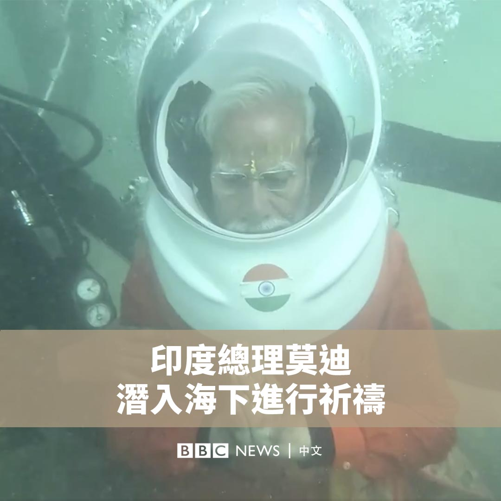

D英国广播公司BBC 北京时间 2024-02-27T17:18:28Z 1762406838124109951 傅提芬是一位香港视障马拉松跑手。她16岁时确诊青光眼随后双目失明。在她处于“人生的谷底”之时，开始和领跑员劳超杰一起练习长跑。

他们于2012年结婚，之后两人便开启了征服世界各地的马拉松巡回赛的挑战之旅。2023年在跑完伦敦马拉松后，傅提芬实现了“世界六大马拉松”大满贯的梦想。 https://t.co/VB0ZZCjP4W   D英国广播公司BBC 北京时间 2024-02-27T14:34:00Z 1762365445494206518 印度总理莫迪（Narendra Modi）周日（2月25日）潜入海下，在一座被海水淹没的印度教寺庙遗址祈祷。莫迪在社交平台表示，这是一次“神圣”的经历。 https://t.co/dWMJfKAPBB   D英国广播公司BBC 北京时间 2024-02-27T12:06:57Z 1762328442316497168 美国阿拉巴马州最高法院裁定冷冻胚胎视同儿童，意外毁坏胚胎或被追究刑责，导致该州各大医疗机构纷纷暂停体外人工受孕服务，影响大量准父母，甚至可能冲击共和党在总统大选的选情。https://t.co/O3UVIuYbau   D英国广播公司BBC 北京时间 2024-02-27T09:00:18Z 1762281467780952304 在俄罗斯发起对乌克兰的入侵行动两年后，美国、英国和欧盟宣布对俄罗斯实施新的制裁。俄罗斯目前面临着哪些制裁，它们起到效果了吗？https://t.co/U6Pj1b8GEA   