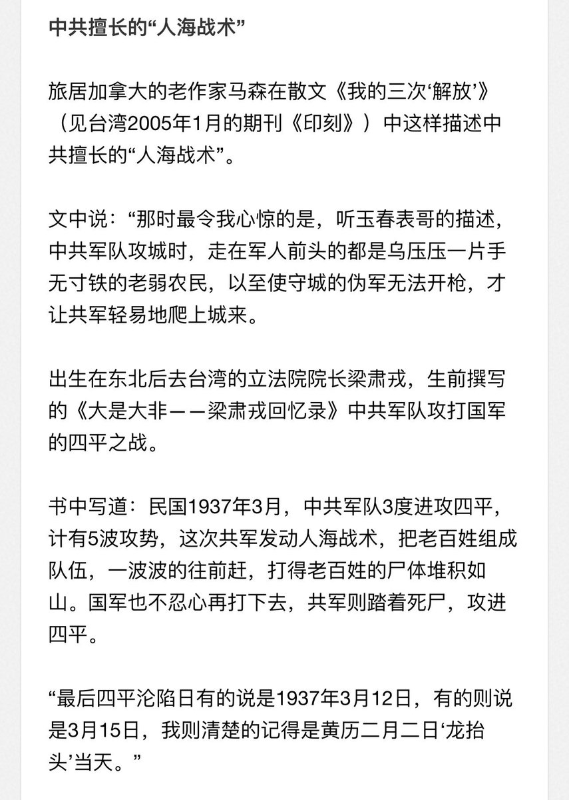
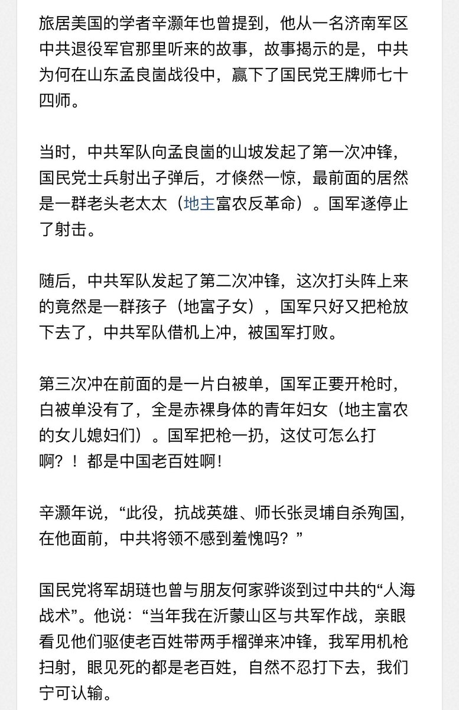
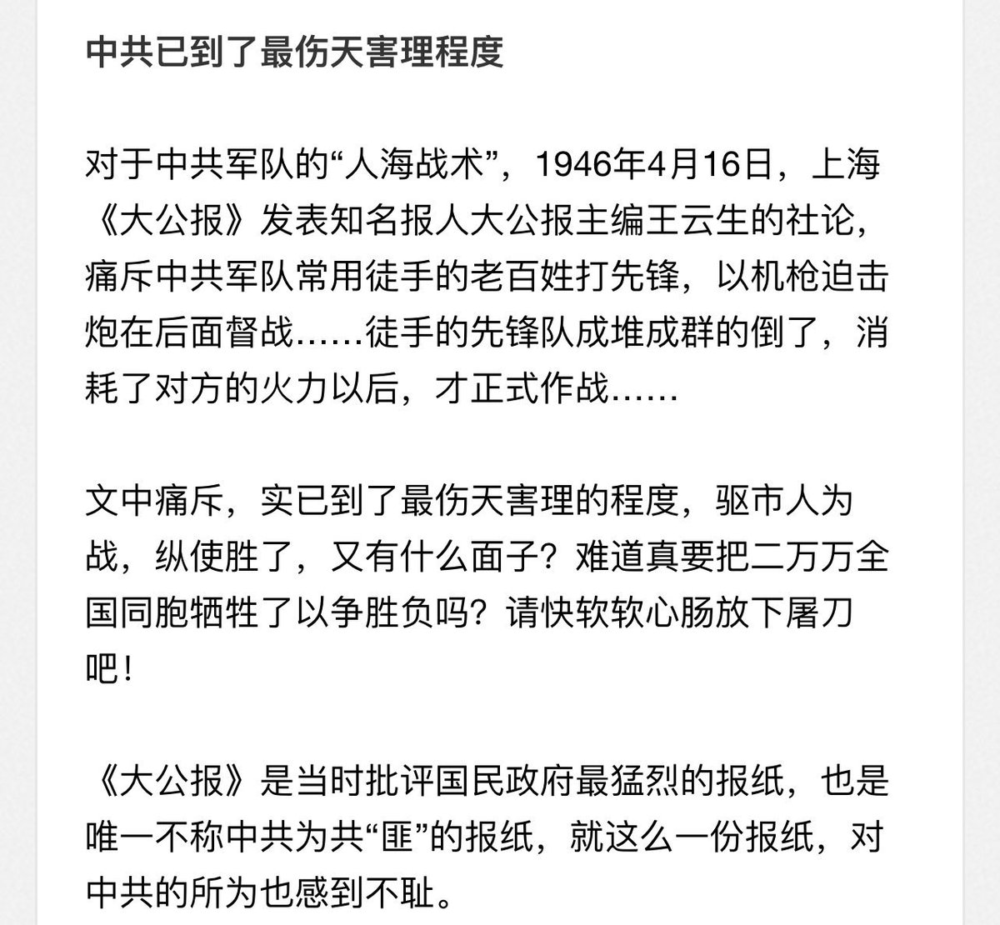

Ivy未央 北京时间 2024-02-27T16:29:19Z 1762394468055961960 RT @Ivy01011: 江泽民和香港记者的视频
还记得习近平的“小本本”吗？与江泽民这段比，有多大差距？

有人说江泽民最大罪：推选习近平！你认同吗？

江泽民之孙叫江志成，坐拥超5000亿美元资产！一个国内月收入3000元的普通工人，得连续为老板打工干一亿一千万年！才赚那…   Ivy未央 北京时间 2024-02-27T16:29:26Z 1762394497172820395 RT @Ivy01011: 揭秘：除了台湾，五个国家如何脱离中国独立？摆脱中共谎言洗脑，一定要看！
中共从来不在乎领土和人民，中共一直喊着统一台湾并不是为了领土和人民，中共为讨好苏俄发文承认外蒙独立（但墙内媒体把这一过程谎言美化中共）

https://t.co/w5L8g0f…   Ivy未央 北京时间 2024-02-27T16:29:35Z 1762394536830021750 RT @Ivy01011: 希望再骂我卖国贼的粉红无毛先补补常识，我真没那么大本事去卖国，先补补脑子看谁才有资格卖国？
是谁把几百万平方公里的领土送给外邦？
是谁把巨额财富挥霍并大撒币赠送外邦？
是谁对国人血汗钱掠夺强占，大批资产连带私生子情人存海外？

最大的卖国贼和汉奸，除…   Ivy未央 北京时间 2024-02-27T13:31:22Z 1762349685073674254 江泽民和香港记者的视频
还记得习近平的“小本本”吗？与江泽民这段比，有多大差距？

有人说江泽民最大罪：推选习近平！你认同吗？

江泽民之孙叫江志成，坐拥超5000亿美元资产！一个国内月收入3000元的普通工人，得连续为老板打工干一亿一千万年！才赚那么多，还得不吃不喝！
5000亿美元，官方讣告称江泽民“无产阶级”，中共他这叫无产阶级革命家的后代吗？
长者的秘诀：闷声发大财！赵家人这大财里多少民脂民膏？   Ivy未央 北京时间 2024-02-27T09:30:41Z 1762289116106866749 审判江青四人帮的现场录像
江青：“我是毛主席的一条狗﹐叫我咬谁就咬谁！”
中共为什么只审判江青不审判罪魁祸首毛泽东呢？

1981年1月25日，江青被中共最高法院特别法庭，判处死刑，缓期两年执行，之后被投入秦城监狱。
法庭认定江青的罪名有四：（1）组织、领导反革命集团；（2）阴谋颠覆政府；（3）反革命宣传煽动；（4）诬告陷害。
但是，从始至终，江青不承认自己犯罪。
在最后的陈述中，江青说：“现在你们逮捕我、审判我，就是要丑化毛泽东主席……现在整的是毛主席。我的家乡有句老百姓的话：‘打狗看主面’，就是说打狗呵，还要看主人的面子。现在就是打主人。我就是毛主席的一条狗。为了毛主席，我不怕你们打。在毛主席的政治棋盘上，虽然我不过是一个卒子，不过，我是一个过了河的卒子。”   Ivy未央 北京时间 2024-02-27T07:06:47Z 1762252903098515472 当年中共与国民党开战时最擅长“人海战术”，就是把手无寸铁的老百姓组成队伍，一波波的往前赶，打得老百姓尸体堆积如山。更为下流残忍的是，中共绑架地主富农的女儿媳妇们，驱赶她们裸体在战争中冲锋陷阵。
如此下流无耻的中共军队，踏着老百姓的尸骨，还有脸喊为人民服务？ https://t.co/XIuE1faofF   