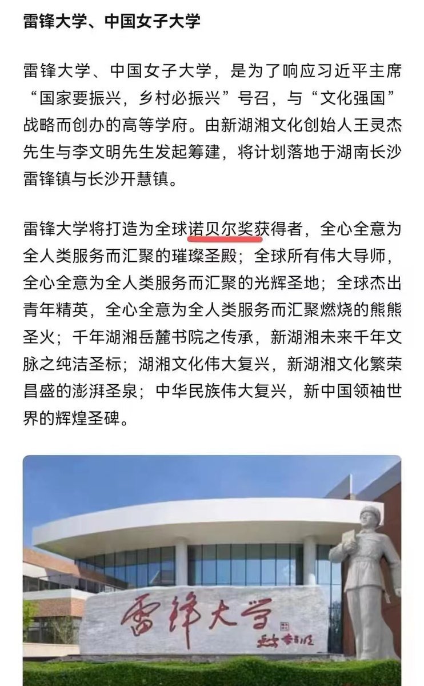

Petrichor 北京时间 2024-02-27T09:16:16Z 1762285488201974042 北京大学季羡林教授曾经语出惊人：
“多少年后，我醒悟过来，
终于发现了一个宇宙真理：
在体系里，每个单位都是小人的天下；
正直的人总是少数，且无权势；
群众的眼晴都是瞎的、势利的，
他们大部分情况下不会站在君子一边。
坏人是不会改好的，
因为他不认为自己是坏人。” https://t.co/NIWWcSqeoz   Petrichor 北京时间 2024-02-27T10:14:19Z 1762300096429887962 有必要新成立雷锋大学吗？雷锋精神就是螺丝钉精神，被人拧在哪，就不再动弹，党叫干啥就干啥，不要有自己独立的思想。这种精神正是全国各地党校提倡的，把党校改成雷锋大学和雷锋学校不行吗？中国孩子出生率下降，一些不太有名的大学开始不好招生了，现在实在不是再建新大学的时候。

此外，把雷锋二字和大学二字联系起来，也是驴头不对马嘴。大学就是要言论自由、思想自由、人格独立、追求真相与真理，创新发展。雷锋故事大多是假的，他的所作所为与大学的定义不符。   Petrichor 北京时间 2024-02-27T10:21:00Z 1762301779788611599 太大意了，这样的地形太凶险了，如果是地下河流，会被卷走的。

 https://t.co/2hiWbSbeav   Petrichor 北京时间 2024-02-27T08:27:43Z 1762273269372117248 美国100年前的农民的机械化都比这先进得多！这样的游行展示愚昧落后呢还是自以为先进得把美帝比下去呢？政府利用防火墙搞信息封锁，井中蛙真以为世界就井那么大，自己是世界上最幸福的动物，井中的制度是全世界最完美的。 https://t.co/QxyzQahJLw   Petrichor 北京时间 2024-02-27T08:46:44Z 1762278054632530425 百岁老人、诺贝尔物理学奖获得者杨振宁说：若美国天才物理学家费曼生活在中国，他要么被送去坐牢，要么被送进精神病医院。中国的制度环境不利于杰出人才的脱颖而出。 https://t.co/TnqCOSclNx   Petrichor 北京时间 2024-02-27T04:23:42Z 1762211858470039681 寻找一种牲口能吃苦耐劳地干活，是人类一直在做的事情，而且已经找到答案，但西方人找到答案比中国晚2000年。西方的答案就是用科技创造机器人和开发人工智能。中国历史上的秦国有个商鞅的人，提出驭民五术：弱民、贫民、疲民、辱民、愚民。另加多生孩子。他的方法被历朝历代的中国统治者使用，即使现在的中国统治者也还在用，甚至有过之无不及。还要用到什么时候，不知道。   