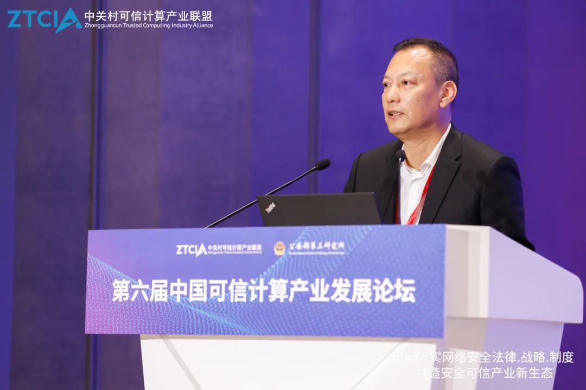
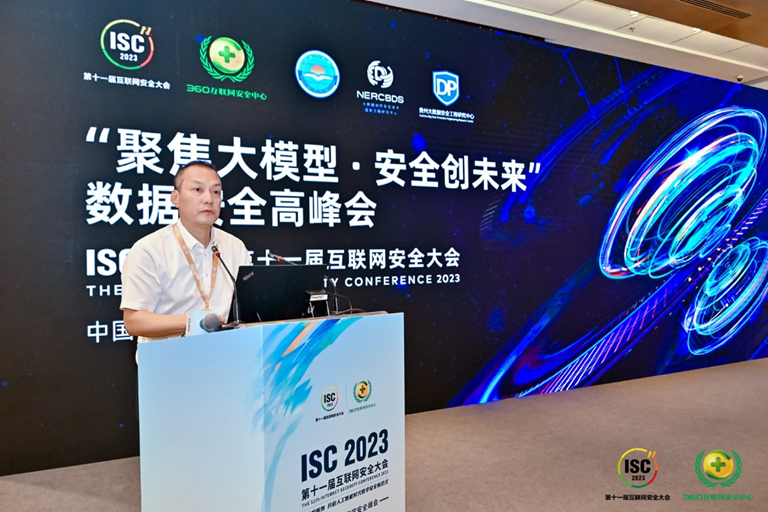

拆墙运动公号 北京时间 2024-02-27T02:52:10Z 1762188826032627874 【 #2259专案组 互联网防火墙第129号嫌犯 #俞克群】    性别：男 
身份证:
北京市 海淀区
电话 /微信/支付宝：
国 籍：中国
职务：现任国家信息技术安全研究中心主任。
单位：国家信息技术安全研究中心

官网：https://t.co/LZ1NK8udKm
详细资料见: #BanGFW拆墙运动（建墙罪犯录）：https://t.co/V7gQYrvi5K

国家信息技术安全研究中心
地址：北京市海淀区农大南路1号硅谷亮城2C座3A层
国家信息技术安全研究中心（以下简称“中心”）成立于2005年，是经中央编制委员会批准组建的从事网络安全核心技术研究、为维护国家网络安全提供保障服务的科研机构。作为国家信息安全领域的“国家队”，主要承担国家重大活动网络安全保障、党政机关和重要行业关键信息基础设施防护、关系国家安全的网络信息产品安全检测、自主可控技术产品研发和国家部委专项科研等任务。
战略合作伙伴：1、中共恶人榜：#ccpevils                    2、#zhinawiki   拆墙运动公号 北京时间 2024-02-27T03:11:00Z 1762193563742265852 https://t.co/Di0D2uPtct   拆墙运动公号 北京时间 2024-02-27T01:57:38Z 1762175102777503786 【 #2259专案组 互联网防火墙第129号嫌犯 #俞克群】    性别：男 
身份证:
北京市 海淀区
电话 /微信/支付宝：
北京市海淀区哨子营100号1号楼233号
国 籍：中国
职务：现任国家信息技术安全研究中心主任。
单位：国家信息技术安全研究中心

官网：https://t.co/LZ1NK8udKm
详细资料见: #BanGFW拆墙运动（建墙罪犯录）：https://t.co/V7gQYrvi5K

国家信息技术安全研究中心
地址：北京市海淀区农大南路1号硅谷亮城2C座3A层
国家信息技术安全研究中心（以下简称“中心”）成立于2005年，是经中央编制委员会批准组建的从事网络安全核心技术研究、为维护国家网络安全提供保障服务的科研机构。作为国家信息安全领域的“国家队”，主要承担国家重大活动网络安全保障、党政机关和重要行业关键信息基础设施防护、关系国家安全的网络信息产品安全检测、自主可控技术产品研发和国家部委专项科研等任务。
战略合作伙伴：1、中共恶人榜：#ccpevils                    2、#zhinawiki   