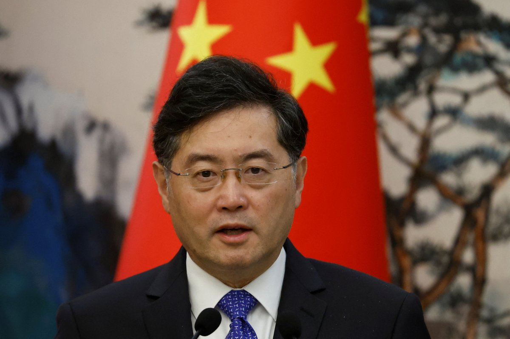
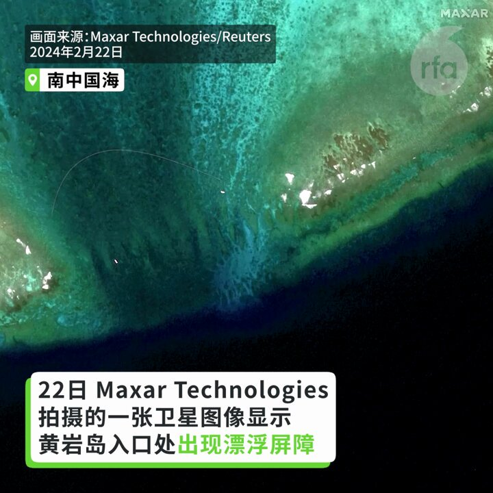
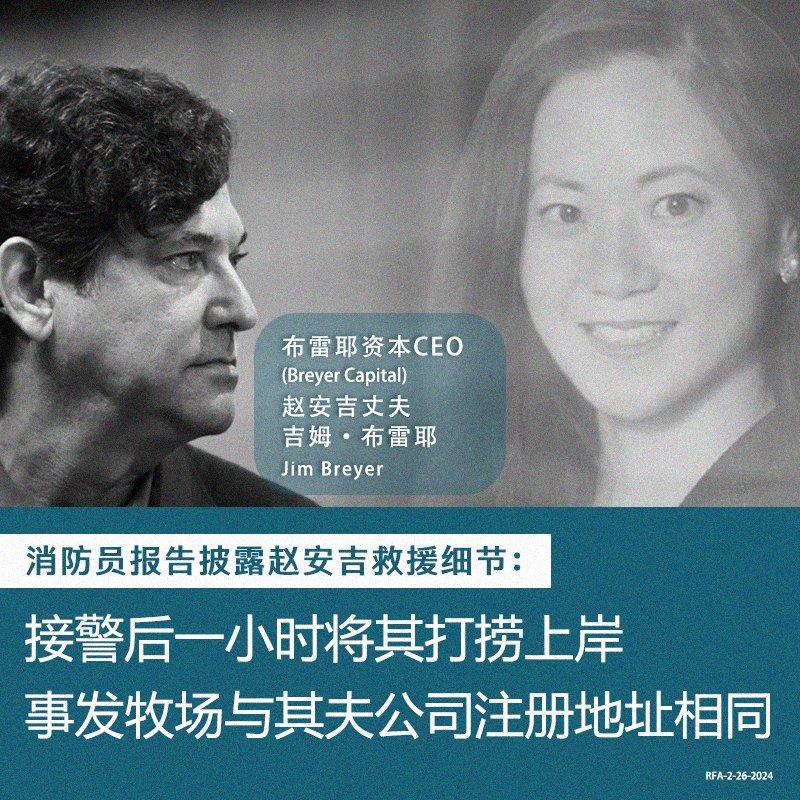
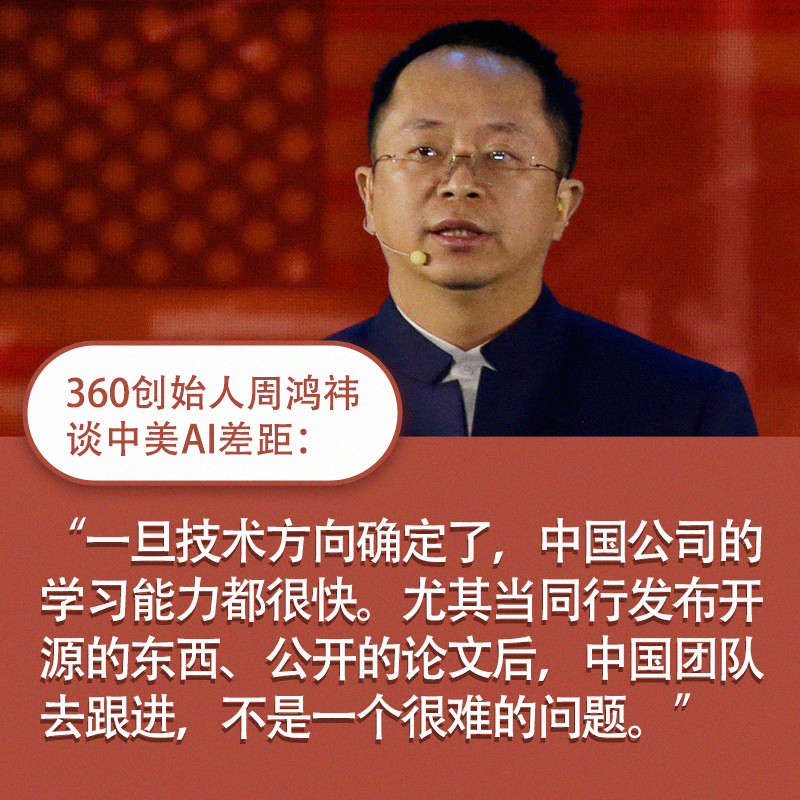
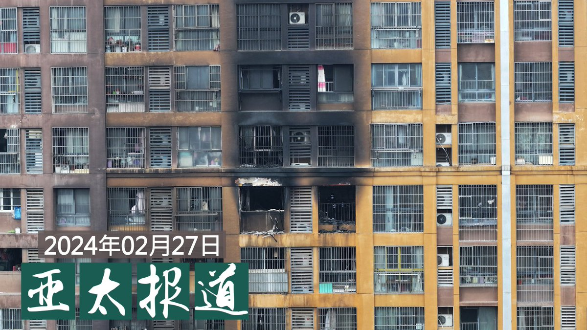
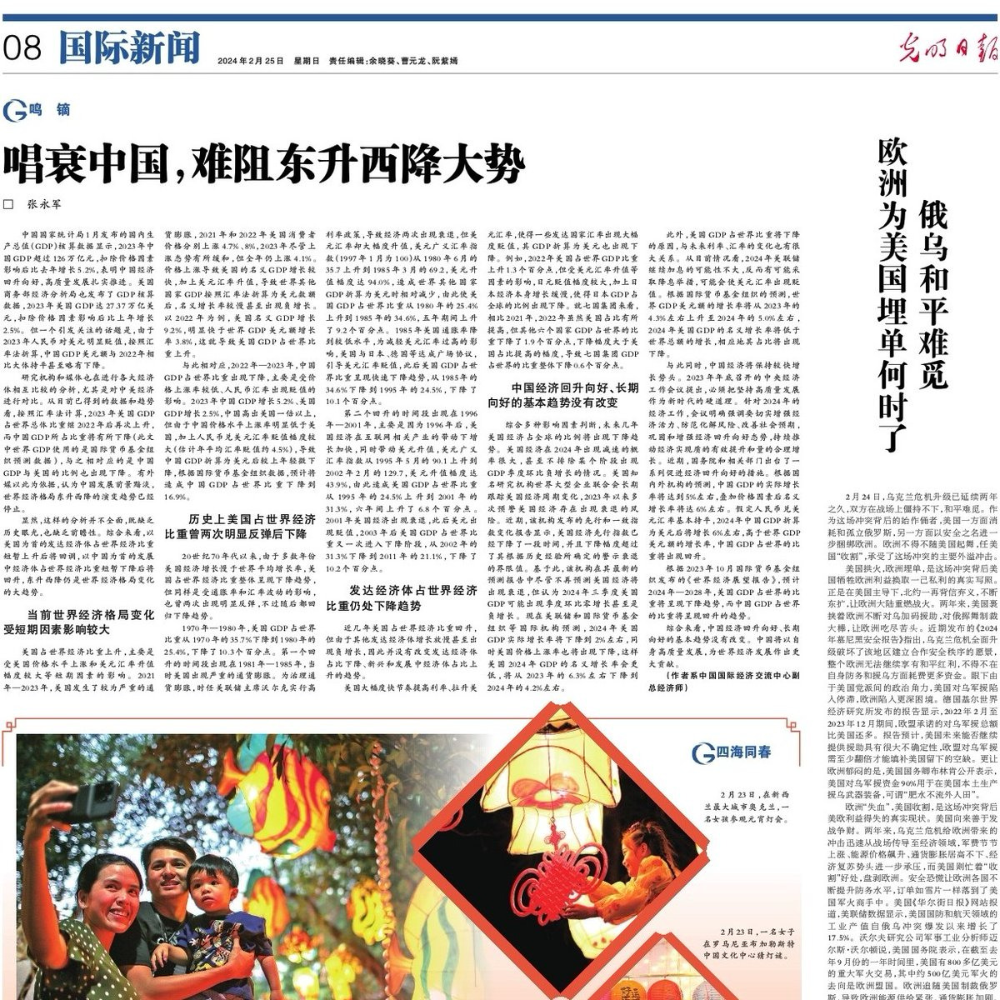
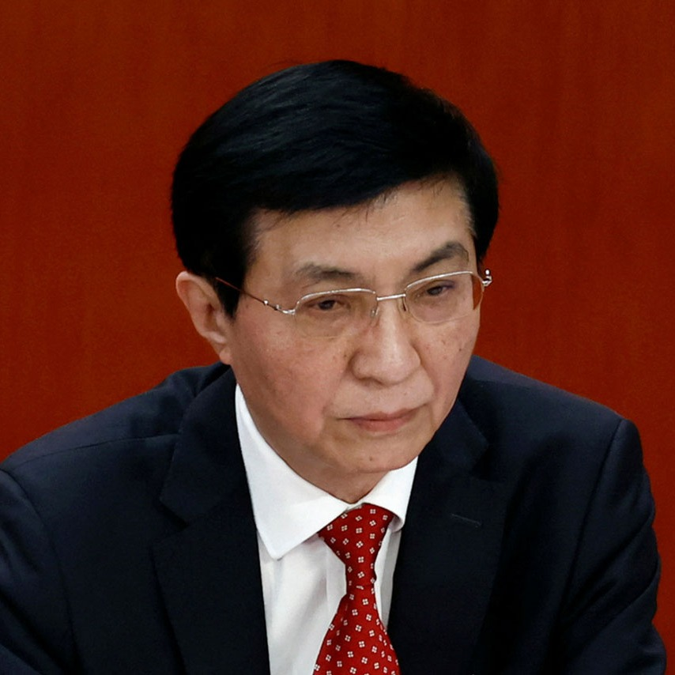
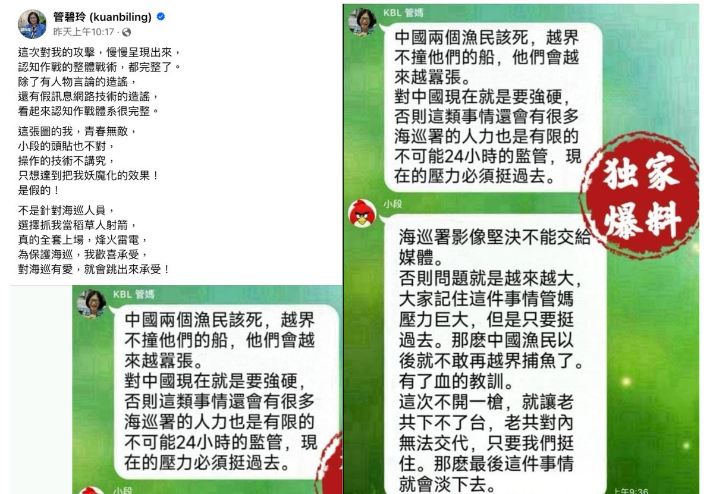
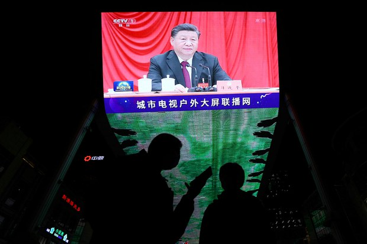

自由亚洲电台 北京时间 2024-02-27T20:45:10Z 1762458855890387140 RT @RFA_Chinese: 近日，“延迟退休”话题又上热搜，据《中国经营报》报道，今年两会期间可能会公布推出延迟退休政策。文章说，《中国养老金发展报告2023》在测算养老金替代率问题时指出：“延迟退休政策出台在即，65岁可能是调整后的最终结果。”… https://t.c…   自由亚洲电台 北京时间 2024-02-27T18:54:02Z 1762430885926978000 【周庭录视频谈狱中生活】
【沉迷小说幻想世界 忘记痛苦】
身在加拿大、正被港警国安处通缉的前香港众志常委周庭2月26日在她的YouTube发布视频，谈她在狱中的遭遇和内心感想。她在狱中做过折信封、洗衣和车衣的工作。午餐空腹吃绿豆粥让她胃疼。周庭说她在狱中沉迷小说幻想世界，借以忘记现实世界的痛苦。她还提到坐进“甲级囚犯”的窄小囚车，被四面墙紧紧包围，不太能呼吸的幽闭恐惧感，令她畏惧。而最令她担忧的是害怕无法出狱。周庭因国安法被捕，在2020年11月到2021年6月入狱。 #周庭   自由亚洲电台 北京时间 2024-02-27T19:37:44Z 1762441883178201108 【中国人大常委会通过修订《#保守国家秘密法》】
【增订 #离职保密 及 #工作秘密 规定】
https://t.co/sOTxLwFvpc https://t.co/W4NCUXAboy   自由亚洲电台 北京时间 2024-02-27T20:18:41Z 1762452191657263444 RT @RFA_Chinese: 【巨星不来中国开演唱会，歌迷只能看录像】
近日 #TaylorSwift 在日本巨蛋体育馆接连四晚开个唱，中国的 #霉霉 粉丝却只能前往电影院观看其提前录制好的演唱会视频。有网民猜测或与政治有关；更有官媒称泰勒.斯威夫特差别对待Instagra…   自由亚洲电台 北京时间 2024-02-27T18:14:57Z 1762421051475239165 【秦刚辞去全国人大职务】
中国人大常委会27号公告，包括黑龙江在内的多地人大代表资格递换。其中，天津市人大常委会决定接受 #秦刚 辞去第十四届全国人民代表大会代表职务。
https://t.co/g4b12MRS9s https://t.co/IYHgqRCxxy   自由亚洲电台 北京时间 2024-02-27T15:02:19Z 1762372575429292210 【中国视频网站招聘粤语审核员提升审核力度】
【境外社交媒体中文账户大规模“掉粉”】
中国有视频网站正以月薪最高九千元招聘粤语、闽南语、吴语等江浙地方方言审核员。评论认为，当局招聘方言审核员是为了提升网络监管力度。另外，美国社交网络X平台，中文简体字部分涉及中国政情类账户出现大规模“掉粉”现象，这究竟是为了清理僵尸账户还是政府行为，引发各种联想。详细报道：https://t.co/4wxvhif6Iw   自由亚洲电台 北京时间 2024-02-27T13:54:13Z 1762355436089716867 【中国家庭净存款四年达58万亿】
【学者：民间投资萎缩求资金安全】
根据中国央行的数据，中国六家最大规模的银行控制着58万亿人民币的存款，而中小银行的存款总额则为27万亿人民币，这一现象引发热议。学者认为，三年疫情导致民间投资萎缩，许多家庭将钱转移至大型银行以求资金安全。详细报道：https://t.co/gWZmh2GCyP   自由亚洲电台 北京时间 2024-02-27T06:45:51Z 1762247635048558950 【卫星图片为证：中国在黄岩岛部署漂浮屏障】
近日，在南中国海备受争议的黄岩岛上空拍摄的卫星图片显示，在菲律宾船只和中国海警船只频繁发生冲突的入口处，出现了一个漂浮屏障。这些图片支持了菲律宾海岸警卫队2月25日发布的一份报告和视频，显示在2月22日，两艘中国海警的充气艇部署了漂浮屏障。 https://t.co/wvZSC2Cogr   自由亚洲电台 北京时间 2024-02-27T06:58:33Z 1762250828335767979 近日，“延迟退休”话题又上热搜，据《中国经营报》报道，今年两会期间可能会公布推出延迟退休政策。文章说，《中国养老金发展报告2023》在测算养老金替代率问题时指出：“延迟退休政策出台在即，65岁可能是调整后的最终结果。”
有网友评论称，“我怀疑我65岁还能找到工作吗？”还有网友说，“这次热搜并不是偶然，而是对延迟退休拍板前的的预热，老百姓肯定是抵触的，毕竟退休这种事宜早不宜迟，越早退休越能尽快回本。”
您对延长退休年龄怎么看？您对此是支持还是反对？   自由亚洲电台 北京时间 2024-02-27T06:59:24Z 1762251044502081684 2月25日，美国哥伦比亚广播公司“60分钟”节目中，美国驻华大使伯恩斯（Nicholas Burns）指出，中美之间的竞争和不信任动摇了商界的信心，并将两国关系推至数十年来的最低点。但他表示，放弃过去几十年建立的深厚经济联系根本不是一种选择。对此，#您怎么看？ https://t.co/pahHnJ7Uqx   自由亚洲电台 北京时间 2024-02-27T07:58:44Z 1762265975242522961 【营救赵安吉报告曝光】
美国福茂集团董事长兼执行长赵安吉2月11日不幸在德州中部一家牧场溺亡。2月24日《奥斯汀美国政治家报》（Austin American-Statesman）根据德州公共信息法，获得消防员报告，披露当天救援情况。
2月11日凌晨12点03分，警方接到了一处牧场的水上救援报警。约9分钟后，救援人员到达现场。12点28分，消防员到达。
12点56分，两警员爬上被淹没的车辆顶部，打破车窗、将人拉出车子。
急救43分钟后，赵安吉被宣布死亡。
整个救援过程持续了2小时40分钟。

报告确认赵安吉去世的牧场名为JW Ranch（也叫JWCB Ranch），地点为101 Schneider Lane, Johnson City。根据公共信息，这家牧场由一家信托公司所有，注册地址位于芝加哥。跟 #赵安吉 的丈夫Jim Breyer拥有的布雷耶资本（Breyer Capital）的注册地址是同一处。   自由亚洲电台 北京时间 2024-02-27T08:30:02Z 1762273851478790636 【“你一开源，我就赶超”   #您怎么看 ？】3
60创始人 #周鸿祎 2月23日在接受《环球时报》记者采访时表示，中美在AI上的差距主要在于“确定技术方向”上，一旦方向确定，中国的优势是学习能力很快，中美在AI上的差距应该能在一两年内追上。
您如何看待这种“你一开源，我就赶超”的发展模式？ https://t.co/PjOCwBoy7r   自由亚洲电台 北京时间 2024-02-27T08:30:04Z 1762273859062096329 欢迎收听和订阅播客【＃亚太报道】 https://t.co/MjLNSvVMqc
#南京住宅楼 火灾导致59人死伤；“#南方街头运动”倡导者 #王爱忠 的妻子疑遭“连坐”；“#大润发” 超市关闭多地门店；#习近平“#亲自指挥”经济困局；#王沪宁 强硬对台讲话。 https://t.co/1vEXvWOrmw   自由亚洲电台 北京时间 2024-02-27T04:43:54Z 1762216943774568544 2月25日，中国官媒《光明日报》刊出“唱衰中国，难阻东升西降大势”一文。文章指出，虽然2023年美国GDP占世界经济的比重提高，中国占比减少，但不能据此认为“中国发展前景黯淡”或世界经济格局停止了“#东升西降”的演变态势。
您信吗？
https://t.co/4zhyjdImBX https://t.co/Rog3y4JzS0   自由亚洲电台 北京时间 2024-02-27T05:29:52Z 1762228513371754636 本周一，中国工业和信息化部在一封致地方政府以及中国企业的文件中呼吁，要有关单位建设资料安全保护体系，落实 #反黑客保护，并承诺在2026年有效防控重大风险。

据法新社报道，尽管美国、荷兰等西方国家经常谴责北京当局资助 #黑客 团体在海外进行网络攻击，中国在近年来同样指责外国的敌对势力透过网络窃取中国公民信息，比如在2022年就有黑客声称骇取到10 亿中国公民的个人信息。

如今，中国工业和信息化部的这份文件是在中国网络安全公司上海 #安洵 资讯公司的数据泄露之后发布。据本台此前报道，泄漏的数据显示该公司向中共国安提供多种情报收集服务，曾渗透香港、台湾、英国、泰国等政府部门、大学以及电讯供应商。   自由亚洲电台 北京时间 2024-02-27T06:15:54Z 1762240097129312644 【能用眼睛开车的荣耀智能手机 会不会威胁苹果？】
2月25日 #荣耀 于巴塞罗那举行的年度世界移动通信大会前发布新产品，用户只需看手机屏幕即可远程打开和移动汽车。
荣耀还展示了基于Meta的LIaMA 2语言模型的概念聊天机器人。
2023年苹果在华市场份额17.3%，荣耀为17.1%。荣耀新手机可能威胁苹果。 https://t.co/2yskzvHXGj   自由亚洲电台 北京时间 2024-02-27T06:17:52Z 1762240590606205277 专栏 | #夜话中南海：#习近平 否定邓氏政治体制改革也是师承 #江泽民
https://t.co/B2oL1eisgY https://t.co/IljbPrkw3X   自由亚洲电台 北京时间 2024-02-27T02:23:39Z 1762181647250952482 近日，中国全国政协主席 #王沪宁 发表2024年对台工作会议讲话，将"反对"#台独 升高为"坚决打击"，并将两岸问题与"#一中"挂钩。
这是否意味着，未来中国对台湾的国际空间打压将更强烈。
https://t.co/LDsM0PTrZ9 https://t.co/eDy7Ejevvd   自由亚洲电台 北京时间 2024-02-27T03:13:23Z 1762194166728298729 台湾的海洋委员会主委管碧玲在脸书发布一张看似为社媒平台Line的对话截图，批评该图为捏造，影射她和前民进党立委段宜康的对话。管碧玲通过脸书表示：“这次对我的攻击慢慢呈现出来，#认知作战 的整体战术都完整了”、“只想达到把我妖魔化的效果”。https://t.co/DtggRzbvYh
#金门翻船 https://t.co/UVash7c2in   自由亚洲电台 北京时间 2024-02-27T03:46:17Z 1762202444782805417 在 #俄罗斯入侵乌克兰两周年 之际，加拿大各城市有数千名支持乌克兰的人走上街头，其中不乏华人面孔。一些华人表示，支持因 #俄乌战争 受苦的民众，因为乌克兰的遭遇很可能就是未来台湾的遭遇，如果不击败俄罗斯，中国的野心将会更加膨胀。
https://t.co/2ka8iaP02G https://t.co/2jWl3puwPr   自由亚洲电台 北京时间 2024-02-27T04:02:11Z 1762206445230301461 评论 | 易富贤 @fuxianyi：从人口视角看 #台湾选举 和 #中美台关系  https://t.co/ed39leHz9u https://t.co/b2pJvzrWrK   自由亚洲电台 北京时间 2024-02-27T01:01:03Z 1762160861714780246 中国当局打压异议人士的同时，家属也疑似受到株连。广州异议人士 #王爱忠 因"寻衅滋事"”罪成被判监三年后，任职于某航空公司担任乘务员的妻子披露，自己因为丈夫的缘故早已被"停飞"，近日资方更疑似采取手段，迫使她"知难而退"。 https://t.co/DC2QrMrCD0   自由亚洲电台 北京时间 2024-02-27T01:19:36Z 1762165529824088464 2月26日，台湾的南太平洋岛国友邦 #图瓦卢 举行总理选举，前检察总长费莱蒂·特奥（Feleti Teo）成为新总理。台湾驻图瓦卢大使林东亨表示，他获得保证，台图双边关系“稳固、持久且永恒”。 https://t.co/xcOGeUbYvU   自由亚洲电台 北京时间 2024-02-27T00:17:17Z 1762149847921295844 习近平在中央财经委员会，提出鼓励大规模更新设备，对汽车和家电等消费品以旧换新 等，以提高国民经济循环质量和水平。
您觉得靠 #以旧换新 能刺激需求，解决中国通缩困局吗？ https://t.co/cQou0DZmrV   