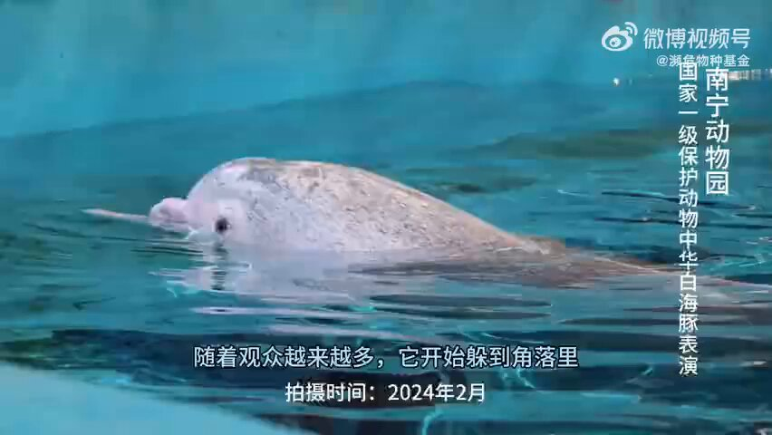
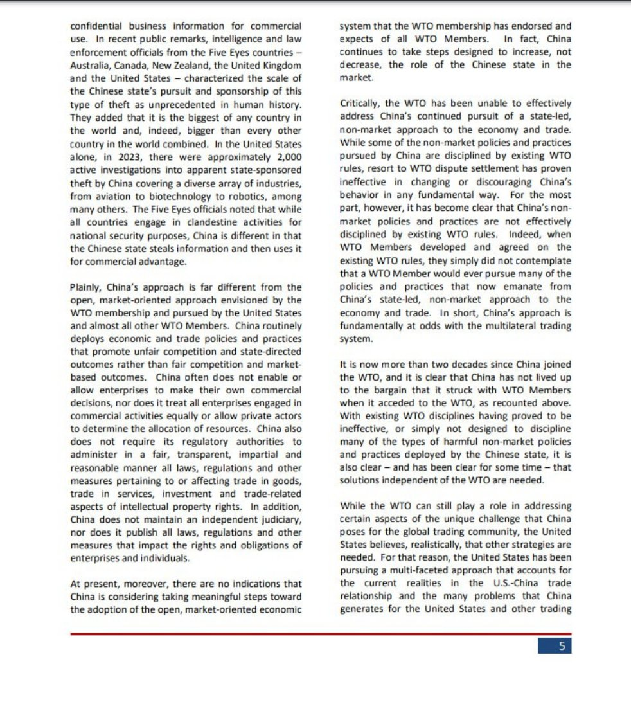
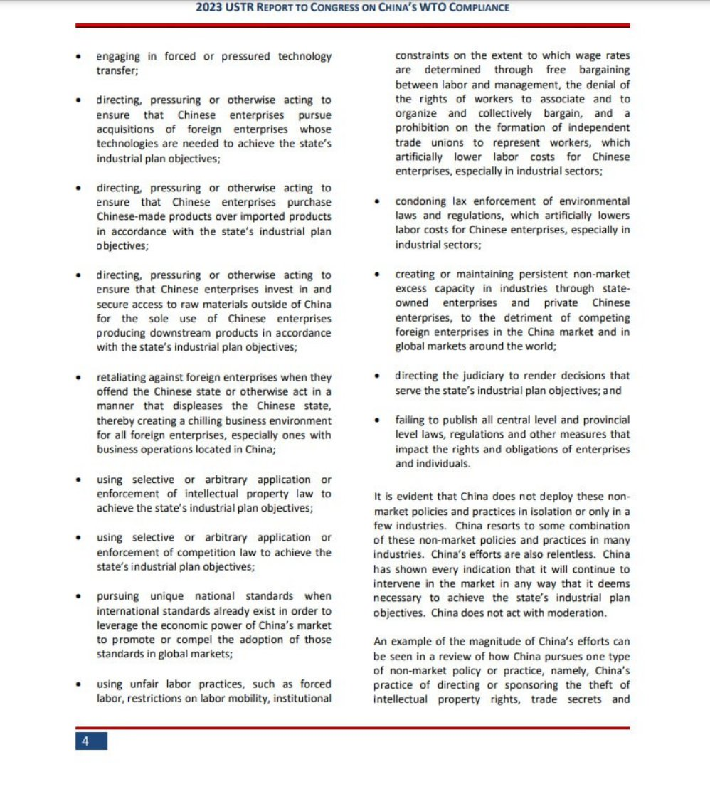
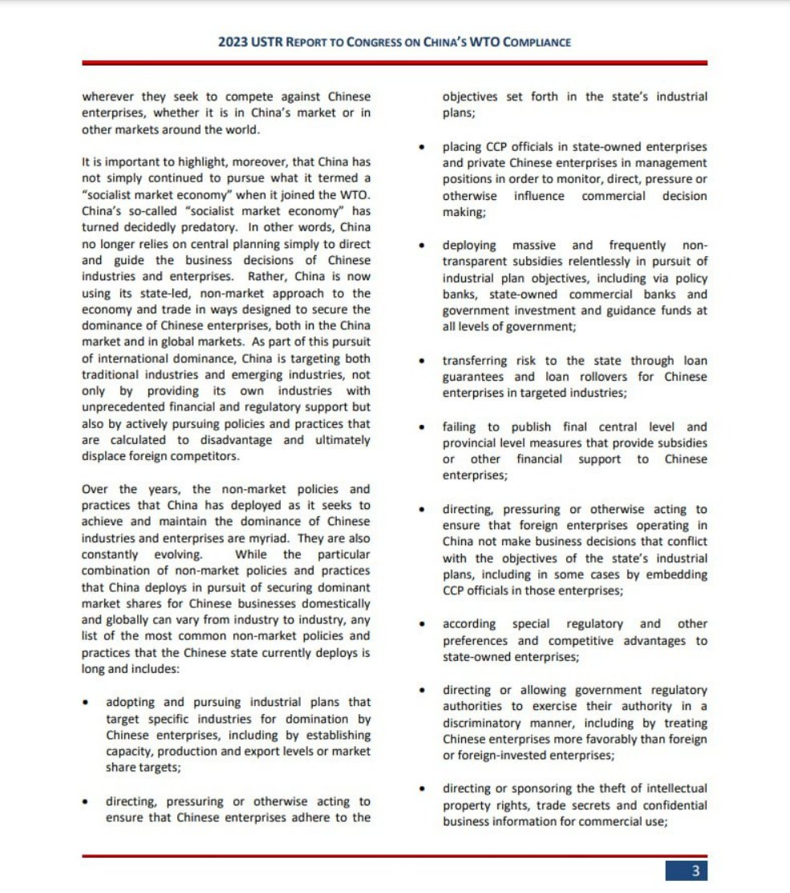
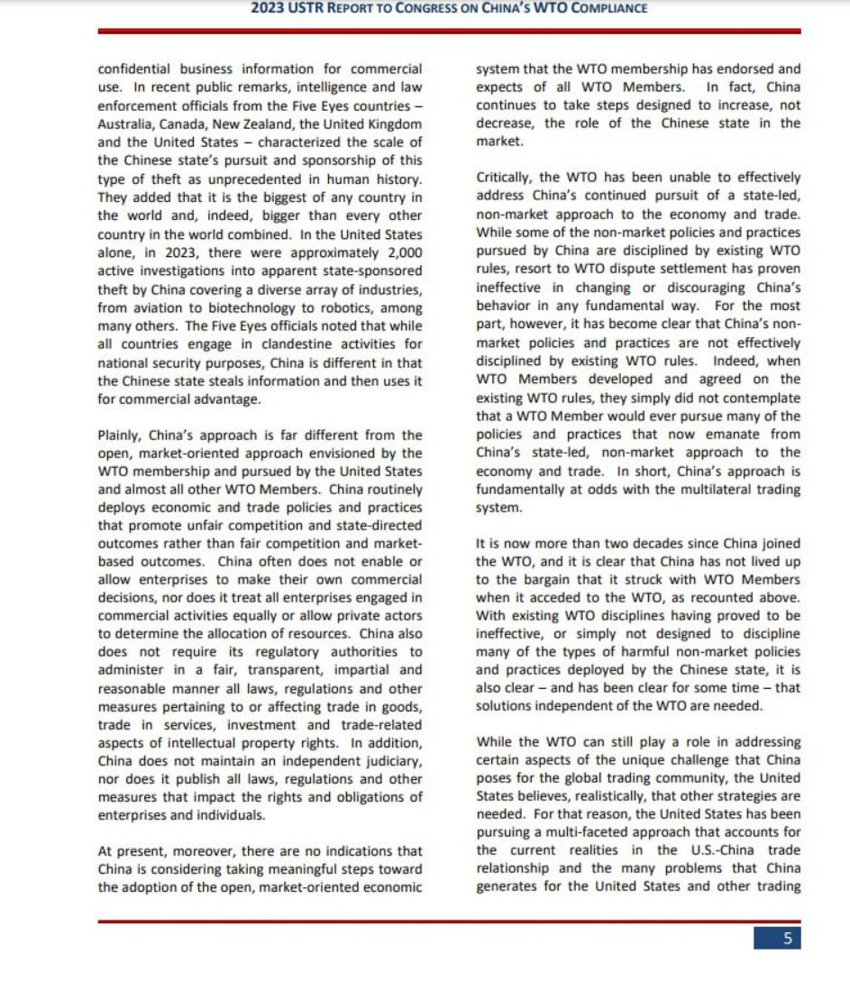

谁将十万横扫三江 北京时间 2024-02-27T19:06:12Z 1762433950683889886 国内唯一进行表演的中华白海豚，是南宁动物园于2007年从野外抓捕回来的，中华白海豚恢复后并未被放归大自然，而是被圈养在小小水池里训作表演。其原本健康完好的吻部，也在被动物园圈养期间受伤断裂了（疑似为海豚抑郁自残所致）。2017年中华白海豚表演曾被公众抵制叫停，如今才过去多久，又开始死灰复燃。

因数量稀少，中华白海豚被称为“海上大熊猫”，是海豚科中唯一的国家一级保护动物， 竟被政府管理的南宁动物园训成了机械的表演工具！在表演过程中，主持人只用了“粉色海豚”来形容它，对它的来历、故事、珍稀程度只字未提，仿佛这样就能遮掩动物园虐待濒危动物的行径。

南宁动物园剥夺了中华白海豚重返大海的机会，非但没有改善它的圈养环境，反而一次又一次地摧残它的生命，最后还美其名曰保护、科普、教育…… 这是保护，还是在把中华白海豚推向绝境。

南宁动物园海洋馆表演现每天有五场，表演动物分别为中华白海豚、宽吻海豚、海狮。海洋馆是动物园里噪音最大的地方，每天长时间循环播放着震耳欲聋的音乐。

海豚的声呐系统非常强大，音乐，欢呼，鼓掌，都会让它们承受巨大的精神压力，更残忍的是，它们还要拖着伤残的身体去做表演。我们之所以会说拒绝动物表演，是因为动物完成高难度动作的背后，是我们难以想象的一次次残忍的训练和难言之痛。   谁将十万横扫三江 北京时间 2024-02-27T13:19:21Z 1762346663065395385 RT @whyyoutouzhele: 这份80页的报告其中提到：当外国企业冒犯中国时，中国会对其展开报复，尤其是在中国经营的外企。
 中国政府越来越倾向于利用威胁或使用影响贸易和投资等措施，迫使他国政府妥协，以实现政治目标。… https://t.co/f04Thm2NvX   