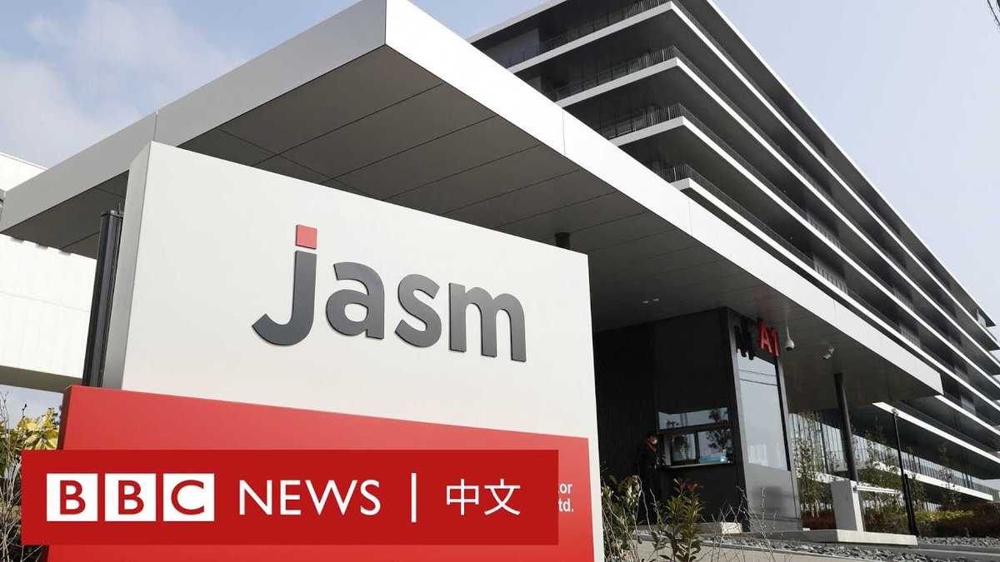
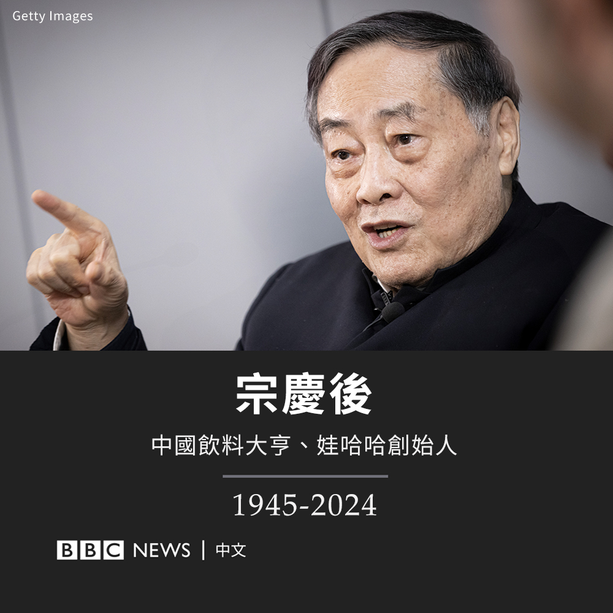
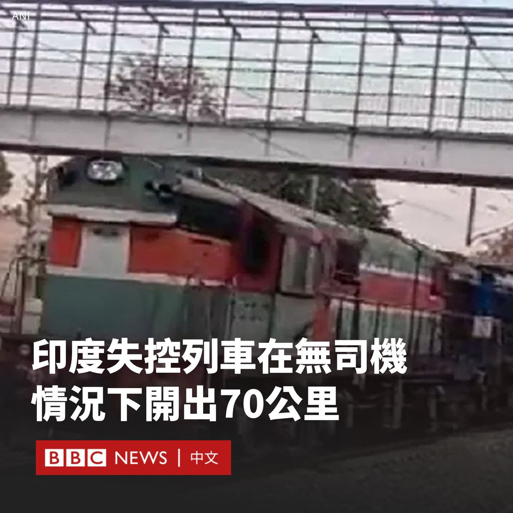

D英国广播公司BBC 北京时间 2024-02-26T19:48:28Z 1762082197908173105 周六（2月24日），晶片制造商台积电（TSMC）在日本设立的首家工厂正式投入运营。揭幕式上，日本政府宣布将再向台积电补助约48.6亿美元，协助其兴建第二工厂。

台积电创始人张忠谋表示，台积电在日本的新工厂将提高日本和全球晶片供应链韧性，相信这将是半导体制造在日本复兴的开始。 https://t.co/us8yXwaSjR   D英国广播公司BBC 北京时间 2024-02-26T18:16:15Z 1762058989544886590 中国传奇饮料大亨、前首富宗庆后于周日（2月25日）病逝，享年79岁。他创立的公司娃哈哈集团宣布了该消息。

宗庆后是中国改革开放后第一批民营企业家的代表人物之一。他曾在一所小学附近摆摊，售卖软饮料和冰棍。1980年代，他开始通过借债白手起家。

1989年，宗庆后创建杭州娃哈哈营养食品厂。他抓住了刚刚富裕起来的中国民众对营养饮料的需求，开始销售一种营养液。

随着销售超出预期，他采取大胆举动，收购了一家濒临破产的罐头厂，并将产品拓展到八宝粥和AD钙奶。

他顺势在媒体上投放了大量广告，使娃哈哈迅速成长为庞大的饮料王国，被视为是中国版的可口可乐公司。

1996年，法国食品公司达能（Danone）以合资企业的形式与娃哈哈建立的合作关系，但该项目最终演变成了一场激烈的官司。

达能指责娃哈哈在双方的合资公司之外销售相同产品，要求获得非合资公司51%的股权，但宗庆后拒绝了该要求，并在中国召集公众舆论反对这家外国公司。

当时，中法两国的领导人甚至都介入其中。最终，达能出售了51%的股份，宗庆后的公司获得了完全控制权。

2010年，《福布斯》将宗庆后评为中国首富，身家达80亿美元。2012年，他再次以100亿美元的身价登上榜首，尽管之后他的身家被科技和地产公司超越。

宗庆后的去世在中国社交媒体上引发悼念。许多人称赞他即便生活富裕后，也保持着简朴的形象。他曾因为穿着便宜的布鞋，而被称为“布鞋首富”。

他在2011年接受BBC采访时表示，他每天的生活费仅20美元。“我唯一的爱好是吸烟和喝茶。”他说。

2021年，宗庆后卸任，其独生女宗馥莉担任娃哈哈集团副董事长兼总经理。   D英国广播公司BBC 北京时间 2024-02-26T16:21:46Z 1762030178786828489 印度一列货运列车在没有司机的情况下行驶了70多公里，印度铁路公司（Indian Railways）已下令展开调查。

社交媒体上分享的影片显示，这列列车高速驶过了几个车站。铁路部门表示，列车后来停止运行，无人受伤。

据当地媒体报道，这列载有碎石的火车周日在没有驾驶人员的情况下，从查谟和克什米尔的卡图阿（Kathua）开往旁遮普的霍希亚布尔（Hoshiarpur）地区。

这列有53节车厢的火车当时在卡图阿停车更换乘务员。官员称，火车司机及其助手下车后，列车开始沿着铁轨的斜坡向下滑行。

该列车随后以每小时近100公里的速度行驶。在接到有关列车移动的警报后，官员们紧急关闭了列车沿途的铁路道口。

官员表示，有铁路工作人员在铁轨上放置了木块以阻止火车行进。该列车在经过大约五个车站后被拦下。   D英国广播公司BBC 北京时间 2024-02-26T13:58:07Z 1761994031129841673 去年十月，乌克兰东部哈尔科夫地区的一座小村庄在一次俄罗斯导弹袭击中失去了五分之一以上的人口。许多儿童在袭击中成为孤儿。对于这里的家庭来说，战争的阴影仍挥之不去。 https://t.co/akkyTrQjQq   D英国广播公司BBC 北京时间 2024-02-26T11:58:57Z 1761964038190424210 乌克兰总统泽连斯基（Volodymyr Zelensky）透露，自俄罗斯入侵乌克兰以来，已有3.1万名乌克兰士兵阵亡。

泽连斯基表示，他不会公布受伤人数，因为这可能有助于俄罗斯进行战略规划。他称，提供最新的死亡人数是为了回应俄罗斯所称的夸大数字。

“有3.1万名乌克兰士兵在这场战争中死亡。不是30万或15万，也不是普京和他的谎言圈子所说的数字。但每一次伤亡对我们来说都是巨大的损失。”

在谈到更广泛的战损时，他表示，在俄罗斯占领的乌克兰地区，估计有数万名平民丧生，但真实数字未知。

不过，美国官员去年8月曾估计，乌克兰士兵死亡人数为7万人，伤者多达12万人。

就俄罗斯的战损而言，泽连斯基称有18万俄罗斯士兵死亡，数万人受伤。

BBC俄语组在与Mediazona网站的一个联合项目中，确定了4.5万多名死亡的俄罗斯军人姓名。但据估计，实际总人数将更高。

今年2月，英国国防部估计有35万名俄罗斯士兵伤亡。

泽连斯基还称，乌克兰去年计划的反攻没有更早开始的原因之一是缺乏武器。该反攻基本以失败告终。

上周，乌克兰军队宣布从东部重镇阿维迪夫卡撤军，这是莫斯科数月来取得的最大胜利。

乌克兰国防部长乌梅罗夫（Rustem Umerov）表示，西方承诺的援助有一半被推迟交付，导致更多人员伤亡和领土被占领。   D英国广播公司BBC 北京时间 2024-02-26T09:39:26Z 1761928930989129988 业内人士表示，中国对股市开盘或收盘期间集中卖出的行为加强监管，是为了避免给市场带来情绪低迷的影响。反之，绑住量化机构的手脚后，“国家队”就可以更有效地在这两个时间段入市支撑股价。https://t.co/ysrgqTelFy   