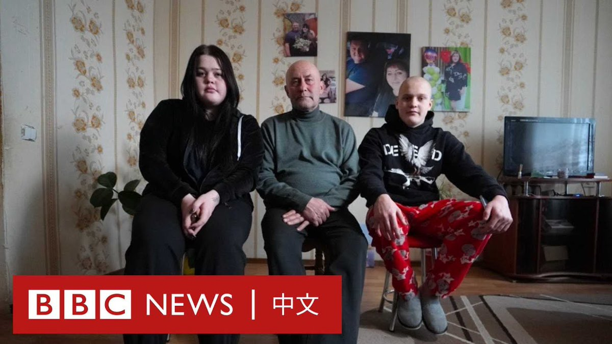
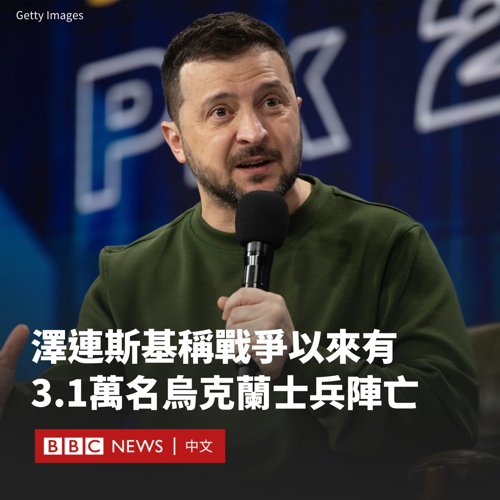

D英国广播公司BBC 北京时间 2024-02-26T13:58:07Z 1761994031129841673 去年十月，乌克兰东部哈尔科夫地区的一座小村庄在一次俄罗斯导弹袭击中失去了五分之一以上的人口。许多儿童在袭击中成为孤儿。对于这里的家庭来说，战争的阴影仍挥之不去。 https://t.co/akkyTrQjQq   D英国广播公司BBC 北京时间 2024-02-26T11:58:57Z 1761964038190424210 乌克兰总统泽连斯基（Volodymyr Zelensky）透露，自俄罗斯入侵乌克兰以来，已有3.1万名乌克兰士兵阵亡。

泽连斯基表示，他不会公布受伤人数，因为这可能有助于俄罗斯进行战略规划。他称，提供最新的死亡人数是为了回应俄罗斯所称的夸大数字。

“有3.1万名乌克兰士兵在这场战争中死亡。不是30万或15万，也不是普京和他的谎言圈子所说的数字。但每一次伤亡对我们来说都是巨大的损失。”

在谈到更广泛的战损时，他表示，在俄罗斯占领的乌克兰地区，估计有数万名平民丧生，但真实数字未知。

不过，美国官员去年8月曾估计，乌克兰士兵死亡人数为7万人，伤者多达12万人。

就俄罗斯的战损而言，泽连斯基称有18万俄罗斯士兵死亡，数万人受伤。

BBC俄语组在与Mediazona网站的一个联合项目中，确定了4.5万多名死亡的俄罗斯军人姓名。但据估计，实际总人数将更高。

今年2月，英国国防部估计有35万名俄罗斯士兵伤亡。

泽连斯基还称，乌克兰去年计划的反攻没有更早开始的原因之一是缺乏武器。该反攻基本以失败告终。

上周，乌克兰军队宣布从东部重镇阿维迪夫卡撤军，这是莫斯科数月来取得的最大胜利。

乌克兰国防部长乌梅罗夫（Rustem Umerov）表示，西方承诺的援助有一半被推迟交付，导致更多人员伤亡和领土被占领。   D英国广播公司BBC 北京时间 2024-02-26T09:39:26Z 1761928930989129988 业内人士表示，中国对股市开盘或收盘期间集中卖出的行为加强监管，是为了避免给市场带来情绪低迷的影响。反之，绑住量化机构的手脚后，“国家队”就可以更有效地在这两个时间段入市支撑股价。https://t.co/ysrgqTelFy   