Ivy未央 北京时间 2024-02-26T23:11:28Z 1762133282764869837 毁掉一个汽油库，只需一根火柴，不是火柴威力大，而是汽油本身过于危险，毁掉一个帝国，可能是一件微不足道的小事件，不是某个人具有倾覆帝国的超能力，而是帝国每天的工作，就是在制造不满.…
到底谁有本事颠覆国家政权？ https://t.co/1L4PD9Ne3J 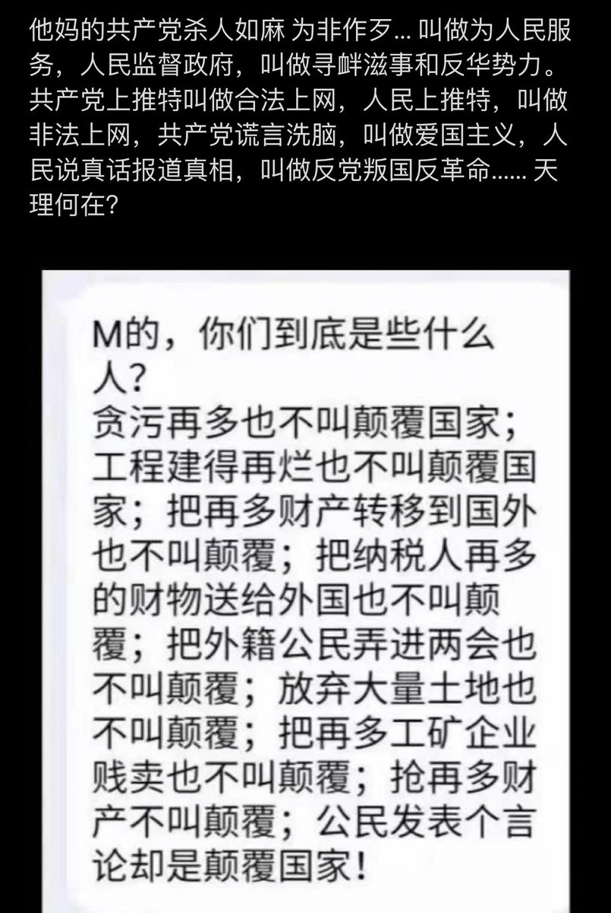  Ivy未央 北京时间 2024-02-26T12:27:20Z 1761971184382390399 有这么一个党：自己选举自己，自己监督自己，自己鼓吹自己，自己夸耀自己。自己给自己特权，自己给自己薪资，自己给自己特供，卑鄙的自己总认为自己是全心全意为人民服务。
它复辟了专制，却说解放了人类；
它泯灭了人性，却说弘扬了正义！
同问：这他娘的是一帮什么玩意儿啊？
它们怎么有脸说为人民服务的？ 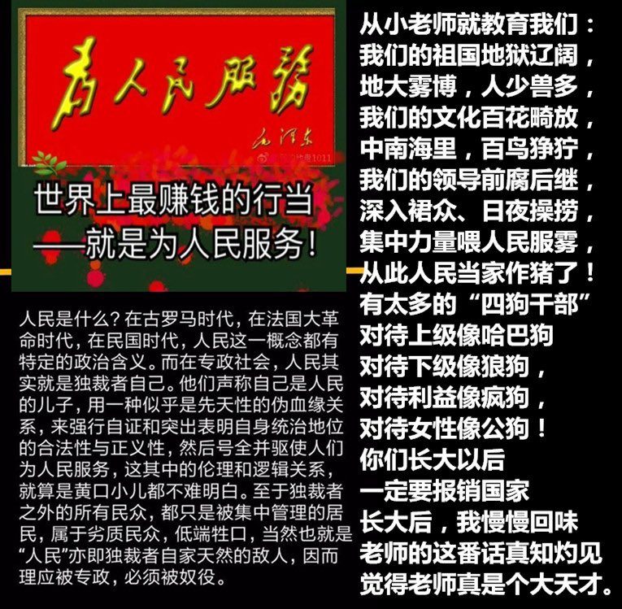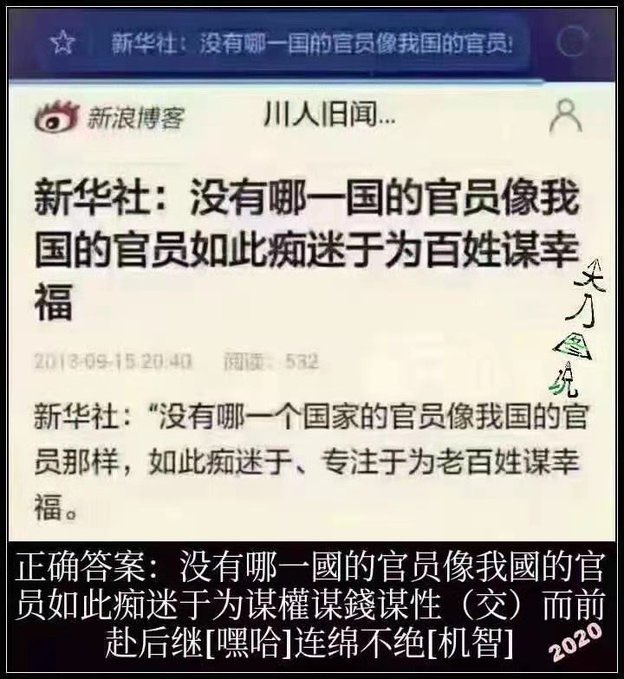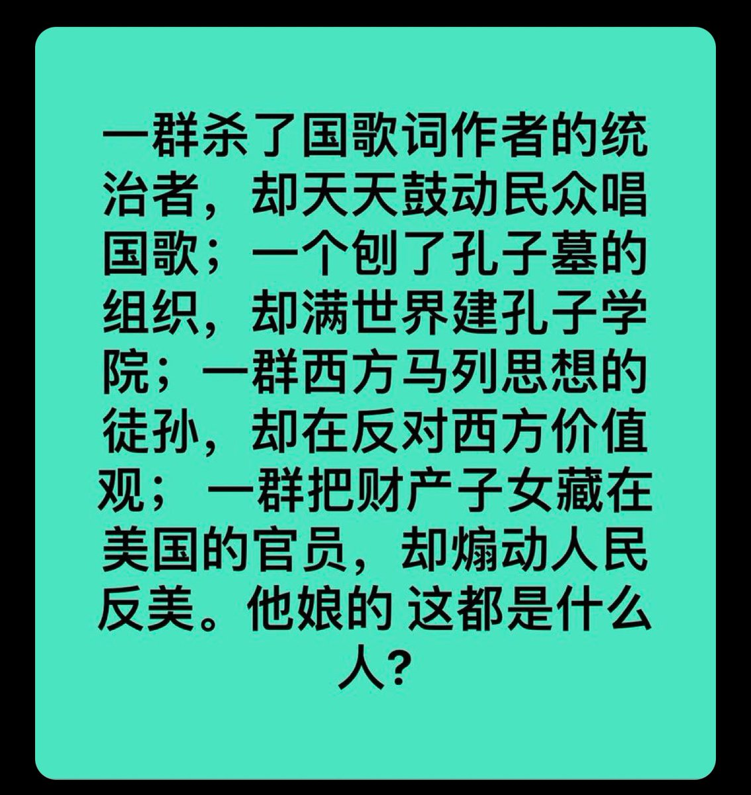  Ivy未央 北京时间 2024-02-26T12:36:45Z 1761973551446311351 当一个人没钱治病时，政府不能看着他死。这是所有公民纳税时，自愿给无能为力人员享有的权益。
免费医疗，教育，养老是一个社会的公益项目，是政府的兜底责任，是征税后该返还给老百姓的最基本福利！
——《罗马国际公约》
任何一个政府，如果公民因保钱而放弃保命，那个政府都要负全责，那个政府应该下台！ 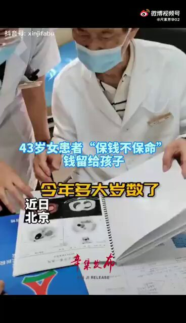  Ivy未央 北京时间 2024-02-26T10:07:50Z 1761936077525340533 揭秘中国最赚钱行业，在中国如何一夜暴富？
https://t.co/k267cgYcuN https://t.co/EnUplqFNXk 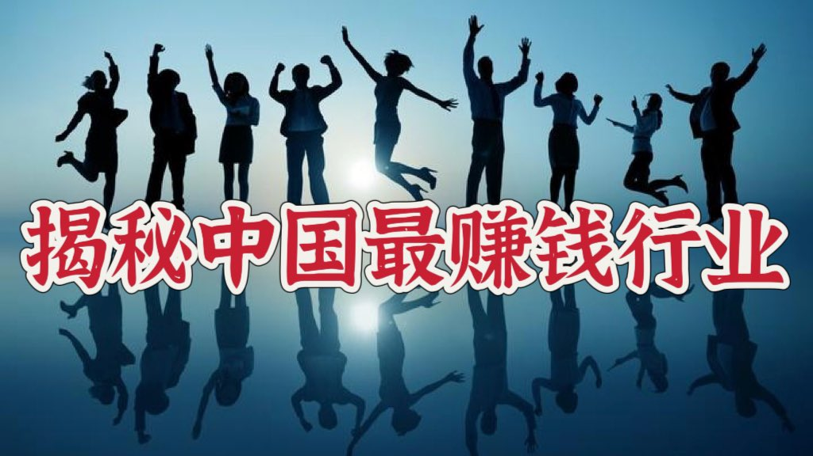  Ivy未央 北京时间 2024-02-26T10:14:14Z 1761937687387214081 在中国最赚钱的生意，甚至全世界范围内最赚钱的生意就是在中国为人民服务，因为在中国为人民服务的人混的最差都是千万富翁。   Ivy未央 北京时间 2024-02-26T11:41:20Z 1761959605796528557 RT @Ivy01011: 一名德国人在苏州一所学校当外教，八年后他离开时感慨：中国教育是把最珍贵的年华付给毫无意义、毫无发展价值的学习内容上。而舍不得花费一点时间讨论和思考。记忆成了学习的唯一方法，高压成了教育的唯一手段，保护成了成长的唯一措施。这种负成长的教育模式是对人性的…   Ivy未央 北京时间 2024-02-26T11:41:46Z 1761959714789732540 RT @Ivy01011: 转）1949年究竟解放了什么？
有人一针见血地指出：解放了兽性，人人自残；解放了贪婪，丧失了人伦；解放了流氓，个个沐猴而冠；解放了土匪，强抢成为常态；解放了罪犯，作奸犯科可投名；最终解放的是一个团伙，它们打着“为人民服务”的旗号劫持了这个国家，为祸人…   Ivy未央 北京时间 2024-02-26T11:41:51Z 1761959736918802717 RT @Ivy01011: 中国最恶心的十件事，你觉得哪个最最恶心？ https://t.co/Esnrrr4gFH 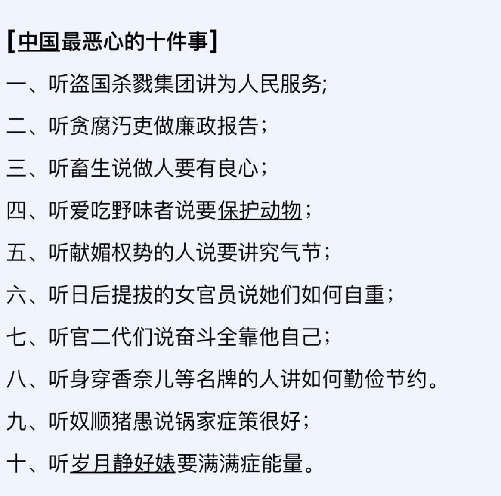  Ivy未央 北京时间 2024-02-26T11:43:52Z 1761960243599151287 https://t.co/FiR6oKz104 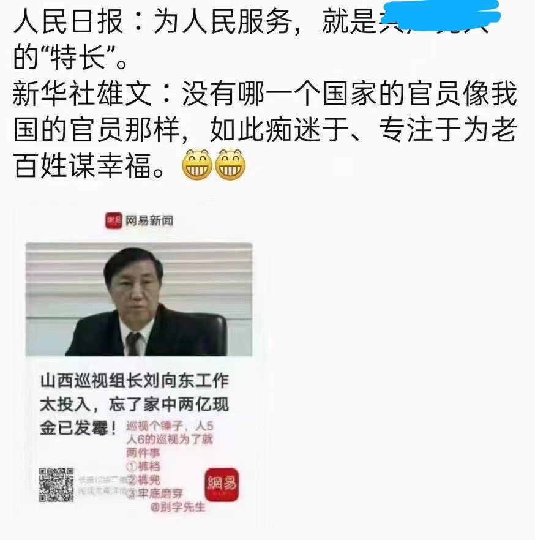  Ivy未央 北京时间 2024-02-26T09:39:12Z 1761928871266369772 一名德国人在苏州一所学校当外教，八年后他离开时感慨：中国教育是把最珍贵的年华付给毫无意义、毫无发展价值的学习内容上。而舍不得花费一点时间讨论和思考。记忆成了学习的唯一方法，高压成了教育的唯一手段，保护成了成长的唯一措施。这种负成长的教育模式是对人性的一种摧残，是对人类的极大犯罪。 https://t.co/Gtx8RB553Y 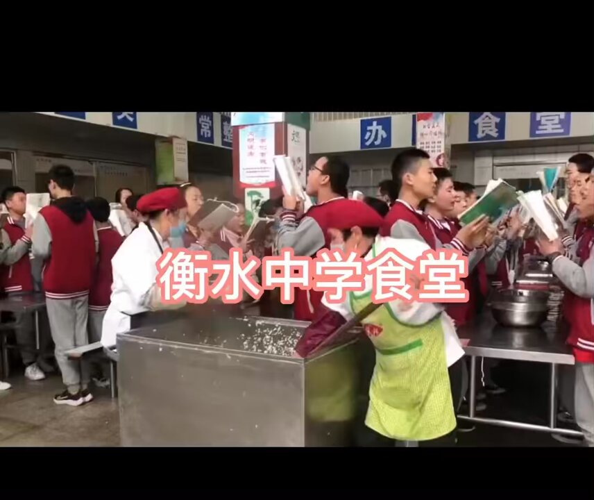  Ivy未央 北京时间 2024-02-26T10:11:27Z 1761936987013915096 你以为贩毒是大赚特赚？那是因为你还不知道中国做官的“真功夫”！在中国，真正能让你发财的不是贩毒，而是坐在办公室里的那些人民公仆。这可真是讽刺啊，中国这世道，真是让人哭笑不得，不是吗？

你知道中国最赚钱行业是什么了吗？ https://t.co/8UwGCKj3pn 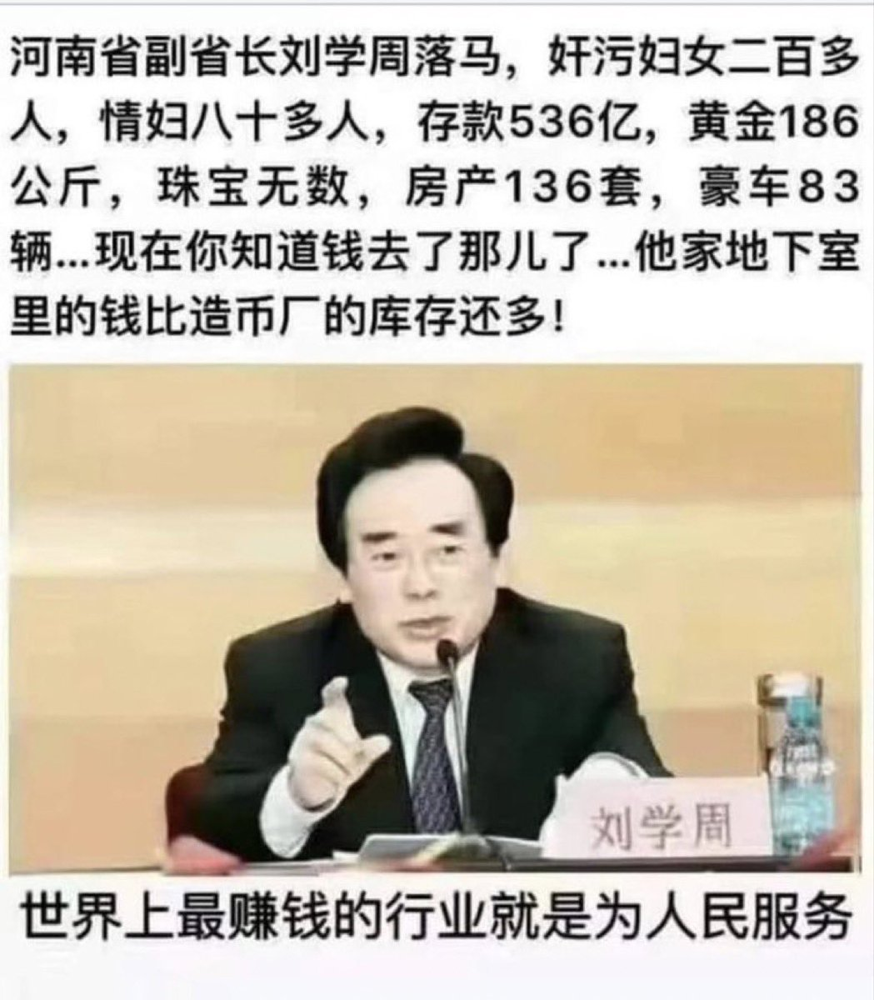  Ivy未央 北京时间 2024-02-26T10:22:59Z 1761939890659344464 转）1949年究竟解放了什么？
有人一针见血地指出：解放了兽性，人人自残；解放了贪婪，丧失了人伦；解放了流氓，个个沐猴而冠；解放了土匪，强抢成为常态；解放了罪犯，作奸犯科可投名；最终解放的是一个团伙，它们打着“为人民服务”的旗号劫持了这个国家，为祸人民！ https://t.co/qSB6pxAcNV 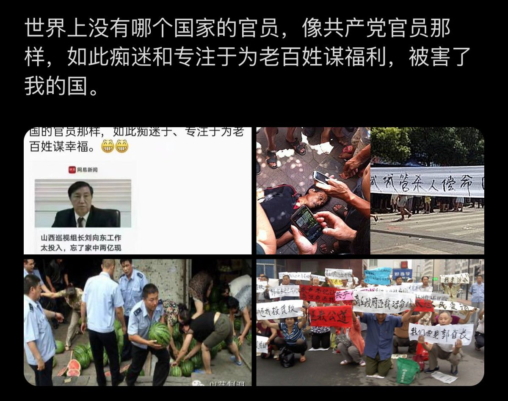  Ivy未央 北京时间 2024-02-26T07:11:07Z 1761891605810749635 1963年，张大千女儿劝诚父来回国
张怒斥：进步？穷死饿死还叫进步？
1949年11月12日，著名国画大师张大千从成都机场登上飞机飞往台湾：后来周恩来写信劝他回大陆，我已经从国库调拨了2万元帮你还账，你大可放心回国！张大千回信道；一个可以随便动用国库的钱为私人还账的政府，你们不如蒋介石；到死张大千也没回大陆，从而躲过了后来的反右，文革等灾难。 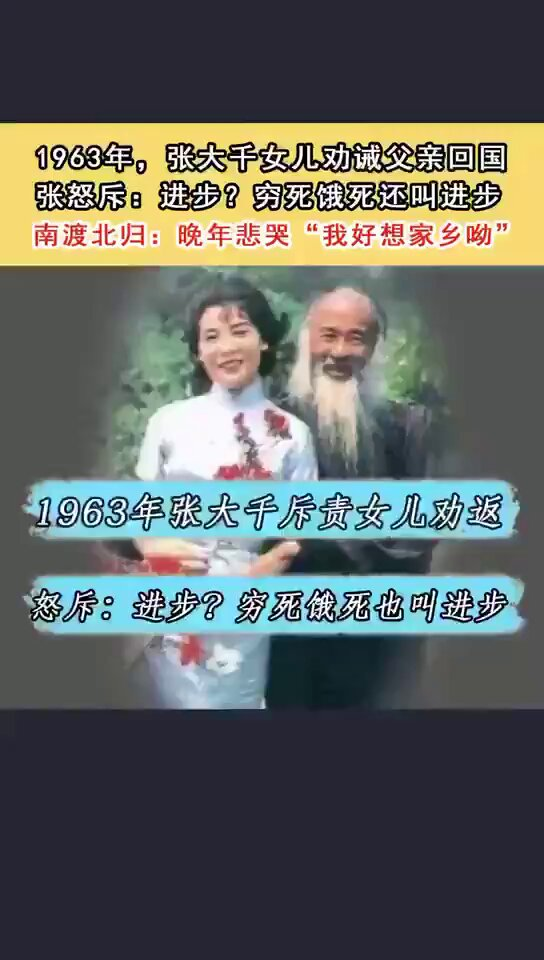  