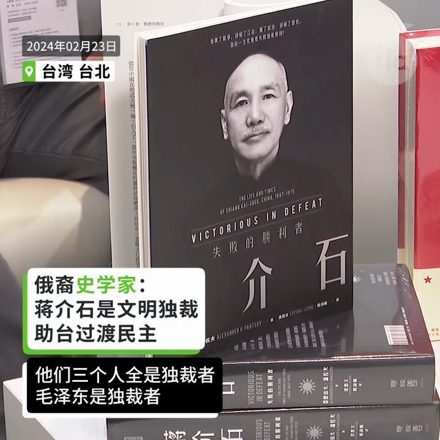
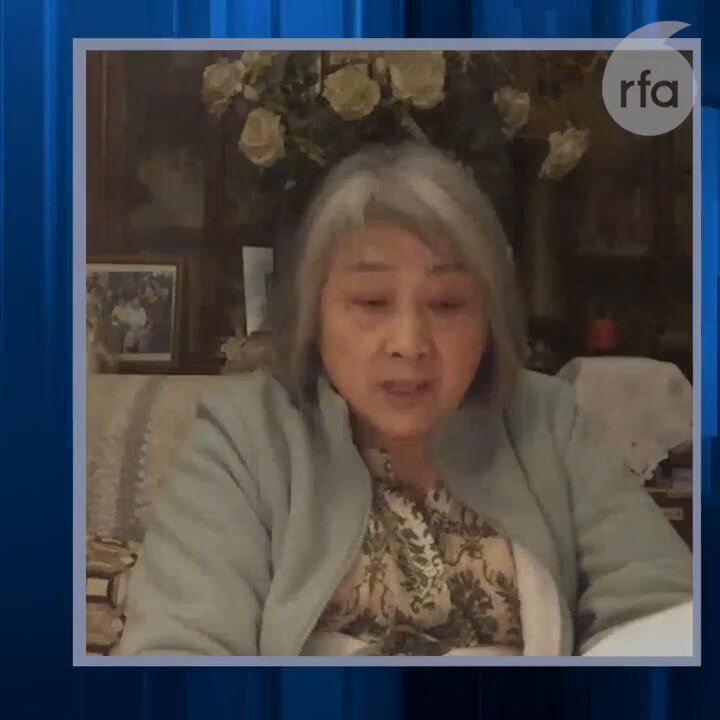

自由亚洲电台 北京时间 2024-02-26T03:17:57Z 1761832926084309377 广东人权捍卫者李碧云元宵节当天公开要求寻医治病权利，但受到顺德政府人员威胁。#李碧云 原为佛山市顺德区人大代表独立候选人，竞选驻地居委会主任和地区 #人大代表、多次上街举牌要求官员公开财产。
详阅：https://t.co/5XSiDlCiSU   自由亚洲电台 北京时间 2024-02-26T00:55:16Z 1761797020652609856 RT @RFA_Chinese: 【冯客看后毛时代中国 西方误认改开放后中国会民主化】
【因拒绝相信中共是“真的”共产主义者】
最近出版新书《毛泽东之后的中国--一个强国崛起的真相》的历史学家 #冯客 (Frank Dikötter)在接受自由亚洲电台专访时指出，西方学者误判中…   自由亚洲电台 北京时间 2024-02-26T00:55:34Z 1761797092555489362 RT @RFA_Chinese: 【俄裔史学专家称蒋毛邓为独裁者 唯蒋介石有反思】
俄裔中国近代史专家亚历山大潘佐夫(Alexander V.… https://t.co/pEOwTYhMFm   自由亚洲电台 北京时间 2024-02-26T00:55:54Z 1761797178106732775 RT @RFA_Chinese: 乔治敦大学中国留学生张津睿因参与“白纸运动”和其它人权活动，自己被其他中国留学生当面威胁，家人被中国当局恐吓，他曾在美国国会就此公开做证。如何抵制这种来自中国政府的骚扰迫害？他说，这是一个谁先胆小谁就输了的游戏。
#跨境镇压 #张津睿 
htt…   自由亚洲电台 北京时间 2024-02-26T01:09:28Z 1761800593427902688 香港记协本月以问卷形式征集意见，收到105人回复认为，23条立法将对新闻自由造成负面影响。就所谓“境外干预”罪，记协担忧外国公营媒体有可能被列为“境外势力”，又对“发布虚假或误导信息”提升至间谍罪感忧虑。
详阅：
https://t.co/PaSyvlQyJP   自由亚洲电台 北京时间 2024-02-26T01:36:33Z 1761807407120884162 著名独立记者高瑜@gaoyu200812告诉观点@viennarrrrr：现在所有地方报纸也得和中央一个腔调，成为宣传喇叭口。中国新闻媒体环境，犹如寒冬。第一财经登了经济学家文章，提到中国有超过9亿人月收入两千元以下，在网上就给封掉——只能说中国人富是吧？你只能说你都全部都脱贫了，你这不符合事实啊。#高瑜 #财新 #第一财经 #炎黄春秋 #蒋经国 #邓小平 #江泽民 #李克强 #林彪 #林豆豆 #鲍彤 #六四 完整访谈：https://t.co/7G2zAe173f   