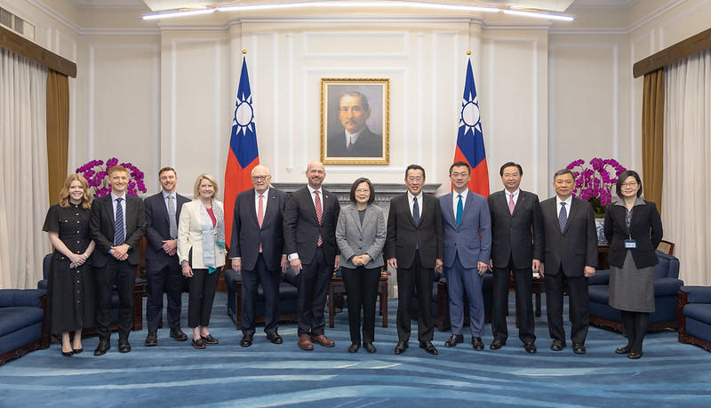
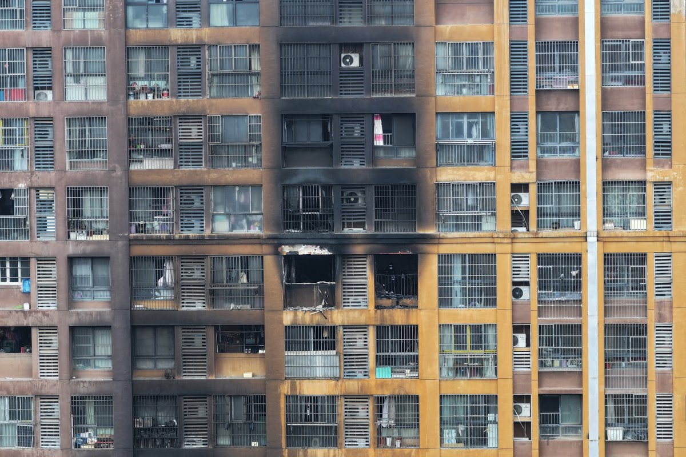
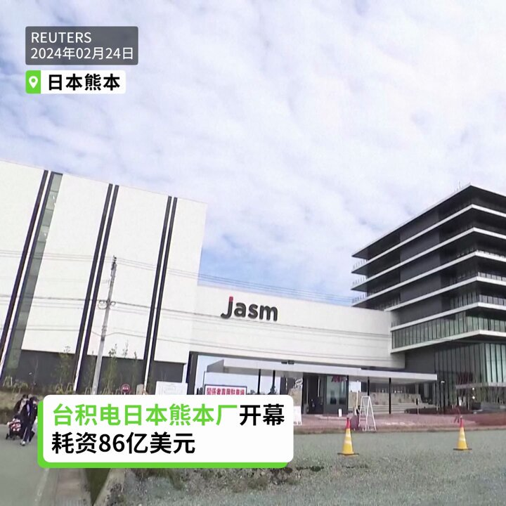

自由亚洲电台 北京时间 2024-02-26T15:51:31Z 1762022567056187602 【台湾经济自由度列全球第四】
【蔡英文：证明发展方向正确】
美国智库“#传统基金会”26日率团拜会 #蔡英文 总统，致赠最新发布的 #经济自由度 报告。台湾和去年一样，名列全球第4名。蔡英文表示，台湾去年以全球第4名创下历年最佳成绩，证明近年的发展方向正确。
https://t.co/cbSr4qFUYI https://t.co/nyLQMqFapB   自由亚洲电台 北京时间 2024-02-26T14:09:09Z 1761996806437966161 【南京一住宅电动车起火死伤59人】
【中国电动车安全隐患再受关注】
江苏南京一住宅大楼起火，造成15人死亡、44人受伤送医，官方通报火灾为大楼建筑地面架空层停放电动自行车处起火引发。此事引发民间对国产电动车是否安全的关注。长期以来，官媒鲜有报道电动车起火或自燃事故。详细报道：https://t.co/Fh50k64HPX   自由亚洲电台 北京时间 2024-02-26T12:00:02Z 1761964313022288294 【台积电熊本厂2月24日开幕】
【提高日本和世界芯片供应韧性】
【为日本半导体带来复兴】
全球最大半导体代工企业“台湾积体电路制造”(台积电，TSMC)2月24日举行了在日本熊本县第一座工厂的开幕典礼。熊本一厂预计今年底开始量产制程12到28纳米的逻辑半导体，用于日企的图像传感器和车载设备等。熊本二厂也已拍板预计2024年底开始兴建，目标2027年底营运，将切入6/7纳米制程。台积电创办人张忠谋说，熊本厂将提高日本和世界芯片供应的韧性，并将为日本半导体带来复兴。#台积电 #TSMC #熊本   自由亚洲电台 北京时间 2024-02-26T07:14:38Z 1761892489546649945 RT @RFA_Chinese: 【冯客看后毛时代中国 西方误认改开放后中国会民主化】
【因拒绝相信中共是“真的”共产主义者】
最近出版新书《毛泽东之后的中国--一个强国崛起的真相》的历史学家 #冯客 (Frank Dikötter)在接受自由亚洲电台专访时指出，西方学者误判中…   自由亚洲电台 北京时间 2024-02-26T04:23:40Z 1761849465344761927 新疆 #克孜勒苏柯尔克孜自治州 发生5.8级地震，震源深度11公里，震中距阿合奇县城24公里，附近人口稀少，但震感强烈。
详阅：
https://t.co/V7rOqOgnHH   自由亚洲电台 北京时间 2024-02-26T04:53:46Z 1761857038441713868 以“煽动颠覆国家政权罪”判处7年有期徒刑的 #阮晓寰 提出二审上诉后，其妻贝女士被上海警方传唤带走。
详阅：https://t.co/WBhGNG398Y   自由亚洲电台 北京时间 2024-02-26T06:11:09Z 1761876514189062179 少数民族女企业家 #马艺珈伊 为贵州六盘水承建易地扶贫搬迁工程、幼稚园、小学等10个政府专案后，持续讨要工程款8年，被地方公安以涉嫌寻衅滋事罪刑事拘留。有关消息冲上微博热搜。
详阅：
https://t.co/EoswTCGF3J   自由亚洲电台 北京时间 2024-02-26T02:48:31Z 1761825518838563322 “#中国海警”微信公众号2月25日宣布，福建海警组织舰艇编队当天在金门附近海域开展了执法巡查。
详阅：
https://t.co/cvkNiXd7cr   自由亚洲电台 北京时间 2024-02-26T03:17:57Z 1761832926084309377 广东人权捍卫者李碧云元宵节当天公开要求寻医治病权利，但受到顺德政府人员威胁。#李碧云 原为佛山市顺德区人大代表独立候选人，竞选驻地居委会主任和地区 #人大代表、多次上街举牌要求官员公开财产。
详阅：https://t.co/5XSiDlCiSU   自由亚洲电台 北京时间 2024-02-26T00:55:16Z 1761797020652609856 RT @RFA_Chinese: 【冯客看后毛时代中国 西方误认改开放后中国会民主化】
【因拒绝相信中共是“真的”共产主义者】
最近出版新书《毛泽东之后的中国--一个强国崛起的真相》的历史学家 #冯客 (Frank Dikötter)在接受自由亚洲电台专访时指出，西方学者误判中…   自由亚洲电台 北京时间 2024-02-26T00:55:34Z 1761797092555489362 RT @RFA_Chinese: 【俄裔史学专家称蒋毛邓为独裁者 唯蒋介石有反思】
俄裔中国近代史专家亚历山大潘佐夫(Alexander V.… https://t.co/pEOwTYhMFm   自由亚洲电台 北京时间 2024-02-26T00:55:54Z 1761797178106732775 RT @RFA_Chinese: 乔治敦大学中国留学生张津睿因参与“白纸运动”和其它人权活动，自己被其他中国留学生当面威胁，家人被中国当局恐吓，他曾在美国国会就此公开做证。如何抵制这种来自中国政府的骚扰迫害？他说，这是一个谁先胆小谁就输了的游戏。
#跨境镇压 #张津睿 
htt…   自由亚洲电台 北京时间 2024-02-26T01:09:28Z 1761800593427902688 香港记协本月以问卷形式征集意见，收到105人回复认为，23条立法将对新闻自由造成负面影响。就所谓“境外干预”罪，记协担忧外国公营媒体有可能被列为“境外势力”，又对“发布虚假或误导信息”提升至间谍罪感忧虑。
详阅：
https://t.co/PaSyvlQyJP   自由亚洲电台 北京时间 2024-02-26T01:36:33Z 1761807407120884162 著名独立记者高瑜@gaoyu200812告诉观点@viennarrrrr：现在所有地方报纸也得和中央一个腔调，成为宣传喇叭口。中国新闻媒体环境，犹如寒冬。第一财经登了经济学家文章，提到中国有超过9亿人月收入两千元以下，在网上就给封掉——只能说中国人富是吧？你只能说你都全部都脱贫了，你这不符合事实啊。#高瑜 #财新 #第一财经 #炎黄春秋 #蒋经国 #邓小平 #江泽民 #李克强 #林彪 #林豆豆 #鲍彤 #六四 完整访谈：https://t.co/7G2zAe173f   