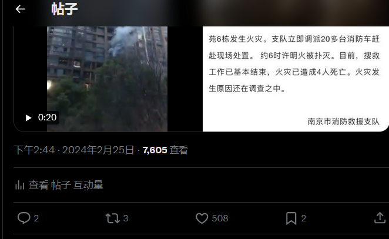
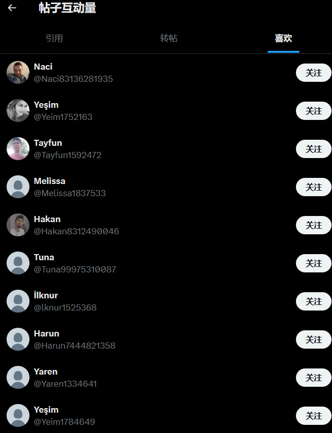
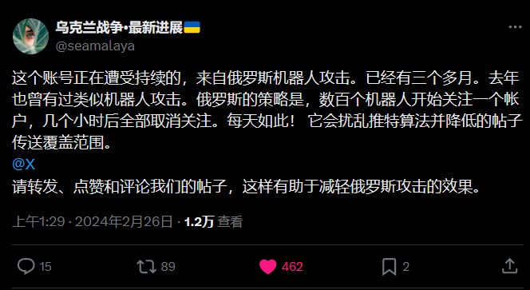
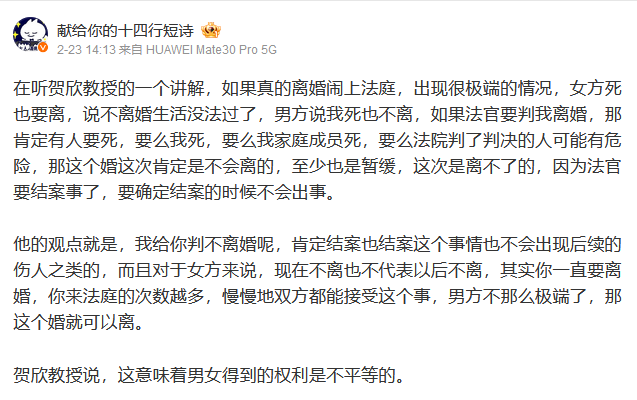

谁将十万横扫三江 北京时间 2024-02-26T12:18:58Z 1761969077806137701 RT @MM_editorial: 《太平洋战争与日本新闻》一书中曾提到，“九一八”事件之后，日本报社《河北新报》发出了一系列社论抨击日本政府，随后宪兵冲入该报办公室，威胁要成立“不买联盟”。

《河北新报》社长回应到“我社虽然贫弱，但也是言论机关。如果受到从外界来的暴力，我社…   谁将十万横扫三江 北京时间 2024-02-26T10:04:02Z 1761935118619566517 掉了六七百粉不说，怎么还给我刷点赞数据呢？😇 https://t.co/g7cvEwrbUY   谁将十万横扫三江 北京时间 2024-02-26T10:10:41Z 1761936793266762040 在听贺欣教授的一个讲解，如果真的离婚闹上法庭，出现很极端的情况，女方死也要离，说不离婚生活没法过了，男方说我死也不离，如果法官要判我离婚，那肯定有人要死，要么我死，要么我家庭成员死，要么法院判了判决的人可能有危险，那这个婚这次肯定是不会离的，至少也是暂缓，这次是离不了的，因为法官要结案事了，要确定结案的时候不会出事。

他的观点就是，我给你判不离婚呢，肯定结案也结案这个事情也不会出现后续的伤人之类的，而且对于女方来说，现在不离也不代表以后不离，其实你一直要离婚，你来法庭的次数越多，慢慢地双方都能接受这个事，男方不那么极端了，那这个婚就可以离。

贺欣教授说，这意味着男女得到的权利是不平等的。

他还提到了家暴，家暴几乎不能让受害者在离婚的时候分到更多的财产，得不到补偿，即使被认定，但法官调理的时候不考虑这个。458个遭到家暴的女性当事人里只有3个因此得到赔偿。

“打了也就是白打了。”

他讲到的特别恐怖的一个点，他说家暴的内容，每个点抛出来都很糟糕。离婚诉讼里提出家暴的话，即使家暴是提出离婚的法定条件，但提出家暴的很多事件里，家暴反而会阻挡离婚。因为结婚其实是在维持稳定。其实我听懂了他在说什么，他在说，这个婚离了，可能让很多人遭受危险，但是不离，只有「你」，嗯，只有妻子会遭受危险。

中国日报给出的调查显示中国的家庭里有三成到四成在遭受家庭暴力，而离婚诉讼里有60%的人是由于家庭暴力才来的。中国的离婚诉讼，22年比21年涨了一倍多，这个是女性意识的觉醒。但同样更多的问题也暴露出来。

还有很多观点，一直在听，能理解其实离婚诉讼这里，婚姻其实是为了稳定，法庭也是在维持稳定，但这个过程里基本上都是女性在遭受伤害，婚姻对女方是不平等的。很多情况就不能公平。

【网评】确实因为家暴而离婚很难，更不用说经济补偿。但其实我一直很质疑所谓不判离婚，让男的在家打老婆就能维稳的策略是否真的成立。好比纵容虐猫会导致犯罪升级，一个能随便打杀老婆小孩的社会，真的会稳固吗？这不合逻辑   