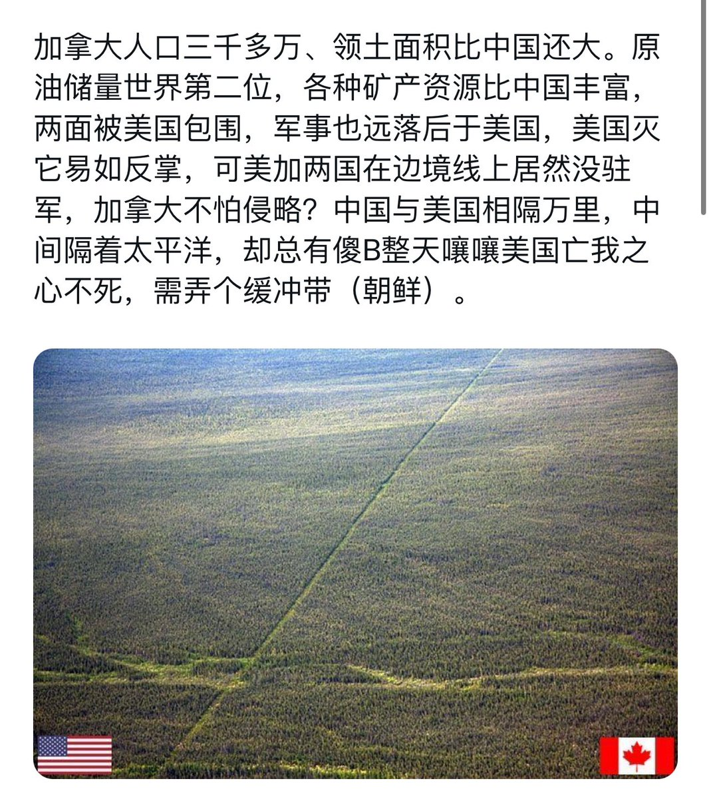

Ivy未央 北京时间 2024-02-25T09:37:30Z 1761566055393091916 RT @Ivy01011: 习近平当主席就是一个悲剧，也是一个笑话！当政十年时间，外资被吓跑了，民企被搞垮了，外汇被撒光了，外交全被搞砸了，股市被跌惨了，货币被贬值了，国库被败光了，民心被搞乱了，官心被搞散了，土地被卖光了，信用被破产了，国家形象被搞坏了，香港已变臭港了，新疆已…   Ivy未央 北京时间 2024-02-25T09:41:44Z 1761567120872054786 这也许是习近平作为文革受害者，却热衷于文革的最合理解释？ https://t.co/Xxa65PVvWI   Ivy未央 北京时间 2024-02-25T09:50:59Z 1761569450166259961 抗美援朝保家卫国纯属谎言
美国侵略中国图个啥？ 美国缺土地吗？缺资源吗？为了奴役中国人民？鬼都不信！
退一万万步，即使美军要侵略中国，从军事的观点上看，用朝鲜为跳板以陆路侵略也是无稽之谈。稍看一下地图就知道，朝鲜距中国的政治经济中心区域，如京津地区，有800公里，从锦州到山海关又是易守难攻的狭长走廊，美军若从朝鲜出发向西进攻中国的核心地区，要打到猴年马月才能对中国的政局有所影响；更糟糕的是，美军会把自己的后方完全暴露给中国的军事盟国苏联，有后路被抄的可能。没有白痴会冒这种战略风险。
美军若入侵，会采用由海上直接登陆的方式。任何了解美军二战历史的人都清楚，美军最擅长登陆作战。登陆作战不但可广泛选择进攻的地点，掌握战争的主动权，而且后勤补给线短，适合美军消耗巨大的作战方式。中国的海岸线绵长，美军可选择在广厦，沪杭，甚至渤海湾登陆，防不胜防。这样的攻击不但可以立即造成重大的政治经济上的影响和后果，而且进退自如，无后顾之忧，有何道理舍捷径而求远道于朝鲜？   Ivy未央 北京时间 2024-02-25T07:02:29Z 1761527045320802705 RT @Ivy01011: 陈丹青：中国有些人是不讲原则的 https://t.co/rg2FNB0GcL   Ivy未央 北京时间 2024-02-25T07:59:20Z 1761541348618916019 习近平当主席就是一个悲剧，也是一个笑话！当政十年时间，外资被吓跑了，民企被搞垮了，外汇被撒光了，外交全被搞砸了，股市被跌惨了，货币被贬值了，国库被败光了，民心被搞乱了，官心被搞散了，土地被卖光了，信用被破产了，国家形象被搞坏了，香港已变臭港了，新疆已变集中营了，中国已变监狱了！ https://t.co/W2ZLlE90oG   