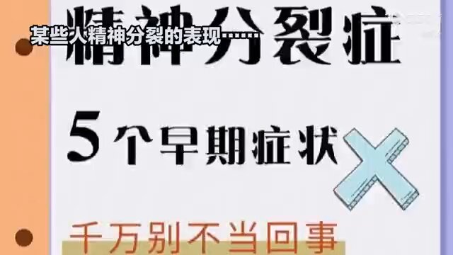
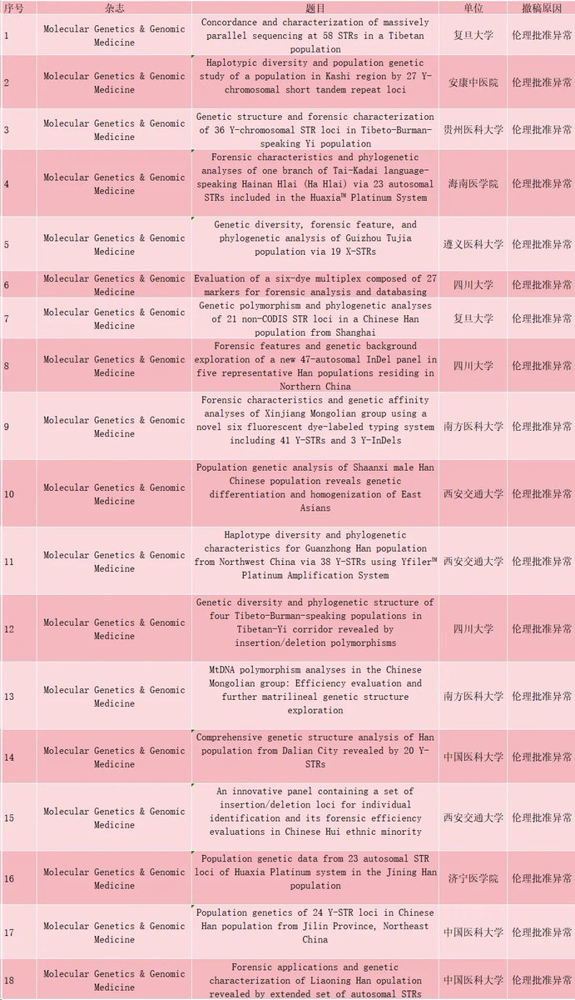

Petrichor 北京时间 2024-02-25T22:13:39Z 1761756345164788166 视频所说的“他们”是谁？小粉红、五毛、中共宣传部、外交部发言人、中共中央、习近平及其他的草台班子？他们的两面性，其实只有一面是真的，另一面是假的用于骗人的。例如，他们说美帝在技术上卡中共脖子，他们技不如人，没有创造性，是真的；他们说自己科技如何厉害，就是假的，是吹牛逼的，就是说自己扛200斤麦子10里山路不换肩一样，是吹牛。他们逻辑思维不清晰，乱乱的。   Petrichor 北京时间 2024-02-25T13:58:26Z 1761631720267264220 如果中国人有公费医疗、公费养老，大家也会快快乐乐地做一个月光族，因为人生有了安全感。但是中共就是不给中国人民连泰国都有的公费医疗和公费养老，不是中国经济不足以负担这些，而是它把商鞅的“驭民五术：弱民、贫民、疲民、辱民、愚民”当成治国法宝。 https://t.co/QoOdoiUk6z   Petrichor 北京时间 2024-02-25T06:34:18Z 1761519949254717708 2024年2月，Molecular Genetics & Genomic Medicine 撤回了18篇由中国学者撰写的医学研究论文，主要原因是伦理批准异常，包含复旦大学，四川大学等院校。所有的撤稿文章，包含以下撤稿声明：
在这篇文章发表后，第三方对文章中进行和报道的研究的同意和伦理批准提出了担忧。出版商和期刊编辑委员会的代表对所提供的同意文件进行了审查，对照文章中进行的研究和报道。审查发现了同意文件与研究报告之间的不一致；文件不够详细，无法解决所提出的问题。因此，当事各方决定撤回该文章。此外，文件并未同意批准与本文相关的数据公开共享。由于担心这些数据可能被用来识别参与研究的人员，本文的相关数据已从发表记录中删除   Petrichor 北京时间 2024-02-25T08:46:14Z 1761553153726529882 风能把人吹变形得如此厉害，这是我以前没有想象过的。自然没有这么大风，幸运。 https://t.co/b4FO2K2Chz   Petrichor 北京时间 2024-02-25T02:48:34Z 1761463142670889322 今年雪下的大，回不去家了。 https://t.co/4uu2j7gZ4o   Petrichor 北京时间 2024-02-25T03:03:28Z 1761466894064710134 与发达国家相比，中国纳税人的钱都花到哪儿去了？西方发达国家用钱最多的是医疗、科技、文化和教育，即老百姓需要的地方。而中国财政的70%被行政部门的公务员用了：党委、人大、政府、政协以及无数的行政单位，也包括妇联、共青团、侨领、国安等。总之，纳税人交的钱都被用于统治、镇压、监视、限制、欺凌纳税人了。可谓取之于民，用之于民。只是这个用很难看。   Petrichor 北京时间 2024-02-25T00:01:31Z 1761421102960586766 把驻外使馆搞成高档会馆和娱乐场所，却把正业——外交忘了，对外国人一律采取战狼式的谩骂，其余时间在所谓侨社华人堆里做“总督”，身边围着各个年龄段贴上来的大陆来有所图的女人。与发达国家不是比工作，而是比奢侈屠华。好像美国或加拿大还是哪些国家统计过，中国是得交通罚单比较多的外交官们的国家，而且基本不交。因为有外交豁免权罩着，所在国也没办法。排在中国前面的好像有沙特、俄罗斯。而日本外交官的交通罚单基本没有。可见素质之差别。

 https://t.co/VJrN1EAcSY   