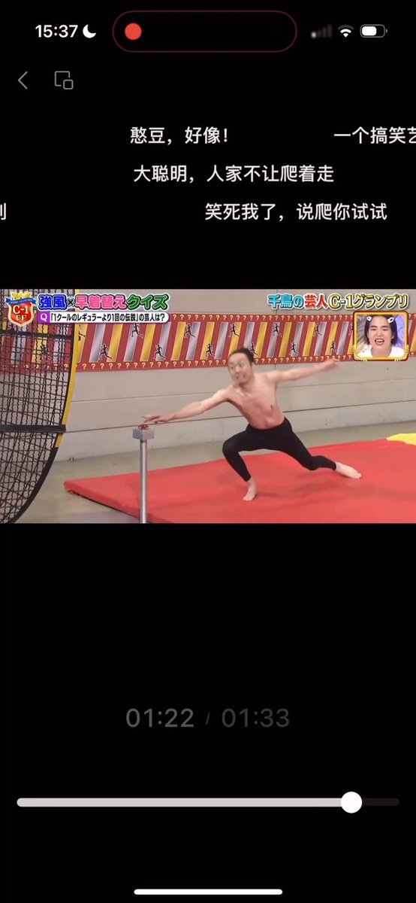
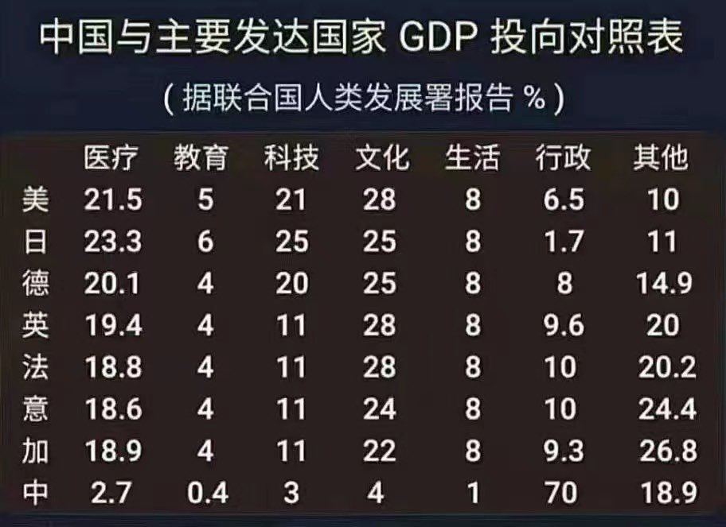
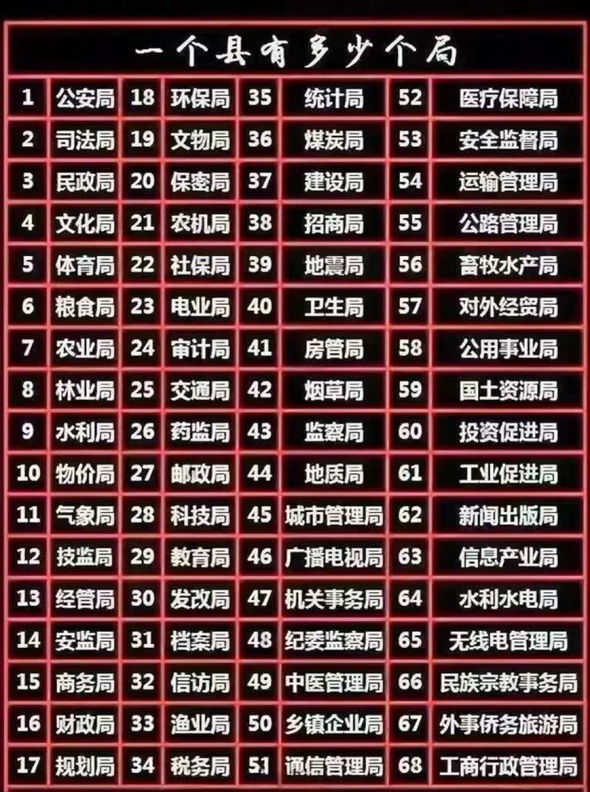
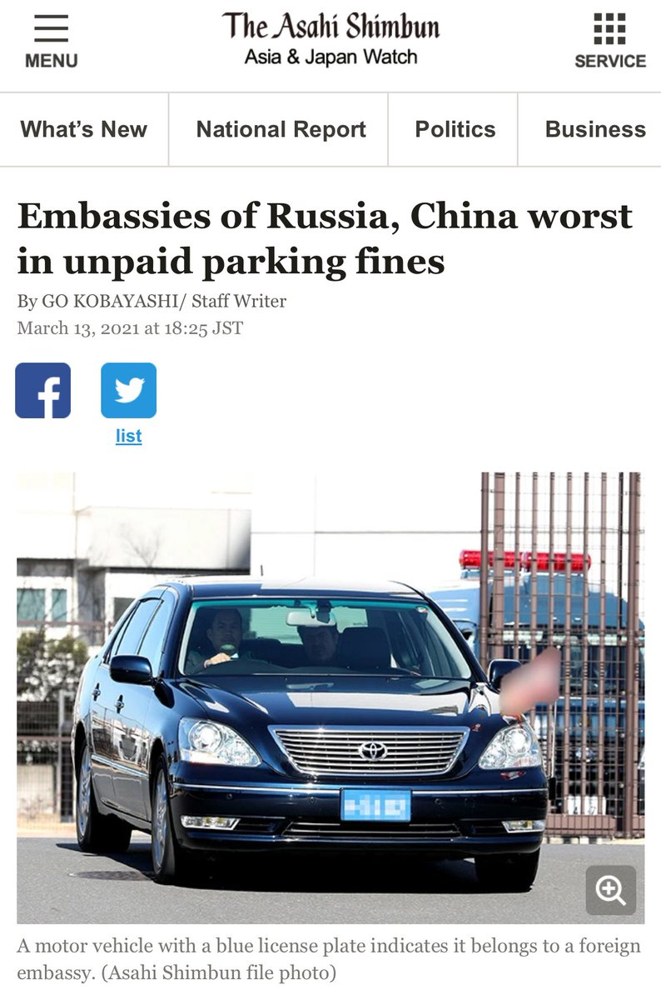
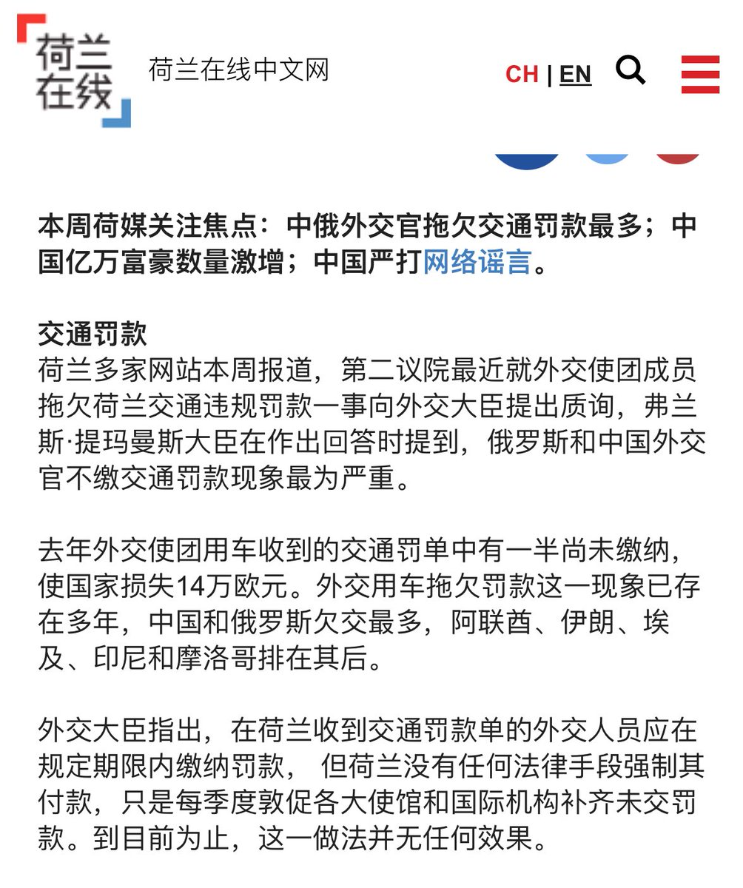

Petrichor 北京时间 2024-02-25T08:46:14Z 1761553153726529882 风能把人吹变形得如此厉害，这是我以前没有想象过的。自然没有这么大风，幸运。 https://t.co/b4FO2K2Chz   Petrichor 北京时间 2024-02-25T02:48:34Z 1761463142670889322 今年雪下的大，回不去家了。 https://t.co/4uu2j7gZ4o   Petrichor 北京时间 2024-02-25T03:03:28Z 1761466894064710134 与发达国家相比，中国纳税人的钱都花到哪儿去了？西方发达国家用钱最多的是医疗、科技、文化和教育，即老百姓需要的地方。而中国财政的70%被行政部门的公务员用了：党委、人大、政府、政协以及无数的行政单位，也包括妇联、共青团、侨领、国安等。总之，纳税人交的钱都被用于统治、镇压、监视、限制、欺凌纳税人了。可谓取之于民，用之于民。只是这个用很难看。   Petrichor 北京时间 2024-02-25T00:01:31Z 1761421102960586766 把驻外使馆搞成高档会馆和娱乐场所，却把正业——外交忘了，对外国人一律采取战狼式的谩骂，其余时间在所谓侨社华人堆里做“总督”，身边围着各个年龄段贴上来的大陆来有所图的女人。与发达国家不是比工作，而是比奢侈屠华。好像美国或加拿大还是哪些国家统计过，中国是得交通罚单比较多的外交官们的国家，而且基本不交。因为有外交豁免权罩着，所在国也没办法。排在中国前面的好像有沙特、俄罗斯。而日本外交官的交通罚单基本没有。可见素质之差别。

 https://t.co/VJrN1EAcSY   