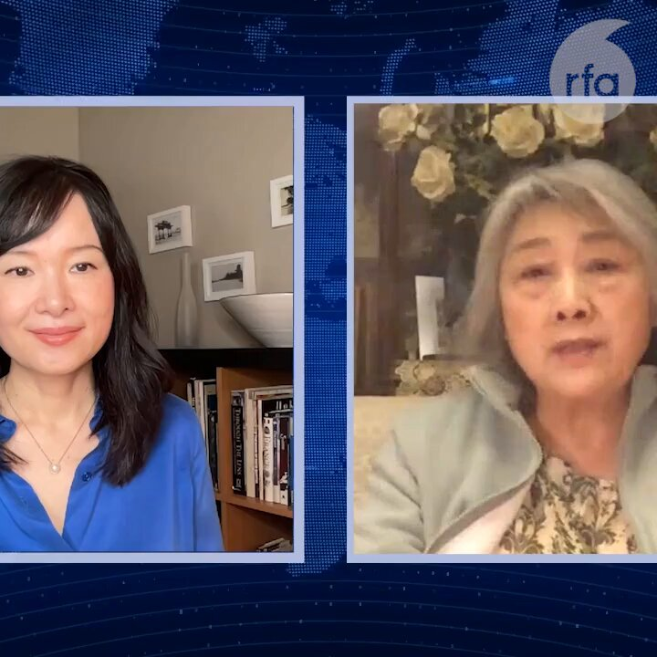

自由亚洲电台 北京时间 2024-02-25T11:52:32Z 1761600036649971767 【俄乌战争两周年，多名西方国家领袖发言】
美国总统 #拜登：赞扬英勇的乌克兰人民奋战不懈，他们捍卫自身自由与未来的决心毫不屈服。
英国首相 #苏纳克 表示：我们必须重振我们的决心。是时候证明暴政永远不会胜利。
详阅：
https://t.co/k2WoGDIHP4   自由亚洲电台 北京时间 2024-02-25T12:22:24Z 1761607554285650039 一艘载有12人的山东籍渔船24日凌晨在 #东海 海域沉没。目前已有4人获救，但仍有人员失联。
详阅：
https://t.co/oe65HQZkqB   自由亚洲电台 北京时间 2024-02-25T02:29:26Z 1761458326980665761 【79岁老人被判有期徒刑三年】辽宁 #营口市 鲅鱼圈区的高龄法轮功学员 #孙秀珍 2023年被关押在营口看守所, 判刑后已被转到辽宁女子监狱。
详阅：
https://t.co/ruFH1epMFp   自由亚洲电台 北京时间 2024-02-25T03:04:08Z 1761467060423397538 著名独立记者高瑜@gaoyu200812告诉观点@viennarrrrr：现在连（作家）章诒和、 连（清华大学教授）郭于华都被边控了。而她现在微信微博都市被封、电话全部窃听。中国新闻媒体环境，犹如寒冬。#高瑜 #财新 #第一财经 #炎黄春秋 #蒋经国 #邓小平 #江泽民 #李克强 #林彪 #林豆豆 #鲍彤 #六四 完整访谈：https://t.co/7G2zAe173f   自由亚洲电台 北京时间 2024-02-25T03:06:34Z 1761467673727164772 维吾尔族商人 #奥布尔阿西木 ·吐尔荪把目光投向了伊朗，扩大香料买卖业务。但伊朗安全官员在 #伊玛目霍梅尼 国际机场拘留了奥布尔阿西木，并在审讯 20 天后将他强行送回中国。
详阅：
https://t.co/Zl8HY7XL5s   自由亚洲电台 北京时间 2024-02-25T04:02:57Z 1761481864827543980 RT @RFA_Chinese: 【"韭菜"必读：中国证券市场的制度缺陷】
李小民回顾他将近20年的炒股经历，股市为他带来了当一个白领不可能赚取的财富。但是 #股市 未来的发展让他不再留恋，“‘亲自指挥’没有哪次成的，如果他英明神武另当别论，但是一次又一次验证，大家都看清了“。…   自由亚洲电台 北京时间 2024-02-25T04:04:04Z 1761482144117928440 RT @RFA_Chinese: 欢迎收听播客 https://t.co/q3QLYQcxWD
“有行动，才有空间”：中国大使馆门前的抗争者 https://t.co/jhYAr0b0nD   自由亚洲电台 北京时间 2024-02-25T00:38:06Z 1761430311135527356 台湾驻美代表 #俞大㵢 与美国在台协会（AIT）执行理事 #蓝莺（Ingrid Larson）签署《台美国际发展合作备忘录》，就健康照护、妇女赋权、中小企业及基础建设等领域探索合作机会。
详阅：
https://t.co/fSfeQhqkmn   自由亚洲电台 北京时间 2024-02-25T01:11:12Z 1761438640272457916 政大台湾 #身份认同 调查：
仅中国人：2.4%，1992年以来新低；
仅台湾人：61.7%，近4年都在六成以上；
两种身份都认同：32.0%；
望两岸永维现状：33.2%，1994年以来新高；
望尽快独立：3.8%，逾20年来低点。
望尽快统一：1.2%；
详阅：https://t.co/WFmAX1t1d5   自由亚洲电台 北京时间 2024-02-25T01:25:02Z 1761442121557356657 【南京噬命大火：市长陈之常鞠躬道歉】雨花台区 #明尚西苑 居民楼火灾造成至少15人死亡，44人受伤，一人生命垂危，其他人伤势较重。初步分析起因是架空层停放电动自行车处起火。
详阅：
https://t.co/apz8VXhR5J   自由亚洲电台 北京时间 2024-02-25T01:35:22Z 1761444721287659955 “艺术可以成为破坏共产主义专制的武器：#习近平 不想被比作小熊维尼，显示音乐、诗歌、著作和歌舞让共产党人感到害怕，因为艺术很容易得到大众支持，这是政治抗议无法做到的”。— #BrendanKavanagh
详阅：
https://t.co/ADIHMHTRW4   自由亚洲电台 北京时间 2024-02-25T02:07:01Z 1761452685994217791 俄乌战争两周年，波兰、#乌克兰 与欧盟驻中使团在北京联合举办聚会，美国驻华大使 #伯恩斯（Nicholas Burns）在发表演说公开表达美方对中国继续支持俄罗斯“很失望”。
详阅：
https://t.co/UpBPydUKKt   自由亚洲电台 北京时间 2024-02-25T00:20:26Z 1761425863566901488 由于开发商深圳华南城无法如期支付千万美元的债券本金，一批境外债权人计划对其大 #国企股东之一 特区建发集团提起诉讼，追讨债务。
详阅：
https://t.co/peNMYlUlJm   