谁将十万横扫三江 北京时间 2024-02-25T14:37:19Z 1761641507310993629 RT @starlightcaesar: 粉红是中国人的出厂设定，就像厌女是男人的出厂设定一样。大环境如此，痛苦是必然的。但是总不能因为自己痛苦，就对一切冒犯到自己的陌生人充满恶意吧。毕竟人家可未必是有恶意的。   谁将十万横扫三江 北京时间 2024-02-25T14:48:03Z 1761644206685290603 RT @lilaoshizuikeai: 当然其实从白纸运动大家早就应该意识到，真正的变革是必须全社会一起努力的。在白纸之前，学生单独闹过，工人单独闹过，市民单独闹过，个别地方政府单独放开过，但最后都没有成功。…   谁将十万横扫三江 北京时间 2024-02-25T14:50:36Z 1761644849386926335 网友投稿：中国12389举报网站连上传截图与视频都没办法，只能用文字描写问题。 https://t.co/SHozIMk8Od 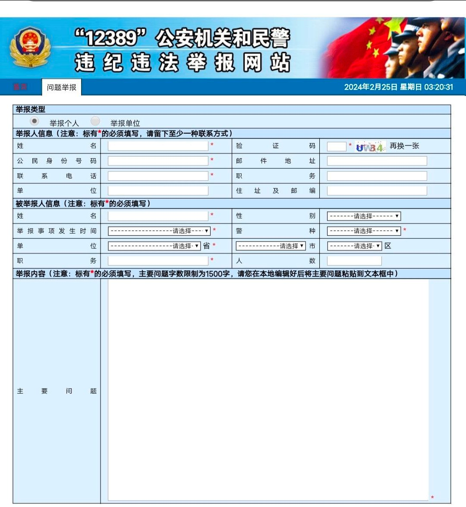  谁将十万横扫三江 北京时间 2024-02-25T15:04:10Z 1761648264779379097 网友投稿：河北工业大学姚教授因捍卫人的基本生存权被政治迫害

河北工业大学研究生在宿舍发现消防安全隐患→该隐患由校长造成，所以校长编造条款给学生处分→学生愤愤不平去找老师→老师为学生申诉→校长联系学生以处分不记档为条件让学生造伪证陷害该老师→老师被作伪证开除。
该老师熟悉各种规章制度，但因河北对该老师的政治迫害已经涉及河北省委高级领导（河北省教育厅，河北省法院，河北工业大学纪委），无法通过正常渠道维护自身权益，请求网友帮助 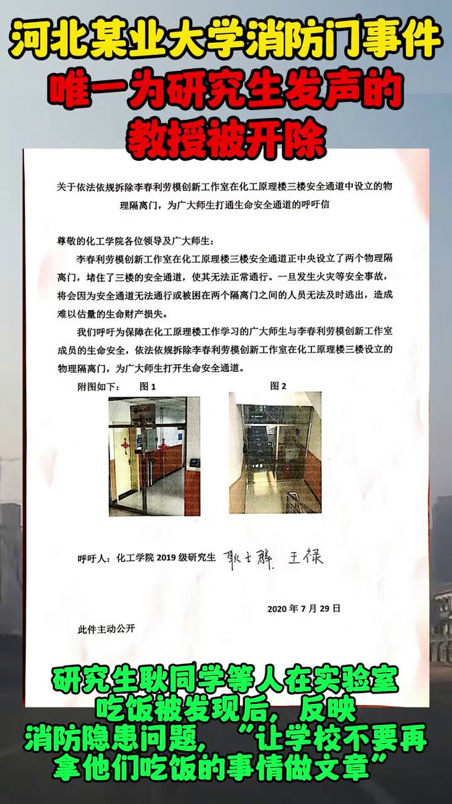  谁将十万横扫三江 北京时间 2024-02-25T13:29:19Z 1761624392399020304 RT @22HomoPoliticus: 这是一种很奇怪的心态。通常别人会用同情心和同理心来感受其他人的苦难，但是为什么有人在看见别人的苦难时就觉得庆幸和侥幸？这种心态有点像集中营难民心态：他们看见别人比自己先进毒气室，就觉得自己赚到了；等他进毒气室的时候，他也幻想也许自己比其…   谁将十万横扫三江 北京时间 2024-02-25T13:31:35Z 1761624965642887522 RT @HuPing1: 纳瓦尔尼之死，欧美国家首脑一致表达致敬并谴责普京。对比刘晓波之死，仅仅是在刘晓波过世之后，西方领导人才在公开讲话中提到刘晓波的名字并表示致敬，但他们没有对把这位诺贝尔和平奖得主囚禁至死的中国政府提出严正谴责。   谁将十万横扫三江 北京时间 2024-02-25T13:44:02Z 1761628095919046930 电动自行车充电桩燃烧起火事故其实每年都有发生，造成人员伤亡的也不在少数。如果只是像宗教团体（图4）一样批评到“资本主义顽疾” “有钱人不买电动车”，枉为左翼

据统计，2022年，全国有1.8万起事故。但这其实并不是一个治理难题，主要解决3个问题：室内充电、飞线充电、楼道充电。几年前电动自行车充电桩技术就已经很成熟了，是很好的解决方案。

2020年，我们孵化了一家做电动自行车充电桩的企业，业务模式很简单，把充电桩安装到小区里面去，赚个电费差价，安全充电问题顺带着就解决了。我参与了前期大客户BD工作，首当其冲就和房产物业部门杠上了。

1. 小区物业要回扣。充电桩要进小区，第一关就是物业。物业的逻辑很简单——谁给的回扣多就让谁进，反正谁进来都一样，结果是很多杂牌子抢先进入。但充电桩安装只是第一步，还需要检修运营、线上体验优化。杂牌子都是赚个加盟费，搞一波就溜，所以很多小区的充电桩占着地方还不好用；

2. 房产局唱高调。小区的门路不好走，我们直接高举高打。我们做了一套电动自行车充电桩管理系统，实时监测充电情况，可以协助消防和房产物业部门建立消防安全大数据，不论从哪个角度看对这些部门都是好事。想方设法与房产局领导建联，得到与一把手汇报的机会，她听完后觉得很好，支持我们干。这个项目就转到了物业管理部门来落实，我们也满心期待紧锣密鼓地去对接推进；

3. 物业部门两张皮。对接了两周，发现完全推不动，侧面了解后才知道，物业管理真是有实权啊，下面好多小老弟巴结着。他们另外一家公司早就盯上了要做充电桩管理平台，但技术和业务都不懂。这家公司主动联系我们，要以他们的名义来做这个事儿，让我们来提供技术和设备，明晃晃的空手套白狼。我当时心想，大领导都支持了，我一家就能做，还需要你来插一脚？本来就是个薄利的惠民工程，经不起这么折腾；

4. 利益板结，无解。又过了两周，我发现这个项目虽然由我们提出来，但显然已经与我们无关了，除非接受他们的苛刻要求，只好退出。一年后，南京出台鼓励安装电动自行车充电桩的政策，那家公司又找了我们一次，还是谈不拢。再一年后我们已转型做新能源充电桩出海。

而电动自行车火灾事故发生率每年还在自然增长着。 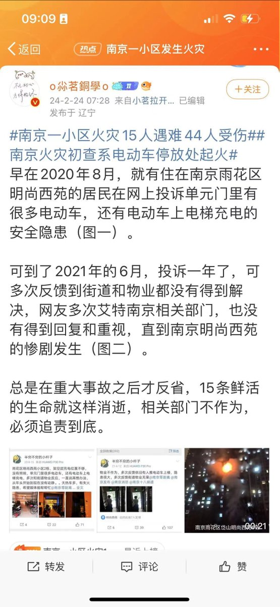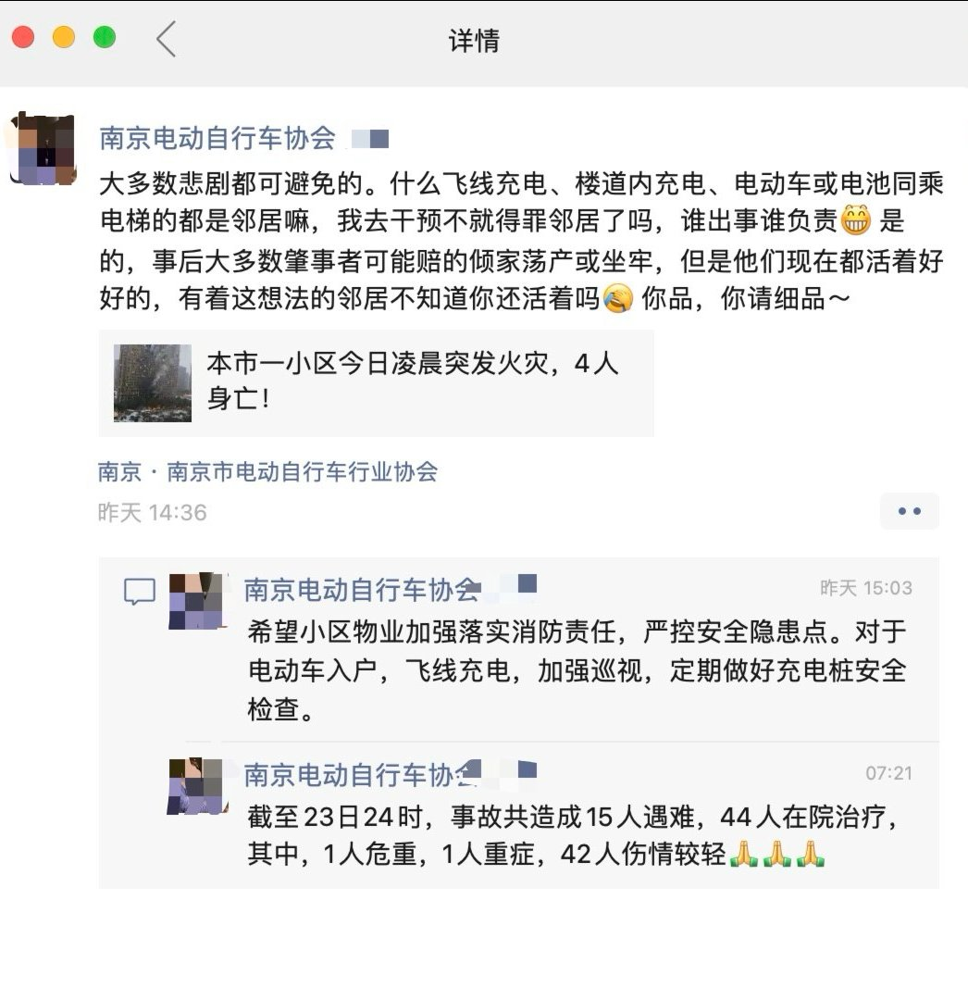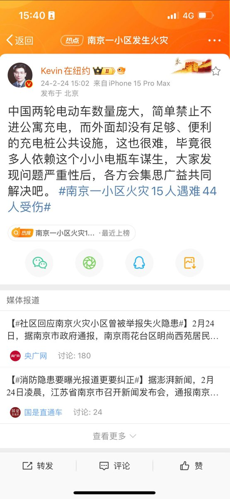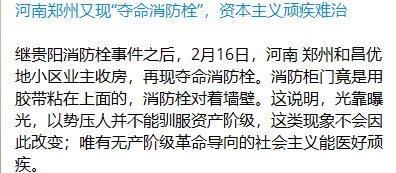  谁将十万横扫三江 北京时间 2024-02-25T09:26:22Z 1761563254068031513 在中国传媒业求生的跨性别女性：我2023年回国去《南方周末》当记者，让我补上了国内职场歧视这一课

2023年初，封控放开之后，我从欧洲回国，到《南方周末》做记者，见识到了国内职场对跨性别女性的歧视会以怎样的方式发生，理解了“中国特色的”性别暴力到底长什么样子，只是这学习成本有点儿高。

“你在这个办公楼见过有男人留长发吗？”

我在南方周末的前编辑姚忆江，在我提交入职所需文件后，谈论起了我的发型。姚是一个五十多岁的顺直男。在这次谈话之前，我知道他对我的长发有些意见，因为他曾多次试图让我剪掉头发，但当他开始讲“你的发型在编辑会议上被讨论过，我们的总编辑对此不满。你知道，外面有很多求职者在等着找工作”时，我仍然极度震惊。他的语气很温和，但言辞却很刻薄。这一刻，我在南方周末工作时遭受的歧视从微侵害（microaggressions）变成了公然的威胁。

那时，我刚刚回到中国待了两个月。此前我在欧洲生活了四年，这一方面是因为要完成我的硕士课程，当然，另一方面也是因为新冠封控和清零政策让回国机票和隔离变得太贵了。作为一名跨性别女性，我预料到自己在日常生活中会受到歧视，尤其是在一个没有特定法律保护边缘群体免受仇恨犯罪侵扰的地方，但我并不知道歧视在中国会真正如何发生。这主要是因为我的社交过渡（social transition）主要发生在欧洲。留长发，尝试女性服装，参加女权研讨会，参加游行等等，我会说能有幸身处开明的人群中是我的一种特权。在欧洲生活时我的过渡得到了朋友们热情的支持。然而，当我踏上我曾经熟悉的土地中国时，情况就开始失控了。

“die Endlösung”

我于2023年1月抵达广州，开始在南方周末担任记者一职。我为这个职位努力了三个多月，经历了各种各样的测试。我非常期待这能让我迎来疫情后的“正常生活”。当时姚是我的编辑。我第一次与他见面是在广州南方周末办公楼附近的一家咖啡馆。那时候我刚到广州3天。他带着一名女性下属朱莉（Julie）和我一起在那里开了个会。我凑巧几年前因为工作原因在网上认识了朱莉。会上我们主要谈论了一些关于我即将开始的这个职位一些细节，以及第二天去北京出差的事情。他在会议上形容我的发型“像个艺术家”。就在那时，他开始督促我剪掉我已经留了五年的头发。不过这是我在一个月之后回想起来才认识到的事情。这种评价有个术语叫“不受欢迎的评论（unwanted comments）”，是权力骚扰（power harassment, パワハラ）的一种。也就是在那时，我终于明白他不会停止因为我的发型而骚扰我，除非我剪成“男性化”的短发。

我是在二月初看透了姚玩的把戏。当时土耳其和叙利亚边境地区发生了一场严重的地震。国内外的新闻机构都将摄像机对准了这样的灾难。南方周末也是如此，但只是比他们的竞争对手晚了一些。他们几乎是在全世界都知道两国民众正在死去的两天后才开始组织工作。姚用被派往边境地区做新闻报道的机会引诱我，但前提是我要根据他的要求剪掉头发。那时我一个北方人在广州初来乍到，还在适应这座城市里的生活。那时候我新租的公寓，连被褥都还没置办齐全，晚上我还要睡床板。因此其实当时如果真要派我去，我其实有很大压力。所以，我决定对他的“善意建议”不做任何反应。其实我一月份的时候也这么干过几次，不过他在这件事上展现了惊人的毅力。他前后用这个诱饵尝试了两次。第一次他只是暗示交易的条件，即用剪发换取去土耳其的机会。但没有什么可以与他的第二次尝试相比。为了打破我的防线，他试图运用三十年来磨练的宣传技巧。误导信息（misinformation）。他试图通过树立榜样的方式对我施加同侪压力。根据他的说法，有一名顺女同事莫妮卡（Monika）为了新闻事业牺牲了她的头发。他的逻辑很简单：“一个女人都能做到，为什么你（作为一个男人）不能？” 姚口中的"真相"是被曲解了的，故事里的“修剪”被替换成了“剪掉”。

（2020年就出过“地方宣传机构宣传女性剪光头参加防疫工作，表现她们为’伟大事业牺牲‘“的丑闻，真不长记性。）

然后就是开头提到姚的“最终解决方案”（die Endlösung）——“工作还是头发”。这场对话发生在2023年三月初，而剪发的截止日期是3月8日，国际妇女节。这次谈话发生在一个会议室里；会议里只有他和我两个人；门是关上的。在谈话中，他让我再次介绍我的经验，然后突然开始“关心我家的经济困难”，然后他话锋一转，开始说南周主编对我的发型不满意。我感觉自己被迫要在两个不同的地狱之间选择，一边是“正常生活”希望的破灭，职业规划彻底被打乱，经济困难，另一边是性别身份被否定，尊严被践踏，好不容易建立的自洽被彻底打碎。我感到不知所措，然后陷入了强烈的恐慌，焦虑，然后是抑郁和酗酒问题在接下来的几个月又开始困扰我。

Misinformation

对于许多不在那种处境中的人来说，我的反应可能听起来有些夸张，但对我来说，这就是近两个月精神折磨之后的崩溃点。恐惧是权力者控制社会的有力工具。这正是我与姚共事的两个月里“过度反应”的实质。用什么才能制造恐惧呢？姚给出的答案又是误导信息。事实上，如果姚决定给你制造恐惧，那么误导信息将成为你的日常。2023年2月23日是普京入侵乌克兰的一周年，美国总统乔·拜登当天在华沙发表了讲话。由于波兰在战争中扮演着特殊的角色，我打算写一篇关于波兰扮演何种角色以及为什么波兰扮演这种角色的文章。为此，我采访了几位波兰教授，还有几位布鲁塞尔的教授。这当中的一个曾经担任过波兰外交部长。姚在得知这个事情之后要求我写一篇关于这个前外交部长的独家专访，即使我提醒过他，这个人是个鹰派，有着强烈的观点。我在截稿日期前一天交了稿件给他，但随后姚就要求我重写整篇文章，因为姚不喜欢这个前部长的鹰派观点。或者换句话说，姚是普京入侵的热烈支持者。

（讲道理，当时如果不是最初是想写波兰和布鲁塞尔视角的冲突，可能第一波重写我就没素材了）

当时，朱莉正因为即将临盆而休产假。然而，姚坚持要我先把文章交给朱莉，然后他才愿意对其进行修改。这是不寻常的。我被要求大改波兰的文章大概有3次（有点记不清了，但是其实没差），还有几次小修订，理由是“你的逻辑不够强”。中间一度姚想要让朱莉来写这篇文章。事实上，姚的策略几乎让我无法发表任何东西。这是因为一方面我不得不请朱莉在她休产假期间工作（有一次甚至是朱莉进产房当天，极端离谱），另一方面，我每次都需要等待1周甚至更长时间才能得到我文章的反馈。姚的目的并不难理解。这是他“工作还是头发”策略的一部分，因为报社是算稿费的，同时也是他在向我展示权力。他试图用PUA技巧控制我逼迫我就范。此外，我甚至不被允许独自与我的受访者见面，我的计划采访被取消，我的采访渠道不被保护。对于一个工作了几年的记者来说，这是一种羞辱；对于一个职场中的跨性别者来说，这种骚扰行为会造成极大的创伤。

我从三月初那次“入职谈话”之后开始公开反抗。当时我去找南方周末唯一的女性副总编辑赛琳（Celine）投诉姚的骚扰行为。然而自那以后，我在南方周末没有能发表过一次文章。到那时为止，我差不多2个月的工作，一分钱也没拿到，出差北京还是我自己垫的路费。（当然，他们后来在5月付了稿费和路费，但那只是一种安抚）。更糟糕的是？姚的歧视和骚扰开始给我带来严重的焦虑和抑郁，并伴有明显的身体症状。我无法集中精力。阅读对我来说变成了不可能完成的任务。这种症状甚至在我摆脱了姚创造的有毒环境后还在折磨我。我曾经两次和他直接对峙。一次是在我和赛琳谈话后。当时姚向我吹嘘南方周末的历史，并声称我的发型会在高端场合玷污公司形象。第二次是在4月19日，当时我穿着黑色连衣裙，带着闪闪发光的银色耳环去了南方周末的办公楼。我在办公室待了大约3个小时后，他才敢和我说话。这一次是在开放的办公室里。尽管他曾经建议我们到一个封闭的房间里谈话，但我拒绝了他的“建议”。这次对峙中，他承认将剪头和入职挂钩。当然不出意外的，他再次试图使用假新闻技能。他试图说服我说我的技能不足以胜任这个岗位，因为我的文章没有吸引足够的点击量。用点击量这个数据来搞假新闻很容易，因为我无法访问公司的系统，所以我也无法看到我文章的点击率。同时，“仅凭”一个记者的文章吸引了多少点击量来评估新闻技能是不充分的。“唯流量论”是三级小报儿用来评估员工表现的标准。

Collaborators

不幸的是，赛琳也参与到了我经历过的性别暴力中，只是她并不像姚表现得那么残暴（或者说伎俩不太明显？），她是非常有策略性的，讲话也很“微妙”。通常情况下，当侵犯发生在一个几乎没有任何已建立的渠道来处理施害者的组织中时，官僚主义就会成为性别暴力的放大器。这是因为当施害者和官僚体系试图让自己脱罪时，就会用各种各样的方法来让受害者放弃维权。在这方面，我的案例并不是一个例外。赛琳就是那个扮演官僚主义角色的人。当然她宣称自己仅代表个人并不代表公司。在2023年3月下旬，当我仍在犹豫是否退出时，我被要求签署一份保密协议。我不确定这是赛琳还是姚的主意。但是当我开始要求南方周末和姚正式道歉，否则我将公开丑闻时，赛琳在2023年5月威胁我说如果我违反了保密协议将面临“法律后果”。这甚至还不是她参与性别暴力的全部。她想把歧视和骚扰描述为我与姚的“个人冲突”，而不是一个社会正义丑闻，以此来让南方周末免受追责，但同时默认姚的偏见，并避免对更具包容性的性别叙事表达赞同。这对于中国公共领域的顺直女来说是一个聪明的举动。由于审查和自我审查，跨性别者越来越难以在公共领域出现，性别问题在简中世界越来越被政治化，对于顺直女来说，“落袋为安”是一个“明智”的选择。这也是简中世界一部分所谓"激进女权主义者（RadFem）"*在社交媒体上对跨性别者采取敌对行动的原因之一。一种恐惧，害怕失去她们已经获得的生活，这就像我在广州经历的恐惧一样。

*Disclaimer: 这部分所谓激进女权主义者事实上内部差异非常复杂，如果整体来说可能可以称为“trans-exclusive feminist”, 但是里面其实有的也可以干脆称为“conservative women”，可能也存在类似于strategical voter的群体混入其中，etc., etc., 但是对于这部分群体通常情况下在简体中文世界用“RadFem”“激进女权主义者”“激女”指代。

我于2023年6月初离开广州前往德国柏林，并警告赛琳将在中文和英文世界公开丑闻。然后，在我追求社会正义的旅程中，发生了最戏剧性的时刻。此前她在玩“胡萝卜加大棒”的策略。赛琳建议我在五月通过报社的“官方渠道”投诉。这建议就仿佛我甚至不知道这应该是一个选项一样。事实上，当我在三月底决定撤回我的入职文件时，向人力资源部门投诉是我的第一个想法。然而，人力资源部门甚至没有回复我的投诉信息。两个月后，就在五月，就在赛琳的“建议”之后，人力资源部门终于开始回应我的投诉。不过令人咋舌的是，人力给我的回复居然说：“给我一些时间来了解官方程序。” 这是我始料未及的，人力资源部门居然需要在处理我的投诉之前先“学习”官方程序。这只有两种可能的情况，要么报社实际上没有处理性别暴力投诉的官方程序，要么就是这些官方程序形同虚设。我曾经多次要求了解整个程序的全貌，但人力资源部门拒绝了。两天后，另一个部门的一名官员就投诉事件联系了我，并表示将开始进行调查。这次调查只有这名官员负责。据赛琳和这名官员的说法，这个部门和将进行的调查都是具有独立性的，不会因为姚是南方周末编委受到影响。然而事实上，当时我多次要求暂停姚的职务，再进行调查，但一直未能成功。这时起我已经对调查的独立性产生怀疑。此后一个月里，我一直在推动他们推进调查，但我得到的只是“你的案子正在调查中”。但就在我向赛琳发出警告后的2天，神奇的事情发生了。这名官员在一个月的调查过程中第一次想起来要求我这个当事人提供证据。当时，她只给了我两天的时间收集所有证据，可见是有多着急。这几乎消耗了我对所谓报社“官方渠道”的最后一点信任。在我切断与这名官员的联系几天后，我得到了一张盖有南方周末公章的文件，上面写着我应该解决我与姚的“个人冲突”。正如你所看到的，调查所声称的独立性甚至不存在，因为他们的策略是一致的，甚至可能是经过协调的。

在接下来的几个月里，我没有停止尝试其他渠道，但这些尝试都没能得到什么实质性结果。最终，在2023年11月底，我在微博和Twitter上开始讲述这个经过，并向南方周末施加压力。他们没有对我做出回应，但是几天后我接到了一名广州警官的电话，告诉我不要再给姚发消息骚扰他。这名警官对我还算友好，但似乎并不真的想介入这个案子。不过姚到目前为止仍然不愿意道歉，正义还未能实现。 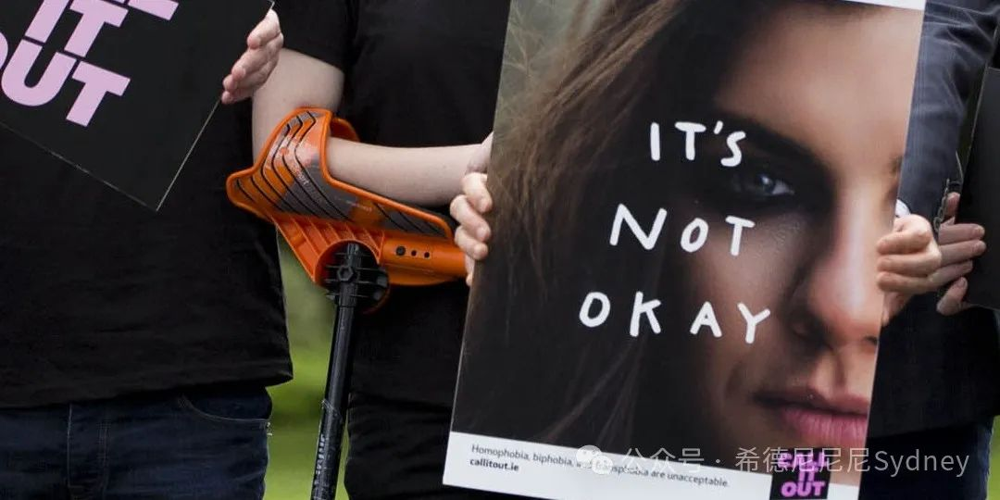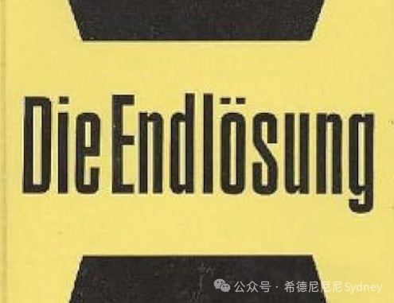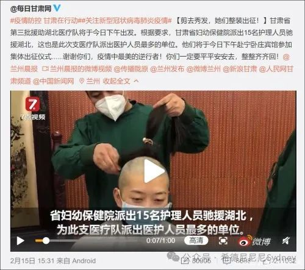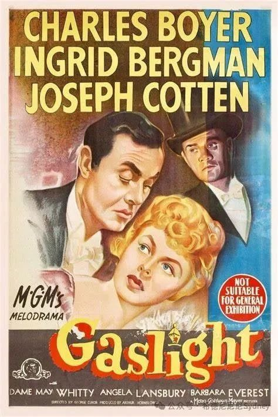  谁将十万横扫三江 北京时间 2024-02-25T09:50:40Z 1761569369614897282 乌克兰导演奥克萨娜·卡尔波维奇的纪录片《拦截》在本届柏林电影节论坛单元中放映。

影片聚焦战争中真实截获的俄罗斯士兵及其家人之间的电话交谈，展示了一个令人震惊的平行世界，以作为俄罗斯人在乌克兰土地上犯下的滔天罪行的证据，以及俄罗斯本身对这些罪行同样可怕的反应。

以下只是电影中的几段台词：

◾️“妈妈，我非常喜欢实行酷刑！我可以告诉你我所了解和参与的酷刑”。  ——儿子，一切都很好。 如果我能在那里，我也会很享受。”

◾️“不，我在这里并没有变得邪恶——我只是杀死纳粹分子。昨天，我们走路的时候，一个带着两个孩子的女人朝我们走来，所以我们把她们击杀了。——你做对了，他们是我们的敌人 . — 是的，我不为他们感到难过。这是他们的选择。他们本可以像其他人一样离开。 — 没错，不要为他们感到难过。杀掉他们。”

◾️“你在那里看到北约基地了吗？”  — 没有。 — 别对我撒谎——他们在电视上告诉我们，他们的基地无处不在。  — 别看电视，妈妈，他们说的不是实话。  - 你说他们没有说实话是什么意思？ 当然是事实。 这就是为什么你被派到那里来保护我们免受北约的侵害。 你们是英雄。 告诉你的朋友。  ——我没有朋友了，他们都被杀了。  — 我为你和你的朋友们感到骄傲。  ”

◾️“你知道，这些邪恶的霍赫利人（对乌克兰人的贬义）生活得很好 - 真的比我们好。” - 嗯，这是显而易见的 - 西方维持着他们，他们害怕失去它并为此而战。”

◾️“我会给你和孩子们带来很多东西——我们现在在这里的一间公寓里，他们抛下一切逃走了。这里的一个家庭——有着十双运动鞋，全都是名牌的。我打包带走了所有东西，把它放进了我的背包里。 这些人把卡车装满了，但我没有卡车。

-你是个好丈夫，你很节俭-你把所有东西都带回家了。顺便说一句，索菲亚今年要去上学-也许你可以找到计算机？”

这部电影的导演奥克萨娜·卡尔波维奇希望俄罗斯人也能看到这部电影。 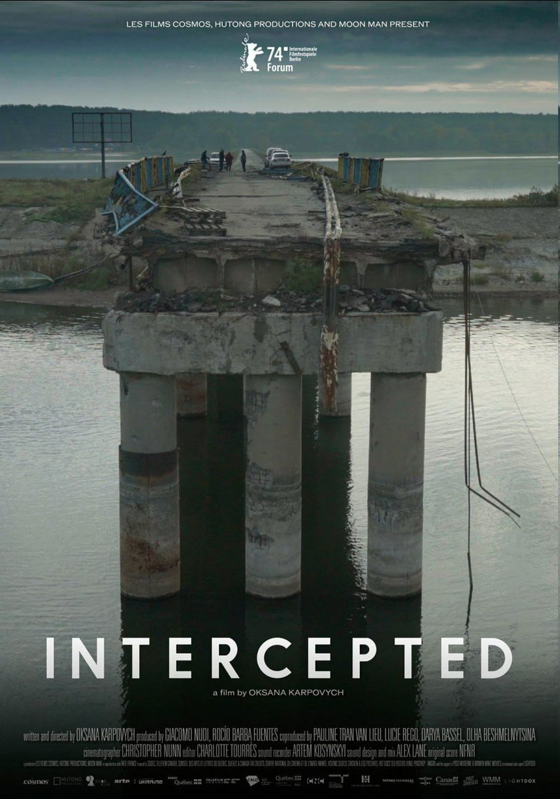  谁将十万横扫三江 北京时间 2024-02-25T09:53:46Z 1761570150472658974 RT @whyyoutouzhele: 2月24日，宁夏回族自治区。恒丰纺织厂不仅拖欠工人工资，还欠缴工人社保。大量的工人们聚集在公司门外维权。 https://t.co/ILtHXEYAVK 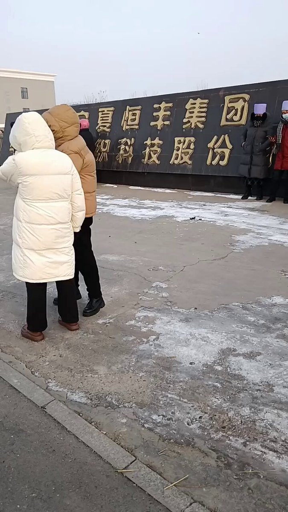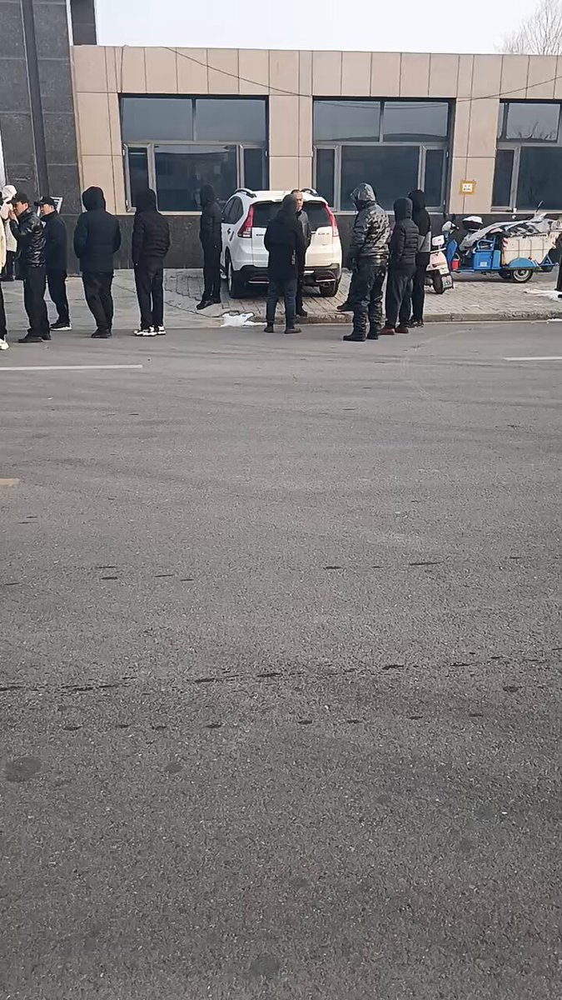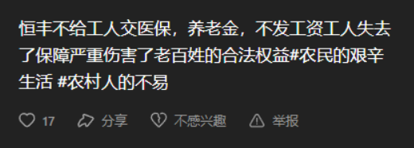  谁将十万横扫三江 北京时间 2024-02-25T09:53:56Z 1761570190494687722 RT @whyyoutouzhele: 2月21日，辽宁阜新。福棉纺织有限责任公司未缴纳工人养老保险，大量的工人们聚集在市政府门前维权。 https://t.co/AfaU5bcjxr 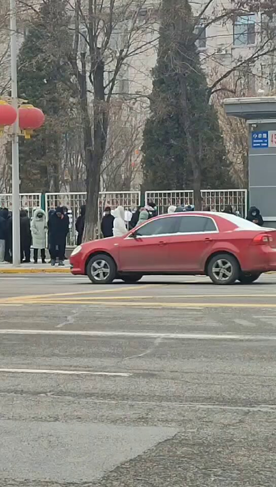  