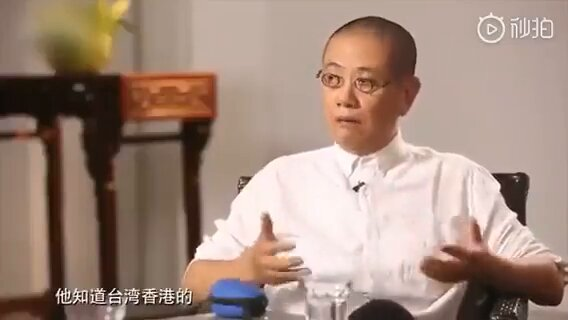
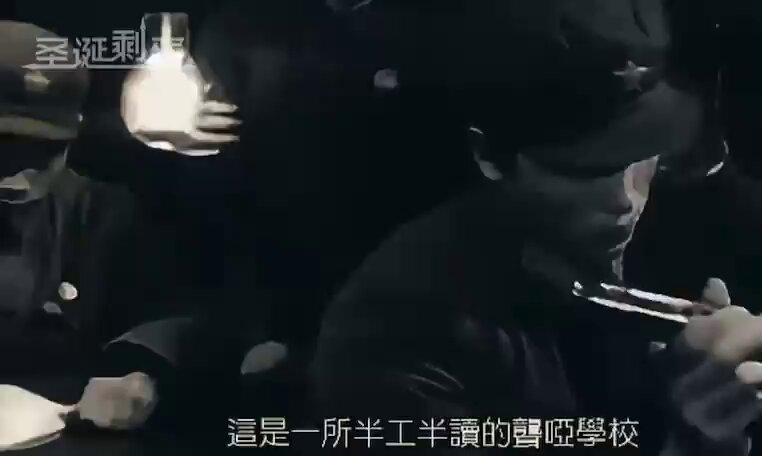

Ivy未央 北京时间 2024-02-24T14:19:24Z 1761274610400580050 陈丹青：现在还不是最糟的，更糟的东西在慢慢来，我们可以看到…… https://t.co/gthPyCXufB   Ivy未央 北京时间 2024-02-24T11:14:12Z 1761228001704874213 转）中国首位女博士徐瑞云：（1915年6月15日—1969年1月）女，数学家，中国第一位数学女博士。1969年在中共邪党发动的“文革”中不堪其凌辱折磨在“隔离室”中自杀身亡，时年53岁！
👉 1927年2月，徐瑞云考入上海公立务本女子中学。1932年，她高中毕业。因徐瑞云自小就非常喜欢数学这一科目，而且长大以后想当个老师，于是在同年9月，她报考国立浙江大学数学系。其导师有钱宝琮、陈建功和苏步青。相比之下，当时国内大部分女学生最多只读到高中学历。 1936年7月，她以优异成绩毕业于浙江大学，并留校任数学系助教。1937年2月，徐瑞云与浙江大学生物学系助教江希明结婚。1937年5月，夫妇二人获得亨伯特奖学金，留学德国。徐瑞云主要研究领域在三角级数论。当时她的博士导师卡拉西奥多里因为自己年纪比较大，本来不想再带学生。但他看徐学习刻苦，成绩又好，就收她当弟子。徐瑞云也是他的最后一个弟子(即关门弟子)。 1940年底，徐瑞云获得博士学位，她是中国历史上首位女数学博士。1941年，其博士论文《关于勒贝格分解中奇异函数的傅里叶展开》发表在德国《数学时报》上。同年4月，徐瑞云回国，被聘为浙江大学副教授。 1952年院系调整后，她任浙江大学数学教研组组长。1953年，她调任浙江师范学院（今杭州大学）数学系主任。
文革初起，徐便受到很大冲击，不仅被挂牌（脖子上挂一块上书打着×的名字的黑板或木板），示过众和游过街，还屡屡被揪上台去批斗。左臂上缠着“牛鬼蛇神”标志的白布条，成天被罚在教学大楼里打扫厕所或在校园中拔草打扫卫生。1969年不堪其凌辱折磨在“隔离室”中自杀身亡，时年53岁‼️   Ivy未央 北京时间 2024-02-24T11:28:27Z 1761231590653333742 文革时期奇葩宣传片，看了起鸡皮疙瘩：“毛泽东思想治好聋哑人”
毛腊肉果然是无神论者，把自己塑造成神啦？ https://t.co/Na6zDik1tS   Ivy未央 北京时间 2024-02-24T11:37:45Z 1761233927480496546 RT @Ivy01011: 王朔陈丹青对孔儒的看法。孔儒是几千年中国专制体制的精神内核，披着仁义礼智的外衣，维护纲常礼教的专制体制；要求老百姓温柔恭俭让，方便君王统治。之所以历代君王尊孔敬儒，就是因为儒学是维护专制体制的精神鸦片
任何没有自由平等和人权的社会政治学说都是异端学说…   Ivy未央 北京时间 2024-02-24T11:37:53Z 1761233961953513738 RT @Ivy01011: 陈丹青说；四九年之后的中国人愚昧的水平到达巅峰，已经完全到达自愚的水平了

陈丹青:这是个弱智民族，必然会有更深重的灾难..饿死几千万人，还在为毛好毛坏争得面红耳赤。这些都是常识，像分辩食物与屎一样容易… https://t.co/cfs8KGr8VE   Ivy未央 北京时间 2024-02-24T11:38:01Z 1761233996397044033 RT @Ivy01011: 文革那些奇葩事：从禁欲到纵欲
在文革时期，性被看作是革命的敌人。在这种背景下，爱情和性变成了非常敏感和禁忌的话题。
文革的过度禁欲还导致了广泛的性暴力和性犯罪，造成了大量的年轻女性被强奸。
毛泽东自己私生活淫乱不堪，为什么要禁欲民众？
https:/…   Ivy未央 北京时间 2024-02-24T11:38:05Z 1761234015019774093 RT @Ivy01011: 转）中国首位女博士徐瑞云：（1915年6月15日—1969年1月）女，数学家，中国第一位数学女博士。1969年在中共邪党发动的“文革”中不堪其凌辱折磨在“隔离室”中自杀身亡，时年53岁！
👉… https://t.co/dWiHEY81nI   Ivy未央 北京时间 2024-02-24T08:11:17Z 1761181969780547812 中共间谍才是无处不在，训练有素的中共燕子，哪个男人能抵挡住诱惑？ https://t.co/kyrcAOIqV0   Ivy未央 北京时间 2024-02-24T08:29:44Z 1761186613315473629 陈丹青说；四九年之后的中国人愚昧的水平到达巅峰，已经完全到达自愚的水平了

陈丹青:这是个弱智民族，必然会有更深重的灾难..饿死几千万人，还在为毛好毛坏争得面红耳赤。这些都是常识，像分辩食物与屎一样容易

蠢与坏是同源关系，善良的人可能傻但不会蠢。傻瓜没有杀伤力，但是蠢货往往伴随着恶，他们是这个世界的祸害
远离蠢人，因为他们会不自觉地去害人，还会觉得自己很正义   