自由亚洲电台 北京时间 2024-02-24T12:26:32Z 1761246204057276843 RT @RFA_Chinese: 【抵制美国校园里的中国跨境镇压】
2月21日，美国华盛顿乔治城大学亚裔美国学生联合会就如何保护在美中国留学生的言论自由举行研讨活动。 https://t.co/H5lSEPudfA 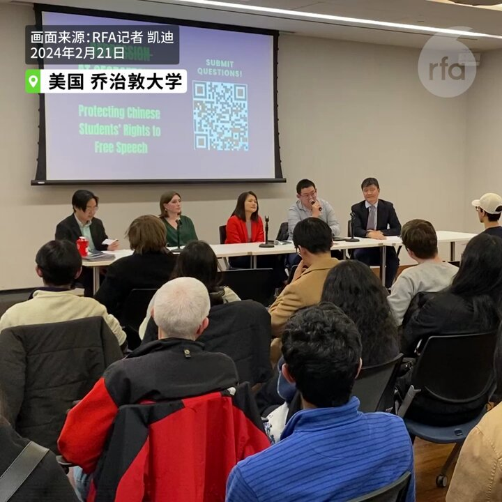  自由亚洲电台 北京时间 2024-02-24T12:26:46Z 1761246264295833890 RT @RFA_Chinese: 法新社：中国经济黯淡，年轻人对黄金的兴趣上升 https://t.co/emqeHCIC6N   自由亚洲电台 北京时间 2024-02-24T13:21:45Z 1761260100101042393 RT @RFA_Chinese: 【赖清德上台 两岸可能Game Over?】
【松田康博：台海周边对中国吓阻态势已形成】
【若中国攻台将是中美日的大规模战争】
#亚洲很想聊 完整视频： https://t.co/L9KNrapWoQ https://t.co/iUD28P76…   自由亚洲电台 北京时间 2024-02-24T12:12:26Z 1761242658586943742 RT @RFA_Chinese: 【赖清德上台 两岸可能Game Over?】
【松田康博：台海周边对中国吓阻态势已形成】
【若中国攻台将是中美日的大规模战争】
#亚洲很想聊 完整视频： https://t.co/L9KNrapWoQ https://t.co/iUD28P76…   自由亚洲电台 北京时间 2024-02-24T12:12:34Z 1761242689926766821 RT @RFA_Chinese: 【巨星不来中国开演唱会，歌迷只能看录像】
近日 #TaylorSwift 在日本巨蛋体育馆接连四晚开个唱，中国的 #霉霉 粉丝却只能前往电影院观看其提前录制好的演唱会视频。有网民猜测或与政治有关；更有官媒称泰勒.斯威夫特差别对待Instagra…   自由亚洲电台 北京时间 2024-02-24T12:16:03Z 1761243568113430698 RT @RFA_Chinese: 乔治敦大学中国留学生张津睿因参与“白纸运动”和其它人权活动，自己被其他中国留学生当面威胁，家人被中国当局恐吓，他曾在美国国会就此公开做证。如何抵制这种来自中国政府的骚扰迫害？他说，这是一个谁先胆小谁就输了的游戏。
#跨境镇压 #张津睿 
htt…   自由亚洲电台 北京时间 2024-02-24T10:03:58Z 1761210327713104005 【巨星不来中国开演唱会，歌迷只能看录像】
近日 #TaylorSwift 在日本巨蛋体育馆接连四晚开个唱，中国的 #霉霉 粉丝却只能前往电影院观看其提前录制好的演唱会视频。有网民猜测或与政治有关；更有官媒称泰勒.斯威夫特差别对待Instagram上的中日粉丝。Taylor会否成为继C罗和梅西以后的又一“辱华”巨星？ https://t.co/n4ZqFVLK2C 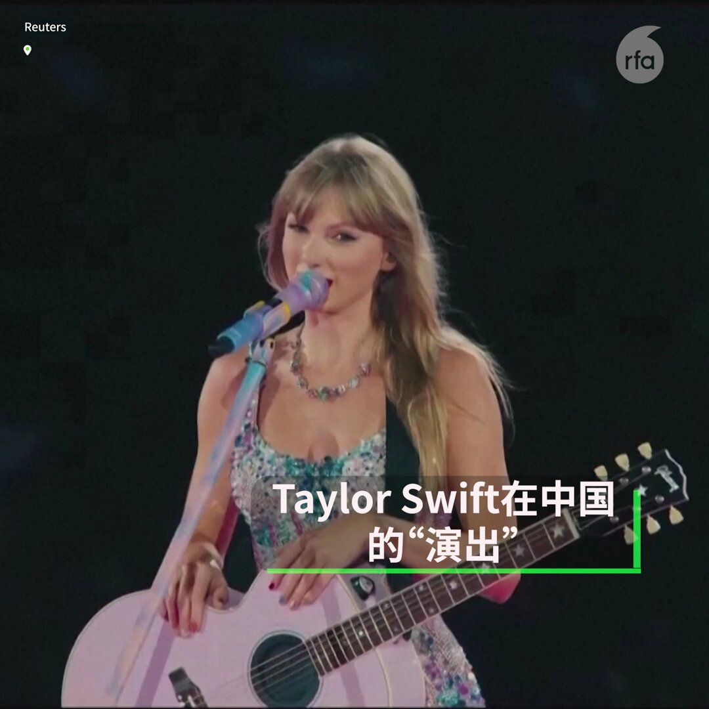  自由亚洲电台 北京时间 2024-02-24T06:19:26Z 1761153824050610501 有人说中国将因 #俄乌战争 导致国际地位下滑， 有人说中国是这场战争的最在赢家。#您怎么看？
 https://t.co/UQo6lrwfPt https://t.co/nc7a7c7nD2 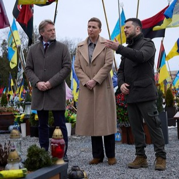  自由亚洲电台 北京时间 2024-02-24T06:22:39Z 1761154632506822924 评论 | #梅复兴： 美国2024年首度 #对台军售  的隐喻
https://t.co/h3R9SSHQZG https://t.co/gbqaVhQ77W 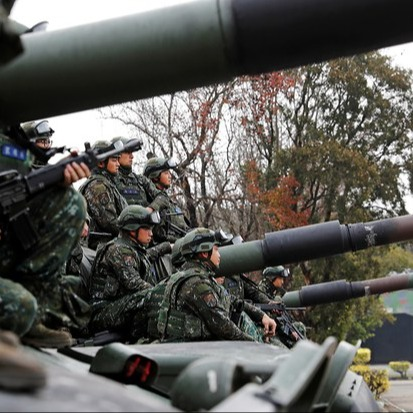  自由亚洲电台 北京时间 2024-02-24T06:25:01Z 1761155227129188554 太平洋岛国 #基里巴斯 的政府官员近日表示，该国已与中国警方开展合作，中国警员随后将在基里巴斯执法出勤。
有澳大利亚学者认为，警察是“很好的耳朵与眼睛”，#警务合作 将强化中国的境外管辖能力。
https://t.co/YswJxDLk7z https://t.co/mhGF62uteW 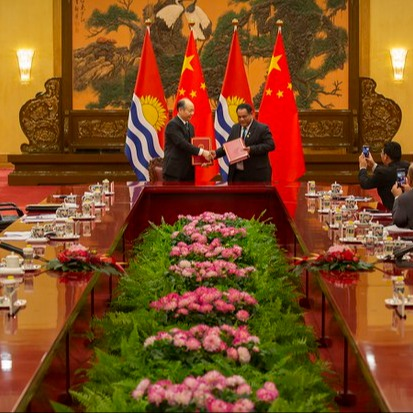  自由亚洲电台 北京时间 2024-02-24T08:22:01Z 1761184672971690063 【"韭菜"必读：中国证券市场的制度缺陷】
李小民回顾他将近20年的炒股经历，股市为他带来了当一个白领不可能赚取的财富。但是 #股市 未来的发展让他不再留恋，“‘亲自指挥’没有哪次成的，如果他英明神武另当别论，但是一次又一次验证，大家都看清了“。

https://t.co/GrHAov8R7j   自由亚洲电台 北京时间 2024-02-24T08:24:47Z 1761185366995042782 专栏 | #夜话中南海：#习近平 的"#两个确立 "脱胎于江泽民的十四届四中全会《决定》 https://t.co/8H8BrPQ3lN 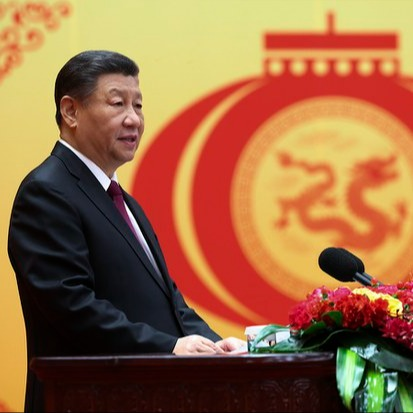  自由亚洲电台 北京时间 2024-02-24T08:27:08Z 1761185960874987752 俄裔中国近代史专家亚历山大-潘佐夫(Alexander V. Pantsov)曾先后撰写 #毛泽东、#邓小平 和 #蒋介石 的传记，认为这三人均想要取得更大的权力，成为近代史上的 #独裁者。但他同时表示，三人当中只有蒋介石到台湾后有所反思，改变执政路线，造就了台湾今天的民主和繁荣。https://t.co/jKabTqlLnj https://t.co/rk96yZON5E 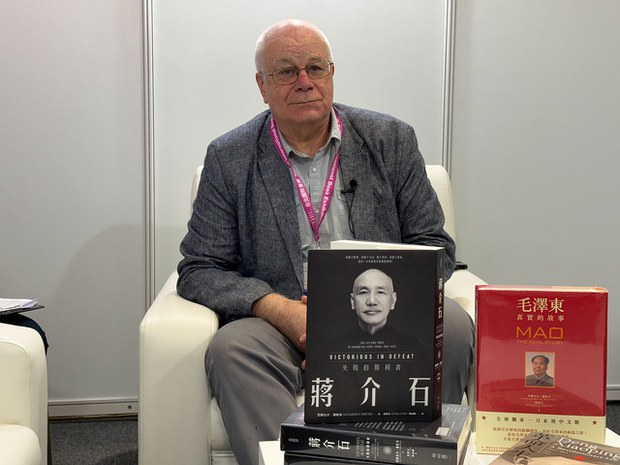  自由亚洲电台 北京时间 2024-02-24T08:29:27Z 1761186541001654489 欢迎收听和订阅播客【＃亚太报道】 https://t.co/MjLNSvVMqc
#贵州 百公里 #山火 蔓延；《#乌鲁木齐中路》导演陈品霖被起诉；四川百多藏人反对水坝工程遭抓捕；中国 #二手房价 全面下跌。 https://t.co/S6561ZmzBI 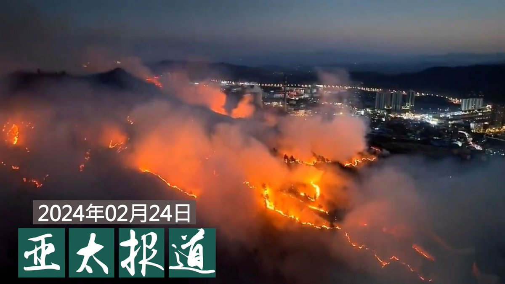  自由亚洲电台 北京时间 2024-02-24T04:33:59Z 1761127285506318745 近日，“超级队长vr党建”的帐号发文，表示推出红色骑行工具，通过VR进行党建学习，党员干部可以在虚拟现实的环境中，通过骑行的方式游览红色纪念馆、红色革命基地、红色文化展厅等场景，沉浸式地体验并学习党建文化知识。
您会使用该器材吗？ https://t.co/zMID55gvwJ   自由亚洲电台 北京时间 2024-02-24T04:38:51Z 1761128511115604106 “#白纸运动”期间，#陈品霖 与一位女性朋友在上海大规模抗议现场拍摄大量视频。在“白纸运动”一周年后，将拍摄的视频制作成纪录片《#乌鲁木齐中路》并上传到互联网，随后二人被中国警察抓捕。据悉，该女性朋友目前已经取保，但陈品霖仍被关押在上海市宝山区看守所。
https://t.co/I6uj13hEpw https://t.co/iDkAWOe3VR 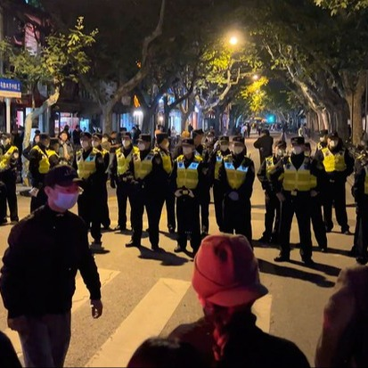  自由亚洲电台 北京时间 2024-02-24T04:53:40Z 1761132238593278327 欢迎收听播客 https://t.co/q3QLYQcxWD
“有行动，才有空间”：中国大使馆门前的抗争者 https://t.co/jhYAr0b0nD   自由亚洲电台 北京时间 2024-02-24T02:25:19Z 1761094904305070521 澳大利亚总理阿尔巴尼斯于2月20日宣布，该国将在未来十年投入111亿澳元用作增强海军战力。中、大型水面作战舰数量将会从目前的11艘增加至26艘。 但由于现役战舰老旧，新战舰又未来得及服役，该国将有5到10年的时间，会仅剩下9艘服役。 
这样能有效吓阻来自中国军事威胁吗？
#澳大利亚 #海军 https://t.co/D7DrJ4VWxP   自由亚洲电台 北京时间 2024-02-24T03:01:27Z 1761103998747324646 中国国家统计局周五公布的数据显示，一月份的全国二手住宅价格全面下跌，创近多年来最大跌幅。此外，中国1月份实际使用外资金额也同比下降超过一成，经济前景不容乐观。
#二手住宅价格 #外贸 
https://t.co/JHckFGM6BK https://t.co/bWZ0FLqmCj 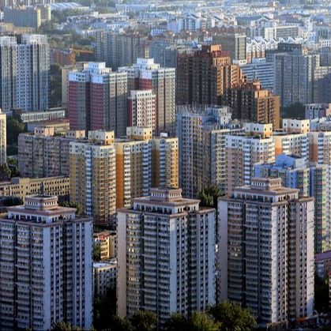  自由亚洲电台 北京时间 2024-02-24T03:53:48Z 1761117172049518926 #熊猫 又要外交了，#您怎么看？
https://t.co/cLu16XuaV1 https://t.co/S9ByGBThqv   自由亚洲电台 北京时间 2024-02-24T04:12:40Z 1761121918932189631 "上海女教师出轨十六岁学生遭停职"消息目前在中国网络引发热议。网友舆论多聚焦于事件中的"权力不对等"、"出于崇拜"等伦理或心理因素，但鲜少触及法律、道德等深层问题。那么，与未成年人发生"#师生恋"究竟应是伦理问题，还是法律问题呢？
#上海女教师出轨十六岁学生遭停职
https://t.co/zWZWn8QKtm https://t.co/ygmxzKc6tc   自由亚洲电台 北京时间 2024-02-24T00:41:15Z 1761068714978619716 【赖清德上台 两岸可能Game Over?】
【松田康博：台海周边对中国吓阻态势已形成】
【若中国攻台将是中美日的大规模战争】
#亚洲很想聊 完整视频： https://t.co/L9KNrapWoQ https://t.co/iUD28P762X 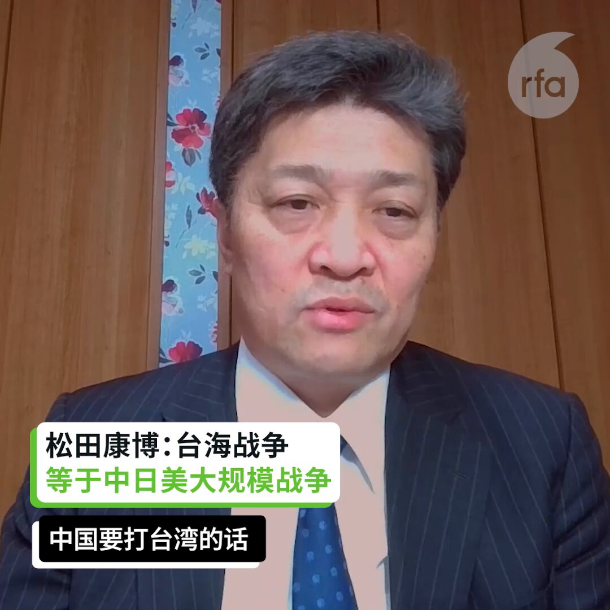  自由亚洲电台 北京时间 2024-02-24T01:26:21Z 1761080067260919887 近日发生的中国快艇在台湾金门海域翻覆事件，引发中方宣布对厦金海域实施“常态化巡查”。伴随事态逐渐升温，台湾对此应予以“冷处理”还是强硬捍卫主权？
#金门  #厦金海域 #常态化巡查
https://t.co/oPQui4ghkJ https://t.co/PUijDwTUW2 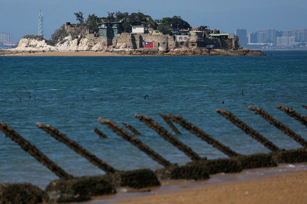  自由亚洲电台 北京时间 2024-02-24T01:51:20Z 1761086352379261202 【金沙江建水电站或毁六座寺庙　百多名藏人抗议被抓】 
达瓦才仁说：“中国政府先请寺院堪布（主管）和村长去开会，就把人抓起来。老百姓看到人有去不回，要求放人。现在听说青壮年都被抓走了，村庄围起来，被断网、断电，不让外人接触，藏人遭毒打。昨天消息是，那些人受到很残酷对待。” https://t.co/7MX4x9Aq7M 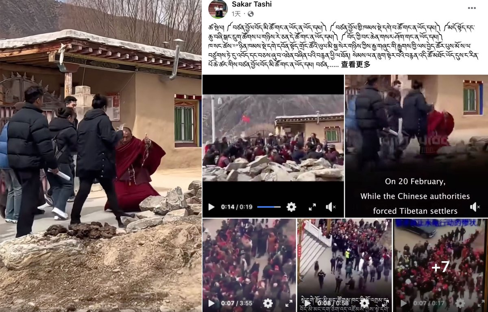  自由亚洲电台 北京时间 2024-02-24T02:08:14Z 1761090607551066457 乔治敦大学中国留学生张津睿因参与“白纸运动”和其它人权活动，自己被其他中国留学生当面威胁，家人被中国当局恐吓，他曾在美国国会就此公开做证。如何抵制这种来自中国政府的骚扰迫害？他说，这是一个谁先胆小谁就输了的游戏。
#跨境镇压 #张津睿 
https://t.co/upi4W066YH https://t.co/2fReNHgcJX 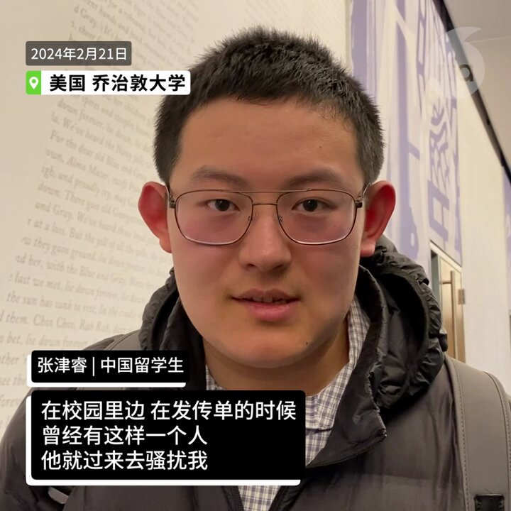  