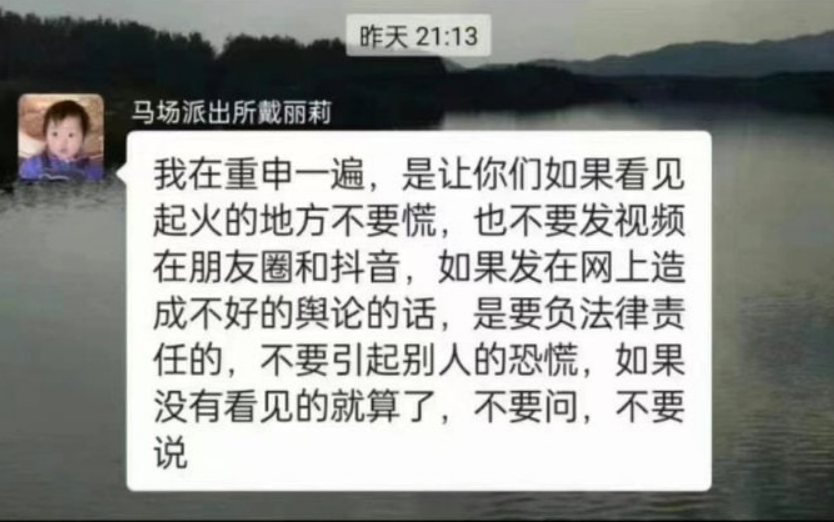
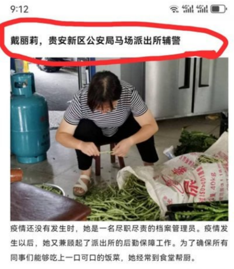
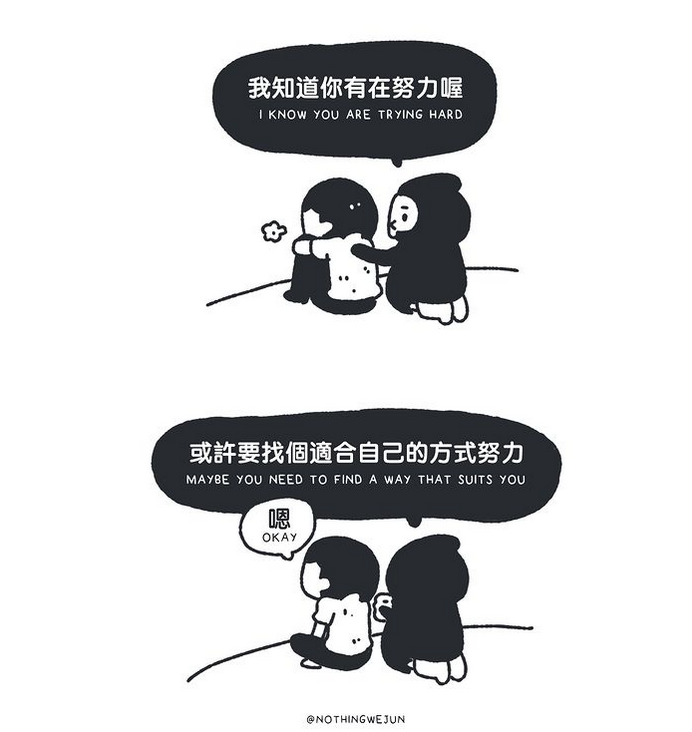
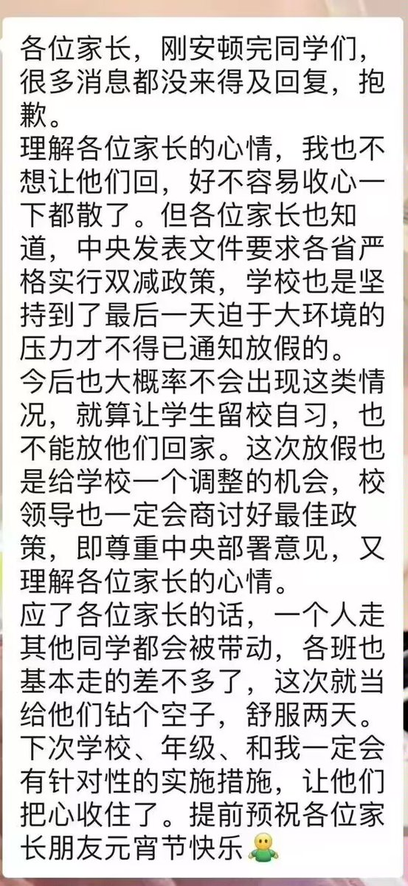

谁将十万横扫三江 北京时间 2024-02-24T18:47:02Z 1761341961200685191 一直以为从火灾里逃生只会出现在演习和视频中，没想到降临到自己身上，是这样的无助。
邻居敲响家门，我婆婆冲进我们房间喊失火了，我连着被子把孩子一把抱起就开始往外跑。慌乱中，扯了件衣服打湿水，捂住孩子口鼻。张总之前买了全家人的防火衣和防火面罩，跟我婆婆喊着赶紧拿出来!“来不及了，快跑吧!”一群人在门口催喊。
跑出家门，廊道已全是浓烟，一层楼的人无路可跑，跑进了最边上的一户人家里，好像这是此时最安全的地方。看着最迟跑进屋里的我们，他们说“你们快把衣服穿上，太冷了!”是的，我只穿了秋衣，光着脚就跑出来了，张总连裤子都没穿。看我抱着孩子，他们让我到床上，一个小女孩帮我盖好了被子。一个男同志随手抽出一条牛仔裤让张总穿上。一位老人打湿了不知道多少条毛巾，分给没捂口鼻的人。女同志在房间，男同志在外面想办法，打了好多桶水，但没看清往哪里泼了。一个女孩看着窗外说火好像烧上来了，怎么办呀。
“快跑!火烧上来了!来不及了!”男同志冲进来让大家赶紧跑。各家带着自己的人往门外冲。我抱着孩子起身穿上别人的鞋就开跑，爸爸一把从我手里抱走娃，我让他一定捂好孩子口鼻。他让我和他妈跟上。
楼道里有别人跑掉的拖鞋，个别年纪大的靠在墙壁跑不动了，每层楼道都有人到窗边借风透气。我们往下跑了四五楼，堵住了。楼下的浓烟已经完全遮住视线，呛得人无法呼吸。人群喊着底下烟太大，下不去了。大家议论起来，摸不着头脑，不知道到底怎么办。“没有个消防来指导我们该怎么办吗!”一位大叔生气地喊着。
我拉着一家人说，我们还是上去吧，这里烟太大。于是我们又开始往上爬，爬了两楼，我们都不行了，找了个烟小的窗边把头探出去，我一直觉得我们能好好的，这时泄气地说了声“感觉不行了”。张总说快把小孩抱着，我抱不动了，我婆婆赶紧接过孩子，他随后就瘫在墙边。他一直捂着孩子口鼻，但自己无暇顾及。
就在这里，我们哪儿也去不了，我抱着孩子坐在墙角，脑子里一片空白。还有几个人也跟我们一样选择了哪儿也不去。一个阿姨说，他老公早就跑到一楼去了，她没跑成，说着说着要哭了。一对老夫妻，两人都戴着夹了湿纸的口罩，倒是很乐观，说这里烟小，火可能灭了，一会儿应该没事了。有个阿姨抱着孩子跑上来了，满脸熏得黢黑，说一开始躲在别人家里，后来烟大出来了，她还有个大女儿，分头跑了。说完，抱着孩子又往楼下跑了。上上下下很多人，张总看到往下跑的人，逮住机会就说“能不能留个号码，如果底下能跑得出去，麻烦打我电话。”大家都留了号码，但后来没有人打过来。期间，只有住在对面楼的闺蜜打了电话，问我们跑出来没。过了一会儿，楼道里就剩我们几个人了，出奇地安静，一个老人在楼下过道不停喊着“人呢，救命啊。”我们都听见了，但没人敢回应。
张总拨通119的电话，消防员找到了我们，告诉我们底下7楼烧得严重，烟大，楼上20多楼也烧起来了，让我们就留在这儿。然后救命稻草一样的人就走了。在窗边的我们，吹着零下的风，我抱着孩子，双腿露在外面，冷得麻木，一个带着孩子的妈妈把他孩子的羽绒外套披在了我的腿上。就这样，感觉过了好久。
“底下能走了，可以下去了!”不知道谁喊了一句。于是大家赶紧动身，我把那件孩子的羽绒外套还给阿姨，她说“没事，你抱孩子，冷。”我还是给她了，说你也有孩子。然后，我们就跑散了。
跑到地下车库了，张总说“终于安全了，你抱孩子在这儿等我，我去开车。”我一个人抱着娃蹲下，拿开捂口鼻的湿衣服，看着娃不哭不闹，才忍不住流下了眼泪。
离开小区，天还没亮，我找到我的手机，得空看了眼时间，还不到6点。我们那幢楼还在烧着..
（居民火灾经历）   谁将十万横扫三江 北京时间 2024-02-24T19:02:29Z 1761345851287584778 中国贵州警察恐吓群众，不允许自由发布关于贵州火灾的真实信息 https://t.co/H06nqDUwV6   谁将十万横扫三江 北京时间 2024-02-24T19:35:58Z 1761354277199749174 RT @SnowFlakeZero: 共产主义者在民族问题上唯一正确的立场是反对一切民族压迫，同时坚决反对一切民族主义，包括被压迫民族的民族主义

举个例子，大陆的共产主义者应该坚决捍卫台湾民族自决的权利，坚决反对武统台湾，反对中特的民族主义，台湾共产主义者应该坚决对抗民进党的…   谁将十万横扫三江 北京时间 2024-02-24T18:15:04Z 1761333917834244543 要我说中国教育里最彻头彻尾的谎言就是“努力读书才能以后不过得辛苦”。哪怕在学生时代，也不见得每个老师家长都相信高考是最公平的选拔方式，但“努力读书才能过得轻松”却一直是绝对的铁律。老师们天天在讲台上耳提面命，对台下说要想以后过得好先要大学考得好，提高一分干掉千人，都给我努力学起来！就连一学期难得拿两节课给学生们放个电影放松一下，选片都得是《当幸福来敲门》才行。

台下不具有被开除潜质的学生都信这套。听话的学生认这理，于是他们每天早上六点半爬起床七点出头就坐进教室扯开嗓子读书，一直学到十点半晚自习结束，回家时都还要往包里塞上两本书。不听话的同学其实也认这理，他们几乎每次从网吧回来，都会让身边同学监督自己，明天一定不再逃晚自习。

总有听话学生考上好大学，然后他们就会成为“通过努力获得回报”的典型例子，被老师一届一届传唱下去。对于中学老师来说故事讲到这里就差不多结束了，但对这些听话的勤奋学生来说，故事还远没有结束。

这些以前的勤奋学生过上了那种一直被社会推崇的正确的标准生活：考个好大学，再找个好工作。他们找了有头有脸的工作，去了投行去了政府去了研究所和明星互联网企业。他们继续过着早上七点出门晚上十点到家的生活，但这时身边已经没人再提及他们从小被许诺能够得到的“轻松”。他们自己也倾向于不去对比晚自习下课时间和下班时间，不去想是不是自己一直过着以前认为只会是“暂时”的辛苦生活。

终于他们中的一部分人开始忍受不了这样过下去，这些人在网上发帖抱怨，说听说以前的街溜子同学在老家当了健身教练，虽然每个月赚的不多但好像过得还挺开心，为什么我一直都过得这么累？这时候另一部分人就会在底下回复说，你别看他现在日子轻松，等到他老了该领退休工资时你就知道了！   谁将十万横扫三江 北京时间 2024-02-24T07:20:21Z 1761169150297387295 网友投稿：江苏连云港很多学校都是无视学生休息日的，本来这周市里面有文件要学生多休息，最后还是学生打市长热线闹的才给双休 https://t.co/Y0ZFRWAh4J   谁将十万横扫三江 北京时间 2024-02-24T08:05:18Z 1761180464126239018 RT @whyyoutouzhele: 网友投稿
《如此打工三十年》西安半坡版
网友Enzo实地探寻过年期间的西安半坡劳动力市场，聚焦西安底层高龄劳动者的生存现状 https://t.co/Uzvl8otqAO   