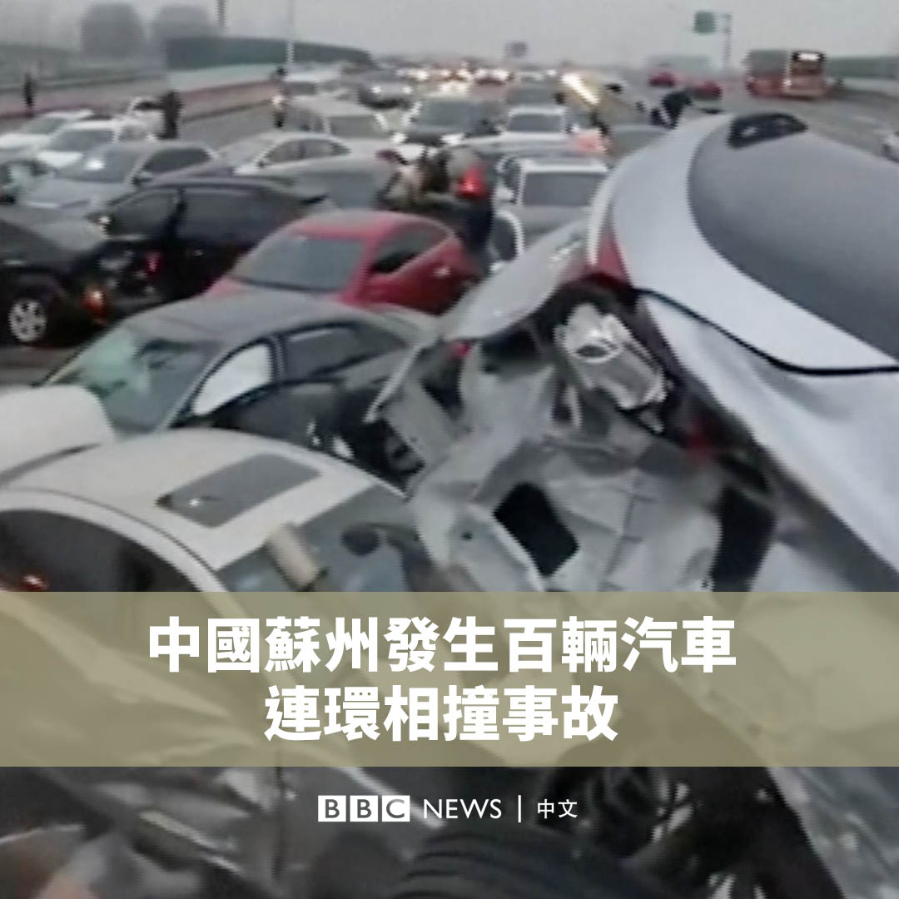
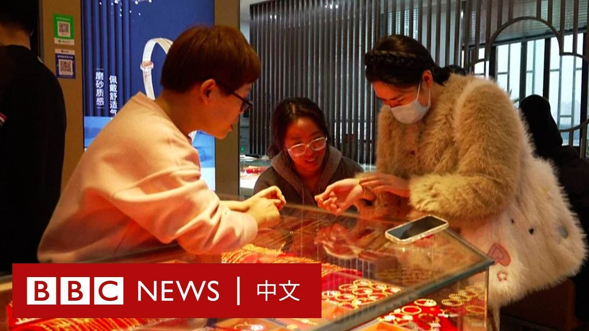
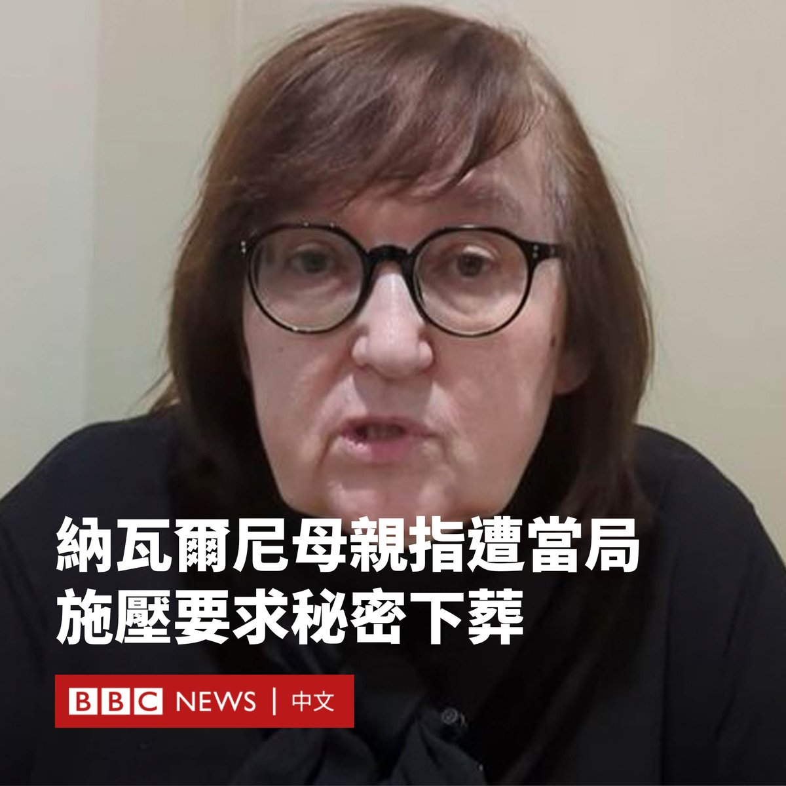

D英国广播公司BBC 北京时间 2024-02-23T17:15:47Z 1760956609352663271 近日在互联网上流传的外泄文件显示，一家名为安洵的中国网络安全公司声称其有能力黑入英国外交部和其他多国的政府机构。
https://t.co/xIg4Yy2AXk   D英国广播公司BBC 北京时间 2024-02-23T15:33:35Z 1760930891961110979 中国东部苏州市的一条高速公路因结冰，发生大量汽车连环相撞事故。警方表示，事故造成至少9人受伤。

现场影片显示，路上有许多汽车堆叠在一起，有汽车甚至被顶在空中。当地媒体报道称，相撞的汽车多达100辆。

过去几周，中国大部分地区遭受寒潮、暴风雪和冻雨袭击，导致多地交通受阻。 https://t.co/3LH4987r2h   D英国广播公司BBC 北京时间 2024-02-23T14:05:49Z 1760908804399796306 近年来全球黄金价格持续走高，高企的金价非但没有冲淡中国消费者的购买热情，甚至引发了年轻人的“黄金热”。

后疫情时代中国经济复苏乏力，年轻人的消费观也变得更加谨慎。被视为“保值”资产的黄金产品因此成为时下年轻人的理财新宠。 https://t.co/Jzk8dVXLEa   D英国广播公司BBC 北京时间 2024-02-23T11:50:56Z 1760874858458890705 在狱中死亡的俄罗斯前反对派领袖纳瓦尔尼（Alexei Navalny）的母亲表示，她已经看到了儿子的尸体，但俄罗斯当局向其施压要求“秘密”下葬。

纳瓦尔尼的母亲柳德米拉·纳瓦尔纳亚（Lyudmila Navalnaya）通过一段影片表示，她已被带到太平间，并在那里签署了死亡证明。

纳瓦尔尼的新闻秘书表示，他的母亲收到的一份医疗报告称，他死于自然原因。但纳瓦尔尼的遗孀表示，他是被俄罗斯当局杀害的。

纳瓦尔纳亚表示，俄罗斯法律要求官员交出遗体，但她被“要挟”了。她声称当局正在为她儿子的下葬设定条件，包括下葬地点、时间和方式。

“他们想把我带到偏僻的墓地，去一个新挖的坟墓，然后说：‘你的儿子就躺在这里。’”

六天前，在儿子于北极圈以内的监狱中过世的消息传出后，纳瓦尔纳亚前往俄罗斯北部城镇萨列克哈德。

此前，她曾被拒绝接触儿子的遗体，周二，她向俄罗斯总统普京（Vladimir Putin）请求允许她入殓安葬儿子。

但纳瓦尔纳亚周四表示，她受到了当局的威胁。她说：“他们看着我的眼睛说，如果我不同意秘密葬礼，他们就会对我儿子的尸体做点什么。”

她称当局人员告诉她：“时间对你不利，尸体正在腐烂。”

俄罗斯当局尚未对此作出回应。   D英国广播公司BBC 北京时间 2024-02-23T09:35:09Z 1760840689825296867 尽管全球已逐步走出新冠疫情，但世卫组织估计至少有6500万人仍在与“长新冠”作斗争，即在感染新冠病毒后持续出现或出现新的症状。然而，如何确诊“长新冠”却一直是一个难题。

英国科学家认为，他们已经找到了有价值的新证据，可以帮助诊断和治疗“长新冠”患者。https://t.co/I8JzDx9c7C   