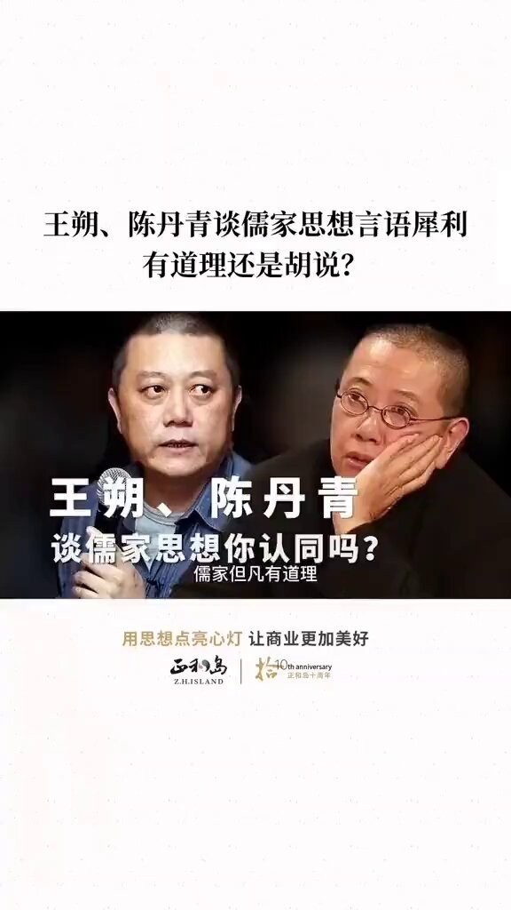
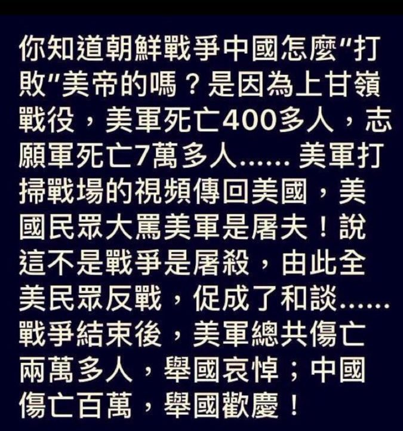
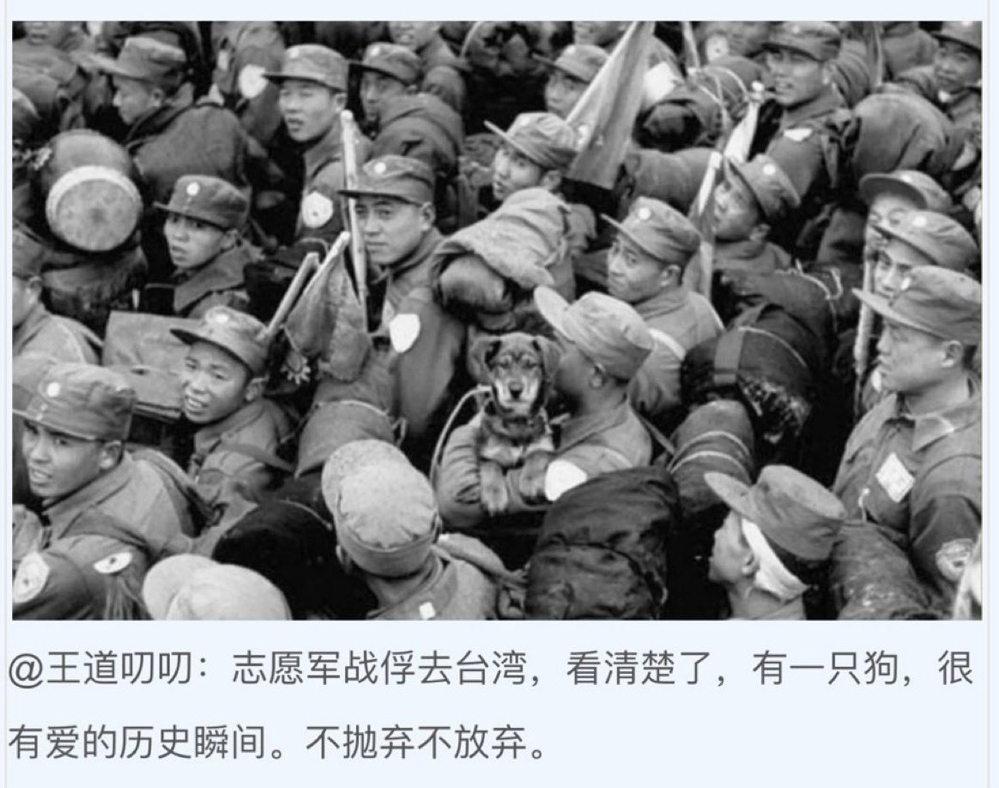

Ivy未央 北京时间 2024-02-23T12:48:03Z 1760889232908849292 王朔陈丹青对孔儒的看法。孔儒是几千年中国专制体制的精神内核，披着仁义礼智的外衣，维护纲常礼教的专制体制；要求老百姓温柔恭俭让，方便君王统治。之所以历代君王尊孔敬儒，就是因为儒学是维护专制体制的精神鸦片
任何没有自由平等和人权的社会政治学说都是异端学说。 https://t.co/koIy3d5H6J   Ivy未央 北京时间 2024-02-23T09:16:36Z 1760836018536624326 回顾一下朝鲜战争后的中朝关系：1958年，金日成清洗亲中国党员，中国“志愿者”也被赶回国。1967年，志愿军墓地被毁，毛岸英的墓碑也被砸了。1992年中国和韩国建交，朝鲜就在中国边境集结大军，威胁要和台湾建交。1993年北京申奥，朝鲜还投给了悉尼。中国每年给朝鲜提供食物、能源和数十亿美元援助，结果朝鲜军队还越境抢劫杀人。
中共可曾悔过了吗？难道不是牺牲几十万中国人换来一个白眼儿狼吗？   Ivy未央 北京时间 2024-02-23T09:55:06Z 1760845708381262227 朝鲜战争中，约有2万志愿军战俘，战争结束后，约1.4万去了台湾，返回大陆的志愿军战俘只有6000余人，原本有2900多人为共产党员，绝大多数都被开除了党籍，大部分战俘被遣返回乡并在档案中注明“控制使用”，有一些因为“特务”罪名被判刑。文革爆发后，相当多战俘受到批斗迫害。 https://t.co/I5FA2gBgW8   Ivy未央 北京时间 2024-02-23T09:55:35Z 1760845828908794200 RT @Ivy01011: 陈丹青关于艺术的大实话，这是不少人喜欢他的原因吧？ https://t.co/aNrIFLP78l   Ivy未央 北京时间 2024-02-23T09:55:39Z 1760845844855591085 RT @Ivy01011: 你敢烧掉你手中的美国绿卡，我就相信你是爱国的

 你敢把孩子送到朝鲜去留学，我就相信你热爱社会主义

 你敢公布所有官员财产，我就相信你真反腐

 你敢把选票发给全国人民，我就相信你为人民服务…   Ivy未央 北京时间 2024-02-23T09:56:01Z 1760845937977553035 RT @Ivy01011: 揭秘朝鲜战争中共五大谎言，朝鲜战争给中国人民带来唯一而巨大的贡献是什么？ https://t.co/HcvEEJKSo7 https://t.co/hqC5cEjfmA   Ivy未央 北京时间 2024-02-23T09:56:03Z 1760845946877861950 RT @Ivy01011: 回顾一下朝鲜战争后的中朝关系：1958年，金日成清洗亲中国党员，中国“志愿者”也被赶回国。1967年，志愿军墓地被毁，毛岸英的墓碑也被砸了。1992年中国和韩国建交，朝鲜就在中国边境集结大军，威胁要和台湾建交。1993年北京申奥，朝鲜还投给了悉尼。中…   Ivy未央 北京时间 2024-02-23T09:56:07Z 1760845964569432125 RT @Ivy01011: “虽然成功率只有5000分之一，不过却是唯一能打败敌人的希望”。这是传奇将军麦克阿瑟力排众议说的一句话
70年前今天麦将军指挥美军发起了著名的仁川登陆，一举扭转朝鲜战局，拯救了韩国同时歼灭了朝鲜主力部队包括林彪四野调派给朝鲜的三个朝鲜族师
麦克阿瑟后…   Ivy未央 北京时间 2024-02-23T10:00:44Z 1760847125682725243 转）朝鲜中学历史教科书上的朝鲜战争：美帝国主义出动400万军队悍然侵略朝鲜，被英勇的人民军击败，不得不主动提出停战谈判。人民军仅靠4门大炮和一个中队就顶住了美军5万多兵力、300艘军舰和1000架飞机的进攻长达3天。当然，没有中国啥事，一句不提志愿军。粉红知道后惊讶吗？ https://t.co/lXH5xadw22   Ivy未央 北京时间 2024-02-23T08:21:25Z 1760822130931839149 陈丹青关于艺术的大实话，这是不少人喜欢他的原因吧？ https://t.co/aNrIFLP78l   Ivy未央 北京时间 2024-02-23T08:31:24Z 1760824643416363066 你敢烧掉你手中的美国绿卡，我就相信你是爱国的

 你敢把孩子送到朝鲜去留学，我就相信你热爱社会主义

 你敢公布所有官员财产，我就相信你真反腐

 你敢把选票发给全国人民，我就相信你为人民服务

                                                        ——陈丹青 https://t.co/fjJXLYbr97   Ivy未央 北京时间 2024-02-23T09:09:41Z 1760834278336688632 揭秘朝鲜战争中共五大谎言，朝鲜战争给中国人民带来唯一而巨大的贡献是什么？ https://t.co/HcvEEJKSo7 https://t.co/hqC5cEjfmA   Ivy未央 北京时间 2024-02-23T00:21:32Z 1760701366593323095 RT @Ivy01011: 莫言这段说的好！
莫言说他的作品会让中共当局不高兴

人死后真的会有地狱吗？
莫言：不用死后，你活着就能看到地狱。

真正可怕的坏人是那些不知道自己坏，反而认为自己正确，认为自己很好的人，他们没有良心，却挥舞着良心的大棒打人，他们没有道德，却始终占据…   