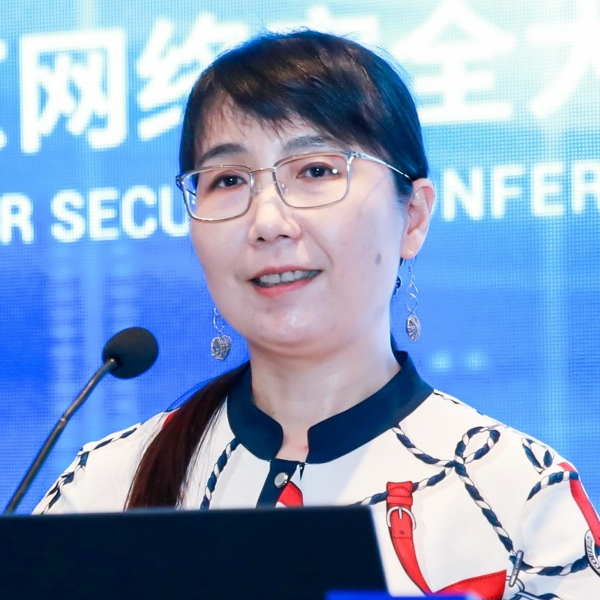

拆墙运动公号 北京时间 2024-02-23T01:36:38Z 1760720265158238623 【 #2259专案组 互联网防火墙第127号嫌犯 #谢玮】    性别：女
身份证: 
北京市市辖区海淀区
手机/微信/支付宝/QQ: 
地址：
职务：中国信息通信研究院安全研究所副所长
地址: 

官网：https://t.co/LZ1NK8udKm
详细资料见: #BanGFW拆墙运动（建墙罪犯录）：https://t.co/lxiWGHinkC

中国信息通信研究院网络安全与国际治理领域主席，安全研究所副所长。长期在网络信息安全、互联网等领域从事科研和技术创新工作。

入选科技部国家科技库专家，工信部高级职称评审专家等。负责并参与了大量国家网络信息安全科研专项（863、国家重大专项等）以及国家网络信息安全支撑科研课题，作为核心人员参与了我国通信行业网络安全防护技术体系和监管管理机制的构建；还完成了信息通信领域大量网络与安全相关国际、国家和通信行业技术标准制定工作。

中国信息通信研究院
电话：
电 话 ：
传 真 ：
Email：
地 址 ：
邮 编 ：10019

战略合作伙伴：1、中共恶人榜：#ccpevils               
    2、#zhinawiki   