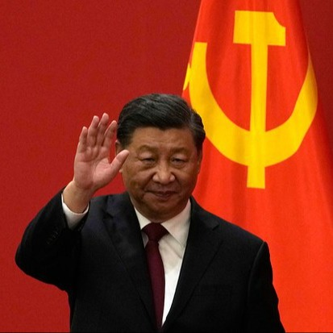
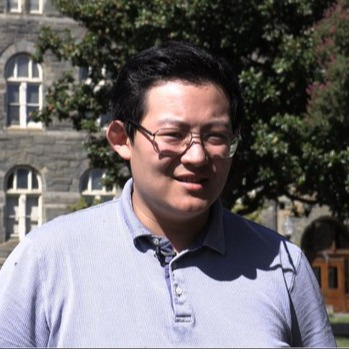
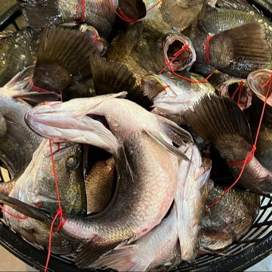
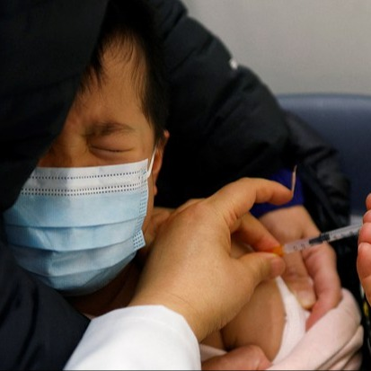
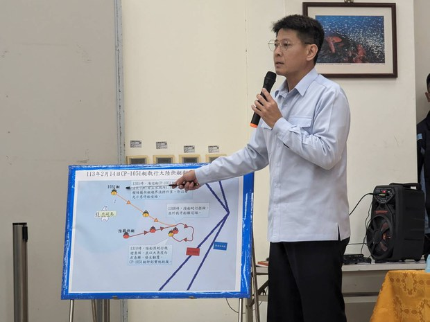

自由亚洲电台 北京时间 2024-02-23T11:43:56Z 1760873098688303269 【独家：四川藏人抗议水坝项目 超过百人被捕】
四川甘孜藏族自治州德格县汪布顶乡藏族民众近来多次走上街头，抗议当地金沙江上修筑岗托水电站的计划，却遭遇当地政府大规模抓捕。
据本台藏语组报道，当地藏民抗议水电站的原因是这一建设计划将摧毁包括含有可追溯到13世纪的古壁画在内的六座寺庙，并且有2000人居住的两个村庄将不得不搬迁。有超过100位参加抗议的藏族僧侣和其他民众陆续被当地政府抓捕。 https://t.co/w93mMbg5qj   自由亚洲电台 北京时间 2024-02-23T11:52:26Z 1760875234897633289 四川甘孜藏族自治州德格县汪布顶乡藏族民众近来多次走上街头，抗议当地金沙江上修 #筑岗托水电站 的计划，却遭遇当地政府大规模抓捕。
https://t.co/zrUST8khc5 https://t.co/lnpJZGVwo0   自由亚洲电台 北京时间 2024-02-23T12:14:12Z 1760880712733868115 台海冲突加剧，中国海警舰队规模有多大？｜兵家常事 https://t.co/F1v28AW2BF via @YouTube   自由亚洲电台 北京时间 2024-02-23T09:27:18Z 1760838714476118440 【#变态辣椒：过命的交情】
俄罗斯总统普京向朝鲜领导人金正恩赠送了一辆豪华轿车，称其为"俄国的罗尔斯-罗伊斯"。自2023年普金峰会以来，朝鲜与俄罗斯这两个冷战时期的老盟友加深了双方在军事、政治、经济及文化方面的联系，据信平壤在俄罗斯与乌克兰的冲突中向俄罗斯提供了军火。
#普京 #金正恩 https://t.co/LNe0NcV6Py   自由亚洲电台 北京时间 2024-02-23T09:31:39Z 1760839808203804785 专栏 | #纵横大历史：文革系列　第八十讲 大串联（三） https://t.co/qeBrE7VSmi https://t.co/gYrpNNre41   自由亚洲电台 北京时间 2024-02-23T09:33:38Z 1760840305572778425 中共中央港澳办主任夏宝龙2月22日到香港展开为期七天的考察调研。
近年香港经济和民生陷于困局，所谓"唱衰"香港的声音此起彼伏。外界相信，夏宝龙此行是要"对症下药"，但有分析认为，随着"两制"逐步消失，香港要脱困谈何容易。
#夏宝龙 
https://t.co/L7pxko762G https://t.co/zjHyJL5bPr   自由亚洲电台 北京时间 2024-02-23T09:41:37Z 1760842315789471747 加拉格尔提到王沪宁著作《美国反对美国》聚焦美国社会内部的冲突。他说，中国在美、台及世界各地试图分化盟友及自由世界，他非常确信这个策略是失败的：“我们站在一起，这是(中共)失败的明证。无论是民主党还是共和党人、蓝或绿、台湾人民和美国人民团结起来反对专制的侵略。”
https://t.co/ZBP3b5sVCW https://t.co/gwgzacS4NR   自由亚洲电台 北京时间 2024-02-23T10:00:04Z 1760846958858764525 【专栏 | 中国透视：和平共处时代的终结】  
身处当代，很多人都有一种惶惶不安的感受。安静祥和的日子已经一去不复返了。为什么会有这种感觉呢？我们今天来梳理一下它的来龙去脉。
https://t.co/5AAxhVlGXL https://t.co/RYFIv5w2K7   自由亚洲电台 北京时间 2024-02-23T06:30:21Z 1760794182267126135 近日，人权组织及美国主流媒体相继披露多起中国当局实施跨国镇压，威胁和骚扰在美留学生的事件。而如何保护在美中国留学生的言论自由，也成为广受舆论关注的话题。本周三，位于华盛顿的乔治城大学亚裔美国学生联合会就此举行了研讨活动。
https://t.co/upi4W066YH
#跨国镇压 #胁迫 #张津睿 https://t.co/CtKUfj0G5U   自由亚洲电台 北京时间 2024-02-23T06:31:07Z 1760794373258629173 据新华社报道，中国野生动物保护协会日前分别与西班牙马德里动物园和美国圣迭戈动物园就新一轮大熊猫国际保护合作事宜达成一致，并签署了合作协议。目前正与美国华盛顿国家动物园和奥地利美泉宫动物园就新一轮合作进行磋商。中国外交部发言人毛宁在2月22日的例行记者会上说，期待同有关国家的新一轮大熊猫国际保护合作，将进一步拓展大熊猫等濒危物种保护科研成果。

在此前几乎召回所有借给美国动物园的的大熊猫后，中国再次计划将更多大熊猫送往美国，您怎么看？   自由亚洲电台 北京时间 2024-02-23T06:31:29Z 1760794465764249962 人权律师陈闯创位于洛杉矶丁胖子广场附近的办公室于2月21日遭遇了不明身份人士的袭击。而在当天下午，一条针对他的信息在当地华人微信群中被广泛转发。
#陈闯创 @1957spirit https://t.co/HLfv8ZiuWB   自由亚洲电台 北京时间 2024-02-23T06:40:19Z 1760796689492058547 【抵制美国校园里的中国跨境镇压】
2月21日，美国华盛顿乔治城大学亚裔美国学生联合会就如何保护在美中国留学生的言论自由举行研讨活动。 https://t.co/H5lSEPudfA   自由亚洲电台 北京时间 2024-02-23T06:43:28Z 1760797482970403305 欢迎收听和订阅播客【＃亚太报道】 https://t.co/MjLNSvVMqc
#上海安洵 公司疑似外泄黑客文件；#加拉格尔 点名警告习近平；中国重点限制四类人出境；人权律师 #唐吉田 难别病逝女儿；#台湾海巡署 说明中方船只 #金门倾覆事件。 https://t.co/jJfVF9Jj4a   自由亚洲电台 北京时间 2024-02-23T07:00:10Z 1760801683905667302 美中战略竞争日趋升级之际，#人工智能 也成为两国既竞争又呼吁要相互合作的领域之一。对此，美国是如何看待并处理这样的关系呢？
https://t.co/3c5uTJPy6c https://t.co/pgH4OWpbMv   自由亚洲电台 北京时间 2024-02-23T07:30:01Z 1760809199188181158 专栏 | #绿色情报员：上桌之前（上）— 弓鱼的躺平运动
https://t.co/4Wx02ra87t https://t.co/5lrlVov3Ws   自由亚洲电台 北京时间 2024-02-23T08:22:29Z 1760822399979696564 RT @RFA_Chinese: 【著名独立记者高瑜: 最好中国能出现蒋经国 开放党禁报禁后走向民主 | #观点】
#高瑜 表示：中国目前的新闻媒体环境犹如寒冬。中国新闻自由的真正出路，必须是政治制度改变。最好中国能出现一个 #蒋经国，开放党禁报禁后走上民主——但我现在看不出来…   自由亚洲电台 北京时间 2024-02-23T08:23:25Z 1760822635884118179 RT @RFA_Chinese: 据新华社报道，中国野生动物保护协会日前分别与西班牙马德里动物园和美国圣迭戈动物园就新一轮大熊猫国际保护合作事宜达成一致，并签署了合作协议。目前正与美国华盛顿国家动物园和奥地利美泉宫动物园就新一轮合作进行磋商。中国外交部发言人毛宁在2月22日的例…   自由亚洲电台 北京时间 2024-02-23T04:21:33Z 1760761769348444339 法新社：中国经济黯淡，年轻人对黄金的兴趣上升 https://t.co/emqeHCIC6N   自由亚洲电台 北京时间 2024-02-23T04:37:47Z 1760765851224142304 评论｜#魏京生：什么样的 #民主 更适合中国（之一） https://t.co/A0IMB0j2sx @WEI_JINGSHENG https://t.co/r9J3G0Zzvv   自由亚洲电台 北京时间 2024-02-23T02:50:56Z 1760738963839668404 专栏 | #军事无禁区：威慑与承诺－传美国5艘航母部署西太平洋 https://t.co/qChze0MhaU   自由亚洲电台 北京时间 2024-02-23T03:16:36Z 1760745422522601625 近日，与中国政府部门合作的上海安洵资讯公司（I-SOON）疑似外泄遭网络黑客窃取的资料信息。有学者认为，相关内容详细展示了中国当局用于监视海外异见分子、黑客入侵其他国家以及在社交媒体上推广亲北京叙事的方法。
”https://t.co/Nq47UiBU9D https://t.co/BGOa9etz7j   自由亚洲电台 北京时间 2024-02-23T04:07:14Z 1760758165736755485 “#Sora 可能被中国用来在台湾，乃至于美国，生成非常令人信服的假新闻和错误资讯。它可能会加剧目标国家的社会和政治分裂。"美国智库兰德公司（RAND Corporation）国际防务高级研究员何天睦（Timothy Heath）在接受本台记者采访时警告说。
https://t.co/xUl5Ws100v https://t.co/LVb76kehyn   自由亚洲电台 北京时间 2024-02-23T00:35:00Z 1760704752734851458 两千多名中国新冠疫苗受害者将派出代表，在2024年全国两会现场提交《呼吁建立“新冠疫苗伤害保障救助机制”倡议书》和2656份受害者名单。
#新冠疫苗 #新冠疫苗受害者
https://t.co/o3tPn3QptL https://t.co/MvwTVTNEju   自由亚洲电台 北京时间 2024-02-23T01:48:53Z 1760723348655591494 大陆“三无快艇”生还者 在 #央视翻供
看台湾海巡署怎么说 https://t.co/UrLzqTLJru https://t.co/l7M0Y2CU9w   