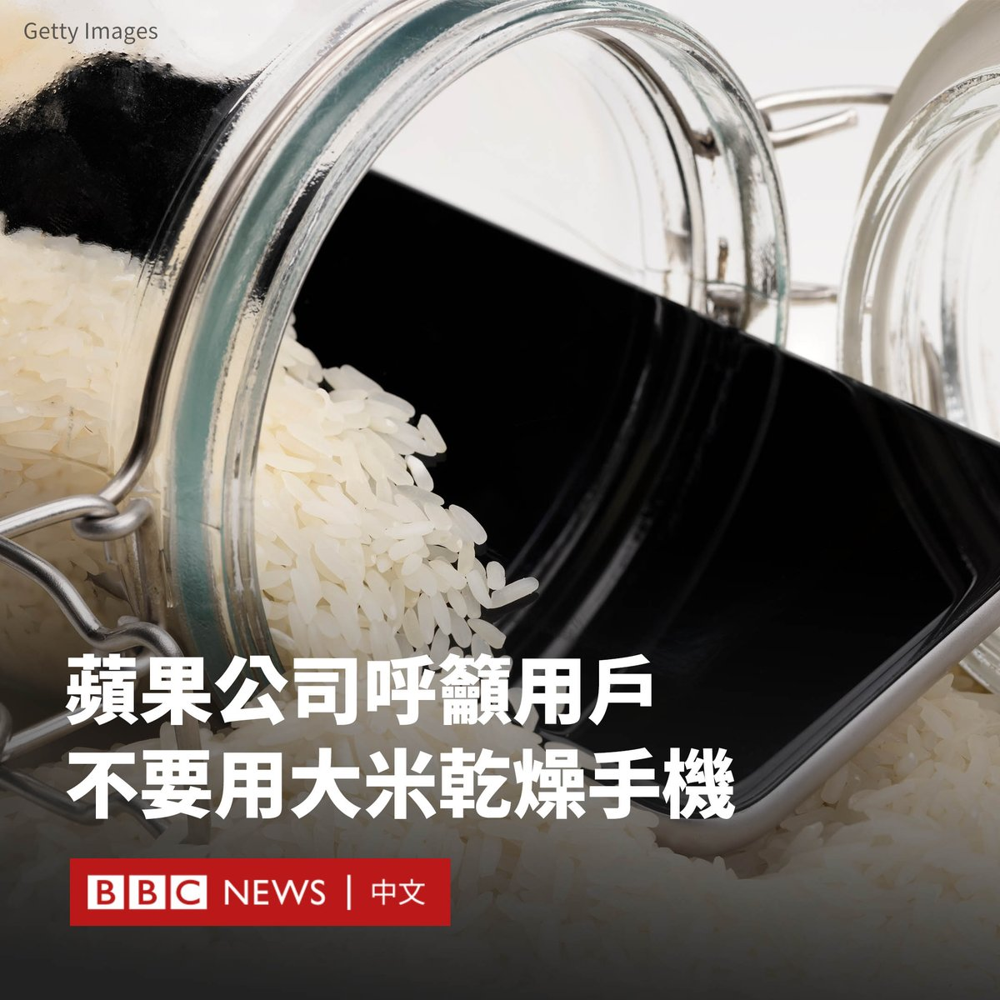

D英国广播公司BBC 北京时间 2024-02-22T13:18:51Z 1760534594741277059 俄罗斯入侵乌克兰已经两年，双方都付出了惨重的代价，但目前却看不到战火会很快停止的迹象。我们来看看迄今为止战场上发生了什么，以及这场冲突未来可能的走向。https://t.co/nnUN90nGxk   D英国广播公司BBC 北京时间 2024-02-22T11:51:11Z 1760512535663673642 苹果公司（Apple）建议，如果你的iPhone进水，不要将其放入米桶中进行干燥。

尽管这种网络上广传的方法很受欢迎，但该公司表示，用户这样做可能导致较小的米粒损坏设备，测试也显示其未能起到作用。

苹果公司指，用户应该轻轻敲打机身，将iPhone的连接器朝下，以甩掉多余的液体，然后将其放置在通风的地方。

除了避免使用米桶外，苹果还建议不要使用“外部热源或压缩空气”来烘干手机，这意味着应避免使用暖气和吹风机。

此外，它建议用户不要尝试将“异物，如棉花棒或纸巾”插入手机中。

网站MacWorld指出，随着智能手机的设计不断改进，手机设备变得越来越能够承受水浸，意味着这些建议都将变得不必要。

从iPhone 12开始，所有苹果设备都能够承受在六米深的水中浸泡半小时。   D英国广播公司BBC 北京时间 2024-02-22T09:08:56Z 1760471703728107742 两名台湾网红在柬埔寨开直播声称在诈骗园区内被绑架殴打，后来遭揭发是自导自演，当地警方迅速逮捕两人并控以煽动制造社会动乱罪，判刑两年。

该事件震动了柬埔寨的领导层，前首相洪森及现任首相洪玛奈先后批评两人抹黑该国形象。https://t.co/FXEtxi7HmN   