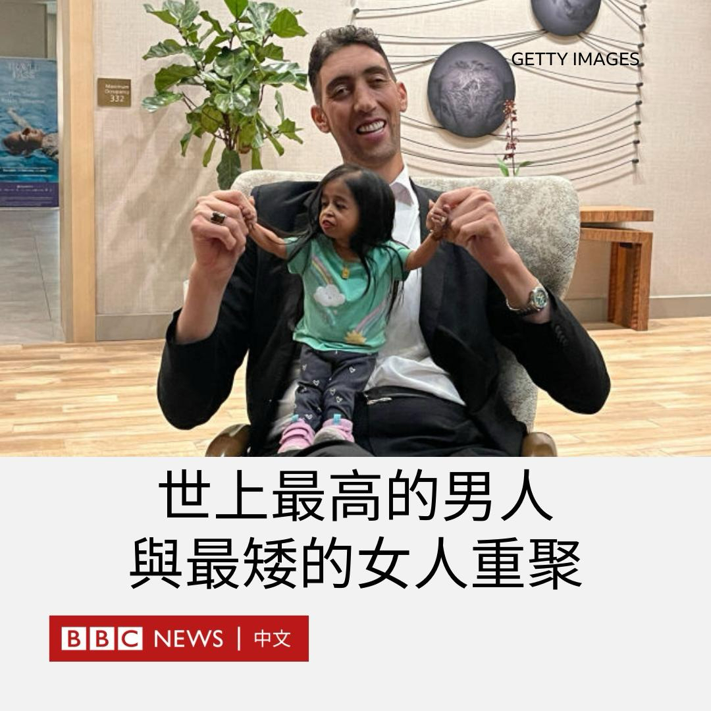
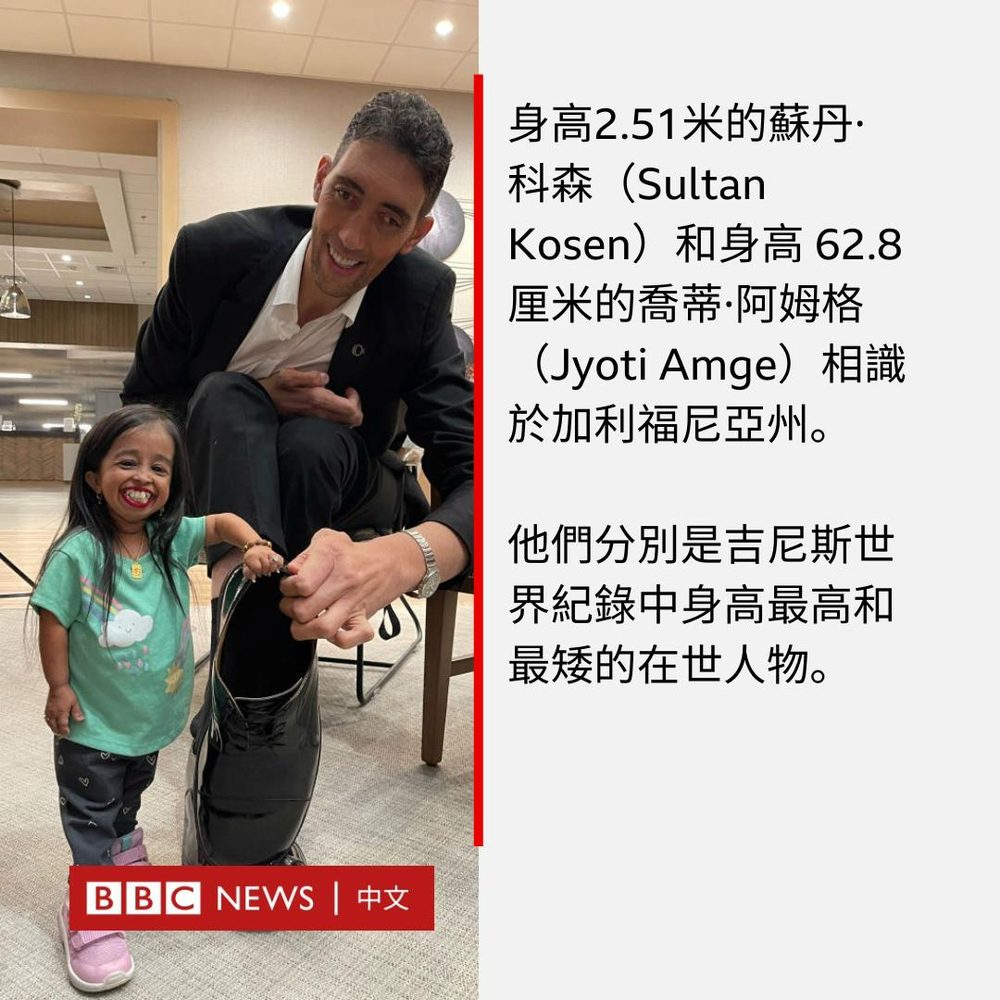
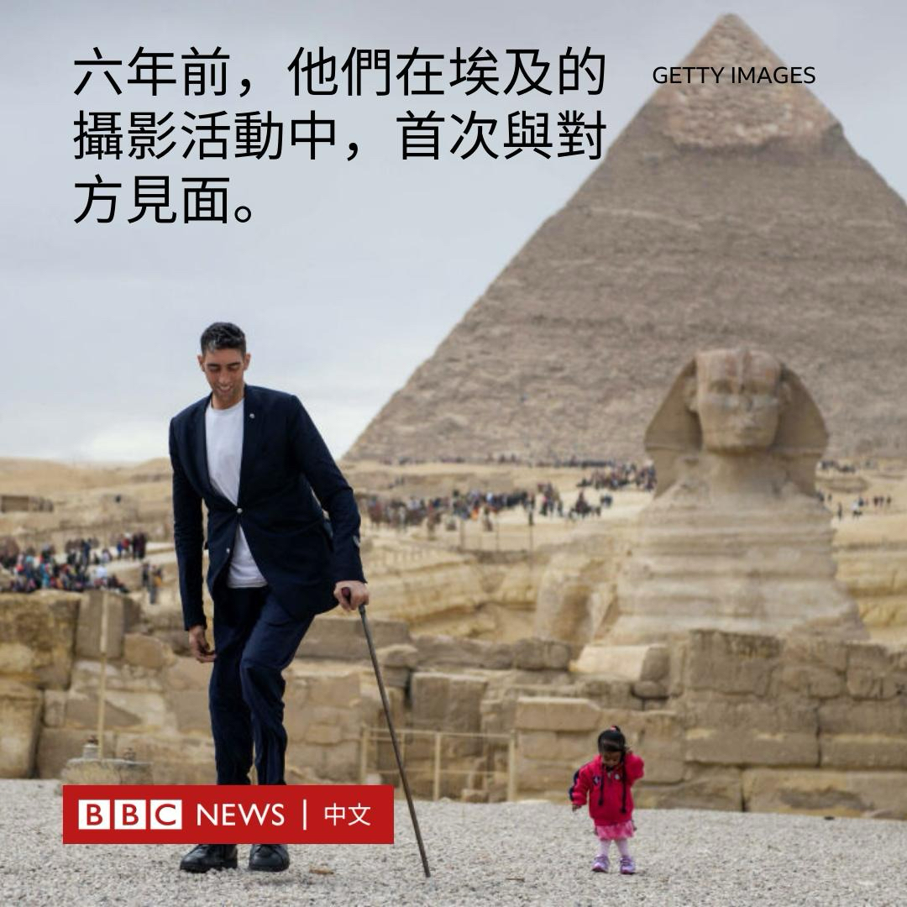
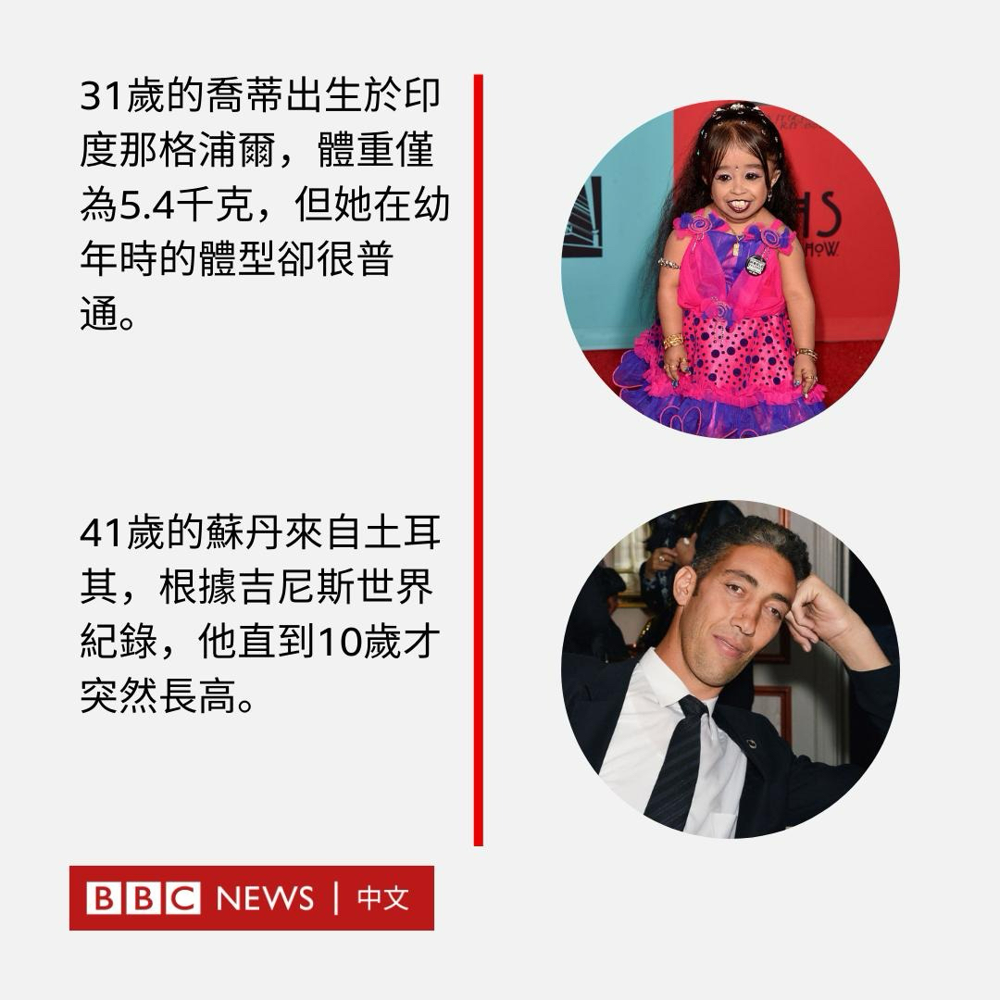
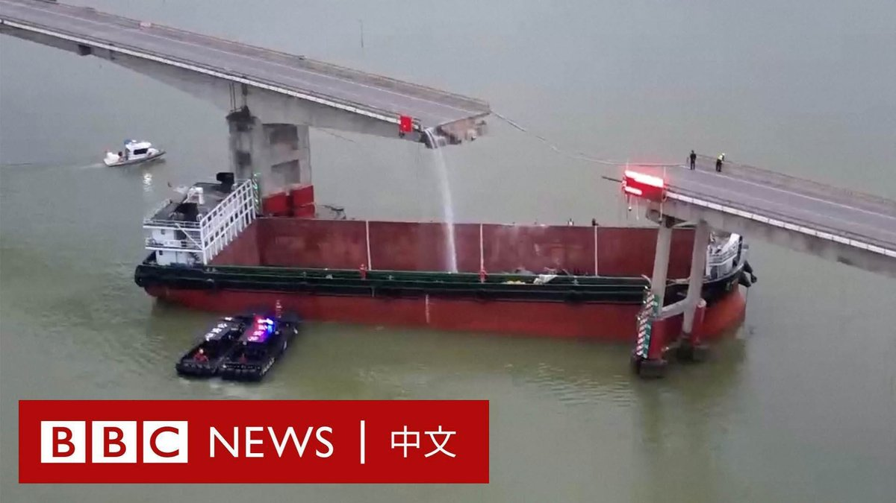

D英国广播公司BBC 北京时间 2024-02-22T20:33:01Z 1760643858730479863 来自土耳其的苏丹·科森（Sultan Kosen）和来自印度的乔蒂·阿姆格（Jyoti Amge）分别是吉尼斯世界纪录中最高和最矮在世者的纪录保持者。

最近，身高2.51米的科森和身高0.628米的阿姆格再次在美国相聚。 https://t.co/2eniWexC6q   D英国广播公司BBC 北京时间 2024-02-22T17:44:27Z 1760601436730069048 美国众议院中国问题特设委员会主席麦克·加拉格尔本周访台。据统计，去年共有32位美国议员到访台湾。为何在近年有如此多的美国国会议员“扎堆”前往台北访问？https://t.co/Y7xihFldTf   D英国广播公司BBC 北京时间 2024-02-22T14:52:10Z 1760558080264397231 据中国媒体报道，一艘集装箱船周四（2月22日）在南部广东省的洪奇沥水道与沥心沙大桥发生碰撞，导致桥体断裂，多辆汽车和电动摩托车坠桥。

官方通讯社新华社报道称，目前已导致两人死亡、三人失踪。另有两人获救。

据报道，坠落车辆包括四辆汽车和一辆电动摩托车，其中两辆车落水，其他三辆落至船上。

据报道，事件发生在周四清晨的5时30分左右，当时这艘集装箱船正空载从佛山市南海区开往广州市南沙区。

现场画面显示，该大桥一节桥面从中间完全断裂，一艘无顶盖的红色集装箱船位于两节桥墩之间。船上有一辆绿色巴士的残骸。

还有影片显示，有水流从桥的断裂处倾斜而下。

广州巴士集团在一份声明中称，该集团的一辆营运公交车在事故中坠落，车上只有司机一人，目前无法与司机取得联系。

据报道，中国交通运输部南海救助局已派出救援人员前往现场，该桥梁已实行交通管制。

该集装箱船的运营公司表示，目前该船的船长已被警方控制，他们正在配合调查。

沥心沙大桥是有七千多人居住的三民岛通往广州市区的重要通道，建于1994年。《中国新闻周刊》报道称，该桥去年刚完成防撞能力加固提升工程。   D英国广播公司BBC 北京时间 2024-02-22T13:18:51Z 1760534594741277059 俄罗斯入侵乌克兰已经两年，双方都付出了惨重的代价，但目前却看不到战火会很快停止的迹象。我们来看看迄今为止战场上发生了什么，以及这场冲突未来可能的走向。https://t.co/nnUN90nGxk   D英国广播公司BBC 北京时间 2024-02-22T11:51:11Z 1760512535663673642 苹果公司（Apple）建议，如果你的iPhone进水，不要将其放入米桶中进行干燥。

尽管这种网络上广传的方法很受欢迎，但该公司表示，用户这样做可能导致较小的米粒损坏设备，测试也显示其未能起到作用。

苹果公司指，用户应该轻轻敲打机身，将iPhone的连接器朝下，以甩掉多余的液体，然后将其放置在通风的地方。

除了避免使用米桶外，苹果还建议不要使用“外部热源或压缩空气”来烘干手机，这意味着应避免使用暖气和吹风机。

此外，它建议用户不要尝试将“异物，如棉花棒或纸巾”插入手机中。

网站MacWorld指出，随着智能手机的设计不断改进，手机设备变得越来越能够承受水浸，意味着这些建议都将变得不必要。

从iPhone 12开始，所有苹果设备都能够承受在六米深的水中浸泡半小时。   D英国广播公司BBC 北京时间 2024-02-22T09:08:56Z 1760471703728107742 两名台湾网红在柬埔寨开直播声称在诈骗园区内被绑架殴打，后来遭揭发是自导自演，当地警方迅速逮捕两人并控以煽动制造社会动乱罪，判刑两年。

该事件震动了柬埔寨的领导层，前首相洪森及现任首相洪玛奈先后批评两人抹黑该国形象。https://t.co/FXEtxi7HmN   