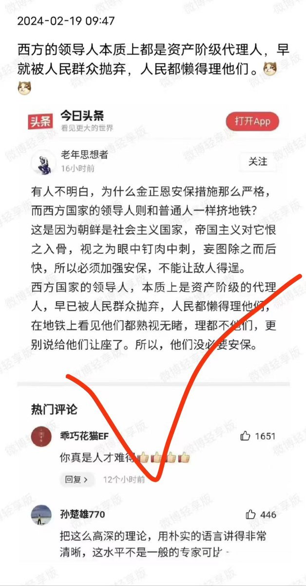
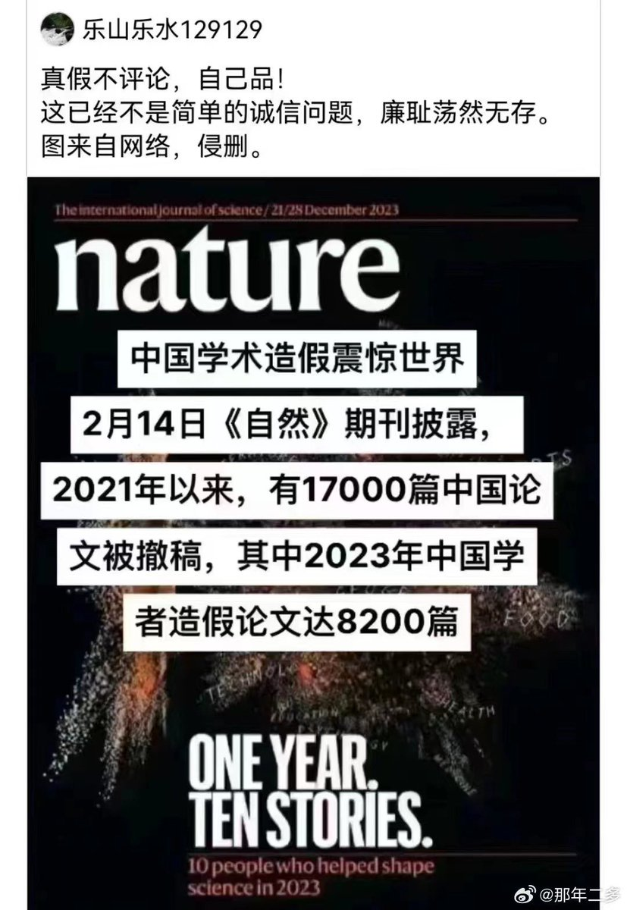
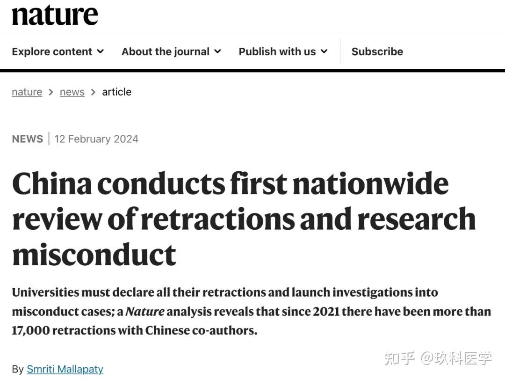
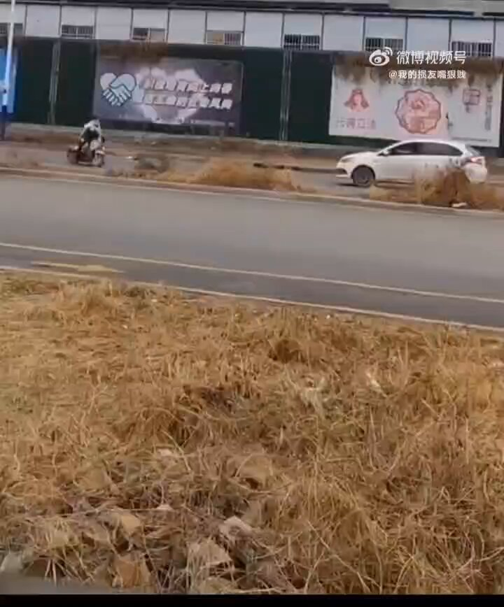
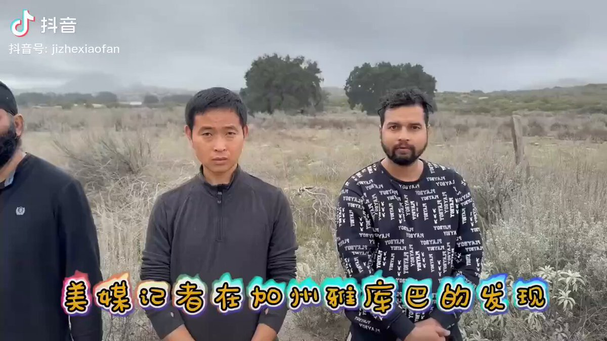
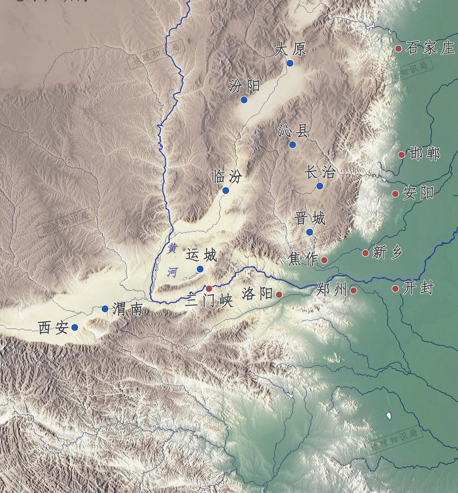
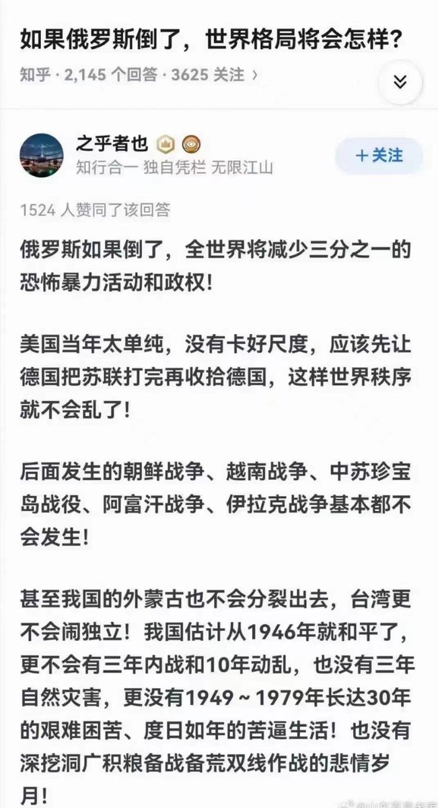

Petrichor 北京时间 2024-02-22T23:42:37Z 1760691570007810171 他们的理论总是很超前，也很有创意，就是有些邪。西朝鲜最高领导的保安比东朝鲜强多了，毛泽东时代也不如现在强。人民领袖其实就怕人民，他知道人民最恨他，欲去一人而世界喜，他心中比谁都更清楚。 https://t.co/awRursBmAY   Petrichor 北京时间 2024-02-22T20:50:21Z 1760648218751160323 湖南省委的这个《关于在全省开展解放思想大讨论活动的通知》里说了，这次解放思想大讨论的任务，共6个方面：第一，把贯彻落实的正确方向统一到党中央和习近平总书记为湖南指引的方向上来。第二，把目光和心思聚焦到破解影响高质量发展的痛点堵点难点上。第三，走好新时代群众路线，纠治政绩观偏差，谋划实施好重点民生实事。第四，践行总体国家安全观，确保全省政治安全、社会安定、人民安宁。第五，深入推进全过程人民民主的湖南实践，团结一切可以团结的攻坚力量，打出一片高质量发展的新天地。第六，习惯过紧日子，多接“地气”、不摆“官气”，树立实干实绩导向。

就说这第一条就不是解放思想，而是统一思想。解放思想的目的就是全面否定习近平过去11的左倾思想和开倒车，就如当年否定毛泽东、平反冤假错案一样。“2024年的中国在搞经济，在提质增速上，也很有可能会重现2020年全民抗疫的那一股狠劲。” 害怕了，千万别来大白的狠劲，省省吧！   Petrichor 北京时间 2024-02-22T21:29:53Z 1760658167682216363 2023年，《自然》杂志创记录地撤回1万篇研究论文，撤稿原因主要是欺诈抄袭和弄虚作假，其中最严重的来自沙特、巴基斯坦、俄罗斯和中国，撤稿增长速度超过了论文增长速度。
2021年以来，涉及中国学者的撤稿论文达到17000篇。什么假都可以造，唯独学术造假不能容忍。试想连搞科学研究都在玩虚的，连科研工作者都在你糊弄我我糊弄你，将会造成怎样一种局面？   Petrichor 北京时间 2024-02-22T13:47:08Z 1760541714769424667 墙上贴着雷锋画像，建立精神文明。可是现实太残酷。为什么中共社会是脱节的两块皮？人与人之间戾气太重，但是官员一直提倡学雷锋。可是，学雷锋屁用没有。 https://t.co/22RKeqvhIn   Petrichor 北京时间 2024-02-22T13:48:44Z 1760542116567036101 中国，我为你而骄傲！因为我们有习主席的四个自信。 https://t.co/u9bEFx6x3a   Petrichor 北京时间 2024-02-22T11:01:50Z 1760500114030743692 中国历史上很长时间内以西安、咸阳、洛阳为都，注定中国成不了开放性的海洋文明的国家。地理环境决定国家思维。 https://t.co/eZpqZ7cvFK   Petrichor 北京时间 2024-02-22T11:05:44Z 1760501094071910686 这一点我完全认同。 https://t.co/S9usrTOPfz   Petrichor 北京时间 2024-02-22T05:36:56Z 1760418349849149733 这大概不是某人拜普京为师的原因？

因反对普京而死亡的部分名单：

1. 阿列克谢·纳瓦尔尼,47岁
   - 2024年在监狱中死亡。

2. 谢尔盖·普罗滕西亚,55岁  
   - 2022年在西班牙洛雷特德马海滩被吊死。

3. 弗拉基斯拉夫·阿瓦耶夫,51岁
   - 2022年与妻子和13岁女儿一起在莫斯科被发现死亡。

4. 瓦西里·梅尔尼科夫,43岁
   - 2022年与全家在俄罗斯下诺夫哥罗德被发现死亡。 

5. 米哈伊尔·沃特福德,66岁
   - 2022年在英国萨里郡被吊死。

6. 亚历山大·秋里亚科夫,65岁
   - 2022年在圣彼得堡被吊死。

7. 利昂尼德·舒尔曼,60岁  
   - 2022年在圣彼得堡被发现死亡。

8. 鲍里斯·涅姆佐夫,55岁
   - 2015年在莫斯科克里姆林宫附近被枪杀。

9. 安娜斯塔西娅·巴布洛娃,25岁
   - 2009年在莫斯科的记者被枪杀。

10. 斯坦尼斯拉夫·马凯洛夫,34岁
    - 2009年在莫斯科的人权律师被枪杀。

11. 纳塔利娅·埃斯特米罗娃,51岁
    - 2009年人权活动人士在格罗兹尼被发现中被枪杀。

12. 塞尔盖·马格尼茨基,37岁
    - 2009年在莫斯科拘留期间死于头部受创。

13. 鲍里斯·别列佐夫斯基,67岁
    - 2013年在英国伯克郡被发现死亡。 

14. 亚历山大·佩蕾皮利奇尼,44岁
    - 2012年在伦敦郊区慢跑时被发现死亡。

15. 亚历山大·利特维年科,43岁
    - 2006年在伦敦死于钋中毒。

16. 安娜·波利特科夫斯卡娅,48岁
    - 2006年在莫斯科的记者被枪杀。

17. 保罗·克列布尼科夫,41岁
    - 2004年在莫斯科的《福布斯》俄罗斯版编辑被枪杀。 

18. 塞尔盖·尤申科夫,52岁
   - 2003年在莫斯科自由俄罗斯党联合创始人被枪杀。   