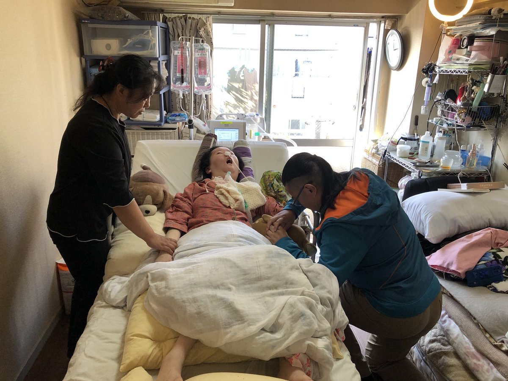
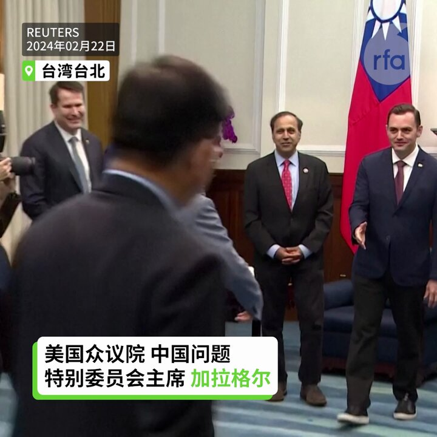
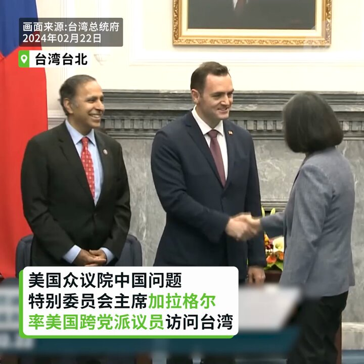
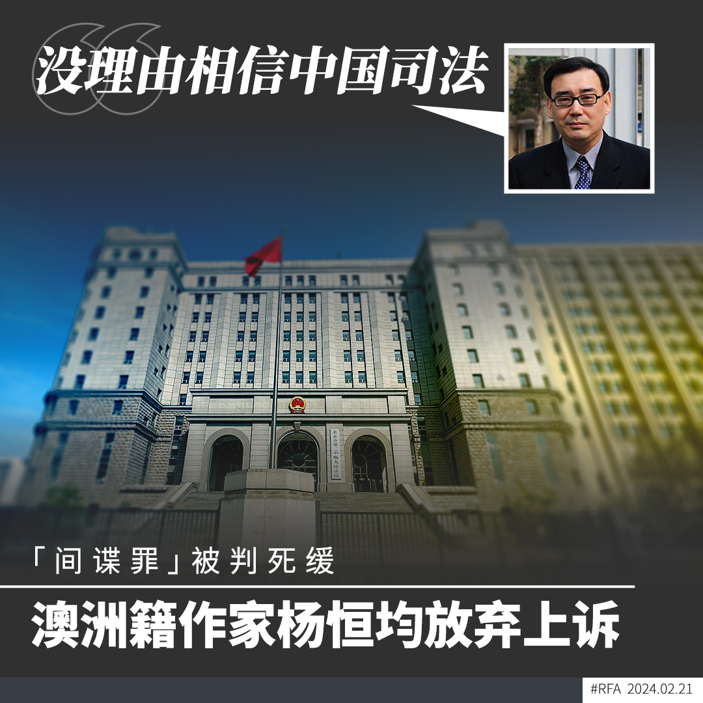
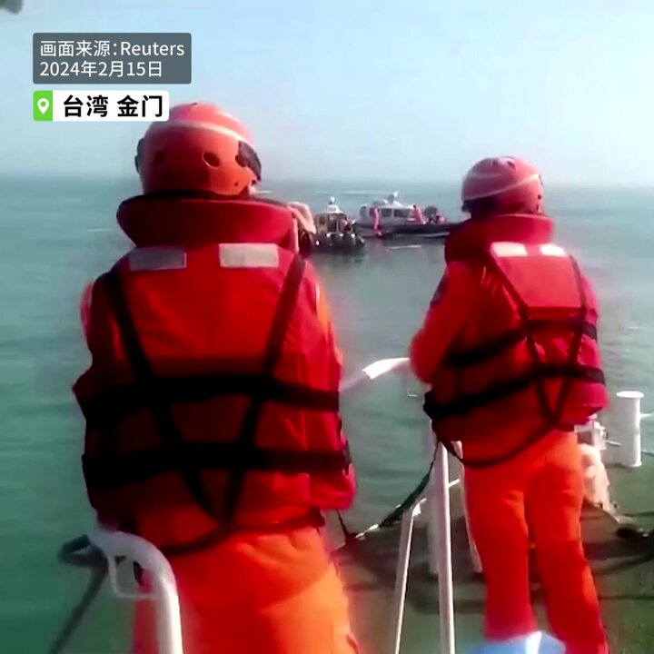
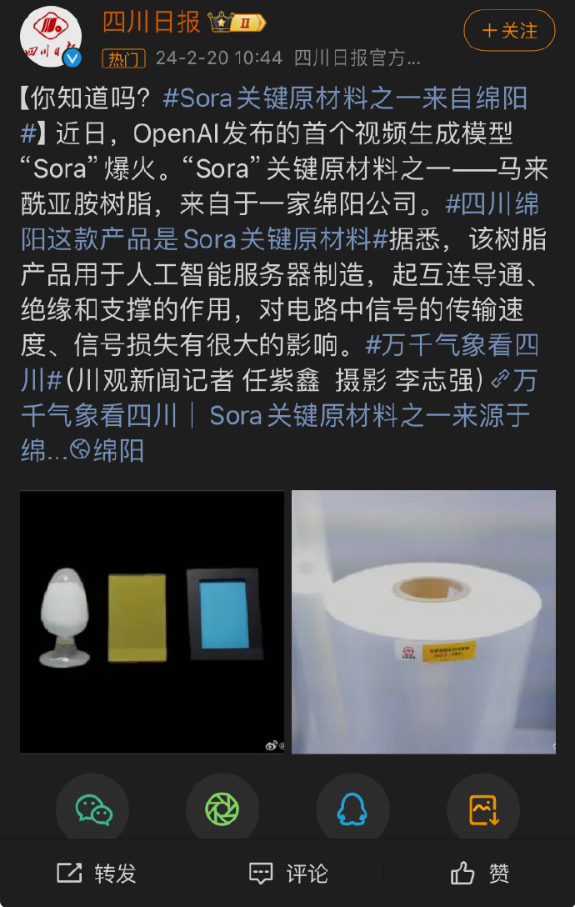

自由亚洲电台 北京时间 2024-02-22T21:52:58Z 1760663978869489724 RT @asiafactcheckcn: 【事实查核】
【透过公文格式让假信息现形】

去年7月，台湾《联合报》称根据一份独家取得的 #南海工作会议纪录，指美国政府要求台湾国防部预防医学研究所投资新设P4（第四级生物安全）实验室，用以开发生物战剂，并刊出了四页会议照片。

❌经…   自由亚洲电台 北京时间 2024-02-22T22:02:13Z 1760666304304841212 【著名独立记者高瑜: 最好中国能出现蒋经国 开放党禁报禁后走向民主 | #观点】
#高瑜 表示：中国目前的新闻媒体环境犹如寒冬。中国新闻自由的真正出路，必须是政治制度改变。最好中国能出现一个 #蒋经国，开放党禁报禁后走上民主——但我现在看不出来，中国高层还有什么改革派。
https://t.co/PLzFCBS6Wb https://t.co/ZL9gpwtAkI   自由亚洲电台 北京时间 2024-02-22T18:22:37Z 1760611040537248150 【人权律师 #唐吉田 遭当局羁押  恐无法送别病逝女儿】
中国维权律师唐吉田的独生女儿唐正琪2月20日在日本东京病逝。唐吉田去年11月再度被当局羁押，他作为中国当局重点稳控对象，会否获准出国送别女儿受到关注。https://t.co/YiYySsKoG1 https://t.co/I1OrlmbBGH   自由亚洲电台 北京时间 2024-02-22T19:00:56Z 1760620683187609980 【加拉格尔率团访台 见蔡英文赖清德】
【加拉格尔:若习近平试图犯台 注定失败】
美国众议院中国问题特别委员会主席加拉格尔(Mike Gallagher)22日率美国跨党派议员访问台湾，访问团会见蔡英文总统和总统副总统当 选人赖清德萧美琴。加拉格尔说，如果习近平试图做出侵略台湾的极度愚蠢决定，一定会失败。他也说，无论谁入主白宫，美国对台湾的支持都将持续。#加拉格尔   自由亚洲电台 北京时间 2024-02-22T14:34:28Z 1760553626093900043 【中国边防严控法律学者等四类人出境】
【边境地区陆路偷渡通道被切断】
中国边防武警已经完成在广西、云南边境地区的防偷渡部署任务。近期，中国加强对机场出入境口岸的管控。据知情人士披露，有关当局重点限制法律和历史学者、维权律师、异议人士以及NGO组织四类人士出境。另外，中国和缅甸、老挝同越南的边境受到严密封锁。详细报道：https://t.co/n9kdgJJ13q  #边控   自由亚洲电台 北京时间 2024-02-22T12:22:32Z 1760520421701751148 【美国众议院中国问题特别委员会主席加拉格尔】
【22日率团访台 会见蔡英文总统】
美国众议院中国问题特别委员会主席、威斯康辛州共和党众议员迈克·加拉格尔(Mike Gallagher)率领代表团于2月22日至24日访问台湾。台湾的总统蔡英文与赖清德副总统22日上午分别会见访问团，就台美经贸、印太区域情势等各领域议题交换意见。#加拉格尔   自由亚洲电台 北京时间 2024-02-22T13:25:14Z 1760536204397957246 【广州 #沥心沙大桥 被撞致桥面断裂】
【多人死伤落水失联】
综合中国媒体报道，2月22日05时30分左右，一艘集装箱船空载从佛山南海开往广州南沙途中，航经洪奇沥水道时触碰沥心沙大桥桥墩，致沥心沙大桥桥面断裂。
据广州海事局消息，广州市海上搜救中心通报，截至2月22日上午10时，经初步调查，涉事故车辆4辆，电动摩托车1辆，其中2辆车落水，其他3辆落至船上。截至10时，2人获救，2人死亡，1名船员受轻微伤，3人失联。   自由亚洲电台 北京时间 2024-02-22T10:41:04Z 1760494887084917181 中国在非洲和拉丁美洲的影响力日增，中国不仅是该区域的主要贸易伙伴，也透过一带一路计划强化相互连结。本周三，美国国务院主管东亚和太平洋事务的助理国务卿康达表示，美国对外政策的基本原则是要建立一个开放、自由、繁荣及安全的世界，但中国正在侵吞这样的国际空间。 https://t.co/1enQqfDxns   自由亚洲电台 北京时间 2024-02-22T11:47:37Z 1760511636081623344 RT @RFA_Chinese: 【#加拉格尔 率美国跨党派议员22至24日访问台湾】
美国在台协会宣布，美国众议院中国问题特别委员会主席、威斯康辛州共和党众议员迈克·加拉格尔 (Mike… https://t.co/Q918E2hAfa   自由亚洲电台 北京时间 2024-02-22T09:35:15Z 1760478324453716373 美国驻联合国大使琳达·汤玛斯-格林菲尔德（Linda Thomas-Greenfield）表示，由于哈玛斯与以色列的谈判正在进行，若是安理会在此时通过立即停火决议，将会危害以哈最终的和平谈判。
#加沙停火决议　 https://t.co/2ceTtxYZmd   自由亚洲电台 北京时间 2024-02-22T09:50:41Z 1760482207138033742 【#加拉格尔 率美国跨党派议员22至24日访问台湾】
美国在台协会宣布，美国众议院中国问题特别委员会主席、威斯康辛州共和党众议员迈克·加拉格尔 (Mike Gallagher)率领代表团于2月22日至24日访问台湾。台湾的总统蔡英文与赖清德副总统上午10时、11时将接见访问团，就台美经贸、印太区域情势等各领域议题交换意见。台湾的外交部长吴钊燮将于22日中午设宴欢迎访问团。访问团成员并将有记者会。台湾新任的立法院长韩国瑜将于22日下午接见访问团。https://t.co/QAbzqXRhuG   自由亚洲电台 北京时间 2024-02-22T10:15:42Z 1760488505317183951 RT @RFA_Chinese: “大家好，我是李宁，我今天又来到中国驻日本大使馆，过大年的每一天，也要来向领导请安，来汇报，来讲我们龙口市的杀人犯，我妈妈被活活打死已经十五年了……”
@ningli21  #李宁  #李淑莲  
https://t.co/FmCqdKhTXW   自由亚洲电台 北京时间 2024-02-22T10:16:39Z 1760488744933568625 RT @RFA_Chinese: 欢迎收听和订阅播客【＃亚太报道】 https://t.co/MjLNSvVMqc

“券商杀手”#吴清 上任伊始开罚；高位接盘高月供 中国 #房贷 族的心酸；中国立法促进 #民营经济 能奏效吗；毛左《#毛泽东博览》网站可能“奉命”关闭；中国是…   自由亚洲电台 北京时间 2024-02-22T10:18:05Z 1760489103982817381 RT @RFA_Chinese: 遥遥领先！中国育儿成本全球最高
把一个孩子抚养到 18 岁所花费的成本相对于人均 GDP ，中国是 6.3 倍，澳大利亚为2.08 倍，法国是 2.24 倍，瑞典是 2.91 倍，德国是3.64 倍，美国是 4.11 倍，日本是 4.26 倍。…   自由亚洲电台 北京时间 2024-02-22T06:39:38Z 1760434129014067226 因间谍罪被中国法院判处死缓的澳籍华裔作家杨恒均决定放弃上诉。家属表示，上诉将会影响杨恒均治病，强调放弃上诉不改变他是无辜的事实。
有观察人士敦促澳大利亚政府向北京施压，争取让 #杨恒均 保外就医。 https://t.co/ipDl2pFlWX https://t.co/QkjtusftIz   自由亚洲电台 北京时间 2024-02-22T06:41:19Z 1760434553746026868 北京人权律师余文生和妻子许艳因涉及"煽动颠覆国家政权"等罪名目前被羁押在苏州的看守所。近日余文生案被检察院发回警方重新侦查。
有法律界人士表示，#余文生 案备受国际社会关注，当局旨在利用司法手段达到"降温"目的。https://t.co/oTH5sG4yTF https://t.co/4K0Ut0UjGQ   自由亚洲电台 北京时间 2024-02-22T08:00:09Z 1760454390752944626 欢迎收听和订阅播客【＃亚太报道】 https://t.co/MjLNSvVMqc

“券商杀手”#吴清 上任伊始开罚；高位接盘高月供 中国 #房贷 族的心酸；中国立法促进 #民营经济 能奏效吗；毛左《#毛泽东博览》网站可能“奉命”关闭；中国是 #养育孩子成本 最高的国家之一 https://t.co/rVWF7K83mT   自由亚洲电台 北京时间 2024-02-22T04:26:58Z 1760400741984772565 中国司法部会同有关部门加快民营经济促进法的立法工作，以营造良好的营商环境，进一步提振民营经济信心。中国两会即将召开，专项立法能否奏效？政策"朝令夕改"，能挽回丧失的信心吗？https://t.co/xjU9YnzsvJ   自由亚洲电台 北京时间 2024-02-22T05:21:05Z 1760414360105807893 【台海紧张情势会不会升级？】
中国渔船蛇行越界躲避台湾海巡追查后翻覆，中国海警部门在金厦禁限海域强制登船检查台湾籍观光船，进而马祖海域也出现中国执法船只。
台海紧张情势还会升级吗？百姓怕不怕？ https://t.co/vj3qRKYJ9k   自由亚洲电台 北京时间 2024-02-22T05:58:20Z 1760423734324723962 “大家好，我是李宁，我今天又来到中国驻日本大使馆，过大年的每一天，也要来向领导请安，来汇报，来讲我们龙口市的杀人犯，我妈妈被活活打死已经十五年了……”
@ningli21  #李宁  #李淑莲  
https://t.co/FmCqdKhTXW   自由亚洲电台 北京时间 2024-02-22T03:00:39Z 1760379019516592346 自2023年11月起遭中国当局强迫失踪的中国人权律师唐吉田的女儿唐正琪在2月20日于东京病逝，得年27岁。
据维权网消息，唐吉田律师关注组就此呼吁中国政府尽快解除对唐吉田的非法监禁，归还唐吉田人生自由，同时，希望基于人道主义考量，允许 #唐吉田 出境日本为 #唐正琪 办理丧事。https://t.co/coJ7Q2MBtX   自由亚洲电台 北京时间 2024-02-22T03:17:48Z 1760383336638218594 被问起读书的心得和建议？颜纯钩说，首先是：政府要你读的书，千万不要读。他的说法引起现场民众一阵笑声。“有没有见过美国政府丶加拿大政府要你一定去读什么书呢？没有嘛！所以中国政府要你去读的书，就不需要读了。”
#朱耀明 #颜纯钩  https://t.co/SjGMoy7Zsv   自由亚洲电台 北京时间 2024-02-22T03:42:19Z 1760389505205612944 #Sora 火爆全网。《四川日报》微博称：“Sora”关键原材料之一——马来酰亚胺树脂，来自于一家绵阳公司。
与有荣焉？ https://t.co/K3QHQbAS6e   自由亚洲电台 北京时间 2024-02-22T04:05:22Z 1760395308591161817 本周二，台湾驻美国代表俞大㵢表示，台湾与美国的关系“坚若磐石”。由于台湾获得美国跨党派支持，在今年的美国总统大选中，无论是哪位候选人赢得大选，台湾都有信心与华盛顿以及美国国会紧密合作，确保台湾的防务能力。 
#俞大㵢 #台美关系 #美台关系 
https://t.co/f24cjppNIJ   自由亚洲电台 北京时间 2024-02-22T00:37:35Z 1760343014977769655 “现在回过味来看的话，这个东西真的是像韭菜啊。”培根感叹，西咸新区当时也是一个号称国家级的新区， 但最终以发展效果来看，不是很理想： “说句不好听的话，就是为了炒地皮、卖房子。现在这边除了房价高以外，真的啥都没有。”
#买房 #断供 #高位接盘 https://t.co/m2UeoA7gJ4   自由亚洲电台 北京时间 2024-02-22T01:09:39Z 1760351086919962660 今年台北国际书展有不少作品与中国和文革时代有关。 荷兰作家卡罗琳．维瑟以在文革期间唯一被困在中国、最后不幸离世的荷兰人色尔玛的故事，尝试从她的遭遇和经历了解文革时代的中国。
#色尔玛 #台北国际书展 https://t.co/UNN5rEjNDp   自由亚洲电台 北京时间 2024-02-22T01:44:24Z 1760359830760362158 遥遥领先！中国育儿成本全球最高
把一个孩子抚养到 18 岁所花费的成本相对于人均 GDP ，中国是 6.3 倍，澳大利亚为2.08 倍，法国是 2.24 倍，瑞典是 2.91 倍，德国是3.64 倍，美国是 4.11 倍，日本是 4.26 倍。 
----“#育娲人口研究”《#中国生育成本 报告2024 版》https://t.co/XArqkTwBev   自由亚洲电台 北京时间 2024-02-22T00:01:18Z 1760333885789909310 继中国海警船 19日在金门海域出现后，台湾另一外岛马祖21日下午也出现3艘中国执法船只，其中2艘为海警船，另1艘为全长90公尺、1500吨级的海监船。中央社的报导指，“其中1艘海警船距离马祖南竿岛一度仅约5.5海里。”
美国的反应是何用意？
#中国海警船 #金门
https://t.co/dm0TxkMkYI   