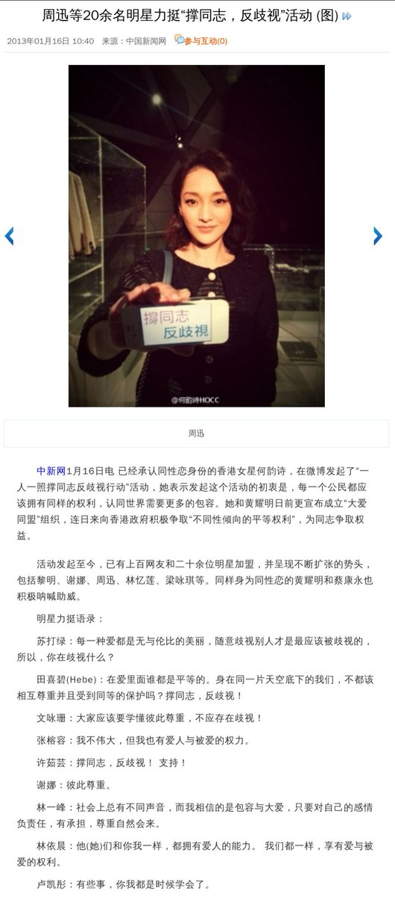
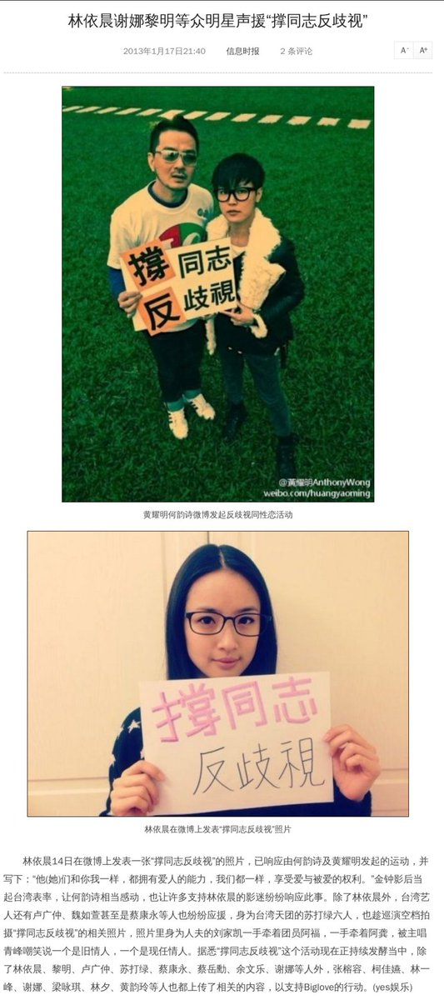
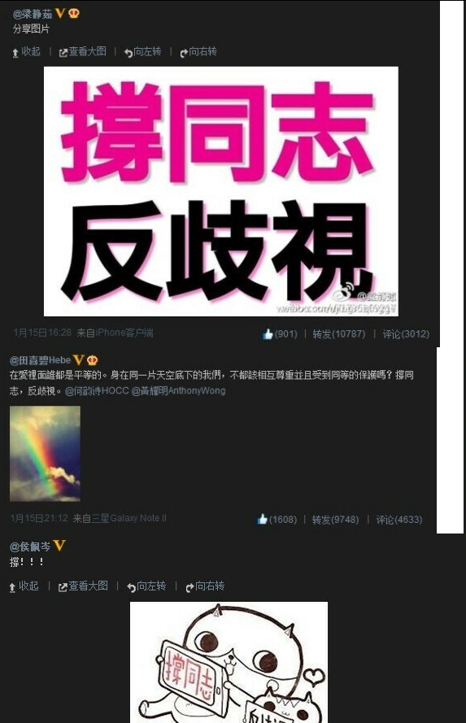
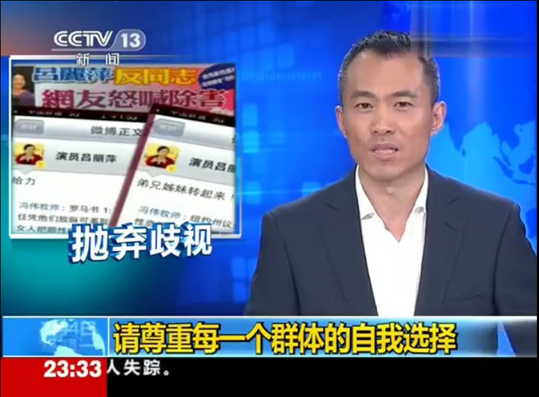
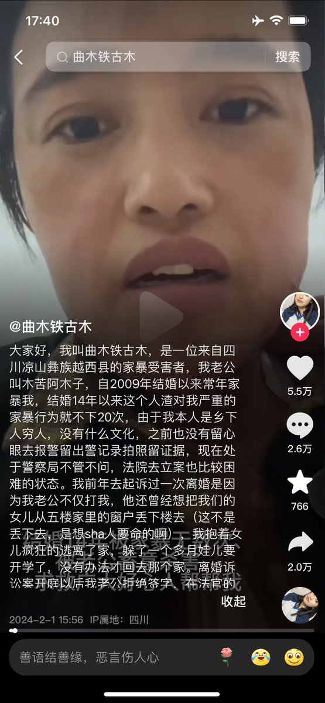

谁将十万横扫三江 北京时间 2024-02-22T18:37:12Z 1760614713153737193 RT @boiledwater: 《第二十条》观后感：

为真正落实第二十条做出最大贡献的人是律师，可电影又回到了经典的“青天大老爷”叙事

我们不需要，也不应用别人的牺牲换来一位青天大老爷

我们要的是保障律师的辩护权，是学者和网友的言论自由权

是媒体及时、客观、公正的监督…   谁将十万横扫三江 北京时间 2024-02-22T18:40:01Z 1760615420250427897 RT @torontobigface: 毛泽东一直是中国争议比较大的一个人物
共产党虽然把他挂在天安门上，但是却会对一些支持毛泽东的网站进行封杀
反贼把毛泽东视为杀人魔王，窃国者
当然中国还有一群毛左，把毛泽东视为神明
这一期就尽可能的客观评价毛泽东的造反行为以及执政结果
方脸…   谁将十万横扫三江 北京时间 2024-02-22T18:52:44Z 1760618620768669849 RT @boiledwater: 我的葱省律师旁友：

“我们不需要恩赐，我们只想要回属于我们的东西”这句话，我是这么理解的：

公民权利是生来具有的，法律只是进行确认和保护，而不是进行授权或恩赐，所以公民权利“法无禁止即许可”。

公权力是由公民权利让渡而来，需要法律对公权力…   谁将十万横扫三江 北京时间 2024-02-22T19:05:00Z 1760621709030547756 2013年明星还能在微博上接力声援“撑同志反歧视”
2011年央视还能表示“抛弃歧视，请尊重每一个群体的自我选择”，当时只道是寻常 https://t.co/LGUn4iISiF   谁将十万横扫三江 北京时间 2024-02-22T14:27:49Z 1760551952839229855 曲木铁古木这位在婚姻中被丈夫木苦阿木子长期殴打伤害，被泼酒精纵火杀人未遂？这位杀人未遂者被拘留15天于昨天结束，在这种环境中的女性，可以仔细看看，一个男人在婚姻中给女人造成这样的伤害，代价是什么？

15天。

我之前就说过，这块土壤上的婚姻制度就是绞肉机，它面对所有女人性质都是一样的，唯一的区别就是个别女人运气好，丈夫不按下绞肉机的按钮而已。

没有任何制度，法制来保障你在婚姻中的人身安全，更别说得到福利了，纯粹靠全方位的诱惑，欺骗，恐吓，削弱，精神打压让你无法活下去不得不靠性和子宫去婚姻里讨口饭吃，去当沙袋供那些满腔愤懑的“不稳定因素们”泄愤泄欲用。

拉姆在直播中被丈夫用火烧死，曲木铁古木被烧成重伤，被冲进下水道的，推下悬崖的，被公婆打死的，离婚被捅杀的，无数女性正在家庭这个“私人场所”里被殴打虐待杀害，一边是口头警告，写保证书，拘留15天，离婚冷静期，一边是社会性的以父母为首的对女儿往婚姻中的驱赶，这块土地上以婚姻形式组建的家庭，已经成为女人专属的缅北。 

PS:当事人说当地政府造谣是她自己喝多了烧的自己，男女都有错   谁将十万横扫三江 北京时间 2024-02-22T13:31:45Z 1760537844328939701 RT @afterglow_PRC: 尽量避免使用“中国人”“无产阶级”“汉族”“人民”这种抽象和宽泛的词汇，多拿具体的人和物说事。   谁将十万横扫三江 北京时间 2024-02-22T14:10:25Z 1760547572245319881 春节返程听到大家吐槽高铁上遇到的熊孩子，你认为应该如何解决高铁上的熊孩子现象？   谁将十万横扫三江 北京时间 2024-02-22T11:29:40Z 1760507119403679925 RT @whyyoutouzhele: 我认为所有的国内媒体都应该报道一下这位警察的表述，好让全国人民知道在中华人民共和国里到底谁才算人民？ https://t.co/pCvXXUzvvi   