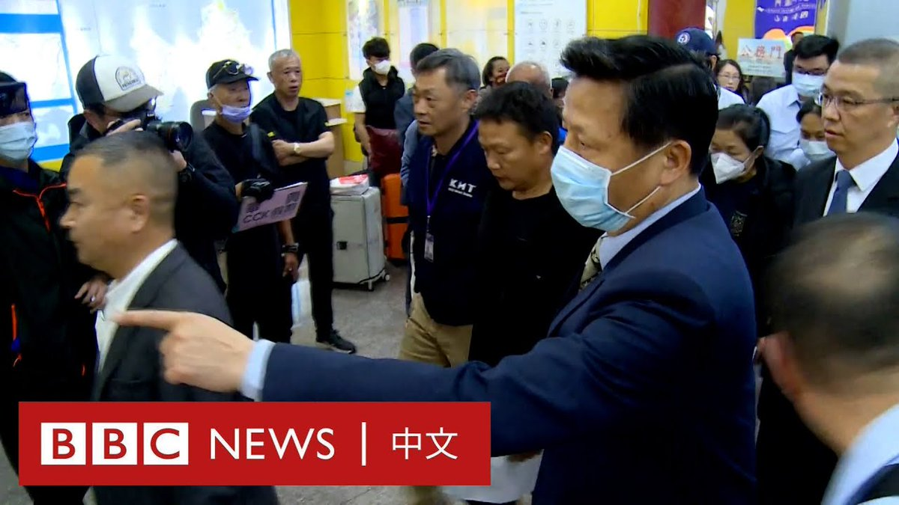
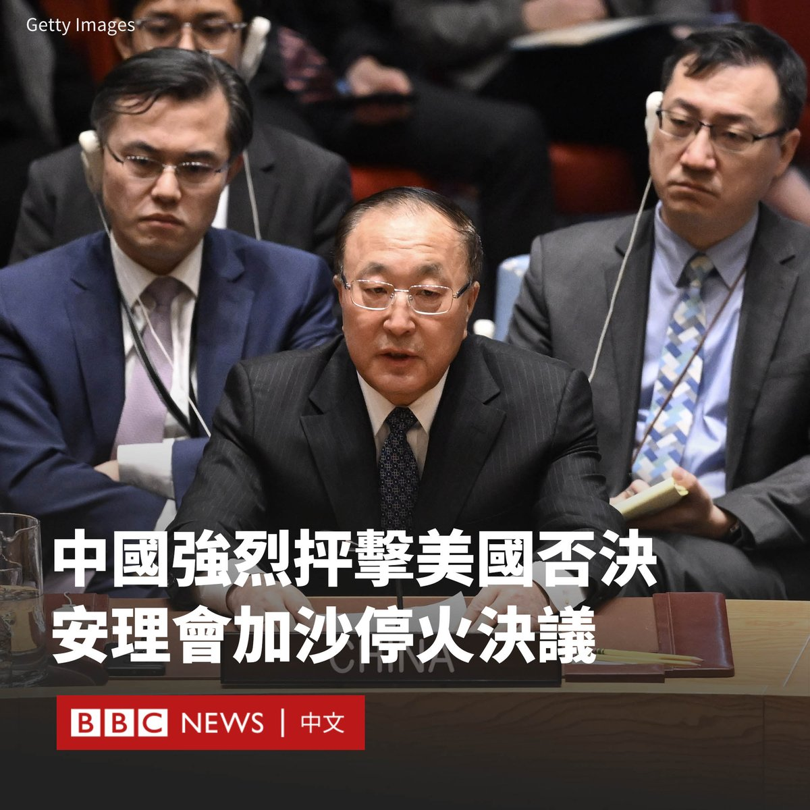
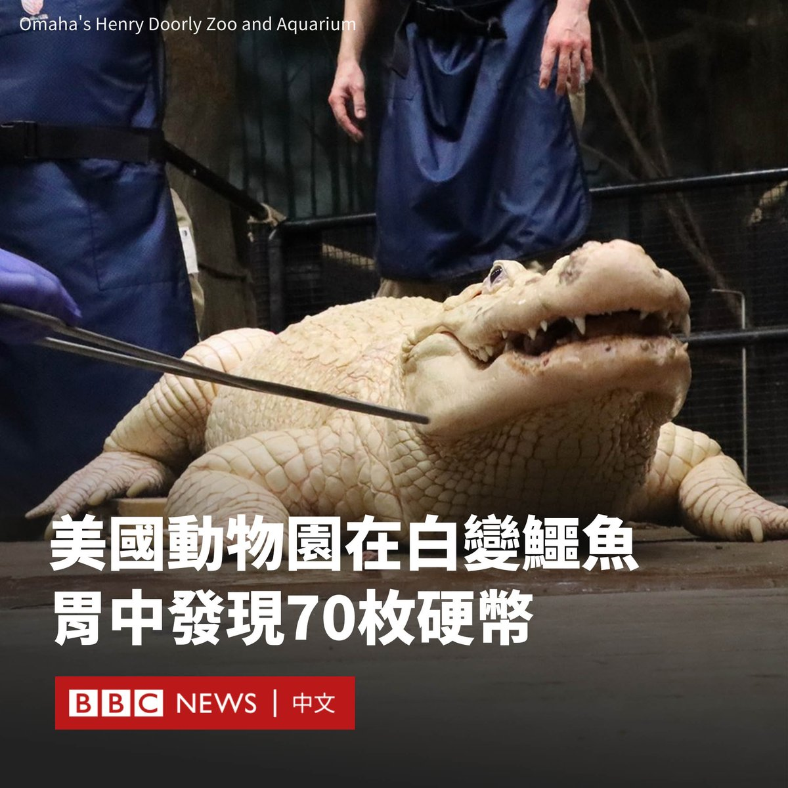

D英国广播公司BBC 北京时间 2024-02-21T18:59:37Z 1760257965477773502 在一艘中国福建渔船上周于金门海域遭台湾海巡署追缉时发生翻覆事故后，两名中国大陆遇难者的家属周二（2月20日）抵达金门处理遗体等事宜，事故中的另两名遭台湾方面扣留的生还者也返回大陆。 https://t.co/ye3SSRZYNn   D英国广播公司BBC 北京时间 2024-02-21T16:25:51Z 1760219268367716790 中国严厉批评美国否决联合国安理会在加沙地带立即实现人道停火的决议草案，称该举动发出了“错误信号”，实际上是“为继续杀戮开绿灯”。

这份决议草案由阿尔及利亚提出。白宫表示，该决议将“危及”结束战争的谈判，而美国提出了自己的临时停火决议，其中警告以色列不要入侵拉法城。

在加沙战事持续之际，美国阻止阿尔及利亚草案的举动遭到广泛谴责。该决议得到了联合国安理会15个成员国中13个成员国的支持，英国投了弃权票。

美国驻联合国大使琳达·托马斯-格林菲尔德（Linda Thomas-Greenfield）说，在哈马斯和以色列的谈判仍在继续的情况下，现在呼吁立即停火还不是时候。

针对这一否决，中国驻联合国大使张军表示，美国称安理会决议会干扰正在开展的外交努力，这种说法是完全站不住脚的。

“当前形势下，在立即停火问题上仍然消极回避，无异于为继续杀戮大开绿灯。”

他补充说：“冲突外溢正在使整个中东地区动荡不安，更大范围的战争风险正在上升。安理会必须尽快采取行动，阻止这场中东浩劫。”

阿尔及利亚常驻联合国代表阿马尔·本德贾马（Amar Bendjama）称，“不幸的是，安理会又一次失败了”。“扪心自问，历史将如何评判你们。”他说。

美国的盟友也对此举提出批评。法国常驻联合国代表尼古拉·德里维埃（Nicolas de Rivière）对该决议未获通过表示遗憾。

美国提出的决议草案呼吁在“切实可行的情况下”实现暂时停火，条件是释放所有人质，并敦促解除通往加沙的援助障碍。

此前，美国在联合国对以哈冲突进行投票时一直避免使用“停火”一词，但目前尚不清楚安理会是否或何时会对该提议进行投票。

美国还表示，在拉法发动大规模地面进攻将对平民造成更多伤害，并导致他们进一步流离失所，包括可能逃往邻国埃及。

但以色列总理内塔尼亚胡（Benjamin Netanyahu）表示，他“致力于继续这场战争，直到我们实现所有目标”，任何压力都无法改变这一点。   D英国广播公司BBC 北京时间 2024-02-21T12:27:03Z 1760159171142664531 蒂娜·拉希米（Tina Rahimi）将会是第一个戴着头巾代表澳洲参与奥运的拳击选手。她的双亲年轻时从伊朗移民到澳洲，父亲过去曾在两地都赢得摔角冠军。

拉希米在21岁时开始打拳击，2024年将代表澳洲参赛巴黎奥运。她说和其他运动员不一样的穿着和样子是最具挑战性的部分，但“穿什么并不重要，结果会证明一切”。   D英国广播公司BBC 北京时间 2024-02-21T13:39:14Z 1760177336547524970 在美国内布拉斯加州的一家动物园，兽医在一条短吻鳄的胃里发现了70枚硬币。该鳄鱼不得不接受手术。

这些硬币是在一条36岁的稀有白变鳄鱼体内发现的，它有半透明的白色皮肤和蓝色眼睛。

奥马哈亨利多利动物园和水族馆（Omaha's Henry Doorly Zoo and Aquarium）说，这些硬币是游客向围栏内投掷的，它们被鳄鱼吞了下去。

兽医表示，这只鳄鱼被麻醉并插管接受手术。目前，该鳄鱼已经从手术中康复，回到了自己的栖息地。

园方在一篇声明中称：动物园会对动物生活区进行例行清洁，但在两次清洁之间，动物还是可能接触到被投掷的硬币。

兽医克里斯蒂娜·普洛格（Christina Ploog）表示，人们没有意识到硬币会对动物造成伤害。她说，动物不仅可能吃下硬币，而且硬币中还可能含有危险的化学物质。   D英国广播公司BBC 北京时间 2024-02-21T09:31:49Z 1760115071815123082 俄罗斯总统普京（Vladimir Putin）向朝鲜领导人金正恩赠送了一辆俄产豪华轿车。朝鲜官媒称，这辆轿车已于周日（2月18日）交付给了金正恩的高级助手。

克里姆林宫发言人佩斯科夫（Dmitry Peskov）证实了该消息，称这是一辆普京本人使用过的全尺寸豪华轿车奥鲁斯（Aurus）。

自俄罗斯入侵乌克兰以来，俄罗斯和朝鲜加强了密切的关系。尽管两国都受到国际制裁，但朝鲜仍被指向俄罗斯提供了用于战争的炮弹。两国均否认违反制裁规定。

去年9月，普京在俄罗斯远东地区的东方航天发射场欢迎金正恩到访，这是他四年来首次出国访问。

其间，金正恩视察了普京自己的座驾Aurus Senat轿车，并被邀请坐进后座。他们还交换了枪支作为礼物。

朝鲜国家通讯社援引金正恩妹妹金与正的话说，“这份礼物清楚地表明了两国最高领导人之间的特殊个人关系”。

但韩国外交部表示，这一礼物违反了联合国安理会对朝鲜的制裁，其禁止向朝鲜供应包括豪华轿车在内的特定类别的车辆。

俄罗斯和朝鲜都透露，普京预计将在不久后访问平壤。   