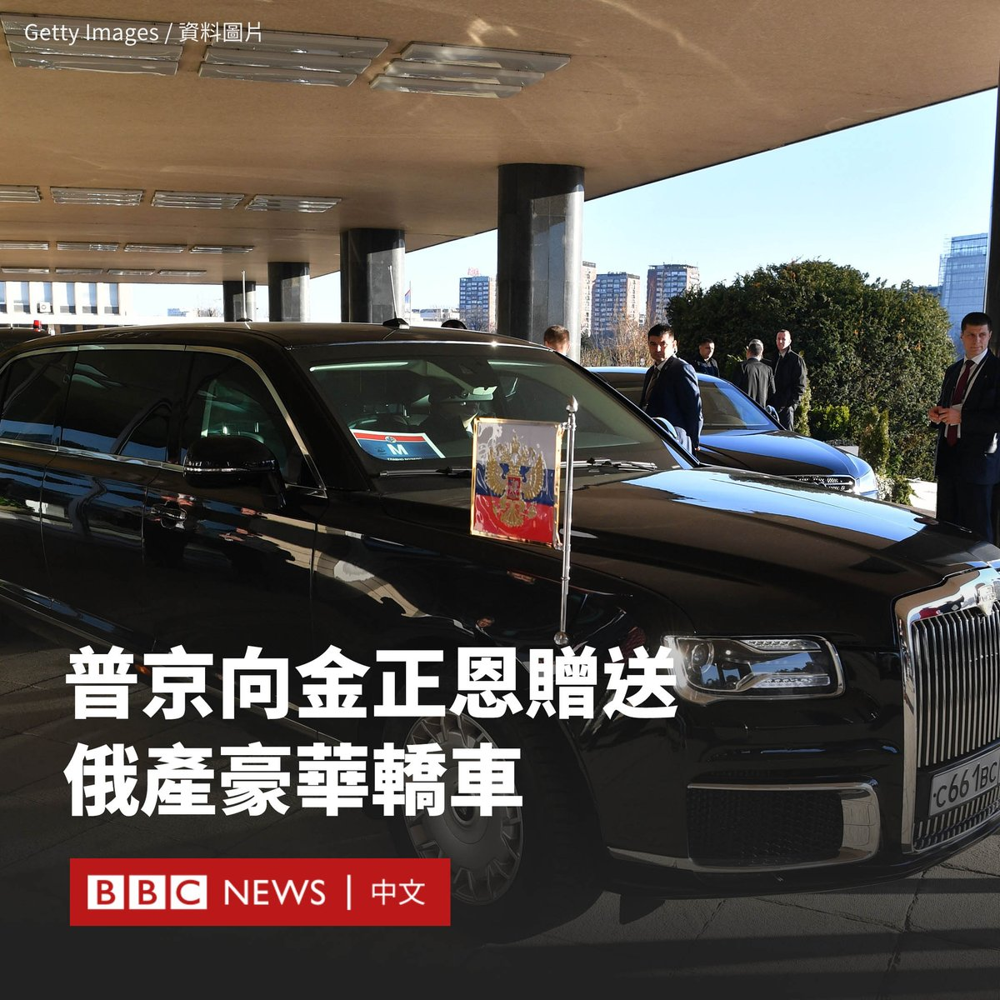

D英国广播公司BBC 北京时间 2024-02-21T09:31:49Z 1760115071815123082 俄罗斯总统普京（Vladimir Putin）向朝鲜领导人金正恩赠送了一辆俄产豪华轿车。朝鲜官媒称，这辆轿车已于周日（2月18日）交付给了金正恩的高级助手。

克里姆林宫发言人佩斯科夫（Dmitry Peskov）证实了该消息，称这是一辆普京本人使用过的全尺寸豪华轿车奥鲁斯（Aurus）。

自俄罗斯入侵乌克兰以来，俄罗斯和朝鲜加强了密切的关系。尽管两国都受到国际制裁，但朝鲜仍被指向俄罗斯提供了用于战争的炮弹。两国均否认违反制裁规定。

去年9月，普京在俄罗斯远东地区的东方航天发射场欢迎金正恩到访，这是他四年来首次出国访问。

其间，金正恩视察了普京自己的座驾Aurus Senat轿车，并被邀请坐进后座。他们还交换了枪支作为礼物。

朝鲜国家通讯社援引金正恩妹妹金与正的话说，“这份礼物清楚地表明了两国最高领导人之间的特殊个人关系”。

但韩国外交部表示，这一礼物违反了联合国安理会对朝鲜的制裁，其禁止向朝鲜供应包括豪华轿车在内的特定类别的车辆。

俄罗斯和朝鲜都透露，普京预计将在不久后访问平壤。   