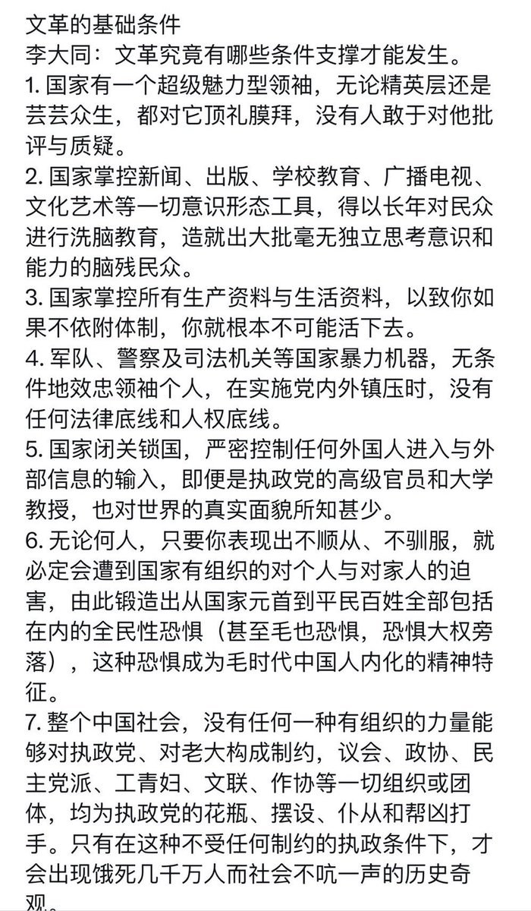
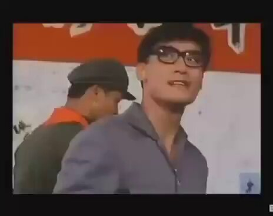
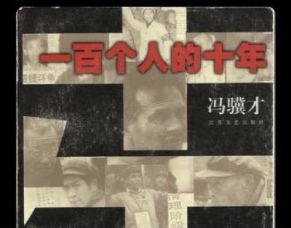
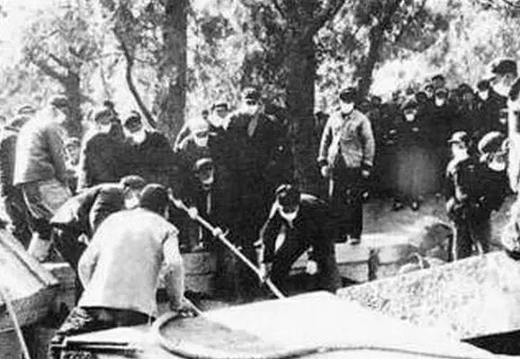
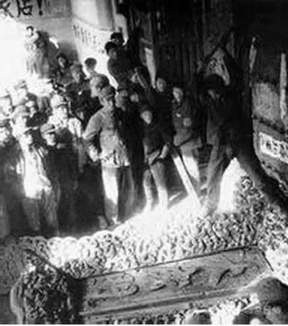
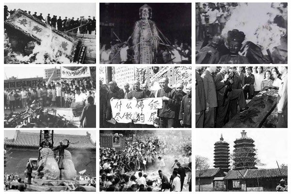
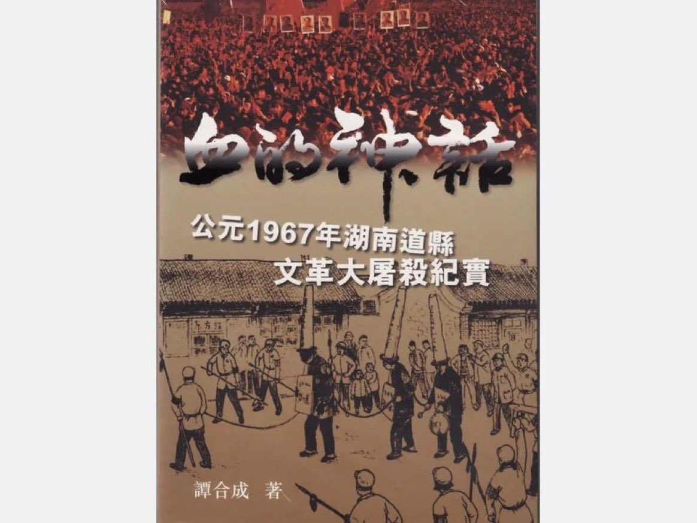
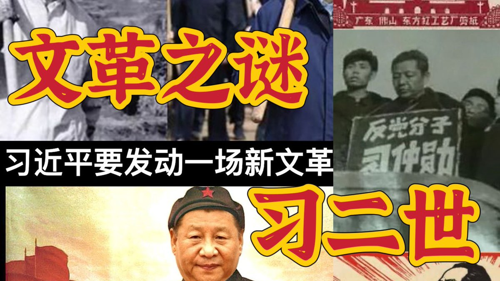
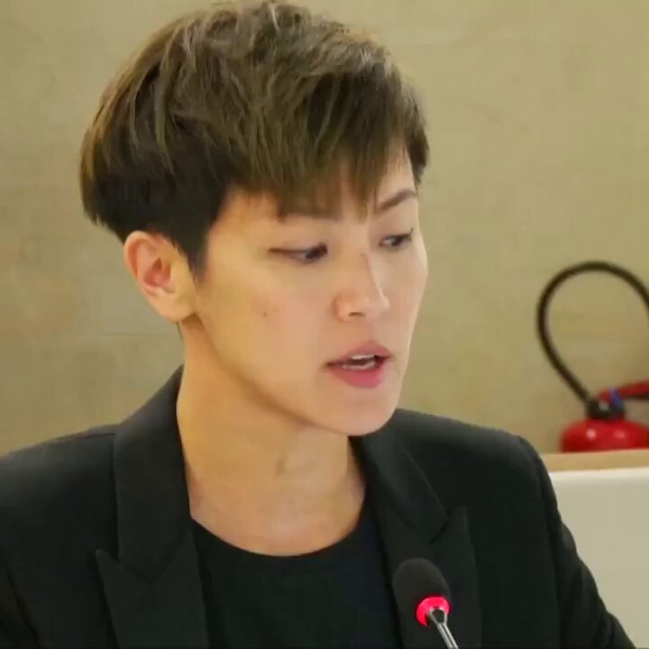

Ivy未央 北京时间 2024-02-21T22:17:20Z 1760307721289560147 RT @Ivy01011: 北大张千帆经典视频，可惜没找到高清版的
2分钟把中共专制的罪恶、中共卖国，愚民，煽动民族仇恨的本质一览无遗。

张教授经典语录
任何专制统治者会都把“民族主义”当作最后一根救命稻草，并在民族主义情绪高涨的骑虎难下中引火自焚

枪杆子出来的政权只能靠枪…   Ivy未央 北京时间 2024-02-21T22:16:43Z 1760307568260284892 RT @Ivy01011: 文革时，康有为的墓被掘，颅骨被放在一个翻斗车里游街示众：
孔子墓被炸药炸开，骨骇示众后被焚毁；
张之洞墓被掘，尚未腐烂的尸体被弃。任由顽童踢弄拔耍；
此外被掘墓的还有：舜帝、炎帝、岳飞、包拯、张居正、霍去病、王義之、蒲松龄、丁汝昌… https://…   Ivy未央 北京时间 2024-02-21T13:13:00Z 1760170736818208770 RT @Ivy01011: 习近平正在把自己塑造成毛二世，做梦都以为他自己是超级魅力的领袖，所以，你觉得中国再次文革的可能性大吗？ https://t.co/KUf73mo9hn   Ivy未央 北京时间 2024-02-21T13:14:02Z 1760170997867524178 我不是你的儿子，我是社会主义新中国的儿子，我是共产党的儿子，多么可怕的洗脑？ https://t.co/XmKJW9n57s   Ivy未央 北京时间 2024-02-21T10:39:51Z 1760132196096987579 文革时，有一对夫妇被五花大绑，身上绑满炸药，造反派和革命群众让夫妇的孩子去点燃导火索，孩子死也不干，他们就往死里打那孩子...最后孩子边哭边扑向爸爸妈妈，点燃了导火索，孩子没跑，紧紧的抱住了爸爸妈妈....冯
骥才&lt;一百个人的十年&gt;
有个孩子问我什么叫邪恶？我转发了这个故事给他。 https://t.co/n91kClA7S6   Ivy未央 北京时间 2024-02-21T10:48:43Z 1760134423779897583 文革时，康有为的墓被掘，颅骨被放在一个翻斗车里游街示众：
孔子墓被炸药炸开，骨骇示众后被焚毁；
张之洞墓被掘，尚未腐烂的尸体被弃。任由顽童踢弄拔耍；
此外被掘墓的还有：舜帝、炎帝、岳飞、包拯、张居正、霍去病、王義之、蒲松龄、丁汝昌
我不知道中国人的道德是从哪来的？但知道是从哪里消失的。   Ivy未央 北京时间 2024-02-21T10:55:40Z 1760136175258370280 转）文革道县大屠杀，从1967年8月13日到10月17日，历时66天，共死亡4519人，其中被杀4193人，逼迫自杀326人。杀人手段有枪杀、刀杀、沉水、炸死、丢岩洞、活埋、棍棒打死、绳勒、火烧、摔死（主要用于未成年的孩子）等。河中被扔满尸体，无人敢饮用河水，县城里仅有的五囗水井顿时价百倍。 https://t.co/XGp0Dwt8Zu   Ivy未央 北京时间 2024-02-21T10:56:38Z 1760136416179179923 RT @Ivy01011: 文化大革命起因，文革之谜：习近平一个文革受害者，为什么热衷于文革？
文革不仅是一段苦难的历史，也是一个深刻的社会和政治教训。它告诉我们，中共极端主义和无限制权力的危害。可惜，有的人居然还想文革2.0，这不是开倒车是什么？https://t.co/ju…   Ivy未央 北京时间 2024-02-21T10:56:44Z 1760136443257667600 RT @Ivy01011: 文革时，有一对夫妇被五花大绑，身上绑满炸药，造反派和革命群众让夫妇的孩子去点燃导火索，孩子死也不干，他们就往死里打那孩子...最后孩子边哭边扑向爸爸妈妈，点燃了导火索，孩子没跑，紧紧的抱住了爸爸妈妈....冯
骥才&lt;一百个人的十年&gt;
有个孩子问我什么…   Ivy未央 北京时间 2024-02-21T10:56:54Z 1760136484500156744 RT @Ivy01011: 转）文革道县大屠杀，从1967年8月13日到10月17日，历时66天，共死亡4519人，其中被杀4193人，逼迫自杀326人。杀人手段有枪杀、刀杀、沉水、炸死、丢岩洞、活埋、棍棒打死、绳勒、火烧、摔死（主要用于未成年的孩子）等。河中被扔满尸体，无人敢…   Ivy未央 北京时间 2024-02-21T11:03:34Z 1760138161689108697 RT @Ivy01011: 文革作为一场官民共同承认的浩劫，却变成受害者和加害者共同守护的禁区。官方不准公开评论，受害者不堪回首，加害者不愿忏悔，后来者不甚了了。绝大多数文革史料要么被封锁黑箱中，要么腐烂在参与者的记忆中，老一代三缄其口，新一辈不求甚解…在这种状况下，要中国人忏…   Ivy未央 北京时间 2024-02-21T11:03:36Z 1760138171751247903 RT @Ivy01011: 文革开始后，习近平的父亲习仲勋被打倒。13岁的习近平被归类为“黑帮子弟”。一次，习近平和其他五个大人被造反派拉去批斗。习近平头上戴着一个因为是铁制而非常重的高帽子，所以他用双手用力托着。当时，习近平的母亲也被迫参加批斗会，所以当台上有人喊打倒习近平时…   Ivy未央 北京时间 2024-02-21T10:19:32Z 1760127083299119439 文化大革命起因，文革之谜：习近平一个文革受害者，为什么热衷于文革？
文革不仅是一段苦难的历史，也是一个深刻的社会和政治教训。它告诉我们，中共极端主义和无限制权力的危害。可惜，有的人居然还想文革2.0，这不是开倒车是什么？https://t.co/ju0s9sBlbB https://t.co/dljg6X3gOx   Ivy未央 北京时间 2024-02-21T08:39:38Z 1760101939608461730 【香港歌手何韵诗联合国发言谈“反送中”】每次看这段视频，都不禁觉得何韵诗很美，很智慧
她发言时形容一国两制已“近乎死亡”。
事实上，现在的香港还有一国两制吗？

她在90秒的发言期间，两度被中国常驻联合国代表团官员戴德茂打断，这没教养加无理蛮缠的风格很中共很战狼？ https://t.co/4fc5ZDavhv   