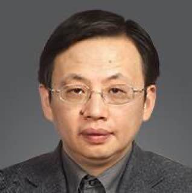
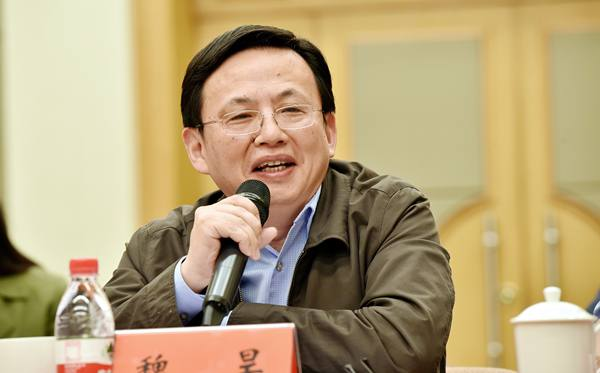
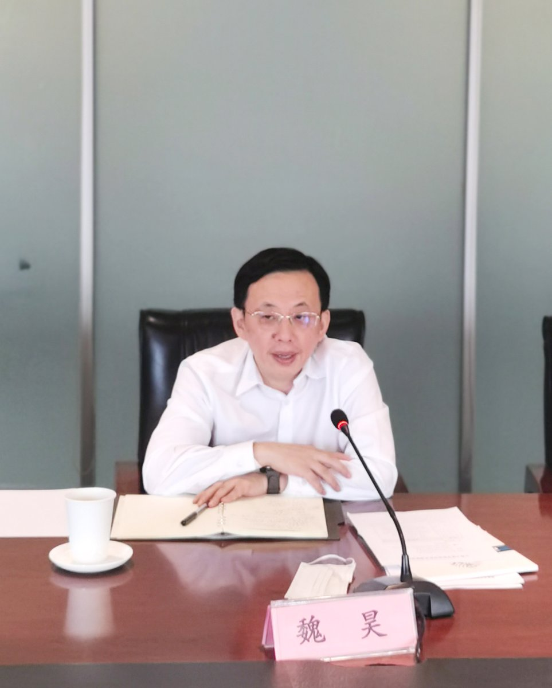
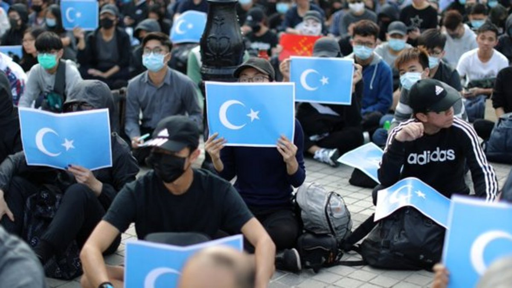

拆墙运动公号 北京时间 2024-02-21T22:39:41Z 1760313346048274563 RT @rqlsgc: 海外人权捍卫者发起的“拆墙运动”，是非常有效突破网络封锁，解体独裁政府，直击恶政真面目，震慑公权恶奴的方式。   拆墙运动公号 北京时间 2024-02-21T14:36:32Z 1760191757306703875 RT @Ipkmedia: 【首发】
王安娜： 纪念茉莉花革命13周年—亲历茉莉花· 甘肃兰州东方红广场

非常震惊，这是我第一次看到发生在自己身上的事情：当时广场上几乎没有人，只有主席台边上的庆阳路停着各种警车，他们在麦当劳门前拉横条挡着不许人员进入。满大街都是拿着对讲机的便…   拆墙运动公号 北京时间 2024-02-21T14:49:28Z 1760195013185569046 RT @RFA_Chinese: 【两岸金厦水域冲突 美国政府表示关切】… https://t.co/7MmILlF3eW   拆墙运动公号 北京时间 2024-02-21T15:00:02Z 1760197669782204430 【 #2259专案组 互联网防火墙第126号嫌犯 #魏昊】    性别：男
出生日期：1962年10月出生
中共党员
学历：硕士学历
职务：中国网络安全审查技术与认证中心主任
工作单位：中国网络安全审查技术与认证中心
地址：北京市朝阳区朝外大街甲10号中认大厦

　　邮编：100020
　　电话：
　　传真：

官网：https://t.co/LZ1NK8udKm
详细资料见: #BanGFW拆墙运动（建墙罪犯录）：https://t.co/NeEibA7bfL

历任中国进出口质量认证中心副主任
中国合格评定国家认可中心副主任，
现任中国信息安全认证中心主任兼党委副书记。

魏昊，男，1962年，研究员，2008年获得国务院政府特殊津贴，从事认证认可及信息安全认证工作30余年，现任中国信息安全认证中心主任兼党委副书记。2016年经批准获任IEC大使。
曾分别担任国际实验室认可合作组织（ILAC）与国际认可论坛(IAF)检查机构联合技术委员会主席、亚太实验室认可合作组织（APLAC）管理委员会成员兼培训委员会主席国际实验室认可合作组织（ILAC）检查机构技术组组长、太平洋地区认可合作组织（PAC）国际认可论坛（IAF）同行评审组长等学术兼职。

机构信息

机构名称中国网络安全审查技术与认证中心
机构批准号CNCA-R-2007-138
统一社会信用代码121000007178190802
机构状态有效
法定代表人：魏昊

战略合作伙伴：1、中共恶人榜：#ccpevils                 
 2、#zhinawiki   拆墙运动公号 北京时间 2024-02-21T06:31:38Z 1760069730503721413 RT @RFI_Cn: 土耳其逮捕六名替中国监视流亡维吾尔族人的间谍嫌疑人 https://t.co/EuR7vKzYd6 https://t.co/D0tdKscxMR   