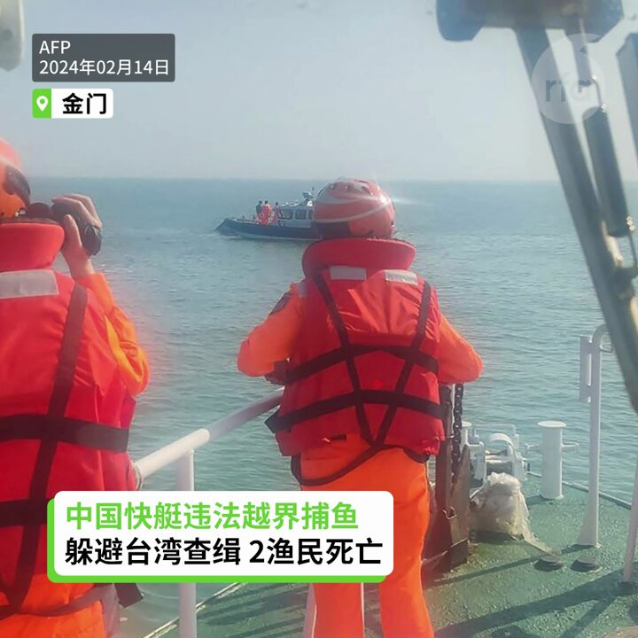
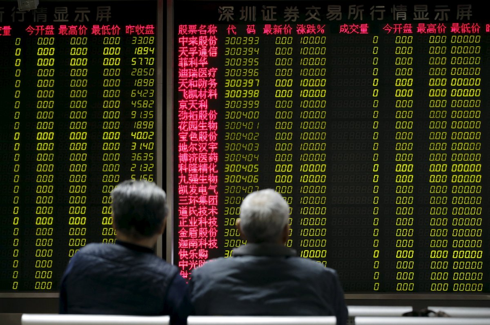
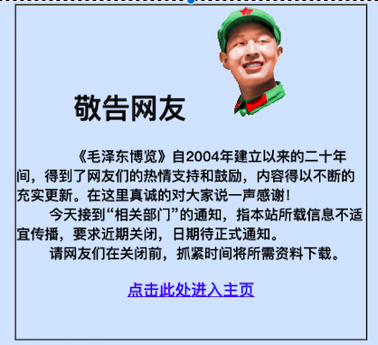
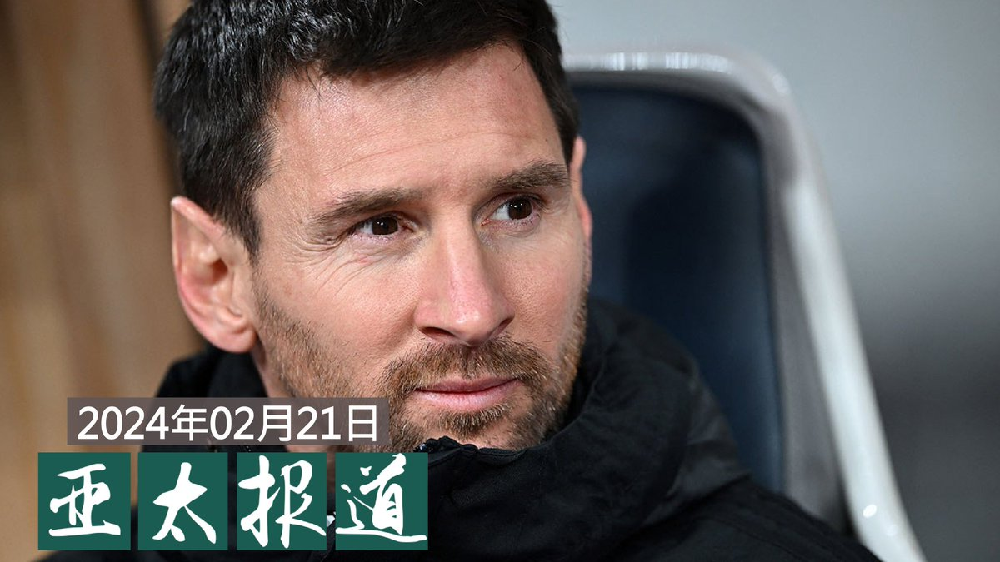
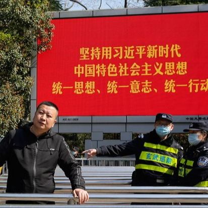
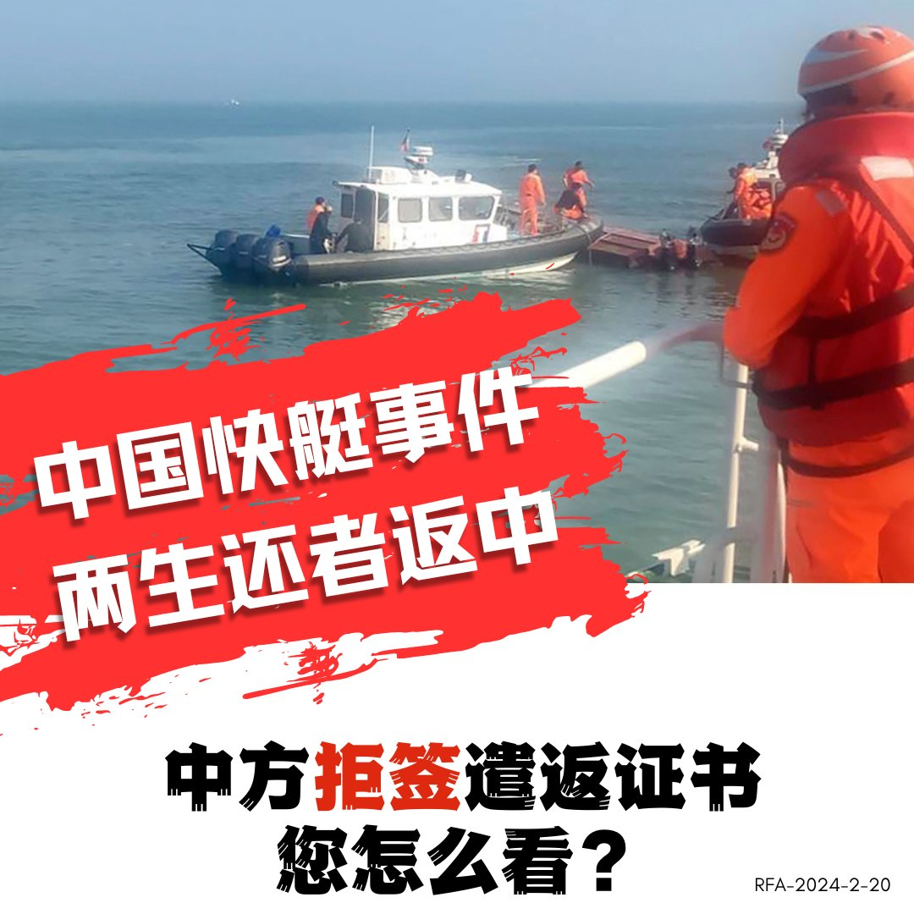

自由亚洲电台 北京时间 2024-02-21T14:35:26Z 1760191481779007750 【两岸金厦水域冲突 美国政府表示关切】
台湾和中国大陆最近在金厦海域发生的冲突引起美国关注，美国白宫和国务院表示密切注意北京的行动，希望北京克制，并与台湾进行有意义对话。美国国防部也说，不希望见到任何地区紧张情势升级的情况，并强调反对破坏台海和平稳定。台湾国防部表示，中国海警船进入金门水域由海巡署应处，国防部不介入，以避免升高紧张局势。而金门的游客和当地业者对于情势感到遗憾，希望偶发事件不要变成常态。   自由亚洲电台 北京时间 2024-02-21T15:20:05Z 1760202718101266718 【灵均投资抛25亿股票遭谴责 公开道歉】
中国股市风云飘渺之际，被称为“券商杀手”的吴清本月上旬出任中国证监会主席，上任两天即开出巨额罚单，处罚违规操作者。不过，中国量化巨头灵均投资“顶风作案”，本周一开市一分钟抛出25亿股票，遭到当局谴责。灵均投资周三凌晨发公开信道歉。https://t.co/sEYKOgHyDx
#灵均 #吴清 #股市   自由亚洲电台 北京时间 2024-02-21T13:09:23Z 1760169825257820403 【毛左网站《#毛泽东博览》“奉命”关闭】
一群毛左创建的《毛泽东博览》网站周二（20日）发出关闭通知，理由是他们“接到‘有关部门’通知”。该网站存放大量中共第一代领导人毛泽东的资源和影集，外界不知该网站关闭的真正原因。https://t.co/jk6kjQRjHH https://t.co/yHdfeHjXtu   自由亚洲电台 北京时间 2024-02-21T11:13:53Z 1760140757745222050 RT @RFA_Chinese: 欢迎收听和订阅播客【＃亚太报道】 https://t.co/MjLNSvVMqc
#中国海监船 再次进入台湾 #金门 限水域；湖南开展“#解放思想大讨论”意欲何为？；中国教育部征询 #教培 管理意见；云南清真寺改建后现“ #听党话 ”标牌；#梅…   自由亚洲电台 北京时间 2024-02-21T11:14:15Z 1760140852318331269 RT @RFA_Chinese: "解放思想"是指从邓小平的思想中解放出来？
为何只提"解放思想" 不提"实事求是"？
"解放思想"提法本身就自相矛盾？ 
"解放思想"目地在于解决"官僚躺平"问题？
"#解放思想"背后是谁在推动？
https://t.co/55gcBBK1Ao…   自由亚洲电台 北京时间 2024-02-21T07:22:14Z 1760082461134844195 RT @RFA_Chinese: 梅西发布解释视频近40个小时后，微博下方挤进了超过6万条回复、62万点赞。其中置顶的两条“热评”都对梅西的视频给予了肯定。但中国官媒则似乎对 #梅西 的视频和球迷的热烈响应不屑一顾。https://t.co/UjKFi9D5hp   自由亚洲电台 北京时间 2024-02-21T07:22:27Z 1760082518093472132 RT @RFA_Chinese: "解放思想"是指从邓小平的思想中解放出来？
为何只提"解放思想" 不提"实事求是"？
"解放思想"提法本身就自相矛盾？ 
"解放思想"目地在于解决"官僚躺平"问题？
"#解放思想"背后是谁在推动？
https://t.co/55gcBBK1Ao…   自由亚洲电台 北京时间 2024-02-21T08:00:08Z 1760092002182681020 欢迎收听和订阅播客【＃亚太报道】 https://t.co/MjLNSvVMqc
#中国海监船 再次进入台湾 #金门 限水域；湖南开展“#解放思想大讨论”意欲何为？；中国教育部征询 #教培 管理意见；云南清真寺改建后现“ #听党话 ”标牌；#梅西 代言白酒疑遭电商下架。 https://t.co/fvOaKekOMm   自由亚洲电台 北京时间 2024-02-21T04:43:37Z 1760042543562027096 随着近期从中国“#走线”进入美国的人数增多，需要慈善帮助的中国新移民越来越多。#中国民主党 全国联合总部与慈善团体和企业家合作，于2月17日下午在洛杉矶 #丁胖子广场 及市中心游民庇护所门外派发慈善物资。
https://t.co/jTox8JNd6l   自由亚洲电台 北京时间 2024-02-21T05:00:34Z 1760046812545921400 "解放思想"是指从邓小平的思想中解放出来？
为何只提"解放思想" 不提"实事求是"？
"解放思想"提法本身就自相矛盾？ 
"解放思想"目地在于解决"官僚躺平"问题？
"#解放思想"背后是谁在推动？
https://t.co/55gcBBK1Ao https://t.co/n03GfJbsr5   自由亚洲电台 北京时间 2024-02-21T05:27:48Z 1760053666541617160 梅西发布解释视频近40个小时后，微博下方挤进了超过6万条回复、62万点赞。其中置顶的两条“热评”都对梅西的视频给予了肯定。但中国官媒则似乎对 #梅西 的视频和球迷的热烈响应不屑一顾。https://t.co/UjKFi9D5hp   自由亚洲电台 北京时间 2024-02-21T05:42:59Z 1760057486432706956 近日，中国一艘"三无"快艇在台湾金门海域倾覆之后，中方海警部门宣布在厦金海域实施常态化巡航。伴随事态升级，外界也关注到北京处理周边主权争议问题的方式可能正在发生转变。
https://t.co/hAbMgLpU4Z   自由亚洲电台 北京时间 2024-02-21T05:45:48Z 1760058192606777483 #美中战略竞争特设委员会 就通过 #维吾尔政策法案 发表声明 https://t.co/u2pdeQPekK   自由亚洲电台 北京时间 2024-02-21T05:54:46Z 1760060452434764147 “自由之家”报告指出，2023年第四季度，中国异议监察（CDM）记录了952起抗议事件，比前两个季度分别增加了30%和50%。
劳工（61%）和住房（17%）抗议最频繁，22%涉及环境问题、学校安全、欺诈、土地纠纷和强行拆迁以及宗教自由等。
约18%发生在广东省，其次河南、山东、陕西。https://t.co/ReWv03azIW   自由亚洲电台 北京时间 2024-02-21T05:57:45Z 1760061203089420324 评论 | #陈光诚: "2024年新的一年开始了！看着全国各地无处不 #讨薪 的消息，我在这里只想给农民工兄弟们提個醒：不要光顾着拉车忘记了探路！" https://t.co/W6biAQtAfh   自由亚洲电台 北京时间 2024-02-21T02:59:12Z 1760016267744841830 据中央社2月20日报道称，中国快艇事件中，2名生还者今返回中国，但在要求中方签署海巡署遣返人员证书时，中方却表示没有被授权签署。
14日，中国一艘快艇闯入金门海域遭海巡署人员追缉，拒检后蛇行翻覆酿2死，另有2人生还。2名生还者今天下午4时30分许透过小三通搭船返回中国，而死者家属则于下午3时20分许手捧死者灵位进入殡仪馆，与检方相验中。
对此，台湾海巡署副署长许静芝表示，签署为流程，无论签署与否，都会依照程序遣返。
对此，#您怎么看？   自由亚洲电台 北京时间 2024-02-21T03:17:43Z 1760020927914418310 《#毛泽东之后的中国》作者、荷兰中国近代史专家 #冯客 到访台湾，并接受本台专访，谈及他如何看毛泽东之后的中国、六四事件的重要性，以及中国对美国、香港和台湾的看法。

https://t.co/Pa0RUfjT5j   自由亚洲电台 北京时间 2024-02-21T00:07:18Z 1759973009081684197 评论 | #余杰：“当人们对中国的五毛或小粉红的印象还停留在胡锡进、周小平、张召忠、孔庆东之流的“土鳖”上时，殊不知，升级换代的 #金刻羽 早已粉墨登场。 她比他们更西化，更时尚，更娴熟地使用西方学术和西方思想来为中共涂脂抹粉、鸣锣开道。”https://t.co/ka3p7M6s5Q   自由亚洲电台 北京时间 2024-02-21T00:29:37Z 1759978623673446509 #魏京生 评论：“ #普京 说中共的外交是保守的，习惯于妥协的政策。这和近年来西方观察到的 #战狼外交 正好相反。他进一步带着讽刺地调侃说，中国才是西方最大的威胁，而不是俄罗斯。中国的体量是俄罗斯的十倍，而且经济实力雄厚。他公开挑拨离间，看不起合作无上限的小习同志。
为什么有这么大的仇恨呢？”https://t.co/PoNSN7dLA6   自由亚洲电台 北京时间 2024-02-21T00:55:50Z 1759985222999748958 观光船旅客下船后接受当地台湾金门媒体采访纷纷表示，“中国海警而且他们还上船”，“很恐怖、超恐怖”，“很怕回不了台湾”。据台媒报道，当时也有部分旅客仍在船上唱歌，很淡定，不受影响。
#中国海警 #中国海监船 #金门  https://t.co/hVhz9YOwIU   自由亚洲电台 北京时间 2024-02-21T02:03:15Z 1760002188682698973 陈水扁形容，这套访谈录他最想推荐给台湾政坛的两个人阅读：“第一是赖清德，因为阿扁(当选)那年总统就是朝小野大，少数执政。赖清德处境跟我很类似。在朝小野大政治环境，要怎么面对跟克服，走对的路、做对的事，这本书绝对有参考价值。”
#陈水扁总统访谈录  https://t.co/59eAeTEr1X   自由亚洲电台 北京时间 2024-02-21T02:23:43Z 1760007337639850352 中共湖南省委展在今日中国的大背景下开展“#解放思想大讨论活动”，引发热议。有网友怀疑这是要重演毛泽东1957年发动“反右”之前的“#引蛇出洞”；也有网友说，解放思想，是为了 #统一思想，把全党统一到习思想之下。
#您怎么看？ https://t.co/f2mCS7dLNl   