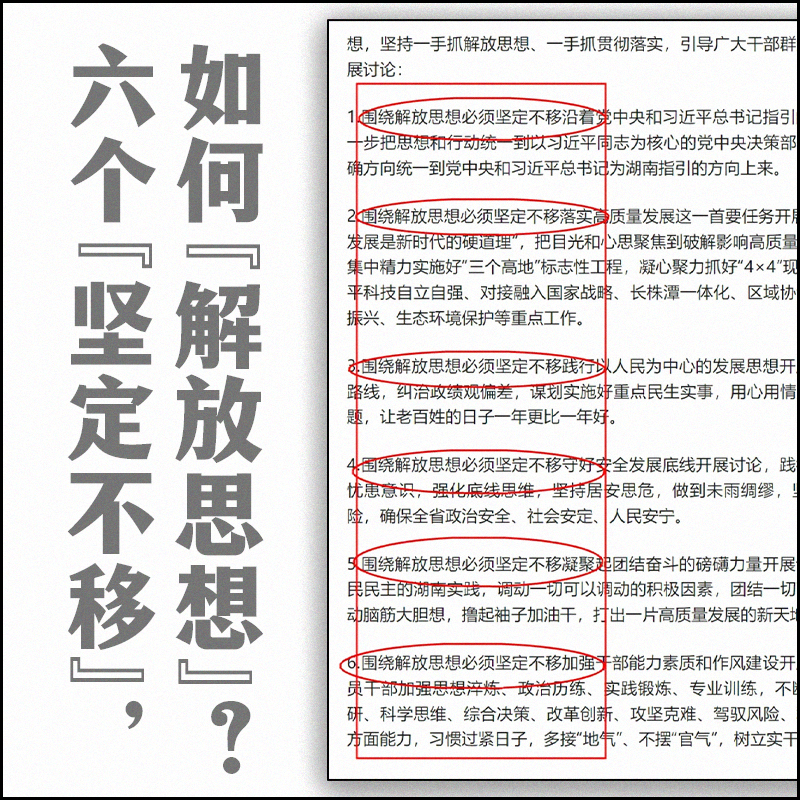

自由亚洲电台 北京时间 2024-02-21T00:29:37Z 1759978623673446509 #魏京生 评论：“ #普京 说中共的外交是保守的，习惯于妥协的政策。这和近年来西方观察到的 #战狼外交 正好相反。他进一步带着讽刺地调侃说，中国才是西方最大的威胁，而不是俄罗斯。中国的体量是俄罗斯的十倍，而且经济实力雄厚。他公开挑拨离间，看不起合作无上限的小习同志。
为什么有这么大的仇恨呢？”https://t.co/PoNSN7dLA6   自由亚洲电台 北京时间 2024-02-21T00:55:50Z 1759985222999748958 观光船旅客下船后接受当地台湾金门媒体采访纷纷表示，“中国海警而且他们还上船”，“很恐怖、超恐怖”，“很怕回不了台湾”。据台媒报道，当时也有部分旅客仍在船上唱歌，很淡定，不受影响。
#中国海警 #中国海监船 #金门  https://t.co/hVhz9YOwIU   自由亚洲电台 北京时间 2024-02-21T02:03:15Z 1760002188682698973 陈水扁形容，这套访谈录他最想推荐给台湾政坛的两个人阅读：“第一是赖清德，因为阿扁(当选)那年总统就是朝小野大，少数执政。赖清德处境跟我很类似。在朝小野大政治环境，要怎么面对跟克服，走对的路、做对的事，这本书绝对有参考价值。”
#陈水扁总统访谈录  https://t.co/59eAeTEr1X   自由亚洲电台 北京时间 2024-02-21T02:23:43Z 1760007337639850352 中共湖南省委展在今日中国的大背景下开展“#解放思想大讨论活动”，引发热议。有网友怀疑这是要重演毛泽东1957年发动“反右”之前的“#引蛇出洞”；也有网友说，解放思想，是为了 #统一思想，把全党统一到习思想之下。
#您怎么看？ https://t.co/f2mCS7dLNl   