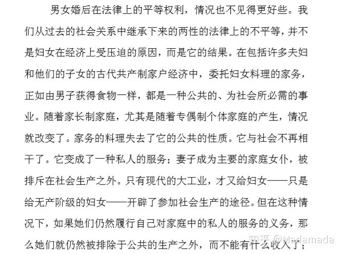
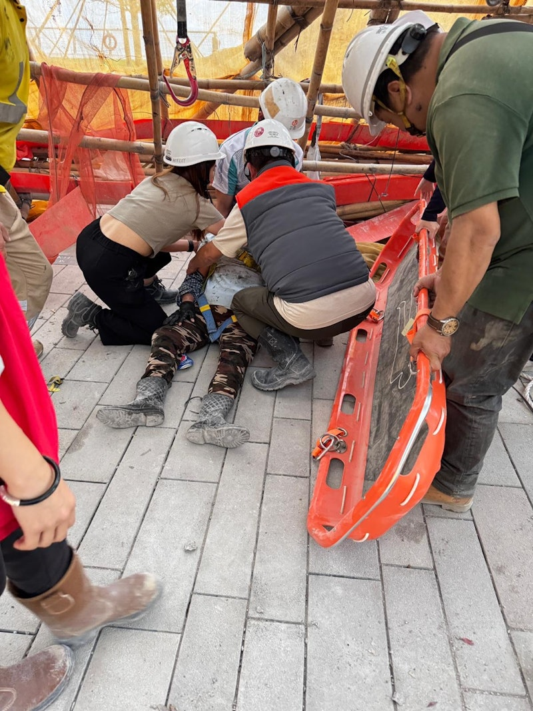
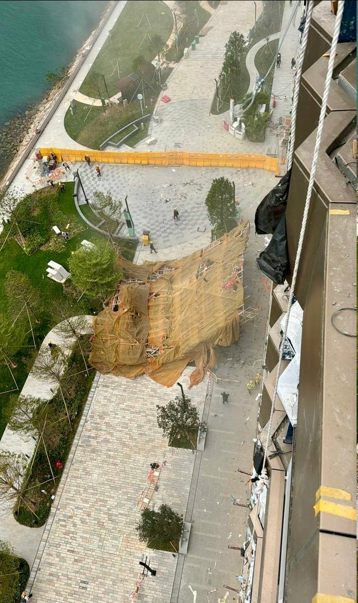
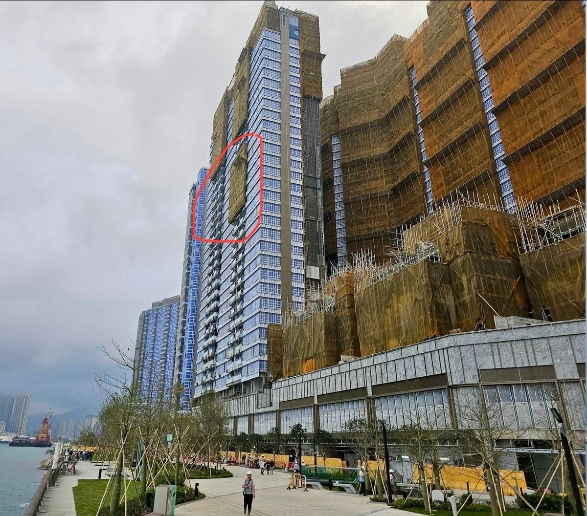

谁将十万横扫三江 北京时间 2024-02-21T12:01:56Z 1760152851765141967 RT @MorePerfectUS: The workers who make Coors are on strike!

420 @Teamsters are striking at Molson Coors in Fort Worth, Texas, after the m…   谁将十万横扫三江 北京时间 2024-02-21T09:23:35Z 1760113002073006472 听一个婚姻登记的朋友说:
上班第一天，离婚的人爆满，结婚的一个都没有。
领导开会说，尽量劝，能不让离就不让，实在劝不了就制造矛盾，让他们上法院起诉离婚。
数据太难看了，80后离婚率45%，90后离婚率56%，00后直接快70%了

中国人：宁拆十座庙，不毁一桩婚。在男性对女性统治这件事上坚决不能让步 https://t.co/Gl04ihQ5j7   谁将十万横扫三江 北京时间 2024-02-21T09:31:58Z 1760115109333283123 中国政府要点脸吧，全年财政收入3个亿的对方，上级转移支付48个亿，你拿谁的钱带动消费呢？ https://t.co/iyvytcyFWH   谁将十万横扫三江 北京时间 2024-02-21T09:39:55Z 1760117111194882139 2月20日香港启德在建楼盘棚架倒塌，从20层高倒塌砸中地面5名工人，2人当场死亡，3人受伤，棚架大约6米x12米，楼盘发展商为中国华润和保利集团。
中国在输出了，以后中国有的香港都会有 https://t.co/5mONjA9gRn   谁将十万横扫三江 北京时间 2024-02-21T09:54:37Z 1760120812374532174 中国民主的典范：

浙江绍兴一男子在村委会换届选举时作为自荐人参选并发表竞职演说，向村民展示了自己的政治理念，工作计划，竞选承诺。然而，这次竞选给他带来了牢狱之灾，公安局接到消息认定其存在违反选举规定的做法，对他采取拘留至选举结束的措施。男子出狱后向法院起诉，被法院驳回所有诉求 https://t.co/MkAtyQm4Nc   谁将十万横扫三江 北京时间 2024-02-21T10:19:32Z 1760127083517477248 视频消音传到微博说这是加利福尼亚，然后等待流量   