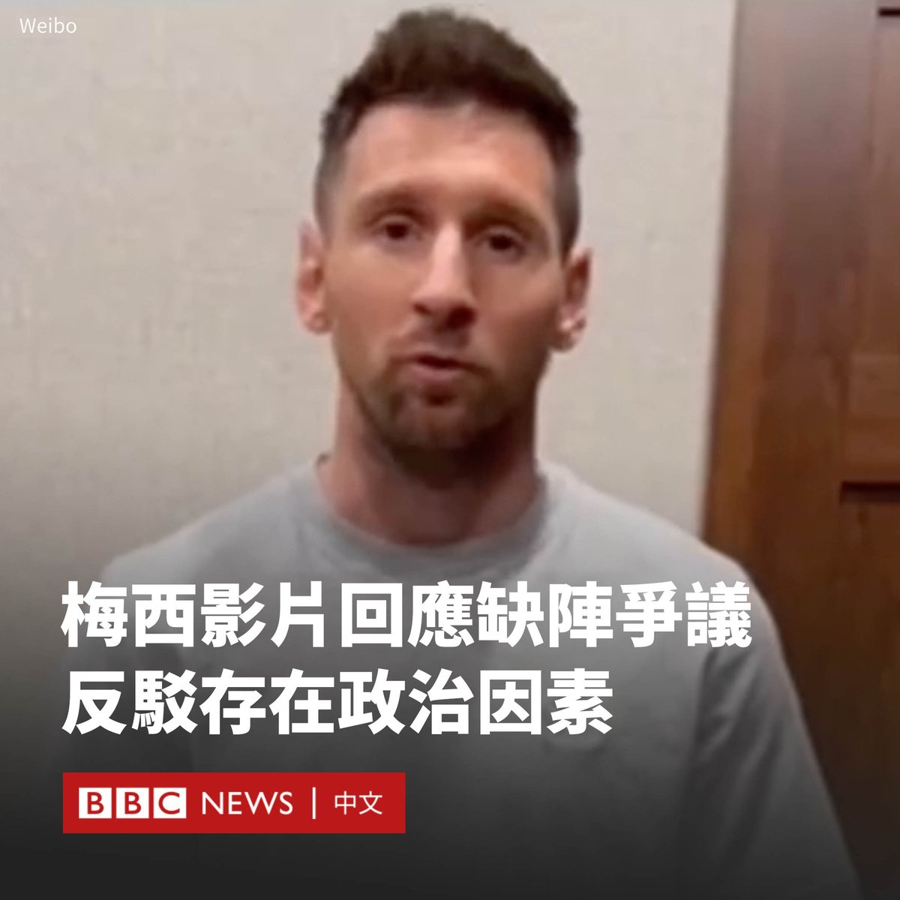
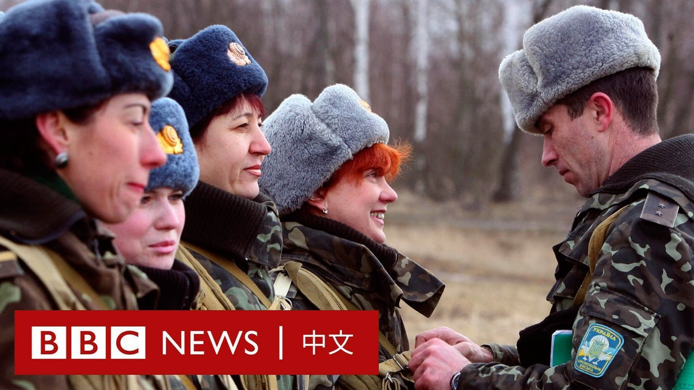
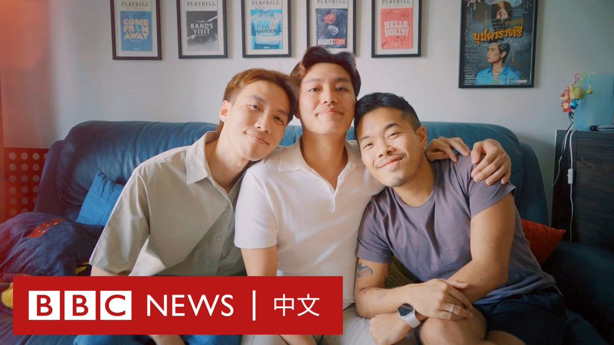

D英国广播公司BBC 北京时间 2024-02-20T14:30:33Z 1759827864286077054 在因缺阵香港友谊赛而在中国引发争议的两周后，“球王”梅西（港译：美斯；Lionel Messi）发布影片，表示他没有上场与“政治原因”无关。

梅西周一（2月19日）在中国社交平台微博发布了一段2分钟的影片，重申他是因内收肌炎症而无法上场。

“我想录制这个影片，给出真实的情况，希望大家不会再继续看到不实的消息了。”身穿浅灰色T恤衫的梅西在影片中说道。他说：“从职业生涯伊始，我就与中国有着非常紧密与特别的缘分。”

对于梅西的影片，微博网民意见两极，有人认为他仍未道歉，留言说：“果然对不起三个字很烫嘴”。同时，亦有网民表示理解和支持，“我相信我一直以来热爱的这名球员，从来不会带有任何偏见地看待他的球迷！”

梅西在2月4日迈阿密国际队与香港明星队的比赛中未能上场，让花大钱买票只为看梅西的球迷愤怒不已，纷纷报以嘘声，并且大喊退钱，香港政府也公开表示“失望”。

梅西的微博账号事后发布了一篇声明，称“很遗憾因为腹股沟有伤没能在香港站的友谊赛中出场，我的伤处发肿并有痛感”。

迈阿密国际主教练马蒂诺（Gerardo Martino）也曾在记者会上解释，梅西没有上阵是为了避免其受伤，指其出现内收肌炎症。

但梅西三天后在另一场东京举行的友谊赛中上场，加剧了中国大陆和香港对他的批评，一些人呼吁在中国“封杀”梅西。

中国官媒《环球时报》发文声称该事件不排除出于“政治动机”。文章称：“香港有意打造盛事经济，有外部势力故意要借此让香港难堪。〞

与此同时，杭州市体育局宣布取消阿根廷足球队今年3月来杭州进行友谊赛的计划。中国足协官网也删除了与梅西有关的所有新闻。

赛事主办方Tatler Asia于2月9日表示，将向在官方购买门票的球迷提供一半退款。   D英国广播公司BBC 北京时间 2024-02-20T13:06:23Z 1759806684015583690 乌克兰将拍卖数以万计未使用过的苏联风格毛帽，其类似于列宁等苏联领导人所戴过的护耳冬帽。

这个前苏联加盟共和国在本世纪初购买了四万顶毛帽，但现在该国已决定弃用这种帽子。 https://t.co/9lXATh6xOn   D英国广播公司BBC 北京时间 2024-02-20T09:53:47Z 1759758215582261447 爱情的定义是什么？三个泰国年轻人打破了人们对于恋爱的传统规范，他们决定探索“三人恋爱”。一起听他们讲讲，三个人的恋爱究竟什么样。 https://t.co/uazatOQ0qy   